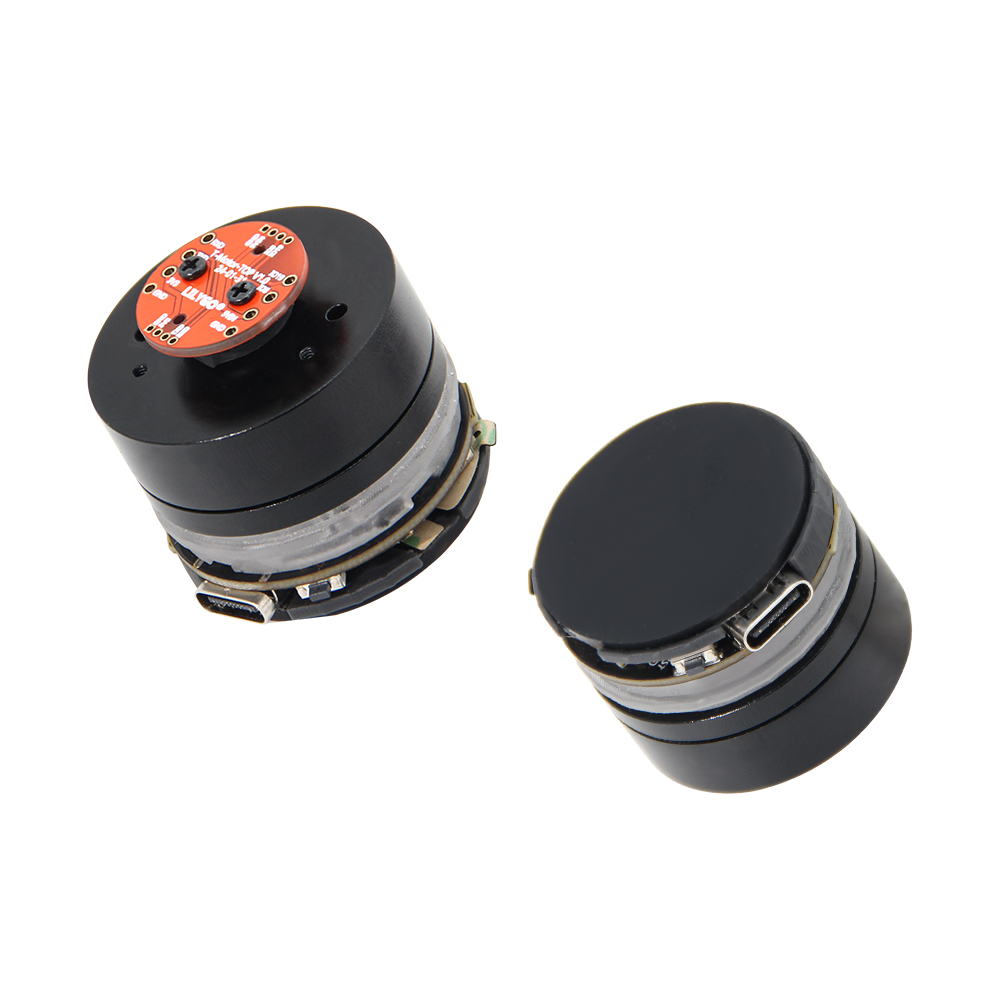
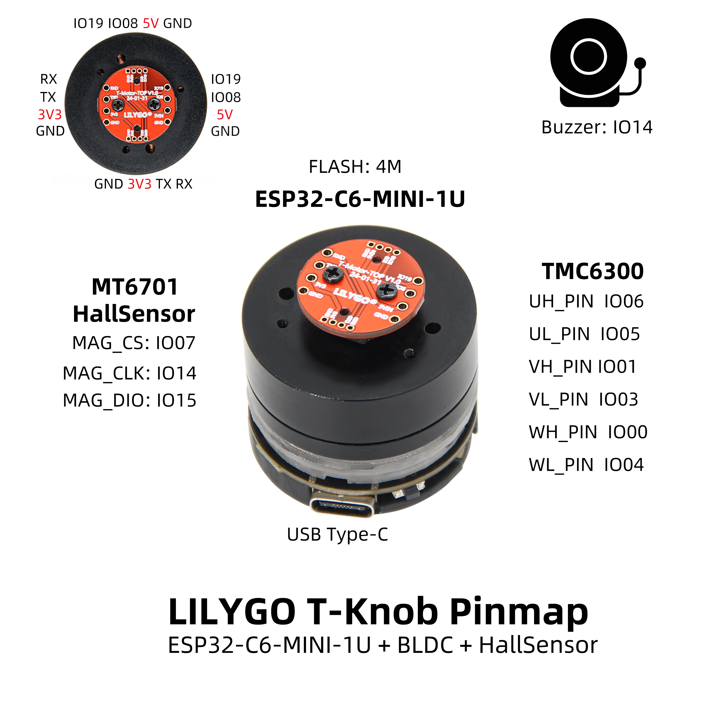
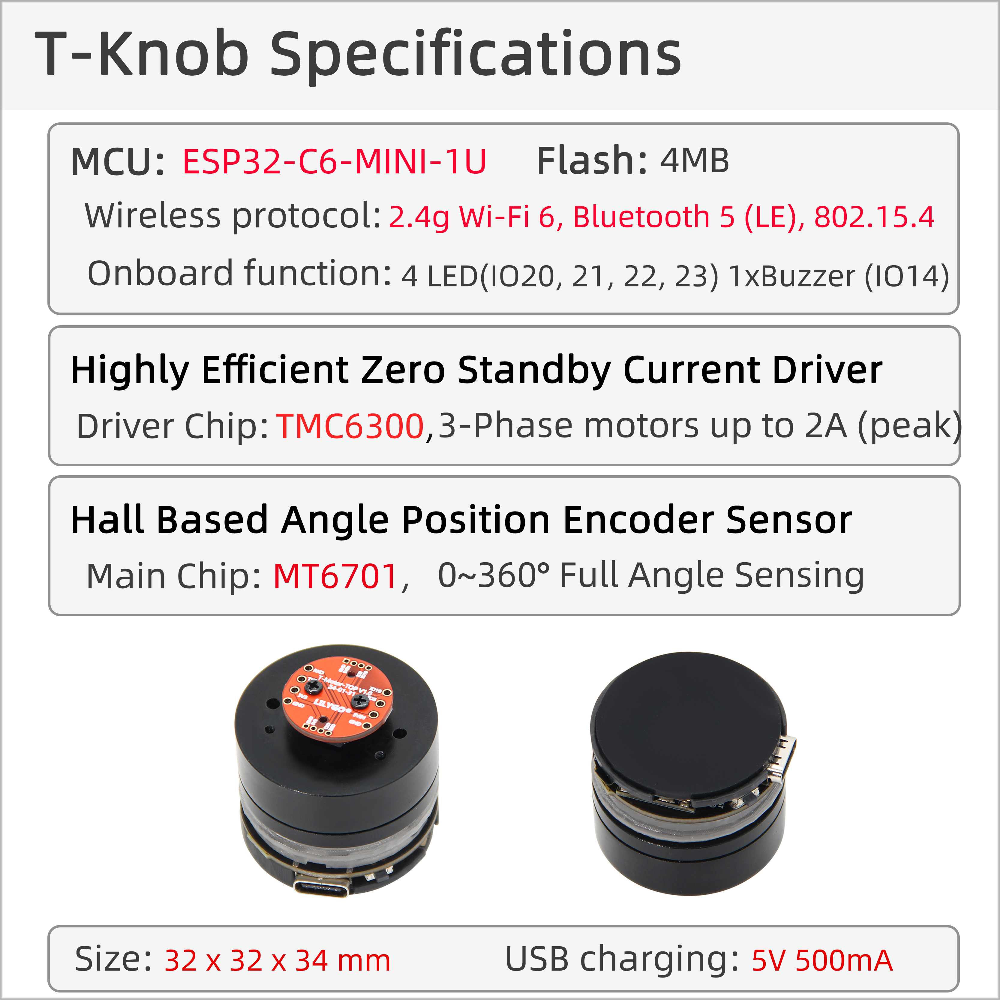

<!-- **[English](README.MD) | 中文** -->

    <a target="_blank" style="margin: 1em;color: white; font-size: 0.9em; border-radius: 0.3em; padding: 0.5em 2em; background-color:rgb(103, 175, 8)" href="https://lilygo.cc/products/t-knob">Go Buying</a>
    <!-- <a target="_blank" style="margin: 1em;color: white; font-size: 0.9em; border-radius: 0.3em; padding: 0.5em 2em; background-color:rgb(63, 201, 28)" href="https://www.aliexpress.com/store/911876460">速卖通</a> -->

## Introduction

LILYGO T-Knob is a smart rotary controller based on the ESP32-C6-MINI-1U wireless module. It integrates a BLDC (Brushless DC Motor) and an MT6701 Hall sensor, delivering a high-precision rotary interaction experience.

The product utilizes the TMC6300 motor driver chip to enable torque control and feedback. It supports USB Type-C for both power supply and data communication, making it well-suited for applications such as smart home control (e.g., volume adjustment, lighting control) and industrial human-machine interfaces.

Its hardware design includes multiple GPIO pins (such as UH_PIN, VL_PIN, etc.) and 4MB of flash storage, combining wireless connectivity with local data processing capabilities. This makes it ideal for developing high-responsiveness, low-power haptic interaction solutions.

## Appearance and function introduction
### Appearance

### Pinmap 

## Module Information and Specifications
### Description

| Component | Description |
| ---  | --- |
|MCU	| ESP32-C6-MINI-1U
|Flash 	|	4MB
|LED	|4 LED(I020, 21, 22, 23)
| Buzzer | 1 x buzzer |
| Wireless | 2.4g Wi-Fi 6, Bluetooth 5 (LE), 802.15.4
| Power Supply | 5V/500mA |
| Keys | 1 x RST key + 1 x BOOT key |
| Hall Sensor | MT6701 |
| Motor | TMC6300 BLDC Brushless DC Motor |
| USB | USB Type-C interface |
| Extended Interface | 1 × QWIIC interface |
| Hole Position | 1 × 2mm positioning hole |
| Size | 32 x 32 x 34mm |

### Related Links
Github：[T-Knob](https://github.com/Xinyuan-LilyGO/T-Knob)
* [TMC6300](https://github.com/Xinyuan-LilyGO/T-Knob/blob/master/hardware/TMC6300_datasheet_rev1.08.pdf)
* [MT6701](https://github.com/Xinyuan-LilyGO/T-Knob/blob/master/hardware/MT6701_Rev.1.0.pdf)
#### Schematic Diagram

[T-Knob](https://github.com/Xinyuan-LilyGO/T-Knob/blob/master/hardware/T-MotorDriver-C6%20V1.0.pdf)

<!-- * [SY6970](./datasheet/AN_SY6970.pdf) -->

## Software Design
### Arduino Set Parameters

|Arduino IDE 	|  Value
| ----------- | -----------|                         
|Board     |	ESP32C6 Dev Module
|Port      |    Your port                        
|CPU Frequency	|160MHz                    
|Core Debug Level	|None                              
|USB DFU On Boot	|Disable           
|Flash Mode	|QIO                       
|Flash Size	|4MB(32Mb)                                         
|Partition Scheme	|Huge APP (3MB No OTA/1MB SPIFFS)                  
|Upload Speed	|921600    

### Development Platform
1. [VS Code](https://code.visualstudio.com/)
2. [Arduino IDE](https://www.arduino.cc/en/software)
3. [ESP-IDF](https://www.espressif.com/en/products/sdks/esp-idf)

## Product Technical Support 

