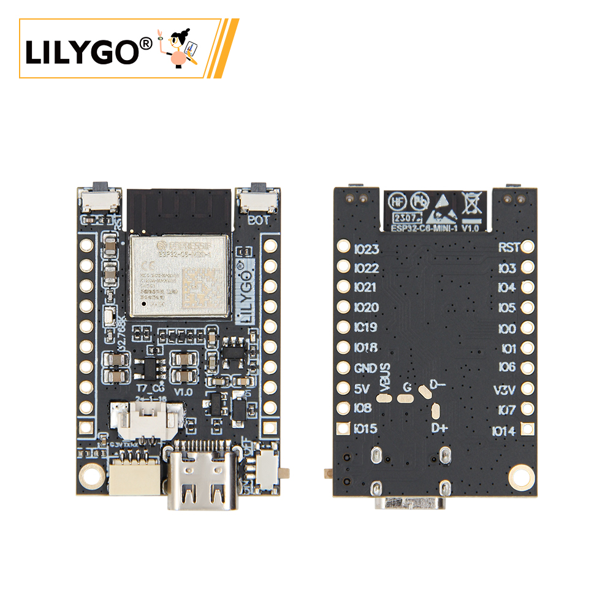
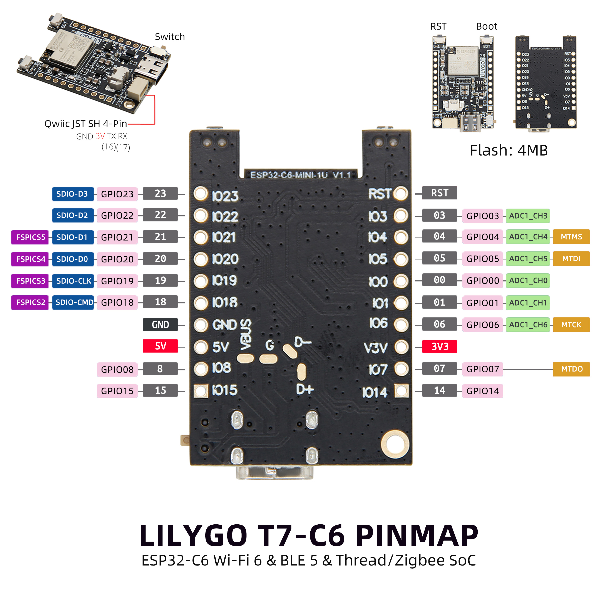

<!-- **[English](README.MD) | 中文** -->

<!-- 

    <a target="_blank" style="margin: 1em;color: white; font-size: 0.9em; border-radius: 0.3em; padding: 0.5em 2em; background-color:rgb(63, 201, 28)" href="https://item.taobao.com/item.htm?id=846226367137">淘宝</a>
    <a target="_blank" style="margin: 1em;color: white; font-size: 0.9em; border-radius: 0.3em; padding: 0.5em 2em; background-color:rgb(63, 201, 28)" href="https://www.aliexpress.com/store/911876460">速卖通</a>

 -->

## Introduction

The LILYGO T7-C6 is a development board based on the ESP32-C6 chip, integrating Wi-Fi 6, Bluetooth 5 (BLE), and Thread/Zigbee support, making it ideal for IoT and wireless communication projects.

This board features a rich set of GPIO pins (GPIO0–GPIO23), ADC (analog-to-digital conversion) capabilities, and 4MB Flash storage. Its pin layout includes a JST SH 4-Pin connector (GND, 3V, TX, RX) and supports SPI (SDIO) communication, enabling seamless connectivity with sensors and peripherals.

With 5V and 3.3V power outputs, the board can power a variety of external devices. It is an excellent choice for developers working on smart home systems, remote monitoring, and other embedded applications.

## Appearance and function introduction
### Appearance

### Pinmap 

## Module Information and Specifications
### Description

| Component | Description |
| ---  | --- |
|MCU	| ESP32-C6-MINI-1
|Flash 	|	4MB 
|Battery chip	|TP4065
| wireless | 2.4g Wi-Fi 6, Bluetooth 5 (LE), 802.15.4
| Power | 5V/500mA |
| button | 1 x RST button + 1 x BOOT button |
| Extended Interface | 1 × QWIIC interface |
| Hole |1 × 2mmpositioning holes  |

### Related Links
Github：[T7 C6](https://github.com/Xinyuan-LilyGO/T7-c6)
* [TP4065](https://github.com/Xinyuan-LilyGO/T7-C6/blob/main/information/TP4065-4.2V-SOT25-R.pdf)
#### Schematic Diagram

[T6 C6](https://github.com/Xinyuan-LilyGO/T7-C6/blob/main/project/T7-C6_V1.0.pdf)

<!-- * [SY6970](./datasheet/AN_SY6970.pdf) -->

## Software Design
### Arduino Set Parameters

|Arduino IDE Setting	|Value   
| ----------- | -----------|                         
|Board     |	ESP32C6 Dev Module
|Port      |    Your port                        
|CPU Frequency	|160MHz                    
|Core Debug Level	|None                              
|USB DFU On Boot	|Disable           
|Flash Mode	|QIO                       
|Flash Size	|4MB(32Mb)                                         
|Partition Scheme	|Huge APP (3MB No OTA/1MB SPIFFS)                  
|Upload Speed	|921600    

### Development Platform
1. [VS Code](https://code.visualstudio.com/)
2. [Arduino IDE](https://www.arduino.cc/en/software)
3. [ESP-IDF](https://www.espressif.com/en/products/sdks/esp-idf)

## Product Technical Support 

