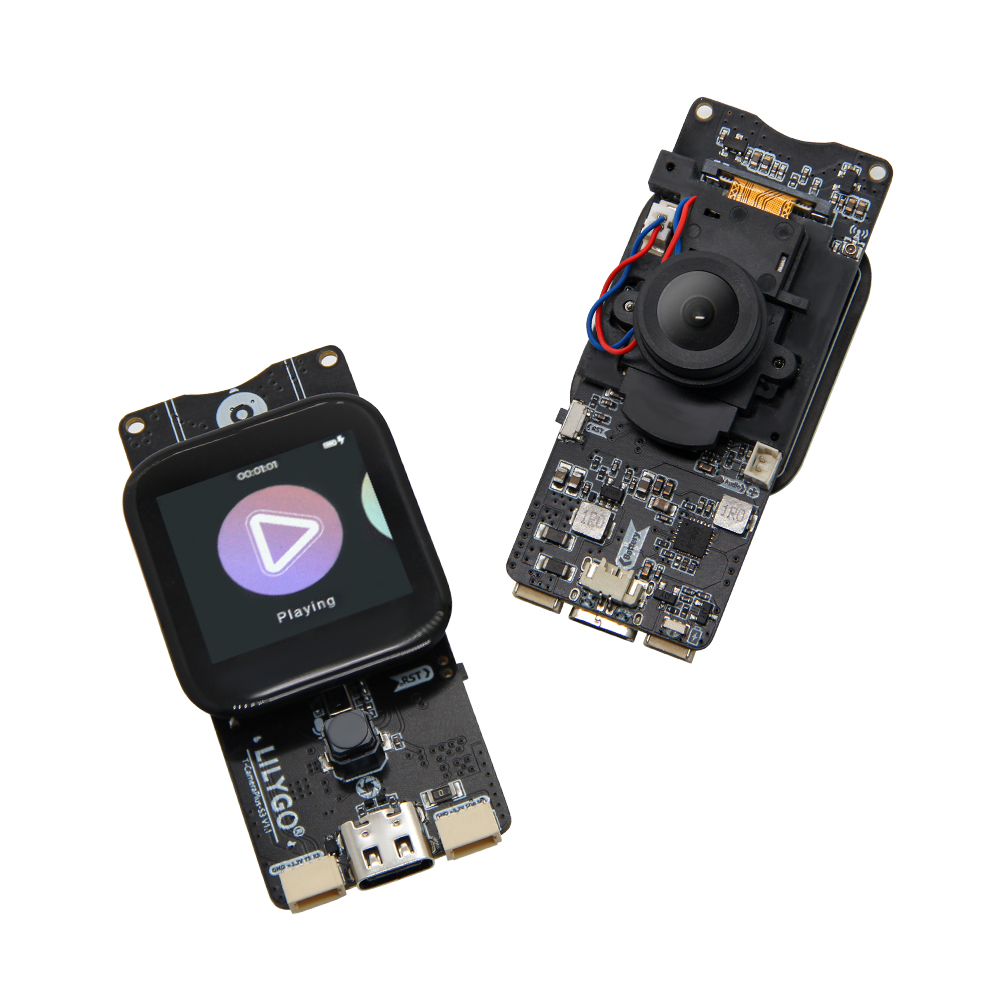
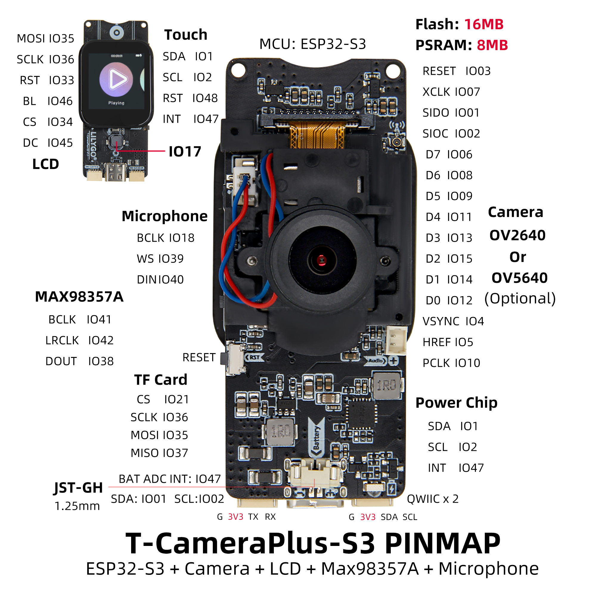
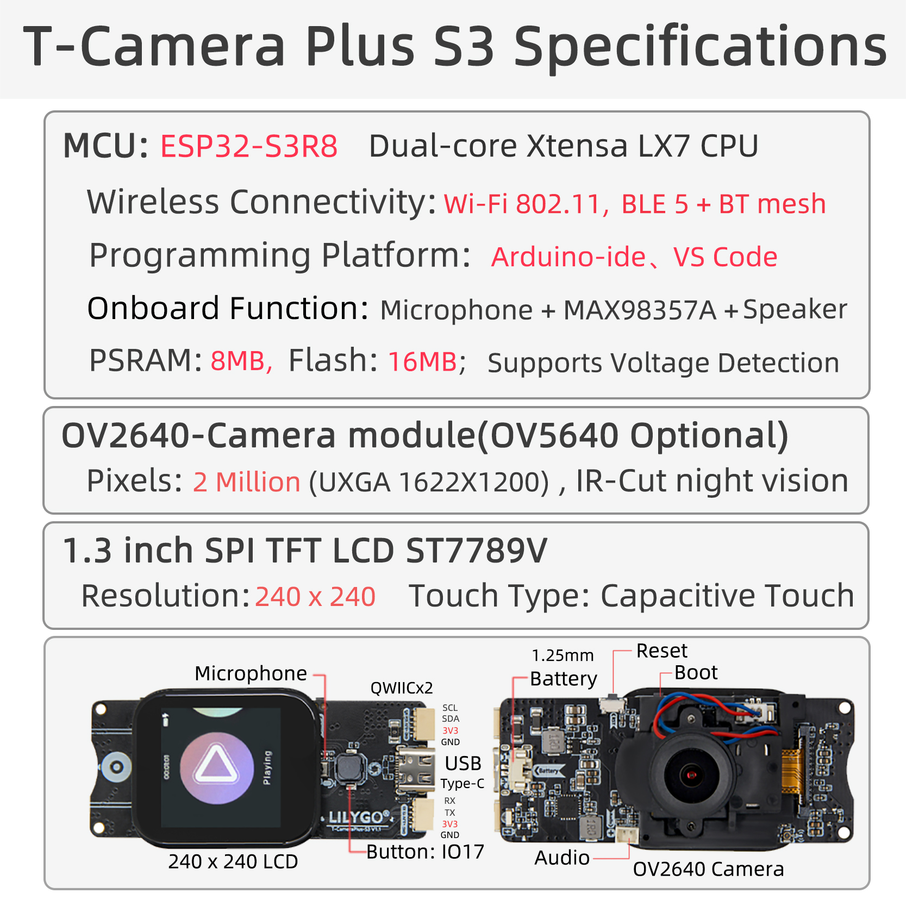

<!-- **[English](README.MD) | 中文** -->

    <a target="_blank" style="margin: 1em;color: white; font-size: 0.9em; border-radius: 0.3em; padding: 0.5em 2em; background-color:rgb(103, 175, 8)" href="https://lilygo.cc/products/t-camera-plus-s3">Go Buying</a>
    <!-- <a target="_blank" style="margin: 1em;color: white; font-size: 0.9em; border-radius: 0.3em; padding: 0.5em 2em; background-color:rgb(63, 201, 28)" href="https://www.aliexpress.com/store/911876460">速卖通</a> -->

## Introduction

T-CameraPlus-S3 is a multifunctional smart hardware development board based on the ESP32-S3 main control chip. It integrates a high-performance camera module (supporting OV2640/OV5640 options), an LCD display (with touch functionality), and a MAX98357A audio chip. With 16MB Flash and 8MB PSRAM, it efficiently handles image, video, and audio data.

The board supports dual-mode audio input/output (microphone and digital audio interface), and includes TF card expansion, a QWIIC interface (compatible with I²C device extensions), and a battery management module (BAT ADC). It is suitable for applications such as IoT visual interaction, smart surveillance, and multimedia terminals.

The hardware design is compatible with various sensors and peripherals, with SPI, I²C, and other protocols enabling coordinated operation between the camera, display, and audio modules. This offers developers flexible support for AIoT, edge computing, and related use cases.

## Appearance and function introduction
### Appearance

### Pinmap 

## Module Information and Specifications
### Description

T-CameraPlus-S3 is a smart camera module developed based on the ESP32-S3 chip. It features an onboard 240×240 TFT display, digital microphone, speaker, a dedicated button, power management chip, and an SD card module.

The device comes preloaded with a basic UI developed using LVGL, offering functions such as file management, music playback, audio recording, and camera projection. (If the module does not come pre-programmed, you will need to manually flash the example program named “Lvgl_UI”.)

| Component | Description |
| --- | --- |
| MCU | ESP32-S3R8 Dual-core Xtensa LX7 CPU |
| FLASH| 16MB |
| PSRAM | 8MB|
| Screen | 1.3-inch ST7789V SPI TFT LCD |
| Touch | CST816S touch capacitive screen
| Storage | TF Card |
| Camera | OV2640/OV5640 |
| Wireless | 2.4GHz Wi-Fi & Bluetooth5 (LE)
| USB | 1 × USB Port and OTG(TYPE-C interface) |
| IO interface | 2.54mm pitch 2*13 (dual rows) Extended IO interface |
| Battery chip | SY6970 |
| Speaker | MAX98357A |
| Microphone | MP34DT05-A |
| Extended Interfaces |1 × TF card interface + 2 × STEMMA QT/QWIIC interface (JST-SH 1.0MM 4Pin) + 1 x JST-GH 1.25MM interface + 1 x Battery interface socket |
| Keys | 1 x RESET key + 1 x BOOT key + 1 x IO17 key |
| Hole Position | **2mm positioning holes **2 ** |
| Dimensions | 68x32x31mm |

### Related Links

Github：[T-Camera Plus S3](https://github.com/Xinyuan-LilyGO/LilyGo-AMOLED-Series)

* [Espressif](https://www.espressif.com/en/support/documents/technical-documents)
* [MAX98357A](https://github.com/Xinyuan-LilyGO/T-CameraPlus-S3/blob/arduino-esp32-libs_V2.0.14/information/MAX98357AETE+T.pdf)
* [MSM261S4030H0R](information/MSM261S4030H0R.pdf)
* [MP34DT05-A](https://github.com/Xinyuan-LilyGO/T-CameraPlus-S3/blob/arduino-esp32-libs_V2.0.14/information/mp34dt05-a.pdf)
* [EVB_SY6970](information/EVB_SY6970.pdf)
* [AN_SY6970 ](information/AN_SY6970.pdf)
[T-Camera Plus S3](https://github.com/Xinyuan-LilyGO/LilyGo-AMOLED-Series/blob/master/schematic/T-Display-S3-AMOLED-Plus.pdf)

#### Schematic Diagram

* [T-CameraPlus-S3_V1.2](project/T-CameraPlus-S3_V1.2_20240417.pdf)

## Software Design
### Arduino Set Parameters

 * [Arduino_GFX-1.3.7](https://github.com/moononournation/Arduino_GFX)  
 * [lvgl-8.3.5](https://github.com/lvgl/lvgl)  
 * [JPEGDEC-1.2.8](https://github.com/bitbank2/JPEGDEC)  
 * [MiniTV](https://github.com/moononournation/MiniTV)  
 * [TFT_eSPI](https://github.com/Bodmer/TFT_eSPI)
 * [XPowersLib-0.2.1](https://github.com/lewisxhe/XPowersLib)  
 * [Arduino_DriveBus-1.1.16](https://github.com/Xk-w/Arduino_DriveBus)
 * [cst816t-1.5.0](https://github.com/koendv/cst816t)  
 * [arduino-libhelix-0.8.1](https://github.com/pschatzmann/arduino-libhelix)  
 * [ESP32-audioI2S-3.0.6](https://github.com/schreibfaul1/ESP32-audioI2S)
 * [DFRobot_MSM261](https://github.com/DFRobot/DFrobot_MSM261)  

## Software Design
### Arduino Set Parameters

| Setting                  | Value                            |
|--------------------------|----------------------------------|
| Board                    | ESP32S3 Dev Module               |
| Upload Speed             | 921600                           |
| USB Mode                 | Hardware CDC and JTAG            |
| USB CDC On Boot          | Enabled                          |
| USB Firmware MSC On Boot | Disabled                         |
| USB DFU On Boot          | Disabled                         |
| CPU Frequency            | 240MHz (WiFi)                    |
| Flash Mode               | QIO 80MHz                        |
| Flash Size               | 16MB (128Mb)                     |
| Core Debug Level         | None                             |
| Partition Scheme         | 16M Flash (3MB APP/9.9MB FATFS)  |
| PSRAM                    | QSPI PSRAM                       |
| Arduino Runs On          | Core 1                           |
| Events Run On            | Core 1                           |

### Development Platform
1. [Micropython](https://micropython.org/)
2. [Arduino IDE](https://www.arduino.cc/en/software)
3. [Platform IO](https://platformio.org/)

## Product Technical Support 

