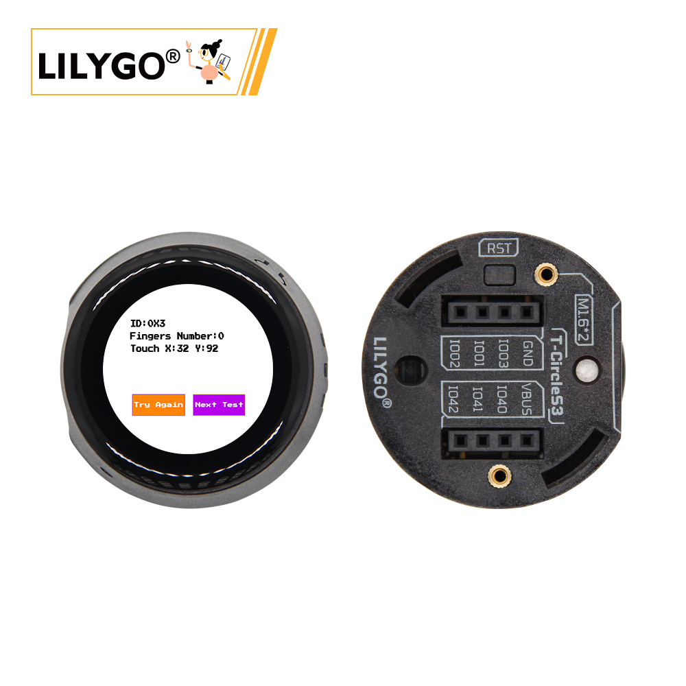
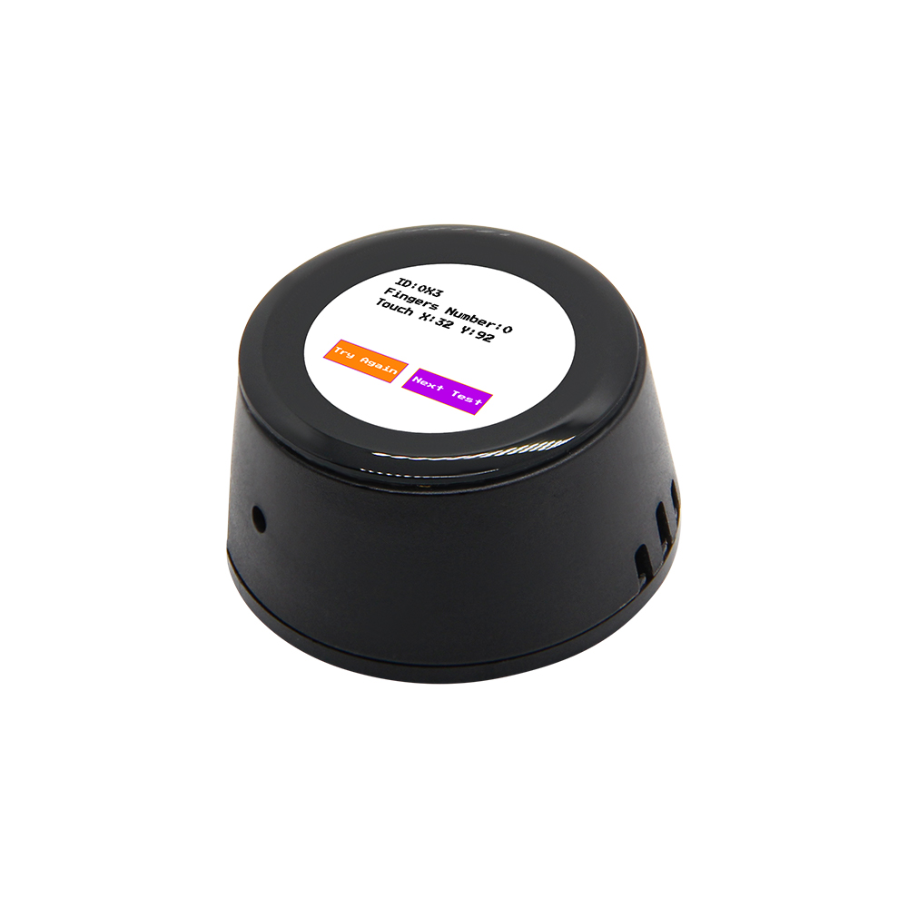
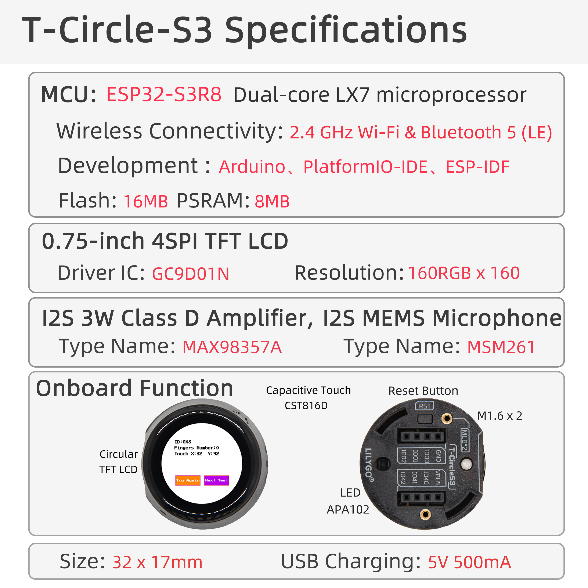

<!-- **[English](README.MD) | 中文** -->

    <a target="_blank" style="margin: 1em;color: white; font-size: 0.9em; border-radius: 0.3em; padding: 0.5em 2em; background-color:rgb(103, 175, 8)" href="https://lilygo.cc/products/t-circle-s3?variant=44912874062005">Go Buying</a>
    <!-- <a target="_blank" style="margin: 1em;color: white; font-size: 0.9em; border-radius: 0.3em; padding: 0.5em 2em; background-color:rgb(63, 201, 28)" href="https://www.aliexpress.com/store/911876460">速卖通</a> -->

> Note: T-Circle S3 is the ESP32-S3 version Version, click here to switch to ESP32 version[T-Circle](https://wiki.lilygo.cc/get_started/zh/LCD_OLED/T-Circle/T-Circle.html)

## Introduction

LILYGO T-Circle S3 is a multifunctional development board based on the ESP32-S3 wireless microcontroller, integrating a 0.75-inch round LCD touchscreen (160x160 pixels), MAX98357A digital audio amplifier, MSM261 audio input module (presumed to be a microphone), APA102 LED control interface, and QWIIC expansion connector.

Its core configuration includes 16MB Flash and 8MB Octal SPI PSRAM, supporting Wi-Fi and Bluetooth communication. The board also features a CST816D capacitive touch controller for intuitive interaction.

With precise pin mapping (e.g., LCD_MOSI, TP_SDA), it combines graphical display, audio I/O, touch interaction, and high-speed storage in a compact form factor. This makes it ideal for prototyping IoT terminals, wearable smart devices, or embedded audio-visual applications.

## Appearance and function introduction
### Appearance

### Pinmap 

## Module Information and Specifications
### Description

T-Circle-S3 is a development board based on the ESP32-S3, featuring a compact 0.75-inch round display. It comes equipped with a speaker, microphone, and a tri-color LED. On the back, it provides six programmable I/O ports, allowing for the expansion of various peripherals.

| Component | Description |
| --- | --- |
| MCU | ESP32-S3-R8
| FLASH| 16M |
| PSRAM | 8M (Octal SPI)|
| Touch | CST816D|
| Screen | SPI GC9D01N drives a 0.5-inch LCD circular screen (160x160px) |
| Speaker | IIS driver MAX98357A |
| Microphone | PDM driver MP34DT05-A |
| LED | APA102 |
| Wireless |2.4Ghz Wi-Fi + Bluetooth 5.0
| USB | 1 × USB Port and OTG(TYPE-C interface) |
| IO interface | 2 × 4-pin extended IO interface |
| Keys | 1 x RESET key + 1 x BOOT key |
| Power Supply | 5V/500mA |
| Hole position | **2 × M1.6* *2** |
| Dimensions | **32*17mm**

### Related Links

Github:[T-Circle-S3](https://github.com/Xinyuan-LilyGO/T-Circle-S3/tree/arduino-esp32-libs_V2.0.14)

- [GC9D01N](https://github.com/Xinyuan-LilyGO/T-Circle-S3/blob/arduino-esp32-libs_V2.0.14/information/GC9D01N.pdf)
- [TFT_eSPI-2.5.43](https://github.com/Bodmer/TFT_eSPI)
- [MAX98357A](https://github.com/Xinyuan-LilyGO/T-Circle-S3/blob/arduino-esp32-libs_V2.0.14/information/MAX98357AETE+T.pdf)
- [MSM261S4030H0R](https://github.com/Xinyuan-LilyGO/T-Circle-S3/blob/arduino-esp32-libs_V2.0.14/information/MSM261S4030H0R.pdf))
- [MP34DT05-A](https://github.com/Xinyuan-LilyGO/T-Circle-S3/blob/arduino-esp32-libs_V2.0.14/information/mp34dt05-a.pdf)

#### Schematic Diagram

[T-Circle-S3](https://github.com/Xinyuan-LilyGO/T-Circle-S3/blob/arduino-esp32-libs_V2.0.14/project/T-Circle-S3_V1.0.pdf)

#### Dependency Libraries

- [Arduino_DriveBus-1.1.16](https://github.com/Xk-w/Arduino_DriveBus)
- [Arduino_GFX-1.3.7](https://github.com/moononournation/Arduino_GFX)
- [ESP32-audioI2S-3.0.6](https://github.com/schreibfaul1/ESP32-audioI2S)
- [DFRobot_MSM261](https://github.com/DFRobot/DFrobot_MSM261)
- [FastLED-3.6.0](https://github.com/FastLED/FastLED)

## Software Design
### Arduino Set Parameters

| Setting                  | Value                            |
|--------------------------|----------------------------------|
| Board                    | ESP32S3 Dev Module               |
| Upload Speed             | 921600                           |
| USB Mode                 | Hardware CDC and JTAG            |
| USB CDC On Boot          | Enabled                          |
| USB Firmware MSC On Boot | Disabled                         |
| USB DFU On Boot          | Disabled                         |
| CPU Frequency            | 240MHz (WiFi)                    |
| Flash Mode               | QIO 80MHz                        |
| Flash Size               | 16MB (128Mb)                     |
| Core Debug Level         | None                             |
| Partition Scheme         | 16M Flash (3MB APP/9.9MB FATFS)  |
| PSRAM                    | OPI PSRAM                        |
| Arduino Runs On          | Core 1                           |
| Events Run On            | Core 1                           |

### Development Platform

1. [VS Code](https://code.visualstudio.com/)
2. [Arduino IDE](https://www.arduino.cc/en/software)
3. [Platform IO](https://platformio.org/)

## Product Technical Support 

