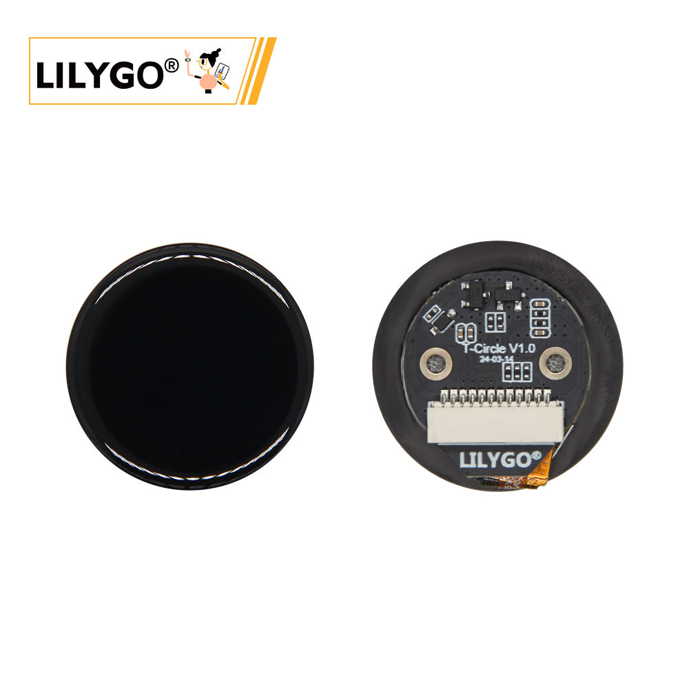
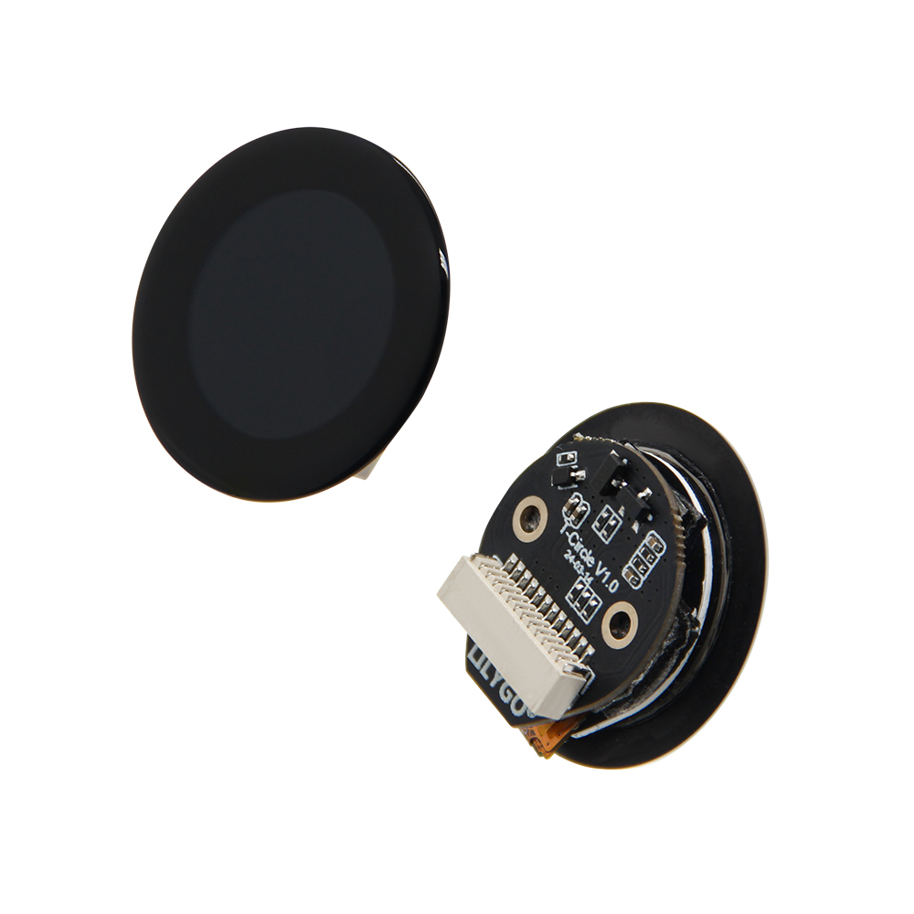
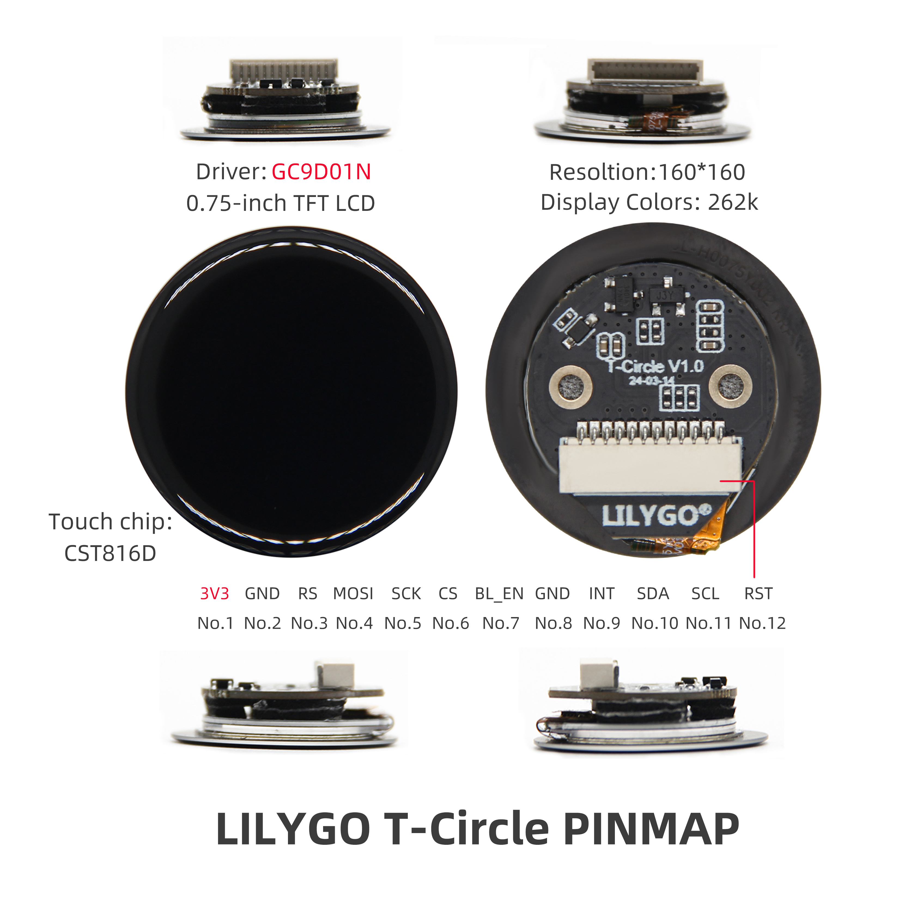

<!-- **[English](README.MD) | 中文** -->

    <a target="_blank" style="margin: 1em;color: white; font-size: 0.9em; border-radius: 0.3em; padding: 0.5em 2em; background-color:rgb(103, 175, 8)" href="https://lilygo.cc/products/t-circle-s3?variant=44912874062005">Go Buying</a>
    <!-- <a target="_blank" style="margin: 1em;color: white; font-size: 0.9em; border-radius: 0.3em; padding: 0.5em 2em; background-color:rgb(63, 201, 28)" href="https://www.aliexpress.com/store/911876460">速卖通</a> -->

> Note: T-Circle is the ESP32 version. Click here to switch to the ESP32-S3 version[T-Circle S3](https://wiki.lilygo.cc/get_started/zh/LCD_OLED/T-Circle-S3/T-Circle-S3.html)版本

## Introduction

LILYGO T-Circle is an ESP32-based development board featuring a 0.75-inch round TFT LCD display, with a 160×160 resolution and 262K color support. It integrates the CST816D capacitive touch controller for accurate and responsive touch interaction.

The hardware utilizes the GCPD01N driver chip and connects to external devices via 12 pins, including 3.3V power, SPI interface (MOSI/SCK/CS), I2C communication lines (SDA/SCL), and a BLE enable pin (BLEEN). It is compatible with development frameworks like Arduino.

With its compact design combining high-precision display, capacitive touch, and low-power wireless communication, the T-Circle is ideal for smartwatches, IoT device interfaces, and miniature embedded system prototyping.

## Appearance and function introduction
### Appearance

### Pinmap 

## Module Information and Specifications
### Description

| Component | Description |
| --- | --- |
| MCU | ESP32-S3R8 Dual-core LX7 microprocessor
| FLASH| 16M |
| PSRAM | 8M (Octal SPI)|
| Display | 0.75-inch round LCD (160x160px), SPI interface,GC9D01N driver
| Touch | CST816D|
| Wireless |2.4 GHz Wi-Fi & Bluetooth5 (LE)
| Expansion Interfaces | 12pin Interfaces |
| Keys | 1 x RESET key + 1 x BOOT key |
| Power Supply | 5V/500mA |
| Hole position | **2 × M1.6* *2** |
| Dimensions |**32*17mm**|

### Related Links

Github:[T-Circle](https://github.com/Xinyuan-LilyGO/T-Circle)

- [GC9D01N](https://github.com/Xinyuan-LilyGO/T-Circle-S3/blob/arduino-esp32-libs_V2.0.14/information/GC9D01N.pdf)
- [TFT_eSPI-2.5.43](https://github.com/Bodmer/TFT_eSPI)
- [MAX98357A](https://github.com/Xinyuan-LilyGO/T-Circle-S3/blob/arduino-esp32-libs_V2.0.14/information/MAX98357AETE+T.pdf)
- [MSM261S4030H0R](https://github.com/Xinyuan-LilyGO/T-Circle-S3/blob/arduino-esp32-libs_V2.0.14/information/MSM261S4030H0R.pdf))
- [MP34DT05-A](https://github.com/Xinyuan-LilyGO/T-Circle-S3/blob/arduino-esp32-libs_V2.0.14/information/mp34dt05-a.pdf)

#### Schematic Diagram

[T-Circle-S3](https://github.com/Xinyuan-LilyGO/T-Circle-S3/blob/arduino-esp32-libs_V2.0.14/project/T-Circle-S3_V1.0.pdf)

#### Dependency Libraries

- [Arduino_DriveBus-1.1.16](https://github.com/Xk-w/Arduino_DriveBus)
- [Arduino_GFX-1.3.7](https://github.com/moononournation/Arduino_GFX)
- [ESP32-audioI2S-3.0.6](https://github.com/schreibfaul1/ESP32-audioI2S)
- [DFRobot_MSM261](https://github.com/DFRobot/DFrobot_MSM261)
- [FastLED-3.6.0](https://github.com/FastLED/FastLED)

## Software Design
### Arduino Set Parameters

| Setting                  | Value                            |
|--------------------------|----------------------------------|
| Board                    | ESP32S3 Dev Module               |
| Upload Speed             | 921600                           |
| USB Mode                 | Hardware CDC and JTAG            |
| USB CDC On Boot          | Enabled                          |
| USB Firmware MSC On Boot | Disabled                         |
| USB DFU On Boot          | Disabled                         |
| CPU Frequency            | 240MHz (WiFi)                    |
| Flash Mode               | QIO 80MHz                        |
| Flash Size               | 16MB (128Mb)                     |
| Core Debug Level         | None                             |
| Partition Scheme         | 16M Flash (3MB APP/9.9MB FATFS)  |
| PSRAM                    | OPI PSRAM                        |
| Arduino Runs On          | Core 1                           |
| Events Run On            | Core 1                           |

### Development Platform

1. [VS Code](https://code.visualstudio.com/)
2. [Arduino IDE](https://www.arduino.cc/en/software)
3. [Platform IO](https://platformio.org/)

## Product Technical Support 

