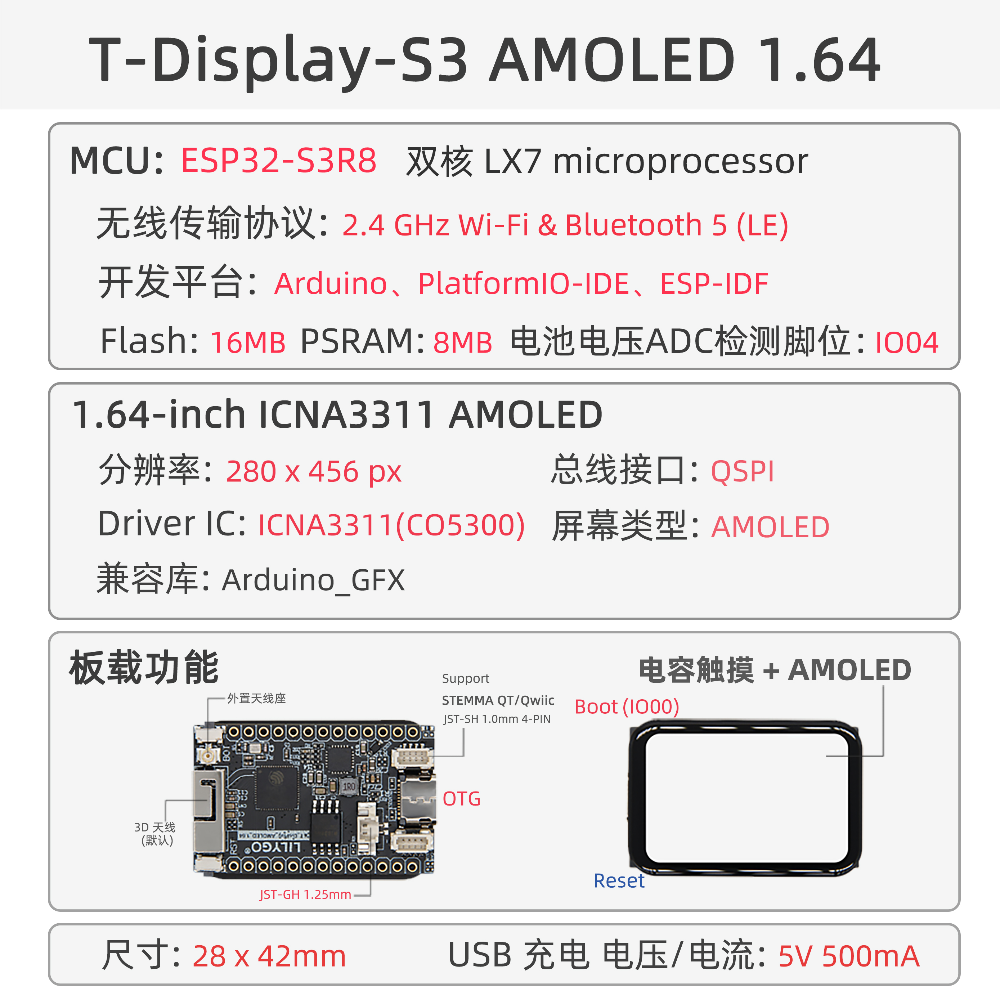

<!-- **[English](README.MD) | 中文** -->

    <a target="_blank" style="margin: 1em;color: white; font-size: 0.9em; border-radius: 0.3em; padding: 0.5em 2em; background-color:rgb(63, 201, 28)" href="https://lilygo.cc/products/t-display-s3-amoled-1-64?variant=44437365031093">Go Buying</a>
    <!-- <a target="_blank" style="margin: 1em;color: white; font-size: 0.9em; border-radius: 0.3em; padding: 0.5em 2em; background-color:rgb(63, 201, 28)" href="https://www.aliexpress.com/store/911876460">速卖通</a> -->

## Introduction

The T-Display-S3 AMOLED 1.64 is a high-performance IoT development board built around the ESP32-S3R8 dual-core LX7 microprocessor, featuring integrated 2.4 GHz Wi-Fi and Bluetooth 5 (LE) connectivity. It supports multi-platform development, including Arduino, PlatformIO IDE, and ESP-IDF.

Its standout feature is the 1.64-inch ICMA3311 AMOLED display with a resolution of 280×456 pixels, connected via a QSPI bus interface and compatible with the Arduino_GFX graphics library, enabling rapid development of rich graphical user interfaces.

The board comes with 16MB Flash and 8MB PSRAM, providing ample storage and memory resources. It also supports battery voltage detection (via ADC pin I004) and 5V/500mA USB charging, balancing low power consumption with mobile application needs.

Additional features include capacitive touch input, explicit hardware flow control, STEMMA QT/Qwiic expansion interface, and RF SH 1.0mm + 4W RF design, making it ideal for use in smart wearables, embedded GUI applications, and industrial control. Its compact 28×42mm form factor delivers a strong balance of performance and functionality.

## Appearance and function introduction
### Appearance

### Pinmap 

## Module Information and Specifications
### Description

| Component | Description |
| --- | --- |
| MCU | ESP32-S3R8 Dual-core LX7 microprocessor |
| FLASH| 16MB |
| PSRAM | 8MB|
| Screen | ** 1.64-inch ICNA3311 AMOLED**
| Touch | FT3168 touch capacitive screen
| Screen Bus | QSPI
| LoRa | 1276:868,915Mhz |
| Storage | TF Card |
| Charging chip | SY6970
| RTC | PCF8563 |
| Wireless | 2.4GHz Wi-Fi & Bluetooth 5 (LE)
| USB | 1 × USB Port and OTG(TYPE-C interface) |
| IO interface |2 x 2.54mm pitch 2*7 extended IO interface |
| Extended Interface | 2 × STEMMA QT/Qwlic JST-SH 1.0mm 4-pin interface +1 x JST-GH 1.25mm battery holder +1 x antenna holder |
| Keys | 1 x RESET key + 1 x BOOT key |
| Dimensions | 28x42x11mm |

> When powered only via 5V without a connected battery, the output waveform of the chip can become highly unstable. To mitigate this issue, either connect a battery or disable the battery channel via software.

### Related Links

Github：[T-Display-S3-AMOLED-1.64](https://github.com/Xinyuan-LilyGO/T-Display-S3-AMOLED-1.64-1.75/tree/main)

* [CO5300](https://github.com/Xinyuan-LilyGO/T-Display-S3-AMOLED-1.64/blob/arduino-esp32-libs_V2.0.14/information/CO5300_V0.01.pdf)
* [FT3168](https://github.com/Xinyuan-LilyGO/T-Display-S3-AMOLED-1.64/blob/arduino-esp32-libs_V2.0.14/information/FT3168.pdf)
* [DO0164FMST02](https://github.com/Xinyuan-LilyGO/T-Display-S3-AMOLED-1.64/blob/arduino-esp32-libs_V2.0.14/information/SPEC-DO0164FMST02-20240126.pdf)
* [AN_SY6970](https://github.com/Xinyuan-LilyGO/T-Display-S3-AMOLED-1.64/blob/arduino-esp32-libs_V2.0.14/information/AN_SY6970.pdf)
* [EVB_SY6970](https://github.com/Xinyuan-LilyGO/T-Display-S3-AMOLED-1.64/blob/arduino-esp32-libs_V2.0.14/information/EVB_SY6970.pdf)

#### Schematic Diagram

* [T-Display-S3-AMOLED-1.64_V1.0](https://github.com/Xinyuan-LilyGO/T-Display-S3-AMOLED-1.64/blob/arduino-esp32-libs_V2.0.14/project/T-Display-AMOLED-1.64_V1.0.pdf)
<!-- * [SY6970](./datasheet/AN_SY6970.pdf) -->

#### Dependency Libraries

* [JPEGDEC-1.2.8](https://github.com/bitbank2/JPEGDEC)
* [lvgl-8.3.5](https://lvgl.io)
* [MiniTV](https://github.com/moononournation/MiniTV)
* [SensorLib](https://github.com/lewisxhe/SensorsLib)
* [Arduino_GFX-1.3.7](https://github.com/moononournation/Arduino_GFX)
* [Arduino_DriveBus-1.1.8](https://github.com/Xk-w/Arduino_DriveBus)

#### Attention

> If users need to adjust the external antenna resistance, please refer to the following.

>!The resistor jumper section is obscured by hardware in the image. You can refer to the method described in the T3-S3 LR1121 documentation to adjust the resistor orientation and thereby modify the resistance of the external antenna.

## Software Design
### Arduino Set Parameters

| Setting                  | Value                            |
|--------------------------|----------------------------------|
| Board                    | ESP32S3 Dev Module               |
| Upload Speed             | 921600                           |
| USB Mode                 | Hardware CDC and JTAG            |
| USB CDC On Boot          | Enabled                          |
| USB Firmware MSC On Boot | Disabled                         |
| USB DFU On Boot          | Disabled                         |
| CPU Frequency            | 240MHz (WiFi)                    |
| Flash Mode               | QIO 80MHz                        |
| Flash Size               | 16MB (128Mb)                     |
| Core Debug Level         | None                             |
| Partition Scheme         | 16M Flash (3MB APP/9.9MB FATFS)  |
| PSRAM                    | OPI PSRAM                        |
| Arduino Runs On          | Core 1                           |
| Events Run On            | Core 1                           |

### Development Platform

1. [Micropython](https://micropython.org/)
2. [Arduino IDE](https://www.arduino.cc/en/software)
3. [Platform IO](https://platformio.org/)

## Product Technical Support 

