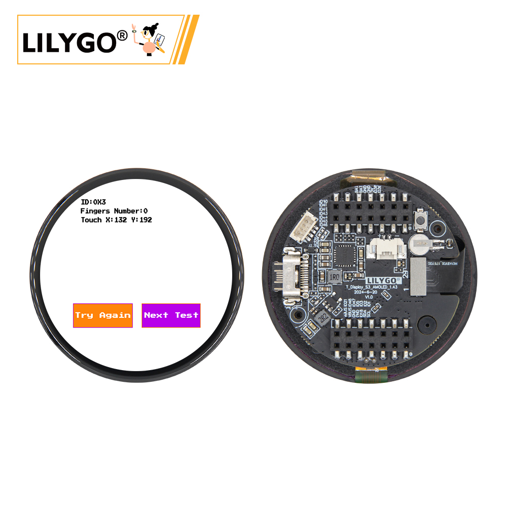
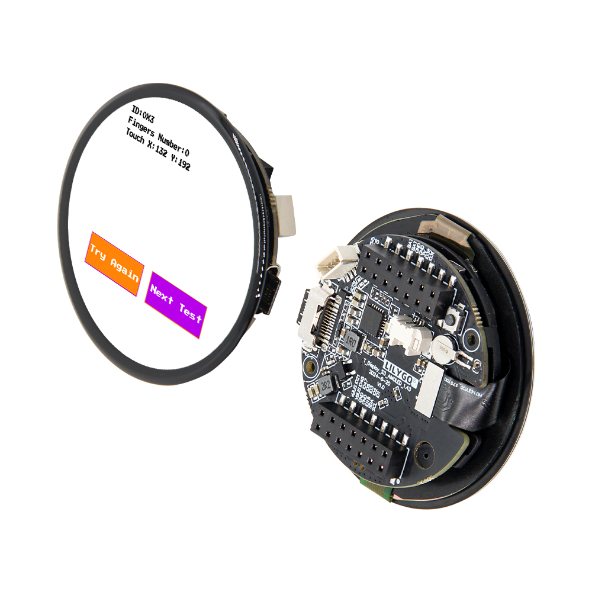
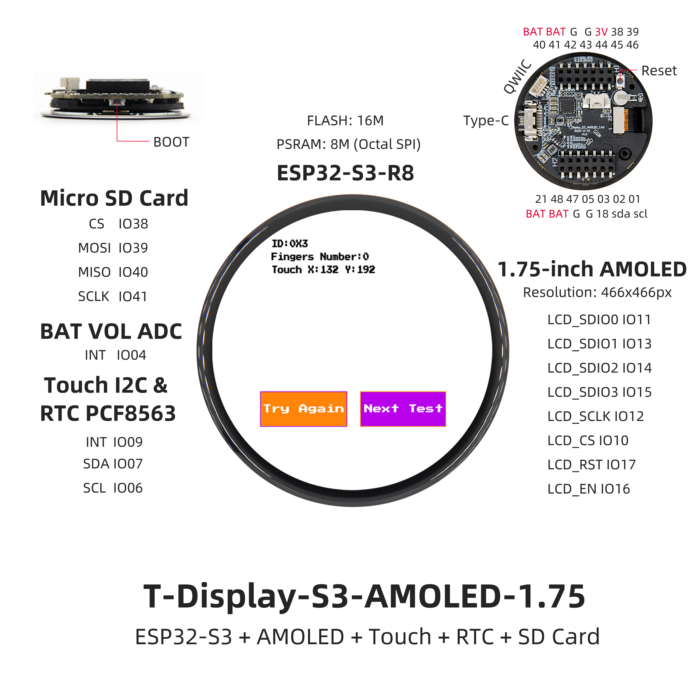
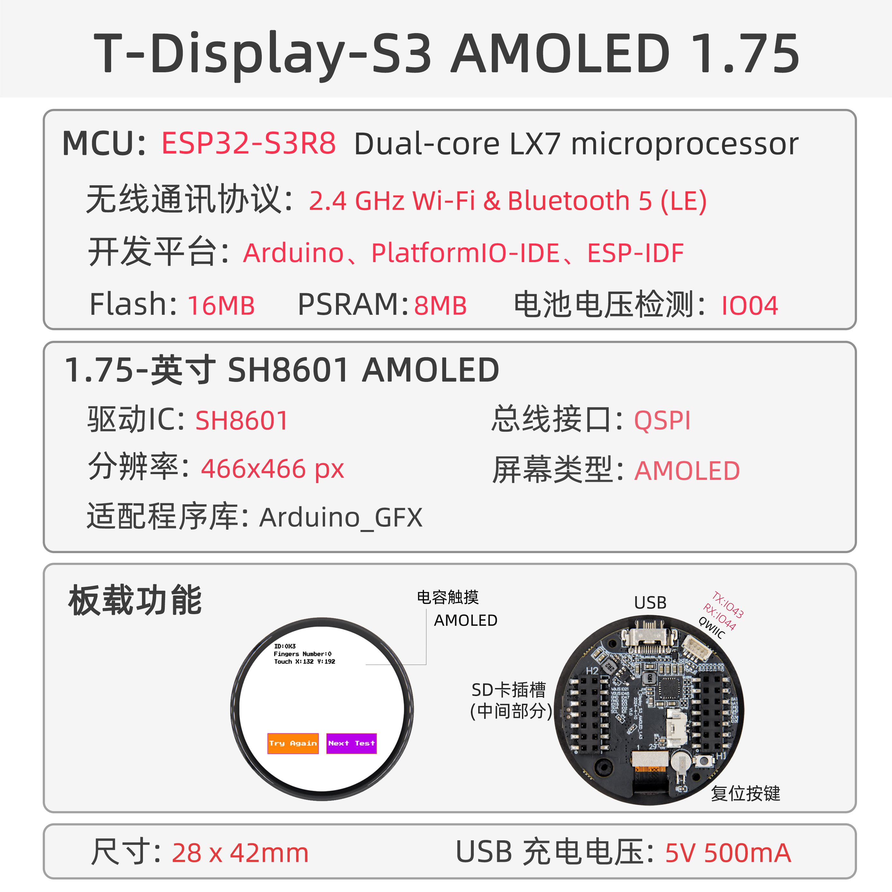

<!-- **[English](README.MD) | 中文** -->

    <a target="_blank" style="margin: 1em;color: white; font-size: 0.9em; border-radius: 0.3em; padding: 0.5em 2em; background-color:rgb(63, 201, 28)" href="https://lilygo.cc/products/t-display-s3-amoled-1-64?variant=44848332931253">Go Buying</a>
    <!-- <a target="_blank" style="margin: 1em;color: white; font-size: 0.9em; border-radius: 0.3em; padding: 0.5em 2em; background-color:rgb(63, 201, 28)" href="https://www.aliexpress.com/store/911876460">速卖通</a> -->

## Introduction

T-Display AMOLED Plus is a high-integration development board based on the ESP32-S3 microcontroller, designed for multifunctionality and high performance. It features 16MB Flash and 8MB PSRAM, enabling the execution of complex applications. The board includes a 1.25-inch AMOLED display with touch functionality.

It comes with a built-in PMU (Power Management Unit) and RTC (Real-Time Clock), along with VBUS power management, optimizing it for low-power applications. For expansion, it offers STEMMA QT/Qwiic dual interfaces, supporting rapid sensor connections, SD card storage, and provides ample GPIO, ADC channels, and UART interfaces for peripheral integration.

Additionally, the board features BOOT mode switching and a reset circuit for easier development and debugging. This product is ideal for smart wearables, IoT terminals, and other scenarios requiring interactive displays and multi-sensor integration.

## Appearance and function introduction
### Appearance

### Pinmap 

## Module Information and Specifications
### Description

| Component | Description |
| --- | --- |
| MCU | ESP32-S3R8 Dual-core LX7 microprocessor |
| FLASH| 16MB |
| PSRAM | 8MB|
| Screen | 1.75-inch SH8601 AMOLED |
| Touch | FT3168 touch capacitive screen
| Bus | QSPI
| LoRa | 1276:868,915Mhz |
| Storage | TF Card |
| Charging chip | SY6970
| RTC | PCF8563 |
| Wireless | 2.4GHz Wi-Fi & Bluetooth 5 (LE)
| USB | 1 × USB Port and OTG(TYPE-C interface) |
| IO interface |2 x 2.54mm pitch 2*7 extended IO interface |
| Extended Interface | 1 × QWIIC interface + JST-GH 1.25MM interface +1 x battery socket |
| Keys | 1 x RESET key + 1 x BOOT key |
| Dimensions | 45x45x11mm |

> The output waveform of this chip will be very unstable when it is not powered by a 5V battery. It is necessary to connect a battery for use or use software to close the battery channel. In this case, the situation will be alleviated

### Related Links

T-Display-S3-AMOLED-1.43/1.75 is a round display development board based on the ESP32-S3. It features a high-definition onboard AMOLED screen and supports external battery connection for independent power supply.

Github：[T-Display-S3-AMOLED-1.43](https://github.com/Xinyuan-LilyGO/T-Display-S3-AMOLED-1.43-1.75/tree/main)

* [PCF8563](https://github.com/Xinyuan-LilyGO/T-Display-S3-AMOLED-1.43-1.75/blob/main/information/PCF8563.pdf)
* [SH8601](https://github.com/Xinyuan-LilyGO/T-Display-S3-AMOLED-1.43-1.75/blob/main/information/SH8601Z.pdf)
* [DO0143FAT01](https://github.com/Xinyuan-LilyGO/T-Display-S3-AMOLED-1.43-1.75/blob/main/information/SPEC-DO0143FAT01-20230830.pdf)
* [AN_SY6970](https://github.com/Xinyuan-LilyGO/T-Display-S3-AMOLED-1.43-1.75/blob/main/information/AN_SY6970.pdf)
* [EVB_SY6970](https://github.com/Xinyuan-LilyGO/T-Display-S3-AMOLED-1.43-1.75/blob/main/information/EVB_SY6970.pdf)

#### Schematic Diagram

* [T-Display-S3-AMOLED-1.43-1.75_V1.0](https://github.com/Xinyuan-LilyGO/T-Display-S3-AMOLED-1.43-1.75/blob/main/project/T-Display-S3-AMOLED-1.43-1.75_V1.0.pdf)

<!-- * [SY6970](./datasheet/AN_SY6970.pdf) -->

#### Dependency Libraries

* [Arduino_GFX-1.3.7](https://github.com/moononournation/Arduino_GFX)
* [Arduino_DriveBus-1.1.12](https://github.com/Xk-w/Arduino_DriveBus)
* [JPEGDEC-1.2.8](https://github.com/bitbank2/JPEGDEC)
* [lvgl-8.3.5](https://lvgl.io)
* [MiniTV](https://github.com/moononournation/MiniTV)
* [SensorLib](https://github.com/lewisxhe/SensorsLib)

## Software Design
### Arduino Set Parameters

| Setting                  | Value                            |
|--------------------------|----------------------------------|
| Board                    | ESP32S3 Dev Module               |
| Upload Speed             | 921600                           |
| USB Mode                 | Hardware CDC and JTAG            |
| USB CDC On Boot          | Enabled                          |
| USB Firmware MSC On Boot | Disabled                         |
| USB DFU On Boot          | Disabled                         |
| CPU Frequency            | 240MHz (WiFi)                    |
| Flash Mode               | QIO 80MHz                        |
| Flash Size               | 16MB (128Mb)                     |
| Core Debug Level         | None                             |
| Partition Scheme         | 16M Flash (3MB APP/9.9MB FATFS)  |
| PSRAM                    | OPI PSRAM                        |
| Arduino Runs On          | Core 1                           |
| Events Run On            | Core 1                           |

### Development Platform
1. [Micropython](https://micropython.org/)
2. [Arduino IDE](https://www.arduino.cc/en/software)
3. [Platform IO](https://platformio.org/)

## Product Technical Support 

