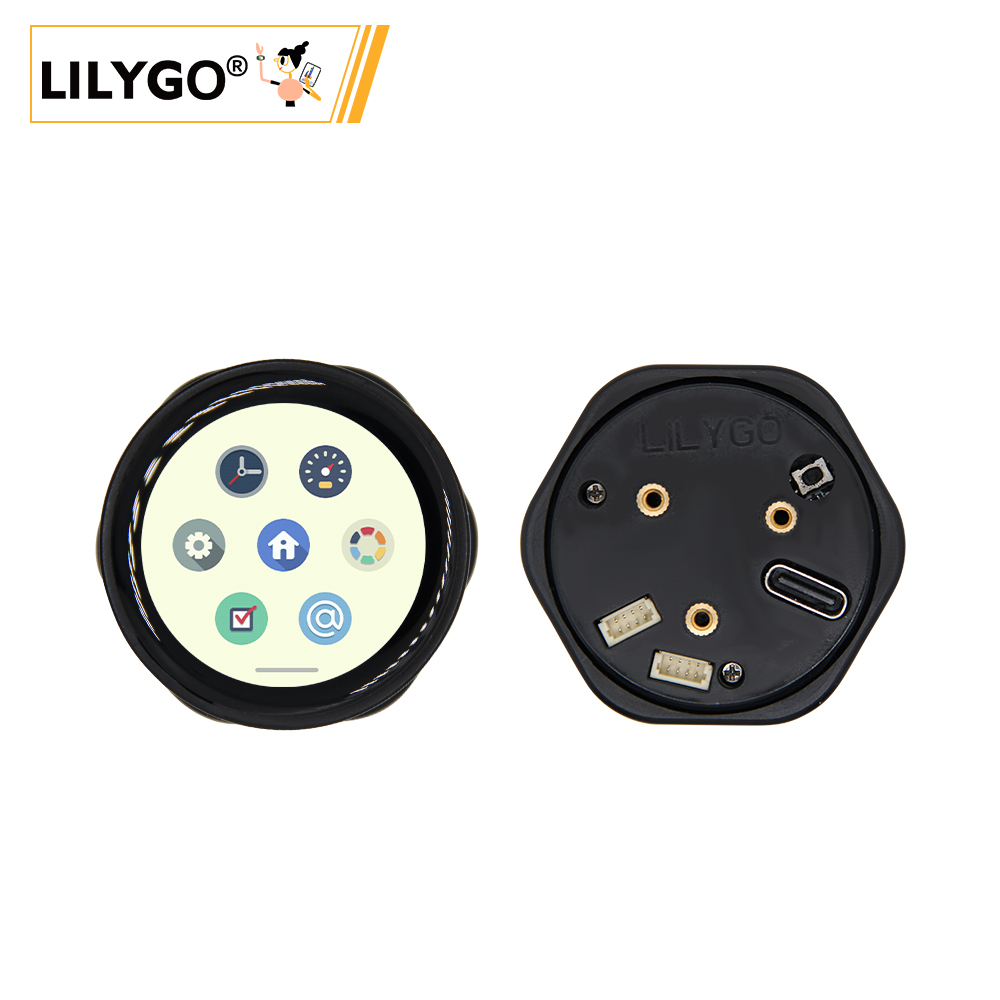
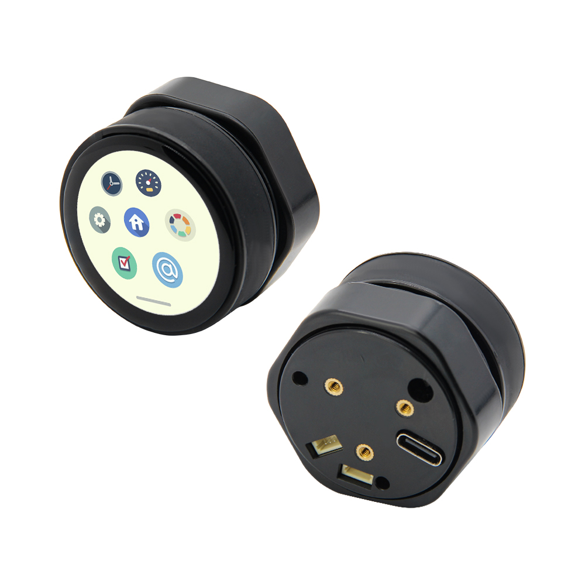

<!-- **[English](README.MD) | 中文** -->

    <a target="_blank" style="margin: 1em;color: white; font-size: 0.9em; border-radius: 0.3em; padding: 0.5em 2em; background-color:rgb(63, 201, 28)" href="https://lilygo.cc/products/t-encoder-plus">Go Buying</a>
    <!-- <a target="_blank" style="margin: 1em;color: white; font-size: 0.9em; border-radius: 0.3em; padding: 0.5em 2em; background-color:rgb(63, 201, 28)" href="https://www.aliexpress.com/store/911876460">速卖通</a> -->

## Introduction

LILYGO T-Encoder-Pro Pinnap is a development board powered by the high-performance ESP32-S3 R8 dual-core chip, featuring Wi-Fi and Bluetooth (LE) connectivity. It integrates a 1.2-inch SH8601A touch AMOLED display with a resolution of 390×390, supporting capacitive touch interaction.

The board comes with a rich set of hardware features, including:

- A rotary encoder (with DATA_A/B pins and a built-in push button),

- A buzzer,

- 8MB PSRAM and 16MB Flash for memory and storage,

- Dual Qwiic 4-pin connectors (SDA/SCL/RST/INT) for quick sensor/module expansion.

Its display is fully configured for advanced rendering tasks, with dedicated pins such as LCD_CS, LCD_RST, and SPI communication interfaces.

Designed with a focus on high integration and interactivity, T-Encoder-Pro Pinnap is ideal for:

- Embedded UI development,

- Smart home control panels,

- Portable device prototyping,

- IoT terminals that demand both low power consumption and high performance.

## Appearance and function introduction
### Appearance

### Pinmap 

## Module Information and Specifications
### Description

T-Encoder-Pro is a smart control knob equipped with a AMOLED touch screen, based on the ESP32S3R8 chip. The knob rotates, clicks (pushes in), and contains a beeper and vibration motor.

| Component | Description |
| --- | --- |
| MCU | ESP32-S3R8  |
| PSRAM | 8M |
| FLASH | 16M |
| Screen | 2.04-inch SH8601A-W14-T06 AMOLED |
| Touch | CHSC5816 touch capacitive screen
| Encoder | Supports left and right rotation
| Buzzer | Support buzzer |
| Wireless | 2.4GHz Wi-Fi & Bluetooth 5 (LE)
| USB | 1 × USB Port and OTG(TYPE-C interface) |
| Extended Interface | 2 × QWIIC 4-pin interface |
| Keys | 1 x RESET key + 1 x BOOT key |
| Hole Position | **M2 screw hole * 3** |
| Dimensions | 43.5 x 43.5 x 27.5mm |

### Related Links

Github：[T-Encoder-Pro](https://github.com/Xinyuan-LilyGO/T-Encoder-Pro)

* [Espressif](https://www.espressif.com/en/support/documents/technical-documents)
* [DXQ120MYB2416A](https://github.com/Xinyuan-LilyGO/T-Encoder-Pro/blob/arduino-esp32-libs_V3.0.7/information/DXQ120MYB2416A.pdf)
* [DS_CHSC5816_V1.1.5](https://github.com/Xinyuan-LilyGO/T-Encoder-Pro/blob/arduino-esp32-libs_V3.0.7/information/DS_CHSC5816_V1.1.5.pdf)
* [CHSC5816-ApplicationDoc_US_V04](https://github.com/Xinyuan-LilyGO/T-Encoder-Pro/blob/arduino-esp32-libs_V3.0.7/information/CHSC5816-ApplicationDoc_US_V04.pdf)

#### Schematic Diagram

* [T-Encoder-Pro](https://github.com/Xinyuan-LilyGO/T-Encoder-Pro/blob/arduino-esp32-libs_V3.0.7/project/[SCH][T-Encoder-Pro_V1.0].pdf)
<!-- * [SY6970](./datasheet/AN_SY6970.pdf) -->

#### Dependency Libraries

* [Arduino_GFX-1.3.7](https://github.com/moononournation/Arduino_GFX)
* [lvgl-8.3.5](https://github.com/lvgl/lvgl)
* [SensorLib-0.1.4](https://github.com/lewisxhe/SensorsLib)

## Software Design
### Arduino Set Parameters

| Setting                  | Value                            |
|--------------------------|----------------------------------|
| Board                    | ESP32S3 Dev Module               |
| Upload Speed             | 921600                           |
| USB Mode                 | Hardware CDC and JTAG            |
| USB CDC On Boot          | Enabled                          |
| USB Firmware MSC On Boot | Disabled                         |
| USB DFU On Boot          | Disabled                         |
| CPU Frequency            | 240MHz (WiFi)                    |
| Flash Mode               | QIO 80MHz                        |
| Flash Size               | 16MB (128Mb)                     |
| Core Debug Level         | None                             |
| Partition Scheme         | 16M Flash (3MB APP/9.9MB FATFS)  |
| PSRAM                    | OPI PSRAM                        |
| Arduino Runs On          | Core 1                           |
| Events Run On            | Core 1                           |

### Development Platform
1. [Micropython](https://micropython.org/)
2. [Arduino IDE](https://www.arduino.cc/en/software)
3. [Platform IO](https://platformio.org/)

## Product Technical Support 

