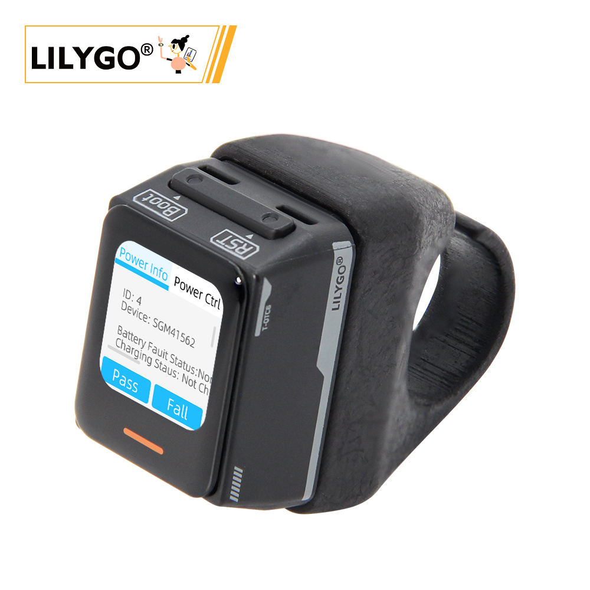
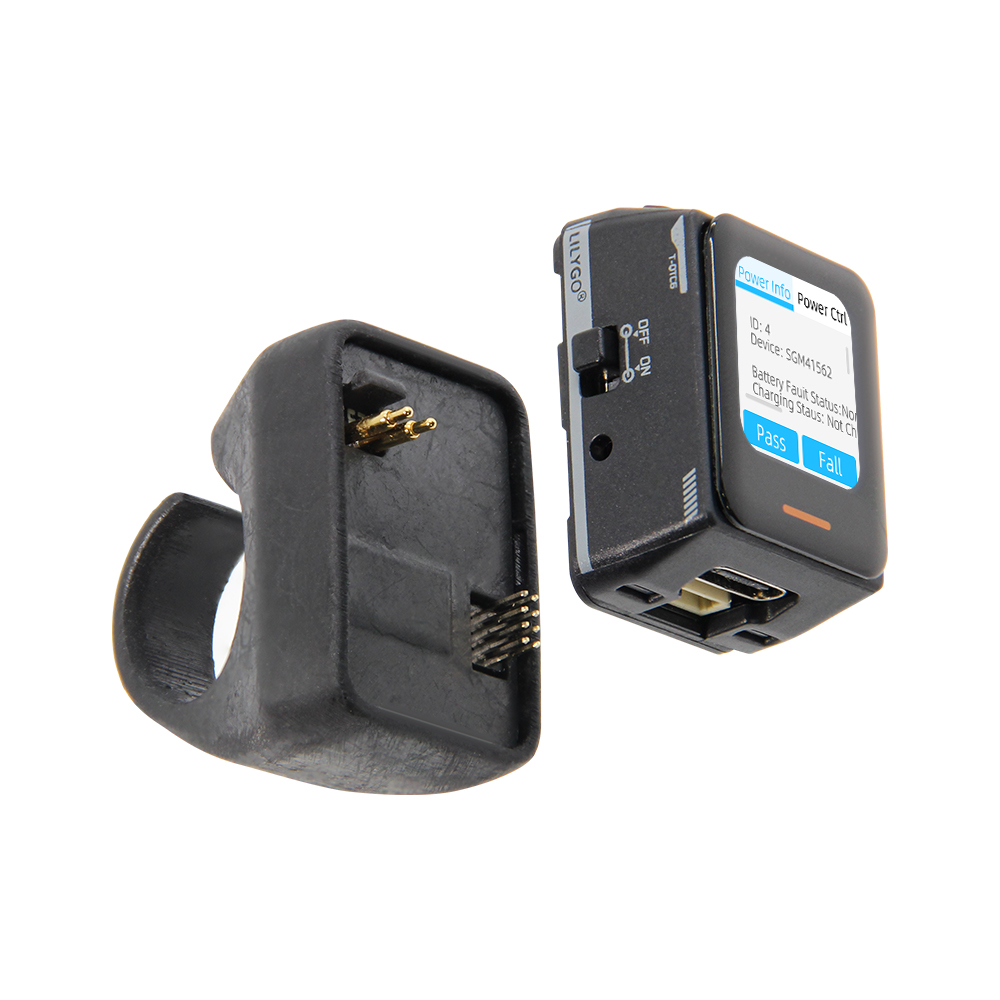
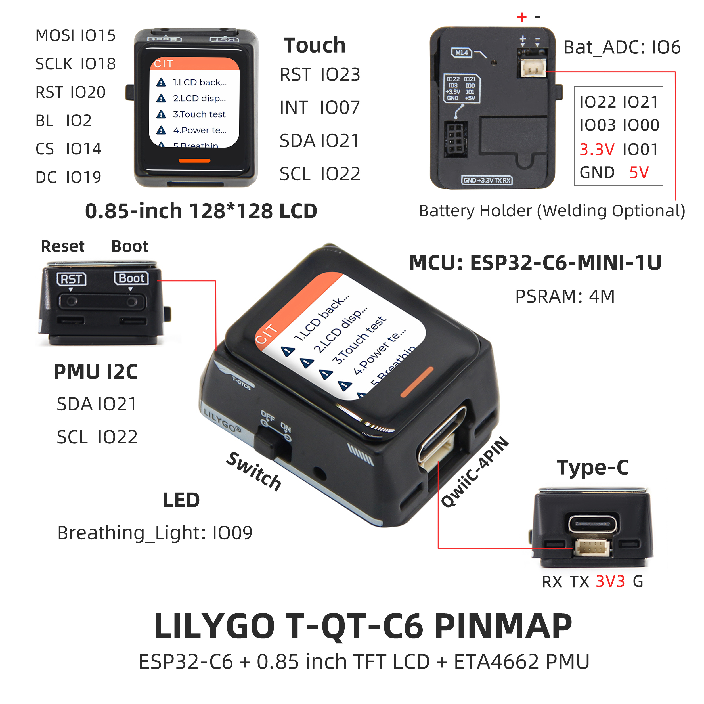
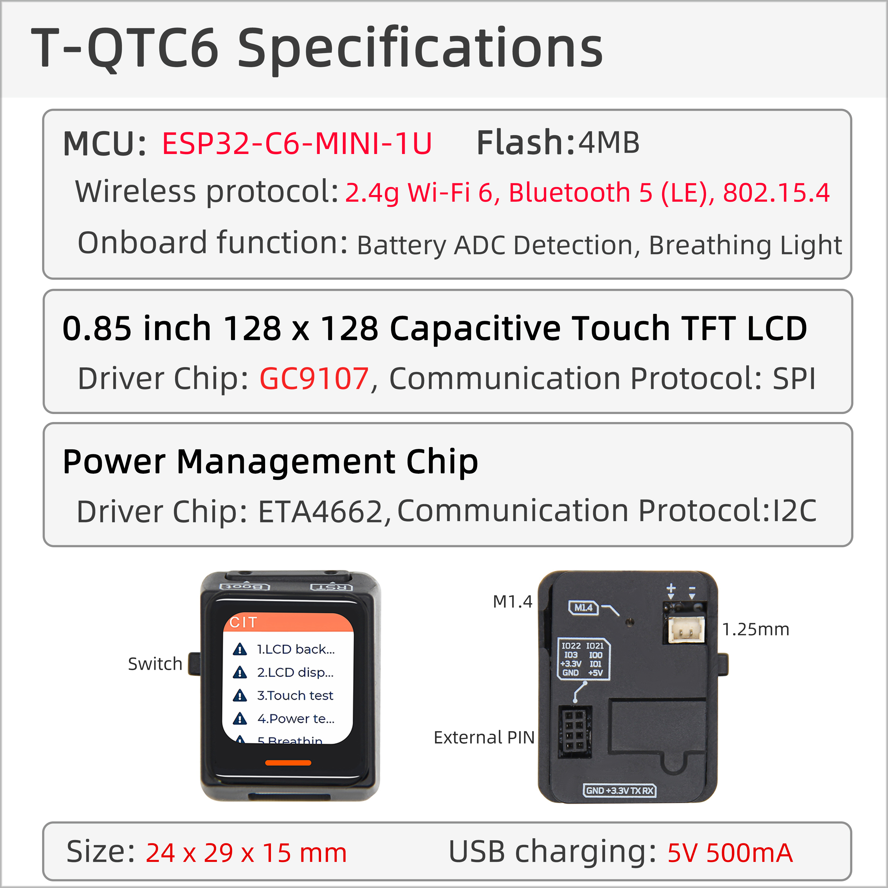

<!-- **[English](README.MD) | 中文** -->

    <a target="_blank" style="margin: 1em;color: white; font-size: 0.9em; border-radius: 0.3em; padding: 0.5em 2em; background-color:rgb(63, 201, 28)" href="https://lilygo.cc/products/t-qt-c6">Go Buying</a>
    <!-- <a target="_blank" style="margin: 1em;color: white; font-size: 0.9em; border-radius: 0.3em; padding: 0.5em 2em; background-color:rgb(63, 201, 28)" href="https://www.aliexpress.com/store/911876460">速卖通</a> -->

## Introduction

LILYGO T-QT C6 is a smart wearable development kit based on the ESP32-C6-MINI-1U microcontroller. It integrates a 0.85-inch TFT LCD display with a resolution of 128×128, a 6-axis sensor (LSM6DSL, supporting accelerometer and gyroscope functions), and a SGM41562 power management unit (PMU).

- Key features include:

- Built-in battery power supply,

- Touch interaction,

- Breathing light status indicator,

- 4MB Flash storage,

- QWIIC 4-PIN connector and I2C/SPI pins for hardware expansion.

It supports Wi-Fi and Bluetooth wireless communication and is suitable for applications such as motion tracking, embedded development, or portable interactive devices.

The product may adopt a ring-style extension dock design (T-QT-C6 Extended Finger Ring Dock), balancing low power consumption with high integration, making it ideal for prototyping and functional validation in fields like IoT and wearable devices.

## Appearance and function introduction
### Appearance

### Pinmap 

## Module Information and Specifications
### Description

| Component | Description |
| --- | --- |
| MCU | ESP32-S3R8 Dual-core LX7 microprocessor |
| PSRAM | 4M|
| Screen | 0.85-inch GC9107 TFT |
| Touch | CST816T touch capacitive screen
| Bus | QSPI
| LoRa | 1276:868,915Mhz |
| Battery backsheet Inertial sensor | LSM6DSLTR
| Power Management | SGM41562 |
| Wireless | 2.4GHz Wi-Fi & Bluetooth 5 (LE)
| USB | 1 × USB Port and OTG(TYPE-C interface) |
| IO interface |2 x 2.54mm pitch 2*7 extended IO interface |
| Extended Interfaces | 1 × QWIIC 4-pin interface +1 x 2 x 4-pin extended battery interface + power interface |
| Keys | 1 x RESET key + 1 x BOOT key |
| Dimensions | 33x24x44.5mm |

### Related Links

Github：[T-QT-C6](https://github.com/Xinyuan-LilyGO/T-QT-C6/tree/arduino-esp32-libs_V3.0.2)

* [Espressif](https://www.espressif.com/en/support/documents/technical-documents)
* [ETA4662_V1.8](https://github.com/Xinyuan-LilyGO/T-QT-C6/blob/arduino-esp32-libs_V3.0.2/information/ETA4662_V1.8.pdf)
* [AN-CST816T-v1](https://github.com/Xinyuan-LilyGO/T-QT-C6/blob/arduino-esp32-libs_V3.0.2/information/AN-CST816T-v1.pdf)
* [WS2812B-2020](https://github.com/Xinyuan-LilyGO/T-QT-C6/blob/arduino-esp32-libs_V3.0.2/information/WS2812B-2020.pdf)
* [WS2812C-2020](https://github.com/Xinyuan-LilyGO/T-QT-C6/blob/arduino-esp32-libs_V3.0.2/information/WS2812C-2020.pdf)
* [SGMICRO-SGM41562XGTR](https://github.com/Xinyuan-LilyGO/T-QT-C6/blob/arduino-esp32-libs_V3.0.2/information/SGMICRO-SGM41562XGTR.pdf)
* [lsm6dsl](https://github.com/Xinyuan-LilyGO/T-QT-C6/blob/arduino-esp32-libs_V3.0.2/information/lsm6dsl.pdf)
* [lsm6dsl-stmicroelectronics_en](https://github.com/Xinyuan-LilyGO/T-QT-C6/blob/arduino-esp32-libs_V3.0.2/information/lsm6dsl-stmicroelectronics_en.pdf)

#### Schematic Diagram

* [T-QT-C6_V1.2](https://github.com/Xinyuan-LilyGO/T-QT-C6/blob/arduino-esp32-libs_V3.0.2/project/T-QT-C6_V1.2/T-QT-C6_MCU_V1.2.pdf)

<!-- * [SY6970](./datasheet/AN_SY6970.pdf) -->

#### Dependency Libraries

* [Arduino_DriveBus-1.1.10](https://github.com/Xk-w/Arduino_DriveBus)
* [Arduino_GFX-1.3.7](https://github.com/moononournation/Arduino_GFX)
* [lvgl-8.3.5](https://github.com/lvgl/lvgl)

## Software Design
### Arduino Set Parameters

| Setting                               | Value                                 |
| :-------------------------------: | :-------------------------------: |
| Board                                | ESP32C6 Dev Module            |
| Upload Speed                     | 921600                               |
| CPU Frequency                   | 160MHz                              |
| Flash Mode                         | QIO                                   |
| Flash Size                           | 4MB (32Mb)                     |
| Core Debug Level                | None                                 |
| Partition Scheme                | Huge APP (3MB No OTA/1MB SPIFFS)                                 |

### Development Platform
1. [Micropython](https://micropython.org/)
2. [Arduino IDE](https://www.arduino.cc/en/software)
3. [Platform IO](https://platformio.org/)

## Product Technical Support 

