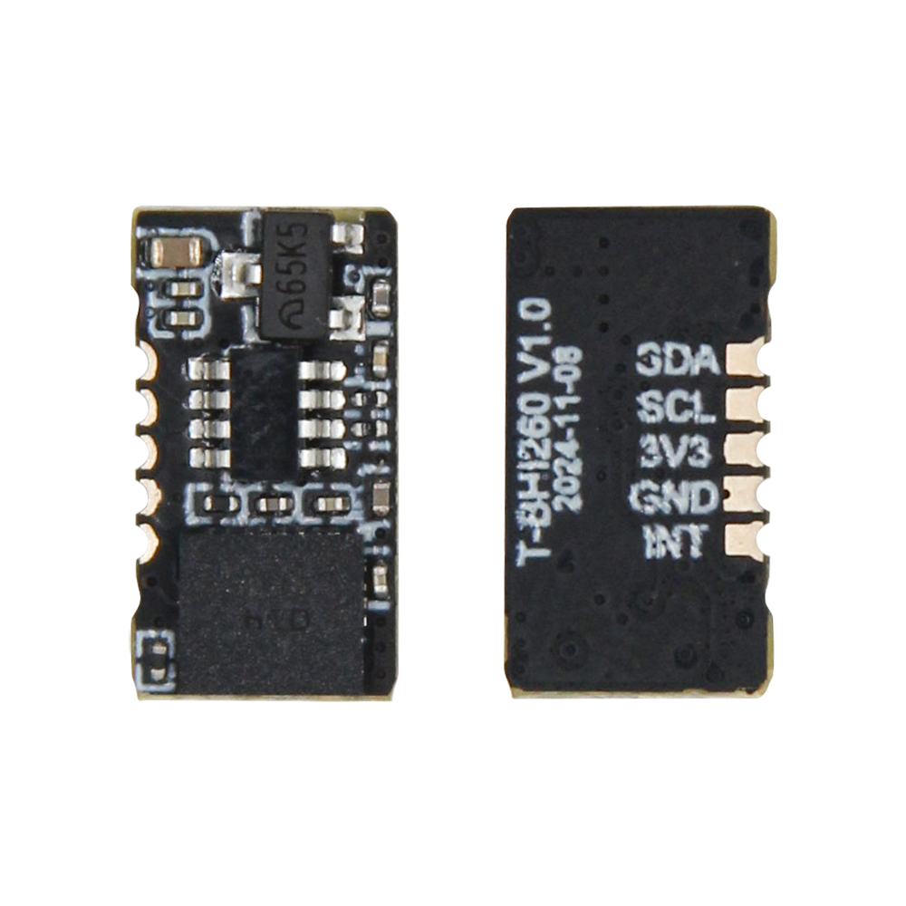
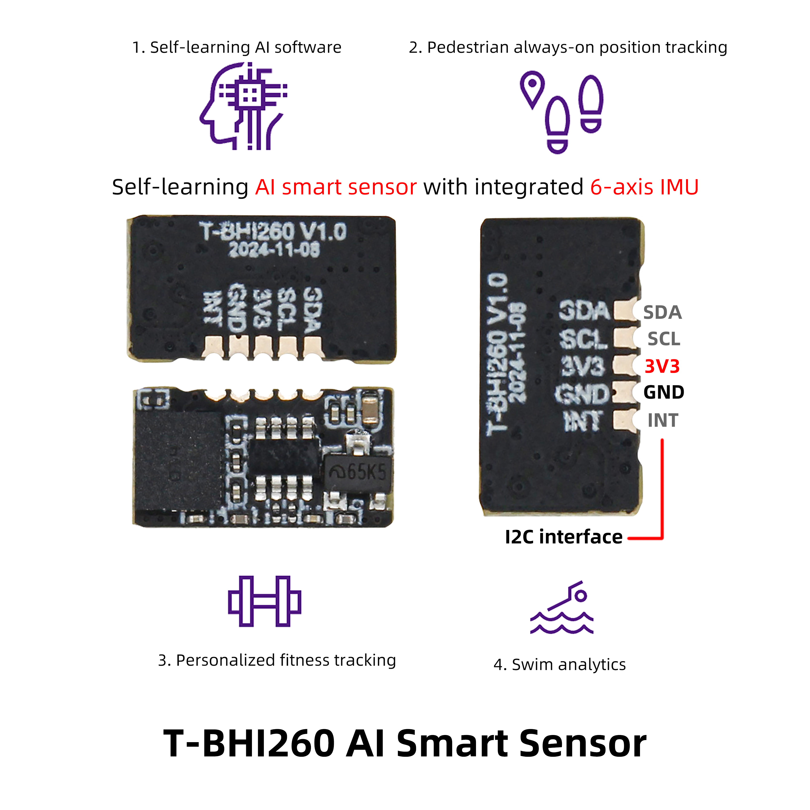

<!-- **[English](README.MD) | 中文** -->

    <a target="_blank" style="margin: 1em;color: white; font-size: 0.9em; border-radius: 0.3em; padding: 0.5em 2em; background-color:rgb(103, 175, 8)" href="https://lilygo.cc/products/t-bhi260ap">Go Buying</a>
    <!-- <a target="_blank" style="margin: 1em;color: white; font-size: 0.9em; border-radius: 0.3em; padding: 0.5em 2em; background-color:rgb(63, 201, 28)" href="https://www.aliexpress.com/store/911876460">速卖通</a> -->

## Introduction

The T-BH260 V1.0 and its upgraded model, the T-BH1260 AI Smart Sensor, are multifunctional motion monitoring devices that integrate self-learning AI algorithms with a 6-axis IMU (accelerometer + gyroscope). They support real-time pedestrian tracking, personalized fitness data analysis (such as movement accuracy and calorie consumption), and specialized swimming metrics (such as stroke efficiency and stroke frequency). Suitable for running, swimming, and daily health management, the devices feature a waterproof design and low-power consumption for sustained use in outdoor and underwater environments. Data synchronization with mobile apps is achieved via Bluetooth/Wi-Fi, and they are compatible with mainstream health platforms—meeting the needs of sports enthusiasts while also offering real-time location tracking for safety and monitoring applications.

## Appearance and function introduction
### Appearance

### Pinmap 

### Related applications
| Product | Detailed Link
| --------------- | -----------------|                         
|T-Deck           |	[T-Deck](https://lilygo.cc/products/t-deck?_pos=2&_psq=DECK&_ss=e&_v=1.0)
|T-Display-S3     |	[T-Display-S3](https://lilygo.cc/products/t-display-s3?_pos=2&_psq=display&_ss=e&_v=1.0)
|T-Display-S3-Pro |	[T-Display-S3-Pro](https://lilygo.cc/products/t-display-s3-pro?_pos=3&_psq=display+s3+p&_ss=e&_v=1.0)
|T-Echo           |	[T-Echo](https://lilygo.cc/products/t-echo-lilygo?_pos=2&_psq=echo&_ss=e&_v=1.0)

