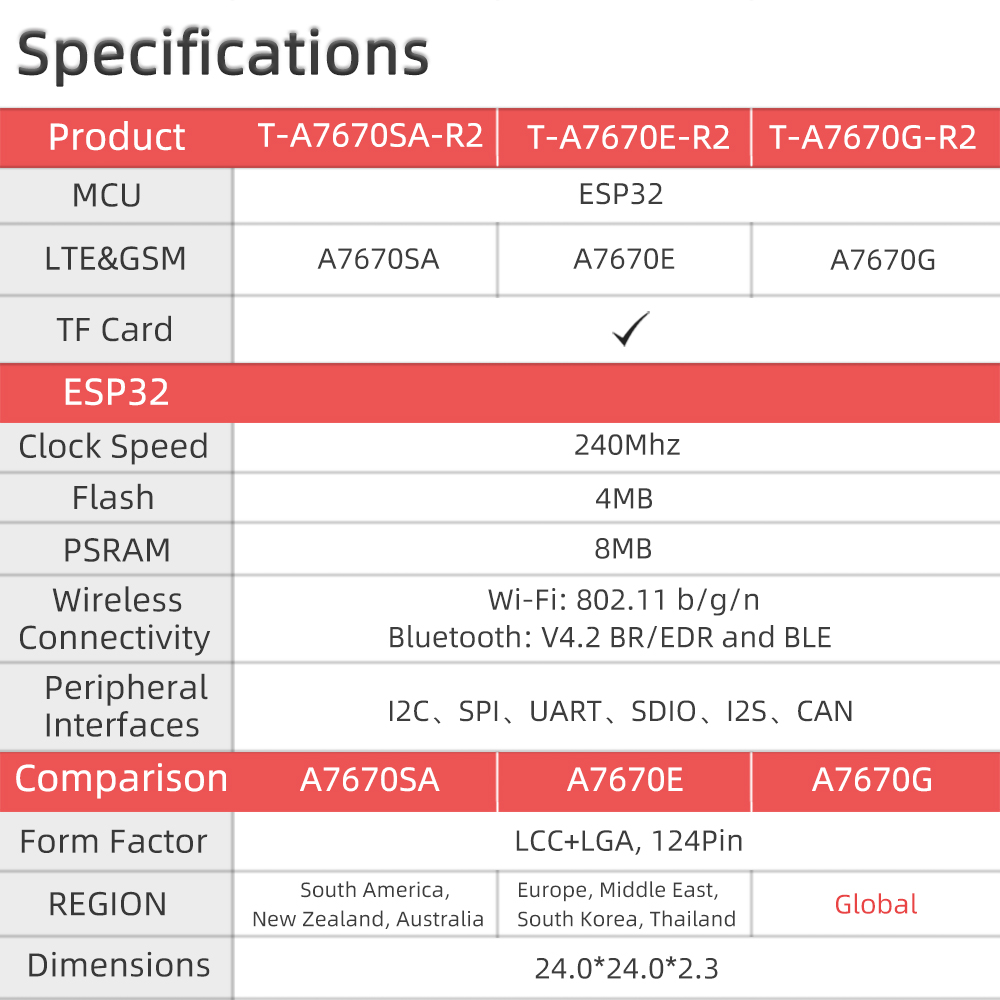
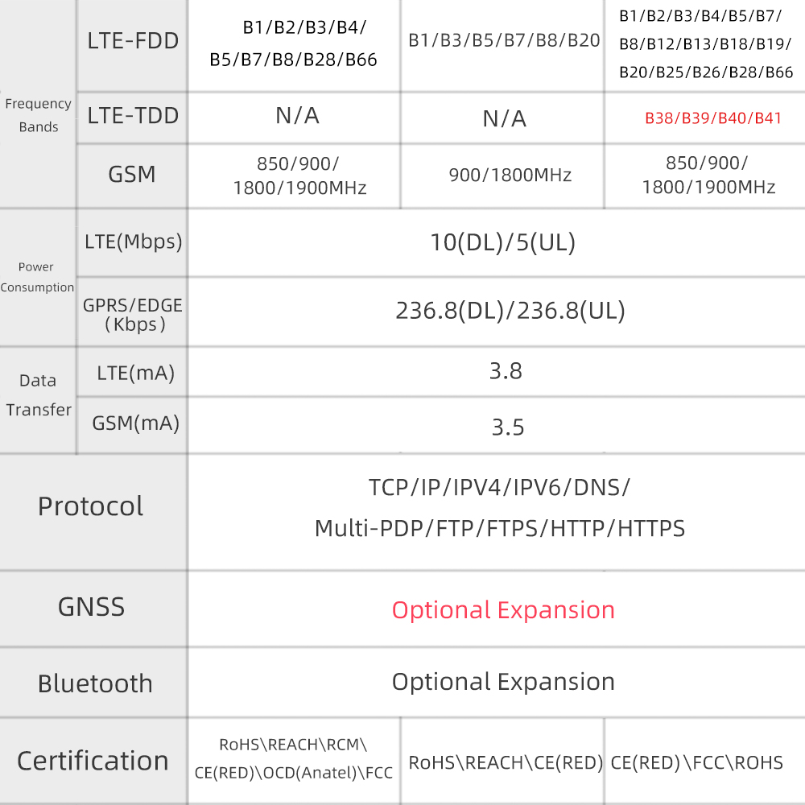

## Module Naming and Compatibility Notes
A7670G / A7670E / A7670SA are collectively referred to as A7670X.

A7672G is identical to A7670G, with only a different name.

A7608SA-H / A7608E-H / A7608E / A7608SA are collectively referred to as A7608X.
## Platform Differences

SIM7670G uses the Qualcomm platform.

A7670X uses the Asrmicro platform.
## Hardware Versions & Notes

### A7670 and A7670 R2

The usage is exactly the same.

The only difference lies in the internal chip manufacturing process of the module

### Differences between T-A7608 and T-A7608-V2
Removed:
* Modem reset pin (IO5)
* Power-on pin (IO12)

Added:
* Onboard LED (controlled via IO12)
* Solar voltage detection function (IO34, ADC)

## Functional Limitations

A7670E-LNXY-UBL  This version does not support voice and SMS functionalities.

## Specification Comparison
### T-A7670E T-A7670G T-A7670SA 

## Reference Materials

1. SIMCOM Official Documentation Center
   - [SIMCOM official A7670X All Datasheet](https://cn.simcom.com/product/A7670X.html)
   - [SIMCOM official A7608X All Datasheet](https://cn.simcom.com/product/A7608X-H-E_SA.html)
   - [SIMCOM official SIM7672 All Datasheet](https://en.simcom.com/product/SIM7672.html)
2. A7670/A7608-Datasheets
   - [A76xx AT Command](https://github.com/Xinyuan-LilyGO/LilyGO-T-A76XX/blob/main/datasheet/A76XX/A76XX_Series_AT_Command_Manual_V1.09.pdf)
   - [A76xx MQTT(S) Application](https://github.com/Xinyuan-LilyGO/LilyGO-T-A76XX/blob/main/datasheet/A76XX/A76XX%20Series_MQTT(S)_Application%20Note_V1.02.pdf)
   - [A76xx HTTP(S) Application](https://github.com/Xinyuan-LilyGO/LilyGO-T-A76XX/blob/main/datasheet/A76XX/A76XX%20Series_HTTP(S)_Application%20Note_V1.02.pdf)
   - [A76xx GNSS Application](https://github.com/Xinyuan-LilyGO/LilyGO-T-A76XX/blob/main/datasheet/A76XX/A76XX%20Series_GNSS_Application%20Note_V1.02.pdf)
   - [A76xx FTP Application](https://github.com/Xinyuan-LilyGO/LilyGO-T-A76XX/blob/main/datasheet/A76XX/A76XX%20Series_FTP(S)_Application%20Note_V1.02.pdf)
   - [A76xx LBS Application](https://github.com/Xinyuan-LilyGO/LilyGO-T-A76XX/blob/main/datasheet/A76XX/A76XX%20Series_LBS_Application%20Note_V1.02.pdf)
   - [A76xx SSL Application](https://github.com/Xinyuan-LilyGO/LilyGO-T-A76XX/blob/main/datasheet/A76XX/A76XX%20Series_SSL_Application%20Note_V1.02.pdf)
   - [A76xx Sleep Application](https://github.com/Xinyuan-LilyGO/LilyGO-T-A76XX/blob/main/datasheet/A76XX/A76XX%20Series_Sleep%20Mode_Application%20Note_V1.02.pdf)
   - [A76xx Hardware Design manual](https://github.com/Xinyuan-LilyGO/LilyGO-T-A76XX/blob/main/datasheet/A76XX/A7670C_R2_硬件设计手册_V1.06.pdf)
   - [A76xx TCPIP Application](https://github.com/Xinyuan-LilyGO/LilyGO-T-A76XX/blob/main/datasheet/A76XX/A76XX%20Series_TCPIP_Application%20Note_V1.02.pdf)
3. SIM7670G-Datasheets
   - [SIM7670G Hardware Design manual](https://github.com/Xinyuan-LilyGO/LilyGO-T-A76XX/blob/main/datasheet/SIM767X/SIM7672X_Series_Hardware_Design_V1.02.pdf)
   - [SIM7670G AT Command](https://github.com/Xinyuan-LilyGO/LilyGO-T-A76XX/blob/main/datasheet/SIM767X/SIM767XX%20Series_AT_Command_Manual_V1.06.pdf)
   - [SIM7670G CE Certificate](https://github.com/Xinyuan-LilyGO/LilyGO-T-A76XX/blob/main/datasheet/SIM767X/SIM7670G_CE%20Certificate_2023.pdf)
   - [SIM7670G Series CMUX USER GUIDE](https://github.com/Xinyuan-LilyGO/LilyGO-T-A76XX/blob/main/datasheet/SIM767X/SIM767XX%20Series_CMUX_USER_GUIDE_V1.00.pdf)
4. Schematics
   - [T-A7608-S3 Schematic](https://github.com/Xinyuan-LilyGO/LilyGO-T-A76XX/blob/main/schematic/T-A7608-S3-V1.0.pdf)
   - [T-A7608X-DC-S3 Schematic](https://github.com/Xinyuan-LilyGO/LilyGO-T-A76XX/blob/main/schematic/T-A7608X-DC-S3-V1.0.pdf)
   - [T-A7608X Schematic](https://github.com/Xinyuan-LilyGO/LilyGO-T-A76XX/blob/main/schematic/T-A7608X-V1.0.pdf)
   - [T-A7608X-V2 Schematic](https://github.com/Xinyuan-LilyGO/LilyGO-T-A76XX/blob/main/schematic/A7608-ESP32-V2.pdf)
   - [T-A7670X Schematic](https://github.com/Xinyuan-LilyGO/LilyGO-T-A76XX/blob/main/schematic/T-A7670X-V1.1.pdf)
   - [T-Call-A7670 Schematic](https://github.com/Xinyuan-LilyGO/LilyGO-T-A76XX/blob/main/schematic/T-Call-A7670-V1.0.pdf)
   - [T-SIM7670G-S3 Schematic](https://github.com/Xinyuan-LilyGO/LilyGO-T-A76XX/blob/main/schematic/T-SIM7670G-S3-V1.0.pdf)