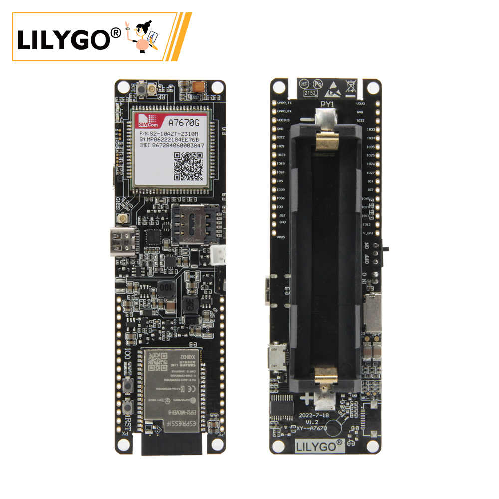
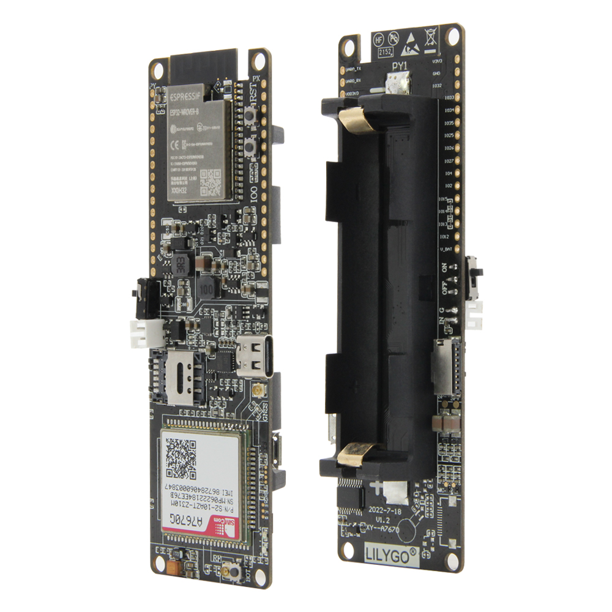
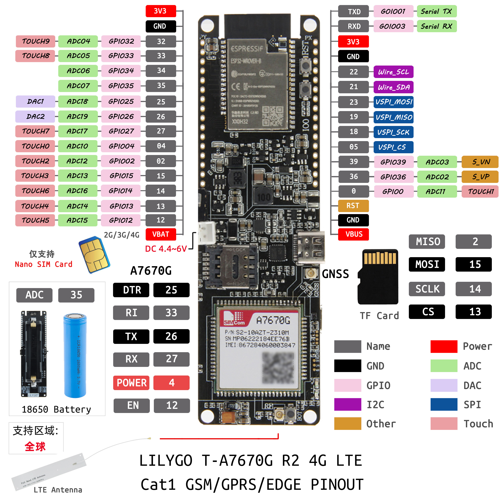

<!-- **[English](README.MD) | 中文** -->

>The differences of the T-A76xx series can be referred to in [SIM](../../SIM.md)

<!-- 

    <a target="_blank" style="margin: 1em;color: white; font-size: 0.9em; border-radius: 0.3em; padding: 0.5em 2em; background-color:rgb(63, 201, 28)" href="https://item.taobao.com/item.htm?id=846226367137">淘宝</a>
    <a target="_blank" style="margin: 1em;color: white; font-size: 0.9em; border-radius: 0.3em; padding: 0.5em 2em; background-color:rgb(63, 201, 28)" href="https://www.aliexpress.com/store/911876460">速卖通</a>

 -->

## Introduction

LILYGO T-A7670G R2 is a 4G LTE Cat1 communication module specifically designed for IoT applications. It supports global multi-band GSM/GPRS/EDGE networks, making it compatible with a wide range of carriers and suitable for medium-to-low-speed data transmission scenarios, such as sensor data reporting and remote command control.

It features a built-in Nano SIM card slot compatible with mainstream IoT SIM cards and integrates a rich set of hardware interfaces, including:

- 12 GPIOs (for digital signal control and PWM output)

- 8 ADC channels (12-bit resolution for analog signal acquisition)

- 2 DAC channels (for driving analog devices)

- 10 capacitive touch pins (TOUCH0–9 for touch key interaction)

- UART interface (TX/RX for communication with the main controller)

The module supports a wide input voltage range of 4.4V to 6V, allowing it to be powered directly by 18650 lithium batteries. With the VBAT pin, it can enter low-power mode, making it ideal for field monitoring, vehicle tracking, and other off-grid applications.

Application scenarios include smart home systems (e.g., remote temperature control), industrial automation (equipment status monitoring), agricultural IoT, and shared economy devices (e.g., smart locks). During development, an external main controller (such as an ESP32) is required to communicate with the module using AT commands. Be sure to use 3.3V logic level to avoid GPIO damage and verify frequency band compatibility with local carriers.

With its compact design, onboard antenna interface, and balance of expandability and cost-efficiency, this module offers a reliable solution for low-to-mid speed IoT connectivity.

## Appearance and function introduction
### Appearance

### Pinmap 

## Module Information and Specifications
### Description

| Component | Description |
| --- | --- |
| MCU | ESP32-WROVER-E |
| FLASH| 4MB |
| PS RAM | 8MB|
| Clock Frequency | 240MHz |
| Wireless | Wi-Fi: 802.11 b/g/n; BLE V5.0 |
| IO Expansion	|2.54mm spacing × 2*16 expansion IO interfaces + 1 × 4.4V~6.0V input interface|
| Battery Capacity | 18650 model battery |
| Storage | TF card |
| Voice Call | Supports voice function
| Buttons | 1 x RST button  + 1 x BOOT button  + 1 × IO0 button  |
| USB | 1 × USB Port and OTG(Type-C) |
| SIM | Supports 2G, 3G, 4G (Nano SIM)
| Power | 5V/500mA input|
| Dimensions | **111x34x19mm**  |
| Mounting Holes | 4 × 2mm positioning holes |
 

 
<table role="table" class="center_table">
  <thead>
    <tr>
      <th colspan = "2">Wireless Communication Module</th>
    </tr>
  </thead>
    <tr>
    <td>MCU</td>
    <td>A7670G</td>
  </tr>
  <tr>
    <td>Supported Regions</td>
    <td>Gloabl</td>
  </tr>
  <tr>
    <td>Size</td>
    <td>LCC+LGA,124Pin</td>
  </tr>
  </tr>
    <tr>
    <td>Size</td>
    <td>24*24*2.3mm</td>
  </tr>
    </tr>
    <tr>
    <td>Frequency Baud</td>
    <td>LTE-FDD :B1/B2/B3/B4/B5/B7/B8/B12/B13/B18/B19/
B20/B25/B26/B28/B66 
        LTE-TDD :B34/B38/B39/B40/B41 
        GSM:850/900/1800/1900MHz,
        </td>
  </tr>
  </tr>
    </tr>
    <tr>
    <td>Power Consumption</td>
    <td>LTE(Mbps) :10(DL)/5(UL) 
        GPRS/EDGE(Kbps) :236.8(DL) / 236.8(UL) 
        </td>
  </tr>
    <tr>
    <td>Data Transmission</td>
    <td>LTE :3.8mA 
        GSM :3.5mA 
        </td>
  </tr>
    <tr>
    <td>Protocol Support</td>
    <td>TCP/IP/IPV4/IPV6/DNS/Multi-PDP/FTP/FTPS/HTTP/HTTPS</td>
  </tr>
  </tr>
    </tr>
    <tr>
    <td>Optional Expansion</td>
    <td>GNSS Bluetooth</td>
  </tr>
    </tr>
    <tr>
    <td>Certification</td>
    <td>RoHS/CE(RED)/FCC</td>

</table>

> ⚠️⚠️⚠️  optional without GPS version, GPS version contact customer service purchase.

### Related Links

Github:[T-A7670G](https://github.com/Xinyuan-LilyGO/LilyGO-T-A76XX)

#### Schematic Diagram

[T-A7670E](https://github.com/Xinyuan-LilyGO/LilyGO-T-A76XX/blob/main/schematic/T-A7670X-V1.4.pdf)

#### Dependency Libraries

* [Adafruit_BusIO](https://github.com/adafruit/Adafruit_BusIO)
* [Adafruit-GFX-Library](https://github.com/adafruit/Adafruit-GFX-Library)                     
* [Adafruit_INA219](https://github.com/adafruit/Adafruit_INA219)       
* [Adafruit_NeoPixel](https://github.com/adafruit/Adafruit_NeoPixel)   
* [Adafruit_SSD1306](https://github.com/adafruit/Adafruit_SSD1306) 
* [Adafruit_Sensor](https://github.com/adafruit/Adafruit_Sensor)    
* [ArduinoHttpClient](https://github.com/arduino-libraries/ArduinoHttpClient)      
* [blynk](https://blynk.io)                     
* [BlynkNcpDriver](https://blynk.io)       
* [DHT-sensor-library](https://github.com/adafruit/DHT-sensor-library)   
* [TinyGPSPlus](http://pubsubclient.knolleary.net) 
* [SensorsLib](https://github.com/lewisxhe/SensorsLib)    
* [StreamDebugger](https://github.com/vshymanskyy/StreamDebugger)      
* [TinyGPSPlus](https://github.com/mikalhart/TinyGPSPlus)       
* [TinyGSM-fork](https://github.com/lewisxhe/TinyGSM-fork)   
 

## Software Development
### Arduino Setup Parameters

| Setting                               | Value                                 |
| :-------------------------------: | :-------------------------------: |
| Board                                 | ESP32 Dev Module           |
| CPU Frequency                   | 240MHz (WiFi/BT)     
| Core Debug Level                | None  
| Erase All Flash Before Sketch Upload | Disabled                             |
| Events Run On                   | Core 1                               |
| Flash Frequency                  | 80MHz
| Flash Mode                         | QIO                      |
| Flash Size                           | 4MB (32Mb)                    |
| JATG  Adapter                      | Disabled                             |
| Arduino Runs On                  | Core 1                               |
| Partition Scheme                | default 4MB with spiffs (1.2MB APP/1.5MB spiffs) |
| PSRAM                              | ENabled                             |
| Upload Speed                      | 921600                             |

### Development Platforms

1. [ESP-IDF](https://www.espressif.com/zh-hans/products/sdks/esp-idf)
2. [Arduino IDE](https://www.arduino.cc/en/software)
3. [VS Code](https://code.visualstudio.com/)
4. [Platform IO](https://platformio.org/)

## Product Technical Support 

