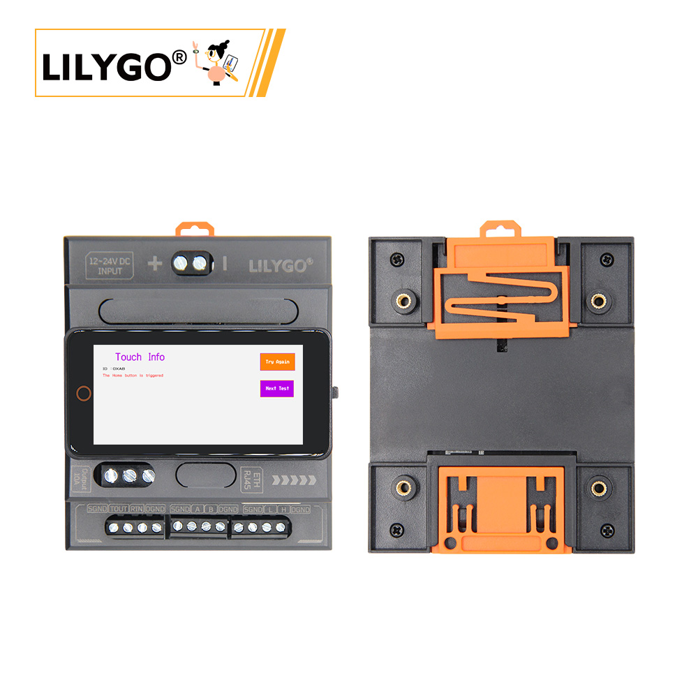

<!-- **[English](README.MD) | 中文** -->

    <a target="_blank" style="margin: 1em;color: white; font-size: 0.9em; border-radius: 0.3em; padding: 0.5em 2em; background-color:rgb(63, 201, 28)" href="https://lilygo.cc/products/t-connect-pro">Go Buying</a>
    <!-- <a target="_blank" style="margin: 1em;color: white; font-size: 0.9em; border-radius: 0.3em; padding: 0.5em 2em; background-color:rgb(63, 201, 28)" href="https://www.aliexpress.com/store/911876460">速卖通</a>-->

 

## Introduction

The T-Connect-Pro is a multifunctional industrial-grade control and communication module based on the ESP32-S3. It integrates LoRa (SX1262 chip), an ST7796 LCD display (with resolution and pins for DC/CS/BL), CAN bus, Ethernet interface, and dual serial ports (RS232/RS485). Supporting a wide voltage input of 12–24V and a 10A relay output, it is well-suited for complex industrial automation and IoT applications.

Its hardware configuration includes touch functionality (SDA/SCL/RST), SPI Ethernet communication (MOSI/MISO/SCLK), a QWIIC expansion interface, and DC-DC power management. The module offers multi-protocol communication (long-range LoRa transmission, CAN bus control), real-time data display (LCD), and device linkage control (relay). With high compatibility and stability, it is ideal for applications such as smart factories, remote sensing, and energy monitoring, meeting diverse industry needs.

## Appearance and function introduction
### Appearance

### Pinmap 

## Module Information and Specifications
### Description

The T-Connect-Pro is based on the ESP32S3 main control chip and consists of a three-layer stacked board design. It offers a wide range of features and integrates three different communication modules—CAN, RS485, and RS232—for long-distance transmission. Additionally, it includes an Ethernet interface, a relay interface, an LoRa module (SX1262), and an LCD screen for more convenient operation.

| component | Description |
| --- | --- |
| MCU | ESP32-S3-R8
| FLASH| 16MB |
| PS RAM | 8MB|
| Axis sensor | BMA423 (IIC)|
| Ethernet | W5500 (SPI) |
| LoRa | HPD16A SX1262 chips support the frequency band from 433 to 920HMZ(optional) |
| CAN | TD501MCANFD (TWAI) |
| RS485 | TD501D485H-A (UART)|
| RS232 | TD501D232H (UART)|
| Relay | output 10A|
| Power management | AXP2101 Highly integrated power management unit |
| USB | 1 x USB Port and OTG(TYPE-C port) |
| Extended interface | 1 x QWIIC interface |
| Button | 1 x RESET button + 1 x BOOT button (built-in) |
| Screen | ST7796 TFT screen 222x480px(SPI)|
| Touch | CST226SE (IIC)|
| Power supply | 5V/500mA |
| Hole | **M3mm screw hole x 4** |
| Dimensions | ** 88x72x60mm with base ** |

### Related Links

Github:[T-Connect-Pro](https://github.com/Xinyuan-LilyGO/T-Connect-Pro)

- [Espressif ESP32-S3 Datasheet](https://www.espressif.com.cn/sites/default/files/documentation/esp32-s3_datasheet_en.pdf)
- [HPD16A_V1.1](https://github.com/Xinyuan-LilyGO/T-Connect-Pro/blob/main/information/HPDTEK_HPD16A_TCXO_V1.1.pdf)
- [SX1262_V2.1](https://github.com/Xinyuan-LilyGO/T-Connect-Pro/blob/main/information/DS_SX1261-2_V2_1.pdf)
- [TD501MCANFD](https://github.com/Xinyuan-LilyGO/T-Connect-Pro/blob/main/information/TD501MCANFD_MORNSUN.pdf)
- [TD501D485H-A](https://github.com/Xinyuan-LilyGO/T-Connect-Pro/blob/main/information/TD501D485H-A_K-CUT.pdf)
- [TD501D232H](https://github.com/Xinyuan-LilyGO/T-Connect-Pro/blob/main/information/TD501D232H.pdf)

#### Schematic Diagram
[T-Connect-Pro](https://github.com/Xinyuan-LilyGO/T-Connect-Pro/blob/main/project/T-Connect-Pro_V1.0.pdf)

#### Dependency Libraries
- Touch: [Arduino_DriveBus-1.1.2](https://github.com/Xk-w/Arduino_DriveBus)
- LoRa: [RadioLib-6.6.0](https://github.com/jgromes/RadioLib)
- Screen:[Arduino_GFX](https://github.com/moononournation/Arduino_GFX)
- Ethernet:[Ethernet_V2.0.0](http://www.arduino.cc/en/Reference/Ethernet)

## Software Design
### Arduino Set Parameters

|Setting|	Value|
| :--------------: | :------------: |
|Board	| ESP32S3 Dev Module
|Upload Speed	|921600
|USB Mode	|Hardware CDC and JTAG
|USB CDC On Boot	|Enabled
|USB Firmware MSC On Boot	|Disabled
|USB DFU On Boot|	Disabled
|CPU Frequency	|240MHz (WiFi)
|Flash Mode	|QIO 80MHz
|Flash Size	|16MB (128Mb)
|Core Debug Level|	None
|Partition Scheme	|16M Flash (3MB APP/9.9MB FATFS)
|PSRAM	|OPI PSRAM
|Arduino Runs On	|Core 1
|Events Run On	|Core 1

### Development Platform

1. [ESP-IDF](https://www.espressif.com/zh-hans/products/sdks/esp-idf)
2. [Arduino IDE](https://www.arduino.cc/en/software)
3. [VS Code](https://code.visualstudio.com/)
4. [Micropython](https://micropython.org/)

## Product Technical Support 

