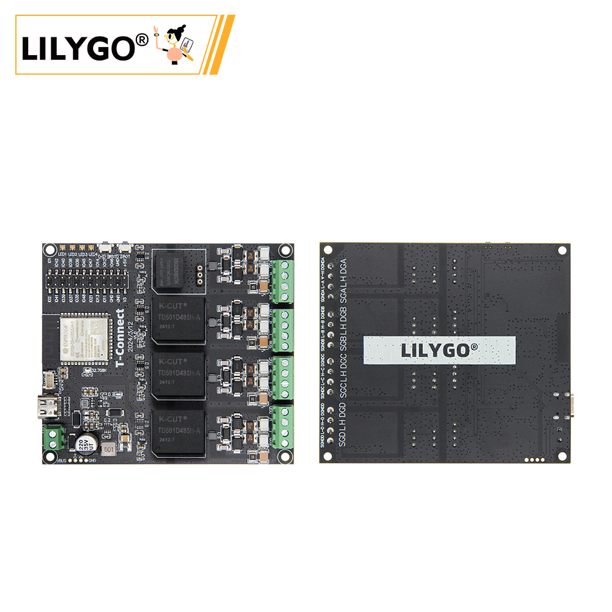
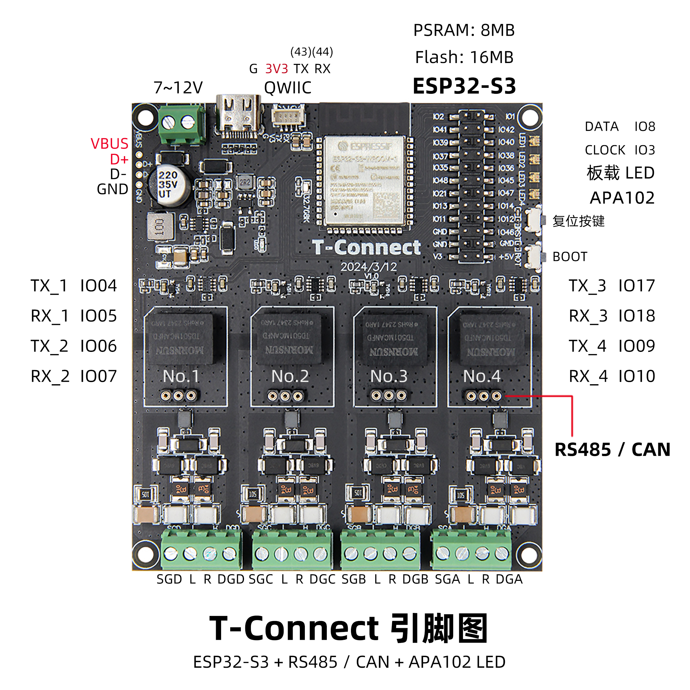
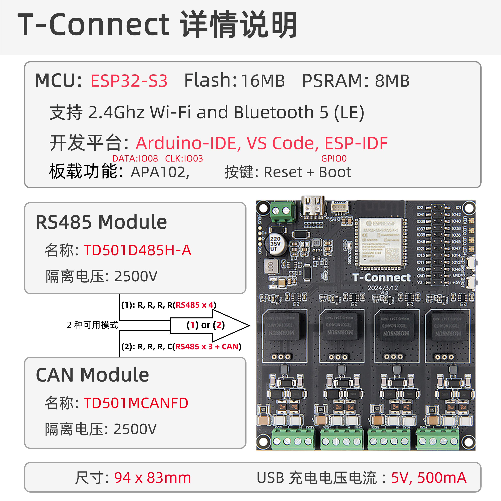

<!-- **[English](README.MD) | 中文** -->

    <a target="_blank" style="margin: 1em;color: white; font-size: 0.9em; border-radius: 0.3em; padding: 0.5em 2em; background-color:rgb(103, 175, 8)" href="https://lilygo.cc/products/t-connect">Go Buying</a>
    <!-- <a target="_blank" style="margin: 1em;color: white; font-size: 0.9em; border-radius: 0.3em; padding: 0.5em 2em; background-color:rgb(63, 201, 28)" href="https://www.aliexpress.com/store/911876460">速卖通</a> -->

## Introduction

T-Connect is a multifunctional development board based on the ESP32-S3 chip, equipped with 8MB PSRAM and 16MB Flash. It supports dual-mode Wi-Fi/Bluetooth communication and industrial protocols such as RS485 and CAN. The board features a built-in APA102 LED driver, enabling direct control of RGB light strips.

With multiple UART interfaces and multiplexed pins (such as the SGD/SGC series), T-Connect is well-suited for IoT devices, industrial automation, and smart lighting applications. It combines high integration with flexible expansion, making it ideal for reliable communication and versatile control in complex environments.

## Appearance and function introduction
### Appearance

### Pinmap 

## Module Information and Specifications
### Description

T-Connect is a development board capable of outputting data from four different module groups, supporting both CAN and RS485 protocols with flexible switching between them. It can support up to three independent RS485 channels and one CAN bus, each capable of transmitting different sets of data simultaneously.

| Component | Description |
| --- | --- |
| MCU | ESP32-S3-R8
| FLASH| 16MB |
| PSRAM | 8MB (Octal SPI)|
| RS485 | UART communication |
| CAN | TWAI communication |
| Led | APA102|
| Relay | Output 10A|
| USB | 1 × USB Port and OTG(TYPE-C interface) |
Output: Supports up to three groups of RS485 and one group of CAN bus output
| Extended Interface | 1 × QWIIC interface |
| Keys | 1 x RESET key + 1 x BOOT key |
| Power supply | 5V/500mA USB interface power supply  7V~12V DC power input |
| Hole Position | **2mm positioning hole × 4** |
| Dimensions | 94x83x13mm |

### Related Links

Github:[T-Connect](https://github.com/Xinyuan-LilyGO/T-Connect)

- [TD501MCANFD](https://github.com/Xinyuan-LilyGO/T-Connect-Pro/blob/main/information/TD501MCANFD_MORNSUN.pdf)
- [TD501D485H-A](https://github.com/Xinyuan-LilyGO/T-Connect-Pro/blob/main/information/TD501D485H-A_K-CUT.pdf)

#### Schematic Diagram
[T-Connect](https://github.com/Xinyuan-LilyGO/T-Connect/blob/main/project/T-Connect_V1.0.pdf)

#### Dependency Libraries
- [FastLED](https://github.com/FastLED/FastLED)

## Software Design
### Arduino Set Parameters

| Setting                  | Value                            |
|--------------------------|----------------------------------|
| Board                    | ESP32S3 Dev Module               |
| Upload Speed             | 921600                           |
| USB Mode                 | Hardware CDC and JTAG            |
| USB CDC On Boot          | Enabled                          |
| USB Firmware MSC On Boot | Disabled                         |
| USB DFU On Boot          | Disabled                         |
| CPU Frequency            | 240MHz (WiFi)                    |
| Flash Mode               | QIO 80MHz                        |
| Flash Size               | 16MB (128Mb)                     |
| Core Debug Level         | None                             |
| Partition Scheme         | 16M Flash (3MB APP/9.9MB FATFS)  |
| PSRAM                    | OPI PSRAM                        |
| Arduino Runs On          | Core 1                           |
| Events Run On            | Core 1                           |

### Development Platform
1. [VS Code](https://code.visualstudio.com/)
2. [Arduino IDE](https://www.arduino.cc/en/software)
3. [Platform IO](https://platformio.org/)

## Product Technical Support 

