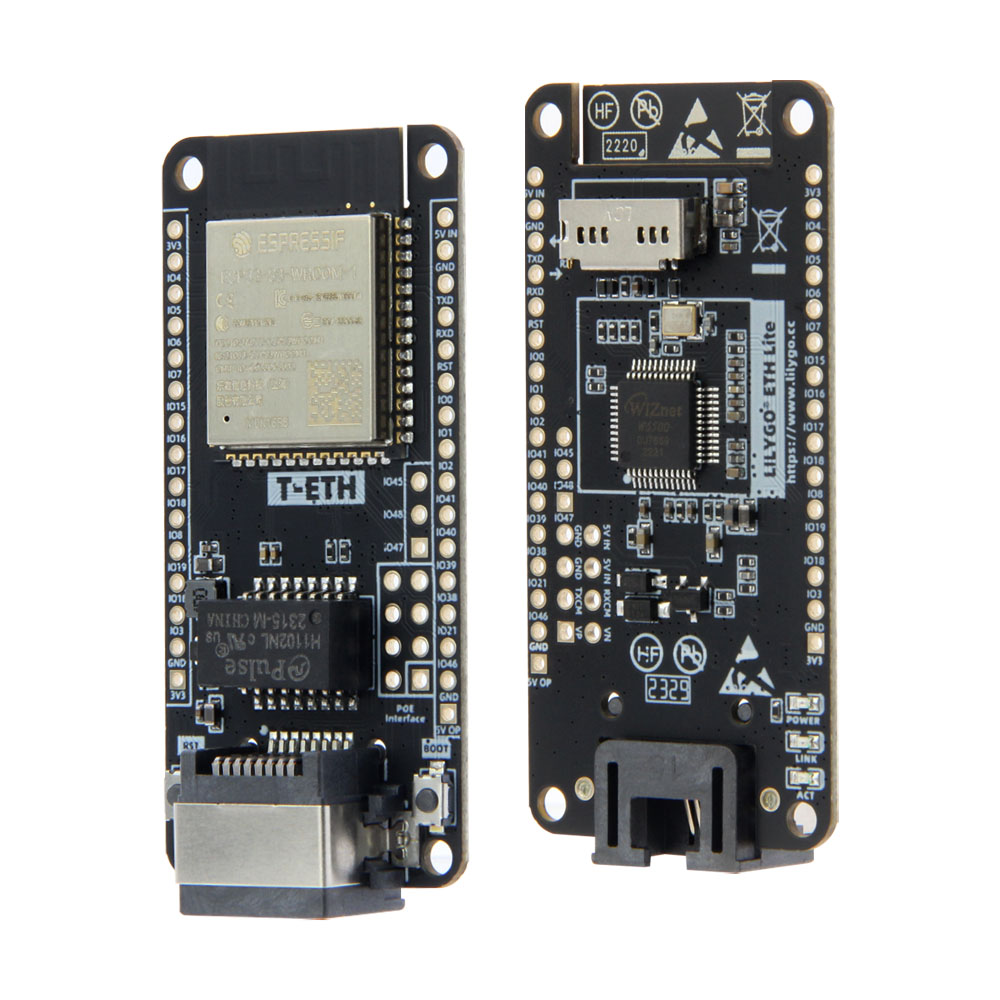
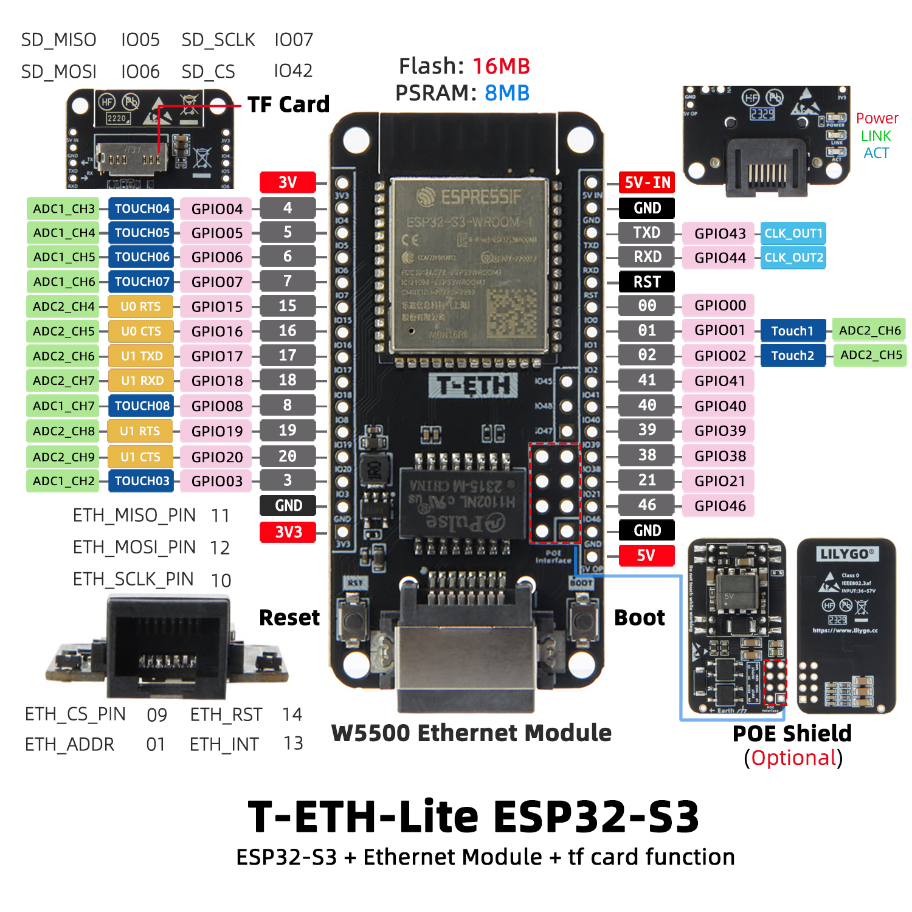

<!-- **[English](README.MD) | 中文** -->

    <a target="_blank" style="margin: 1em;color: white; font-size: 0.9em; border-radius: 0.3em; padding: 0.5em 2em; background-color:rgb(63, 201, 28)" href="https://lilygo.cc/products/t-eth-lite?variant=43120880779445">Go Buying</a>
    <!-- <a target="_blank" style="margin: 1em;color: white; font-size: 0.9em; border-radius: 0.3em; padding: 0.5em 2em; background-color:rgb(63, 201, 28)" href="https://www.aliexpress.com/store/911876460">速卖通</a>-->

 

## Introduction

T-ETH-Lite ESP32-S3 is an embedded development module based on the ESP32-S3 chip, integrating Ethernet communication, TF card storage expansion, and multiple peripheral interfaces. Its core configuration includes 16MB Flash and 8MB PSRAM, supporting high-speed data processing and storage. The module features a W5500 Ethernet controller that enables stable network connectivity, accessible via control pins such as ETH_CS and ETH_INT.

It offers a wide range of GPIO interfaces (e.g., GPIO00–GPIO20, GPIO38–GPIO46), supporting ADC channels, touch inputs (TOUCH03–TOUCH08), and dedicated output control pins (GK_OUT1/GK_OUT2), making it highly adaptable to sensors, actuators, and other peripherals. In addition, it provides a TF card slot (via SPI interface) and supports an optional PoE expansion board, making it ideal for IoT endpoints, industrial control systems, and other scenarios requiring extensibility and low-power design.

## Appearance and function introduction
### Appearance

### Pinmap  

## Module Information and Specifications
### Description

> Note: T-ETH-Lite is the ESP32-S3 version. Click here to switch to the ESP32 version [T-ETH-Lite S3 version](https://wiki.lilygo.cc/get_started/en/LoRa_GPS/T-ETH-Lite/T-ETH-Lite/T-ETH-Lite.html)

| Component | Description |
| --- | --- |
| Storage | TF card
| Extension | 2 x 15io Extension
| Keys | 1 x BOOT key + 1 x Reset key |
| LED | 3 x indicator light (Power/link/ACT)
| Power Supply | 5V/500mA |
| Interface | 1 x USB Type-C interface |
| Positioning hole | 4 x 2mm positioning hole |

### Related Links

Github:[T-ETH-Lite](https://github.com/Xinyuan-LilyGO/LilyGO-T-ETH-Series)

- [DP9900M](https://github.com/Xinyuan-LilyGO/LilyGO-T-ETH-Series/blob/master/datasheet/ETH-POE-DP9900M-5V.pdf)
- [DP5300](https://github.com/Xinyuan-LilyGO/LilyGO-T-ETH-Series/blob/master/datasheet/ETH-PRO-POE-DP5300-12V.pdf)

#### Schematic Diagram
- [T-ETH-Lite](https://github.com/Xinyuan-LilyGO/LilyGO-T-ETH-Series/blob/master/schematic/T-ETH-Lite-ESP32S3.pdf)

#### Dependency Libraries

- [Adafruit_BME280_Library](https://github.com/adafruit/Adafruit_BME280_Library)
- [Adafruit_BusIO-1.16.1](https://github.com/Xinyuan-LilyGO/T-Echo-Lite/tree/main/libraries/Adafruit_BusIO-1.16.1)
- [Adafruit_NeoPixel](https://github.com/adafruit/Adafruit_NeoPixel)
- [Adafruit_Sensor](https://github.com/adafruit/Adafruit_Sensor)
- [ESP32_USB_Stream](https://github.com/esp-arduino-libs/ESP32_USB_Stream)
- [ETHClass2](https://github.com/Xinyuan-LilyGO/LilyGO-T-ETH-Series/blob/master/lib/ETHClass2)
- [LoRa](https://github.com/sandeepmistry/arduino-LoRa)
- [ModbusMaster](https://github.com/4-20ma/ModbusMaster)
- [RadioLib](https://github.com/jgromes/RadioLib)
- [StreamDebugger](https://github.com/plerup/StreamDebugger)
- [TFT_eSPI](https://github.com/Bodmer/TFT_eSPI)
- [TinyGPSPlus](https://github.com/mikalhart/TinyGPSPlus)
- [TinyGSM](https://github.com/vshymanskyy/TinyGSM)
- [U8g2](https://github.com/olikraus/u8g2)

## Software Design
### Arduino Set Parameters

| Arduino IDE Setting                  | Value                          |
|--------------------------------------|--------------------------------|
| Board                                | ESP32S3 Dev Module             |
| Port                                 | Your port                      |
| USB CDC On Boot                      | Disable                        |
| CPU Frequency                        | 240MHZ(WiFi)                   |
| Core Debug Level                     | None                           |
| USB DFU On Boot                      | Disable                        |
| Erase All Flash Before Sketch Upload | Disable                        |
| Events Run On                        | Core1                          |
| Flash Mode                           | QIO 80MHZ                      |
| Flash Size                           | 16MB(128Mb)                    |
| Arduino Runs On                      | Core1                          |
| USB Firmware MSC On Boot             | Disable                        |
| Partition Scheme                     | 16M Flash(3M APP/9.9MB FATFS)  |
| PSRAM                                | OPI PSRAM                      |
| Upload Mode                          | UART0/Hardware CDC             |
| Upload Speed                         | 921600                         |
| USB Mode                             | CDC and JTAG                   |

### Development Platform

1. [ESP-IDF](https://www.espressif.com/zh-hans/products/sdks/esp-idf)
2. [Arduino IDE](https://www.arduino.cc/en/software)
3. [VS Code](https://code.visualstudio.com/)
4. [Micropython](https://micropython.org/)

## Product Technical Support 

