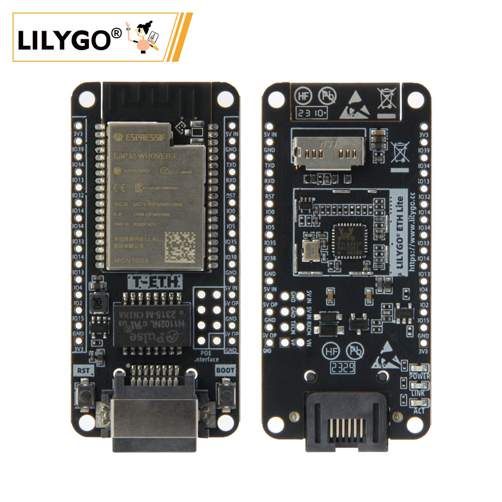
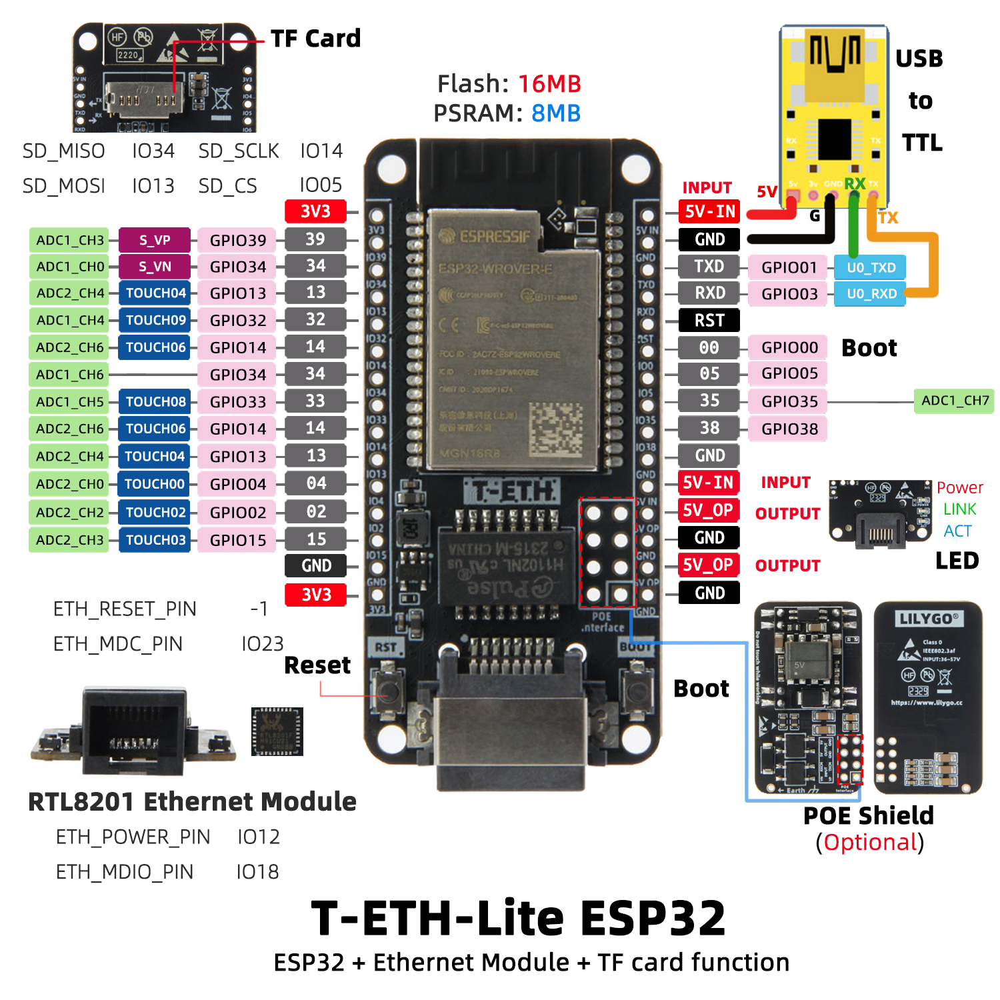
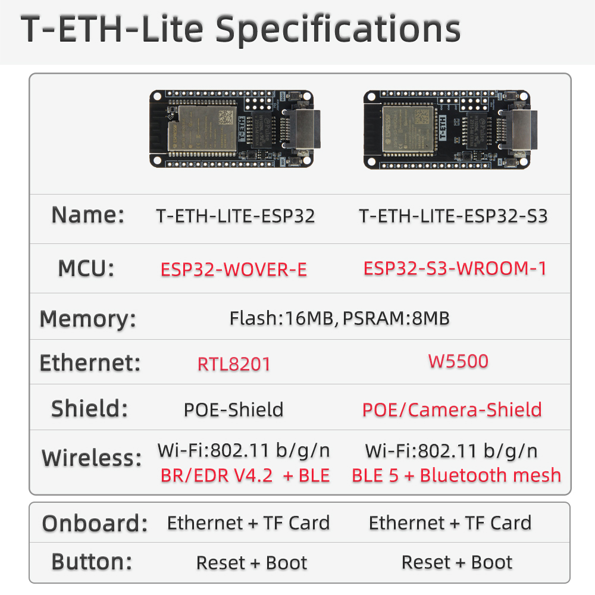

<!-- **[English](README.MD) | 中文** -->

    <a target="_blank" style="margin: 1em;color: white; font-size: 0.9em; border-radius: 0.3em; padding: 0.5em 2em; background-color:rgb(63, 201, 28)" href="https://lilygo.cc/products/t-eth-lite?variant=43120880746677">Go Buying</a>
    <!-- <a target="_blank" style="margin: 1em;color: white; font-size: 0.9em; border-radius: 0.3em; padding: 0.5em 2em; background-color:rgb(63, 201, 28)" href="https://www.aliexpress.com/store/911876460">速卖通</a>-->

 

## Introduction

T-ETH-Lite is a versatile embedded development board powered by the ESP32 main controller, offering deep integration of Ethernet communication, local storage, and power expansion capabilities.

On the hardware side, it features 16MB Flash and 8MB PSRAM, providing ample space for data processing and buffering in complex applications. It incorporates the RTL8201 Ethernet module, enabling efficient network transmission via interfaces like ETH_POWER_PIN (IO12) and ETH_MDIO_PIN (IO18), and includes a POE expansion interface to simplify power deployment.

The board offers extensive GPIO resources (covering GPIO02 to GPIO39), supports multiple ADC signal inputs (such as ADC1_CH0, ADC2_CH4), and capacitive touch functions (TOUCH02–TOUCH09). A TF card slot (with SD_CS on IO05) is also included for local data storage.

Designed for both industrial-grade stability and IoT flexibility, T-ETH-Lite is well-suited for intelligent control, remote monitoring, and automation systems, addressing scenarios that demand high reliability, low latency, and multi-peripheral collaboration.

## Appearance and function introduction
### Appearance

### Pinmap 

## Module Information and Specifications
### Description

> Note: T-ETH-Lite is the ESP32 version. Click here to switch to the ESP32-S3 version [T-ETH-Lite S3 version](https://wiki.lilygo.cc/get_started/en/LoRa_GPS/T-ETH-Lite/T-ETH-Lite-S3/T-ETH-Lite-S3.html)

| Component | Description |
| --- | --- |
| Storage | TF card
| Extension | 2 x 15io Extension
| Keys | 1 x BOOT key + 1 x Reset key |
| LED | 3 x indicator light (Power/link/ACT)
| Power Supply | 5V/500mA |
| Interface | 1 x USB Type-C interface |
| Positioning hole | 4 x 2mm positioning hole |

### Related Links

Github:[T-ETH-Lite](https://github.com/Xinyuan-LilyGO/LilyGO-T-ETH-Series)

- [DP9900M](https://github.com/Xinyuan-LilyGO/LilyGO-T-ETH-Series/blob/master/datasheet/ETH-POE-DP9900M-5V.pdf)
- [DP5300](https://github.com/Xinyuan-LilyGO/LilyGO-T-ETH-Series/blob/master/datasheet/ETH-PRO-POE-DP5300-12V.pdf)

#### Schematic Diagram
- [T-ETH-Lite](https://github.com/Xinyuan-LilyGO/LilyGO-T-ETH-Series/blob/master/schematic/T-ETH-Lite-ESP32.pdf)

#### Dependency Libraries

- [Adafruit_BME280_Library](https://github.com/adafruit/Adafruit_BME280_Library)
- [Adafruit_BusIO-1.16.1](https://github.com/Xinyuan-LilyGO/T-Echo-Lite/tree/main/libraries/Adafruit_BusIO-1.16.1)
- [Adafruit_NeoPixel](https://github.com/adafruit/Adafruit_NeoPixel)
- [Adafruit_Sensor](https://github.com/adafruit/Adafruit_Sensor)
- [ESP32_USB_Stream](https://github.com/esp-arduino-libs/ESP32_USB_Stream)
- [ETHClass2](https://github.com/Xinyuan-LilyGO/LilyGO-T-ETH-Series/blob/master/lib/ETHClass2)
- [LoRa](https://github.com/sandeepmistry/arduino-LoRa)
- [ModbusMaster](https://github.com/4-20ma/ModbusMaster)
- [RadioLib](https://github.com/jgromes/RadioLib)
- [StreamDebugger](https://github.com/plerup/StreamDebugger)
- [TFT_eSPI](https://github.com/Bodmer/TFT_eSPI)
- [TinyGPSPlus](https://github.com/mikalhart/TinyGPSPlus)
- [TinyGSM](https://github.com/vshymanskyy/TinyGSM)
- [U8g2](https://github.com/olikraus/u8g2)

## Software Design
### Arduino Set Parameters

| Arduino IDE Setting                  | Value                          |
|--------------------------------------|--------------------------------|
| Board                                | ESP32 Dev Module             |
| Port                                 | Your port                      |
| CPU Frequency                        | 240MHZ(WiFi/BT)                   |
| Core Debug Level                     | Debug                           |
| Erase All Flash Before Sketch Upload | Disable                        |
| Events Run On                        | Core1                          |
| Flash Frequency                      | 80MHZ                      |
| Flash Mode                           | QIO                    |
| Flash Size                           | 16MB(128Mb)                    |
| Arduino Runs On                      | Core1                          |
| Partition Scheme                     | 16M Flash(3M APP/9.9MB FATFS)  |
| PSRAM                                | Enable                    |
| Upload Speed                         | 921600                         |

### Development Platform

1. [ESP-IDF](https://www.espressif.com/zh-hans/products/sdks/esp-idf)
2. [Arduino IDE](https://www.arduino.cc/en/software)
3. [VS Code](https://code.visualstudio.com/)
4. [Micropython](https://micropython.org/)

## Product Technical Support 

