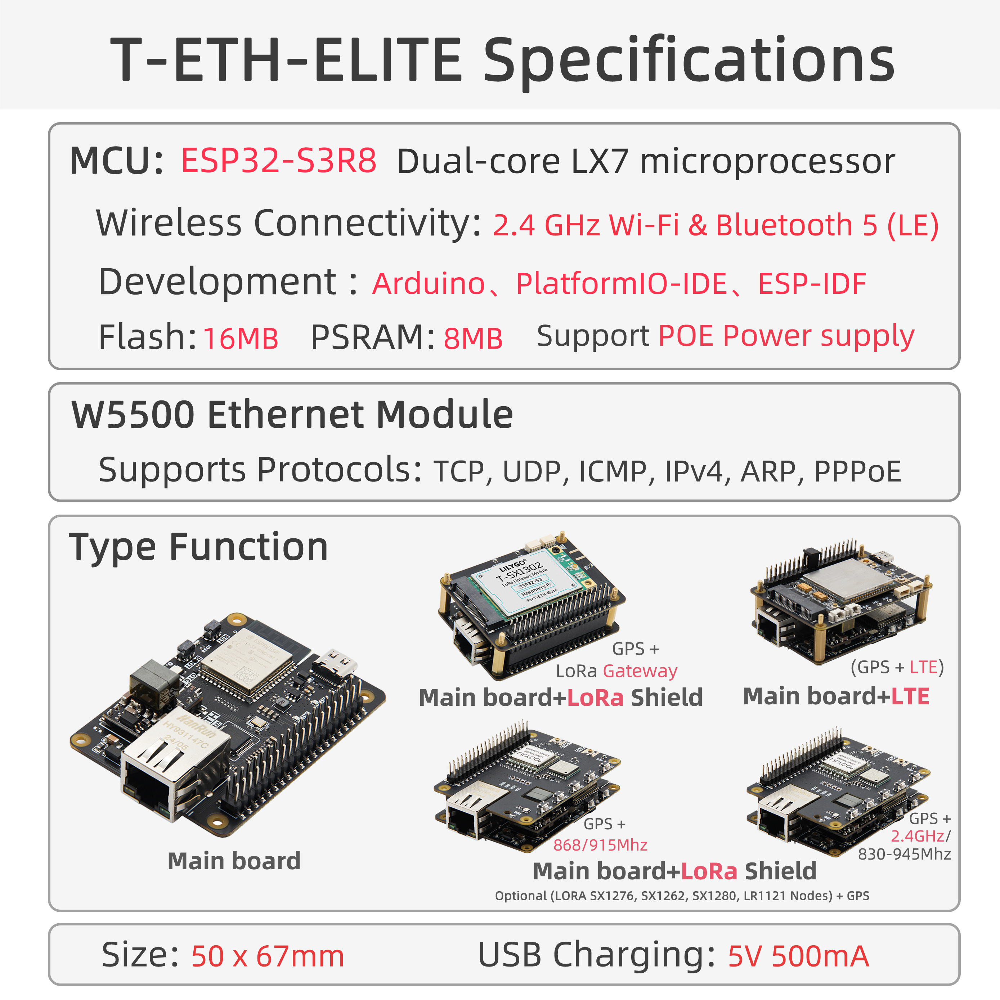

<!-- **[English](README.MD) | 中文** -->

    <a target="_blank" style="margin: 1em;color: white; font-size: 0.9em; border-radius: 0.3em; padding: 0.5em 2em; background-color:rgb(103, 175, 8)" href="https://lilygo.cc/products/t-eth-elite-1?variant=44498204983477">Go Buying</a>
    <!-- <a target="_blank" style="margin: 1em;color: white; font-size: 0.9em; border-radius: 0.3em; padding: 0.5em 2em; background-color:rgb(63, 201, 28)" href="https://www.aliexpress.com/store/911876460">速卖通</a> -->

## Introduction

LILYGO T-ETH ELITE  是一款基于 ESP32-S3-WROOM-1 模组的高性能物联网开发板，集成了 W5500 以太网控制器，支持以太网通信和 PoE（IEEE 802.3af Class 0）供电，输入电压范围为 36~57V。该板载 16MB Flash 和 8MB PSRAM，提供丰富的扩展接口，包括 MicroSD 卡槽（SPI 接口）、40-PIN GPIO（兼容树莓派引脚布局），以及以太网、USB OTG、UART 等外设接口。其设计兼顾了物联网应用的网络连接需求与硬件扩展灵活性，适用于智能家居、工业控制等场景，同时支持与树莓派等设备的兼容协作，为开发者提供了高效的双模（Wi-Fi/蓝牙 + 以太网）开发平台。

## Appearance and function introduction
### Appearance

### Pinmap 

## Module Information and Specifications
### Description

#### LoRa Gateway Solution

Composition: Mainboard + LoRa Gateway Expansion Board

Function: Supports building LoRa network infrastructure. Compatible with mainstream modules such as SX1276, SX1262, SX1280, and LR1121. Optional GPS support enables accurate positioning (e.g., 868/915 MHz frequency bands).

Application Scenarios: Ideal for long-range, low-power wide-area IoT deployments such as agricultural environmental monitoring and smart city node management.

#### LoRa End Node Solution

Composition: Mainboard + LoRa Module Expansion Board

Function: Provides terminal communication capabilities. Supports multiple LoRa module types (e.g., SX1276, SX1262). GPS integration is available for real-time location tracking.

Application Scenarios: Suitable for logistics tracking, asset localization, and field-deployed sensor data return in mobile terminal use cases.

#### LTE Cellular Network Solution

Composition: Mainboard + LTE Communication Expansion Board

Function: Enables independent remote communication via 4G/5G cellular networks in areas where Wi-Fi or Ethernet is unavailable.

Application Scenarios: Industrial remote equipment monitoring, data transmission in remote regions, and in-vehicle mobile terminals.

#### Multi-Protocol Integration Solution

Core Features: The mainboard natively integrates the W5500 Ethernet chip (supporting TCP/UDP/IPv4) and PoE power supply (36~57V). Combined with the ESP32-S3’s dual-mode Wi-Fi/Bluetooth, it supports hybrid wired/wireless networking.

Expandability: Compatible with Raspberry Pi ecosystem via a 40-pin GPIO interface. Supports MicroSD storage, USB OTG, and external sensors for edge computing applications.

Application Scenarios: Complex system integration such as smart home hubs, industrial automation control, and multi-protocol gateway solutions.

| Component | Description |
| --- | --- |
| MCU | ESP32-S3R8 Dual-core LX7 microprocessor
| FLASH| 16M |
| PSRAM | 8M |
| TF card | TF Card Expansion Interface |
| Wireless |2.4Ghz Wi-Fi + Bluetooth 5.0
| USB | 1 × USB Port and OTG(TYPE-C interface) |
| Extended Interfaces | 1 × IEE802.3af PoE interface + 1 × 40-PIN GPIO interface |
| Keys | 1 x RESET key + 1 x BOOT key + 1 x OTG switch key + 1 x IO38 key |
| Power input | 5V/500mA |
| Hole Position | **4 × M2.5 positioning hole **
| Dimensions |**50 X 67 X 17 mm**

### Related Links

Github:[T-ETH-Series](https://github.com/Xinyuan-LilyGO/LilyGO-T-ETH-Series/tree/master)

#### Schematic Diagram

[T-ETH-ELite](https://github.com/Xinyuan-LilyGO/LilyGO-T-ETH-Series/blob/master/schematic/T-ETH-ELite.pdf)

#### Dependency Libraries

- [Adafruit_BME280_Library](https://github.com/adafruit/Adafruit_BME280_Library)
- [Adafruit_BusIO](https://github.com/adafruit/Adafruit_BusIO)
- [Adafruit_NeoPixel](https://github.com/adafruit/Adafruit_NeoPixel)
- [Adafruit_Sensor](https://github.com/adafruit/Adafruit_Sensor)
- [ESP32_USB_Stream](https://github.com/esp-arduino-libs/ESP32_USB_Stream)
- [ETHClass2](https://github.com/Xinyuan-LilyGO/LilyGO-T-ETH-Series/blob/master/lib/ETHClass2)
- [LoRa](https://github.com/sandeepmistry/arduino-LoRa)
- [ModbusMaster](https://github.com/4-20ma/ModbusMaster)
- [RadioLib](https://github.com/jgromes/RadioLib)
- [StreamDebugger](https://github.com/plerup/StreamDebugger)
- [TFT_eSPI](https://github.com/Bodmer/TFT_eSPI)
- [TinyGPSPlus](https://github.com/mikalhart/TinyGPSPlus)
- [TinyGSM](https://github.com/vshymanskyy/TinyGSM)
- [U8g2](https://github.com/olikraus/u8g2)

## Application Reference

### IoT Applications

LoRa gateway project based on the combination of **T-ETH-ELite** and **T-ETH-ELite-Gateway-Shield** hardware. The above two hardware are indispensable

Configuration method 1:

1. Connect the mobile phone to ESP32S3 to generate a network hotspot named: LilyGo-Gateway Password: 12345678

2. Enter `192.168.4.1` in the browser to open the gateway configuration page

3. Fill in the corresponding column according to the title, and click Apply after filling in

4. Click the restart button, the gateway will restart and run according to the filled parameters

Configuration method 2:

1. Connect to the Ethernet interface via a network cable

2. Open the Serial monitor, get the connected IP address from the serial monitor, use a computer on the same LAN to enter the serial printed IP address in the browser, and open the gateway configuration page
3. Fill in the corresponding column according to the title, and click Apply after filling in
4. Click the restart button, the gateway will restart and run according to the filled parameters

Gateway configuration parameter explanation:

- **Next time Boot**: What mode is running after clicking restart,
  * Soft AP Mode: Network hotspot mode, only used to configure gateway settings
  * Station Mode: Station mode, used to connect to AP
  * Ethernet Mode: Ethernet mode, this mode can not be set to connect to WiFi
- **Frequency Plan**: The frequency plan of the LoRa gateway operation, please set it according to the laws and regulations of the place of use
  * CN470: Asia
  * EU868: Europe
  * US915: USA
  * Please note that the frequency plan must be adapted to the actual frequency of the SX1302 gateway used. For example, the purchased 868MHz LoRa gateway can only be configured to 868MHz, not 470MHz, 915MHz
* For other plans, please refer to [The Things Network Regional Parameters][1]
- **Radio 1 Center Frequency**: RF center frequency setting, the center frequency is for reference only, fill in according to local laws and regulations, if using [TTN][1], you can download the global configuration file after configuring the gateway, find the center frequency, and fill it in the column
  * CN470: 470600000 Hz
  * EU868: 867500000 Hz
  * US915: 915600000 Hz
  * Please note that the frequency plan must be adapted to the actual SX1302 gateway frequency used. For example, the purchased 868MHz LoRa gateway can only be configured to 868MHz, not 470MHz, 915MHz
- **Radio 2 Center Frequency**: RF center frequency setting, the center frequency is for reference only, fill in according to local laws and regulations, if using [TTN][1], After configuring the gateway, you can download the global configuration file, find the center frequency, and fill it in the column
  * CN470: 471400000 Hz
  * EU868: 868500000 Hz
  * US915: 916300000 Hz
  * Please note that the frequency plan must be adapted to the actual frequency of the SX1302 gateway used. For example, the purchased 868MHz LoRa gateway can only be configured to 868MHz, not 470MHz, 915MHz
- **Wi-Fi SSID**: wireless ap name
  * If Next time Boot is selected as Ethernet Mode, you can leave it blank. If you want to use wireless access mode, fill in WiFi SSDI
- **Wi-Fi Password**: wireless ap password
  * If Next time Boot is selected as Ethernet Mode, you can leave it blank. If you want to use wireless access mode, fill in WiFi password
- **NS Host**: LoRa gateway server domain name or IP address
  * [The Things Network][2] After the gateway is created, you can view the access domain name in the gateway interface
- **NS Port**: LoRa gateway server port
  * [The Things Network][2] uses 1700 as the default communication port
- **Gateway ID**: 8-byte gateway ID, you can fill in the 8-byte hexadecimal format at will, and it cannot be repeated with other gateway IDs, such as E84E06FFFE316166

[1]: https://www.thethingsnetwork.org/docs/lorawan/regional-parameters/
[2]: https://www.thethingsnetwork.org

Github：[LilyGO-ETH-Gateway](https://github.com/Xinyuan-LilyGO/LilyGO-ETH-Gateway)

YouTuBe：[TTN&LilyGO LoRa Gateway](https://www.youtube.com/watch?v=NyL87WWntP4)

## Software Design
### Arduino Set Parameters

| Arduino IDE Setting                  | Value                          |
|--------------------------------------|--------------------------------|
| Board                                | ESP32S3 Dev Module             |
| Port                                 | Your port                      |
| USB CDC On Boot                      | Disable                        |
| CPU Frequency                        | 240MHZ(WiFi)                   |
| Core Debug Level                     | None                           |
| USB DFU On Boot                      | Disable                        |
| Erase All Flash Before Sketch Upload | Disable                        |
| Events Run On                        | Core1                          |
| Flash Mode                           | QIO 80MHZ                      |
| Flash Size                           | 16MB(128Mb)                    |
| Arduino Runs On                      | Core1                          |
| USB Firmware MSC On Boot             | Disable                        |
| Partition Scheme                     | 16M Flash(3M APP/9.9MB FATFS)  |
| PSRAM                                | OPI PSRAM                      |
| Upload Mode                          | UART0/Hardware CDC             |
| Upload Speed                         | 921600                         |
| USB Mode                             | CDC and JTAG                   |
### Development Platform
1. [VS Code](https://code.visualstudio.com/)
2. [Arduino IDE](https://www.arduino.cc/en/software)
3. [Platform IO](https://platformio.org/)
4. [MicroPython](https://micropython.org/)

## Product Technical Support 

