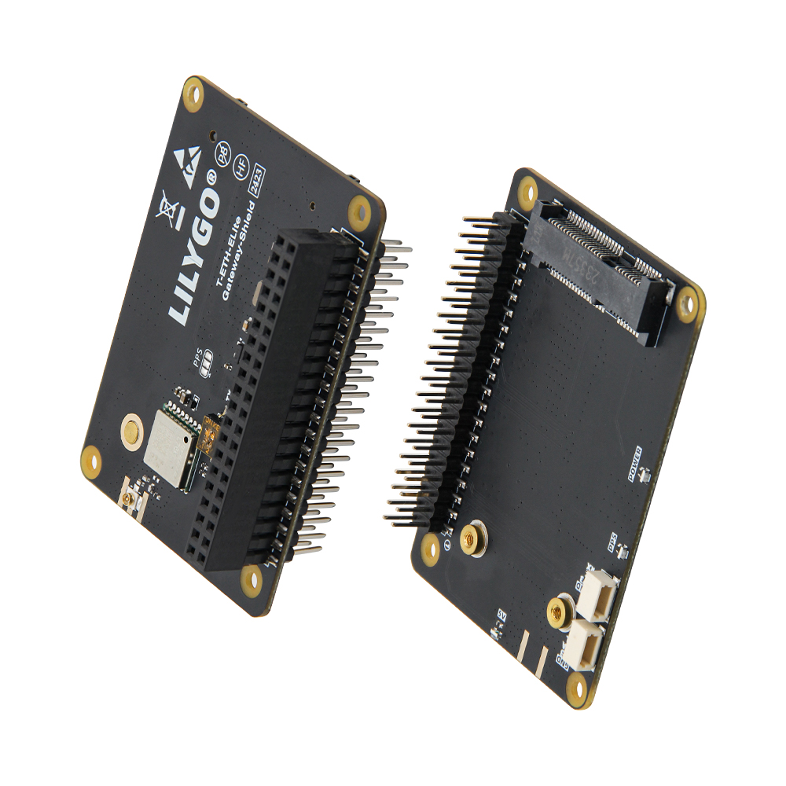

<!-- **[English](README.MD) | 中文** -->

    <a target="_blank" style="margin: 1em;color: white; font-size: 0.9em; border-radius: 0.3em; padding: 0.5em 2em; background-color:rgb(103, 175, 8)" href="https://lilygo.cc/products/t-eth-elite-1?variant=44498205016245">Go Buying</a>
    <!-- <a target="_blank" style="margin: 1em;color: white; font-size: 0.9em; border-radius: 0.3em; padding: 0.5em 2em; background-color:rgb(63, 201, 28)" href="https://www.aliexpress.com/store/911876460">速卖通</a> -->

## Introduction

The LILYGO T-ETH ELITE S3 Gateway Shield is a versatile IoT gateway solution that supports LoRa (compatible with modules such as SX1276 and SX1262), Ethernet (via the W5500 controller), and dual-mode Wi-Fi/Bluetooth communication. It integrates GPS positioning and Power-over-Ethernet (PoE) power supply (36–57V), enabling the deployment of wide-area network hubs. This makes it ideal for applications like agricultural monitoring, logistics tracking, and hybrid networking scenarios. It is compatible with both Arduino and ESP-IDF development platforms, offering industrial-grade reliability and flexible expandability.

## Appearance and function introduction
### Appearance

### Pinmap 

## Module Information and Specifications
### Description

T-ETH-ELITE Main Board + T-ETH-Gateway Expansion Board:

**Configuration**: Main board + LoRa gateway expansion board

**Function**: Supports building LoRa network infrastructure, compatible with mainstream modules such as SX1276, SX1262, SX1280, and LR1121. Optional GPS integration enables precise positioning (e.g., 868/915 MHz frequency bands).

**Use Cases**: Suitable for long-range, low-power wide-area IoT deployments such as agricultural environmental monitoring and smart city node management.

### Related Links

Github:[T-ETH-Series](https://github.com/Xinyuan-LilyGO/LilyGO-T-ETH-Series/tree/master)

#### Schematic Diagram

[T-ETH-Gateway](https://github.com/Xinyuan-LilyGO/LilyGO-T-ETH-Series/blob/master/schematic/T-ETH-ELite-Gateway-Shield.pdf)

#### Dependency Libraries

- [AceButton](https://github.com/bxparks/AceButton)
- [Adafruit_NeoPixel](https://github.com/adafruit/Adafruit_NeoPixel)
- [Adafruit_BME280_Library](https://github.com/adafruit/Adafruit_BME280_Library)
- [Adafruit_BusIO](https://github.com/adafruit/Adafruit_BusIO)
- [Adafruit_Sensor](https://github.com/adafruit/Adafruit_Sensor)
- [ESPAsyncWebServer](https://github.com/me-no-dev/ESPAsyncWebServer)
- [AsyncTCP](https://github.com/me-no-dev/AsyncTCP)
- [ESP8266Audio](https://github.com/earlephilhower/ESP8266Audio)
- [LilyGo TWR Library](https://github.com/Xinyuan-LilyGO/T-TWR)
- [SdFat - Adafruit Fork](https://github.com/adafruit/SdFat.git)
- [TFT_eSPI](https://github.com/Bodmer/TFT_eSPI)
- [TinyGPSPlus](https://github.com/mikalhart/TinyGPSPlus)
- [U8g2](https://github.com/olikraus/u8g2)
- [XPowersLib](https://github.com/lewisxhe/XPowersLib)

### Development Platform

1. [VS Code](https://code.visualstudio.com/)
2. [Arduino IDE](https://www.arduino.cc/en/software)
3. [Platform IO](https://platformio.org/)

## Product Technical Support 

