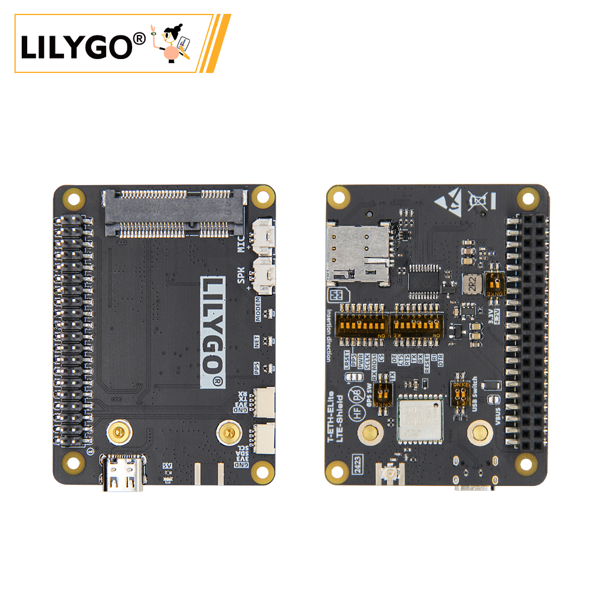
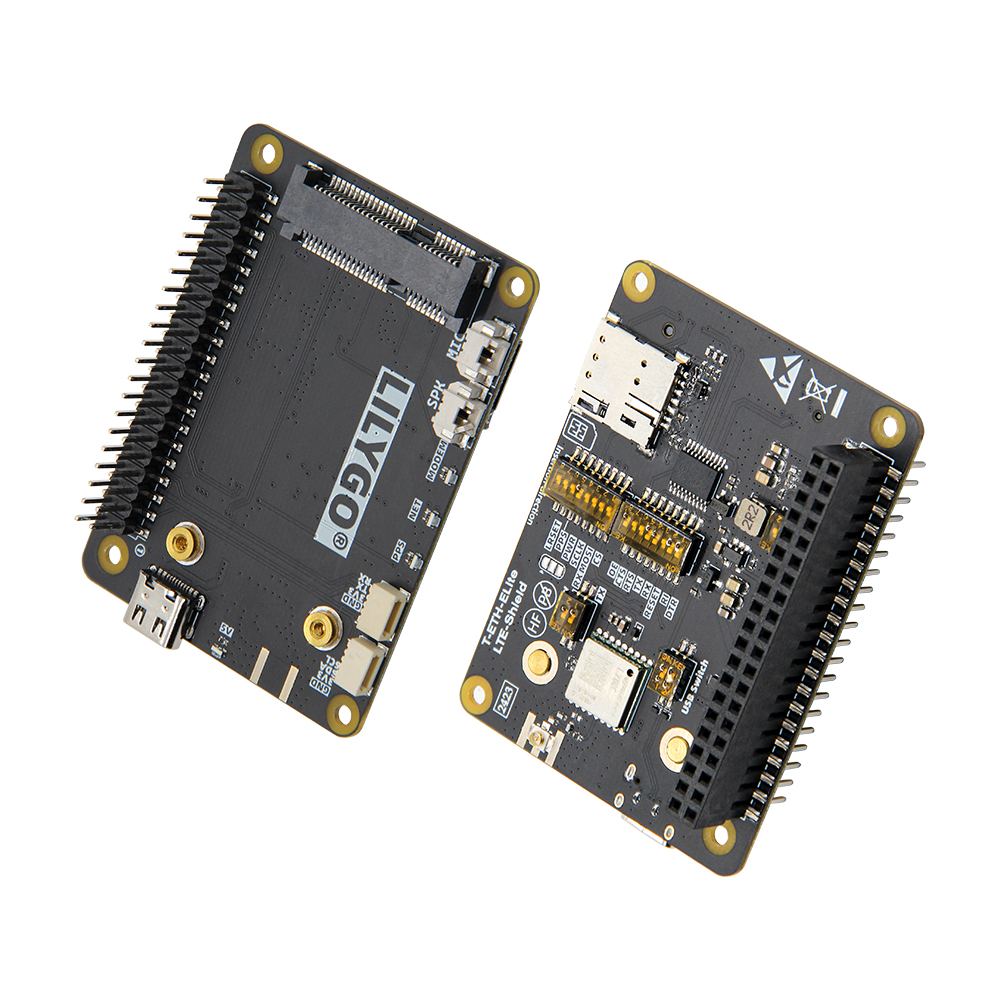
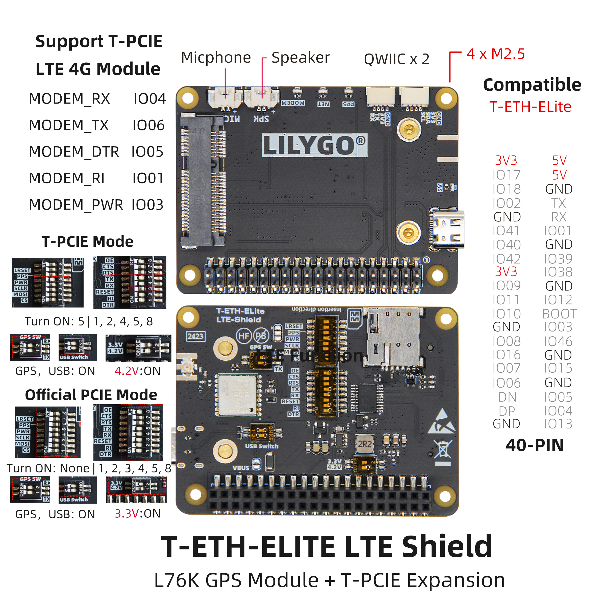
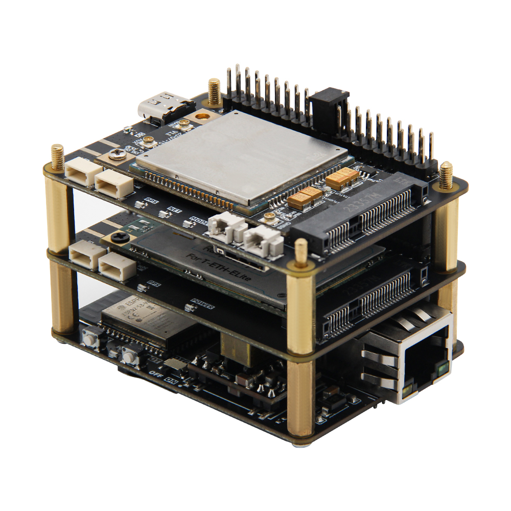

<!-- **[English](README.MD) | 中文** -->

    <a target="_blank" style="margin: 1em;color: white; font-size: 0.9em; border-radius: 0.3em; padding: 0.5em 2em; background-color:rgb(103, 175, 8)" href="https://lilygo.cc/products/t-eth-elite-1?variant=44498205049013">Go Buying</a>
    <!-- <a target="_blank" style="margin: 1em;color: white; font-size: 0.9em; border-radius: 0.3em; padding: 0.5em 2em; background-color:rgb(63, 201, 28)" href="https://www.aliexpress.com/store/911876460">速卖通</a> -->

## Introduction

LILYGO T-ETH ELITE-LTE Shield is a 4G cellular network expansion module specifically designed for the T-ETH-Elite mainboard. It integrates LTE communication and L76K high-precision GPS positioning functions, enabling remote data transmission in areas without network coverage. This module is compatible with the T-PCIE LTE module and offers both T-PCIE mode (4.2V power supply) and official PCIE mode (3.3V power supply), providing flexible adaptation to various deployment needs. The built-in L76K GPS module enables accurate location tracking and time synchronization, making it suitable for logistics management, mobile device monitoring, and other scenarios.

With the 40-PIN GPIO interface (compatible with Raspberry Pi layout) and dedicated communication pins (such as MODEM_RX/TX), the module seamlessly integrates with the mainboard's Ethernet (W5500), Wi-Fi/Bluetooth, and PoE power supply (36~57V), forming an LTE+GPS+Ethernet multi-protocol hybrid communication hub. It supports development on platforms like Arduino and ESP-IDF, offering industrial-grade reliability and flexibility. This makes it an ideal solution for IoT nodes in remote areas, vehicle-mounted terminals, and industrial remote monitoring.

## Appearance and function introduction
### Appearance

### Pinmap 

## Module Information and Specifications
### Description

T-ETH-ELITE Mainboard + T-ETH-LTE Expansion Board:

**Combination**: Mainboard + LTE Communication Expansion Board

**Function**: Enables remote communication via 4G/5G cellular networks, covering areas where Wi-Fi/Ethernet cannot be deployed.

**Scenario**: Industrial equipment remote monitoring, data transmission in remote areas, vehicle-mounted mobile terminals, etc.

### Related Links

Github:[T-ETH-Series](https://github.com/Xinyuan-LilyGO/LilyGO-T-ETH-Series/tree/master)

#### Schematic Diagram

[T-ETH-LTE](https://github.com/Xinyuan-LilyGO/LilyGO-T-ETH-Series/blob/master/schematic/T-ETH-ELite-LTE-Shield.pdf)

#### Dependency Libraries

- [AceButton](https://github.com/bxparks/AceButton)
- [Adafruit_NeoPixel](https://github.com/adafruit/Adafruit_NeoPixel)
- [Adafruit_BME280_Library](https://github.com/adafruit/Adafruit_BME280_Library)
- [Adafruit_BusIO](https://github.com/adafruit/Adafruit_BusIO)
- [Adafruit_Sensor](https://github.com/adafruit/Adafruit_Sensor)
- [ESPAsyncWebServer](https://github.com/me-no-dev/ESPAsyncWebServer)
- [AsyncTCP](https://github.com/me-no-dev/AsyncTCP)
- [ESP8266Audio](https://github.com/earlephilhower/ESP8266Audio)
- [LilyGo TWR Library](https://github.com/Xinyuan-LilyGO/T-TWR)
- [SdFat - Adafruit Fork](https://github.com/adafruit/SdFat.git)
- [TFT_eSPI](https://github.com/Bodmer/TFT_eSPI)
- [TinyGPSPlus](https://github.com/mikalhart/TinyGPSPlus)
- [U8g2](https://github.com/olikraus/u8g2)
- [XPowersLib](https://github.com/lewisxhe/XPowersLib)

### Development Platform

1. [VS Code](https://code.visualstudio.com/)
2. [Arduino IDE](https://www.arduino.cc/en/software)
3. [Platform IO](https://platformio.org/)

## Product Technical Support 

