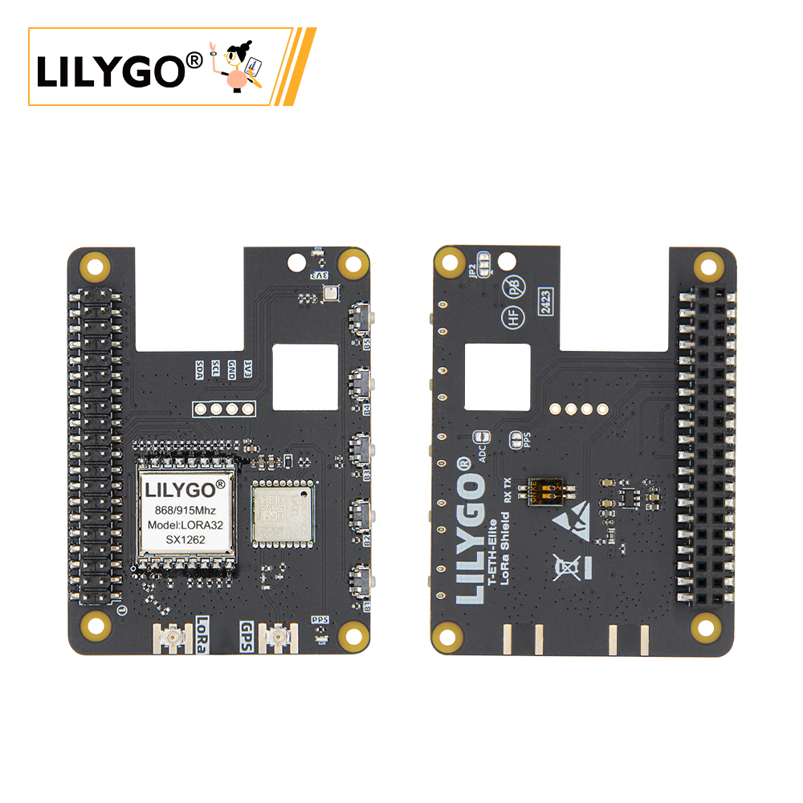
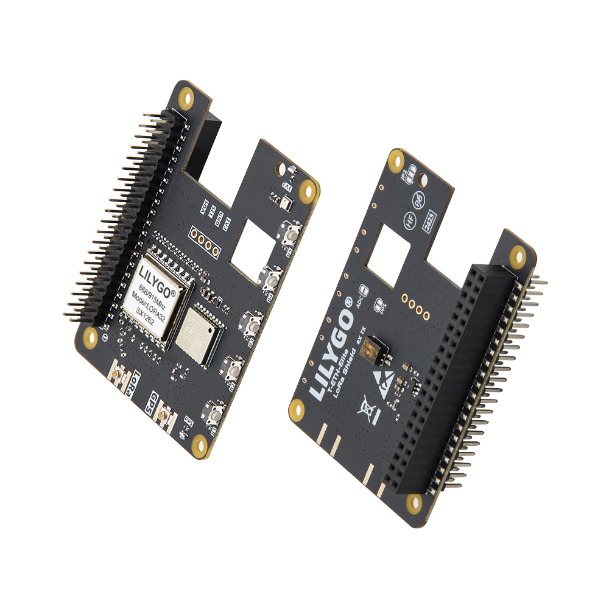
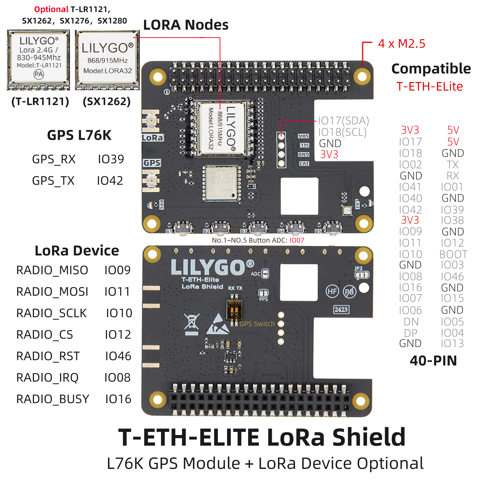
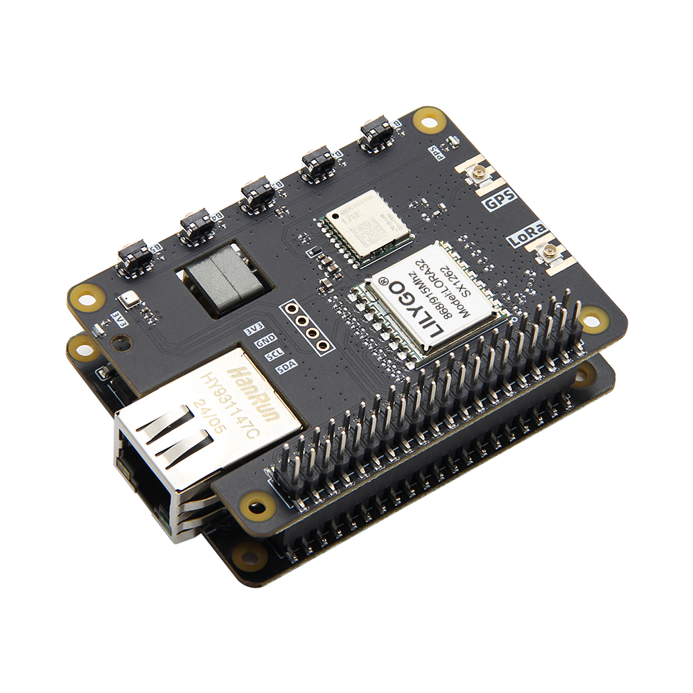

<!-- **[English](README.MD) | 中文** -->

    <a target="_blank" style="margin: 1em;color: white; font-size: 0.9em; border-radius: 0.3em; padding: 0.5em 2em; background-color:rgb(103, 175, 8)" href="https://lilygo.cc/products/t-eth-elite-1?variant=44498256298165">Go Buying</a>
    <!-- <a target="_blank" style="margin: 1em;color: white; font-size: 0.9em; border-radius: 0.3em; padding: 0.5em 2em; background-color:rgb(63, 201, 28)" href="https://www.aliexpress.com/store/911876460">速卖通</a> -->

## Introduction

The LILYGO T-ETH ELITE-LoRa Shield is an expansion module specifically designed for the T-ETH-Elite main board. It integrates multi-band LoRa communication (supporting modules such as T-LR1121, SX1262, SX1276, and SX1280, covering 2.4GHz and 830–945MHz frequency bands) along with high-precision GPS positioning via the L76K module, making it ideal for long-range IoT communication and location tracking.

The module features a 40-PIN GPIO header (Raspberry Pi-compatible layout), SPI interface (MISO/MOSI/SCLK/CS), and control pins (RST/IRQ/BUSY), enabling rapid deployment of LoRa nodes or external sensors. With four M2.5 mounting holes, it ensures stable expansion.

When paired with the main board’s Ethernet (W5500), Wi-Fi/Bluetooth, and PoE power supply, it enables hybrid communication gateway setups—suitable for smart agriculture, logistics tracking, environmental monitoring, and more. The shield is developer-friendly and compatible with platforms like Arduino and ESP-IDF.

## Appearance and function introduction
### Appearance

### Pinmap 

## Module Information and Specifications
### Description

T-ETH-ELITE Mainboard + T-ETH-LoRa Expansion Board:

**Combination**: Mainboard + LoRa Module Expansion Board

**Function**: Provides terminal device communication capabilities, supporting multi-mode LoRa modules (such as SX1276/SX1262), and can integrate GPS for location tracking.

**Scenario**: Suitable for mobile terminal applications such as logistics tracking, asset location, and outdoor sensor data transmission.

### Related Links

Github:[T-ETH-Series](https://github.com/Xinyuan-LilyGO/LilyGO-T-ETH-Series/tree/master)

#### Schematic Diagram

[T-ETH-LoRa](https://github.com/Xinyuan-LilyGO/LilyGO-T-ETH-Series/blob/master/schematic/T-ETH-ELite-LoRa-Shield.pdf)

#### Dependency Libraries
- [AceButton](https://github.com/bxparks/AceButton)
- [Adafruit_NeoPixel](https://github.com/adafruit/Adafruit_NeoPixel)
- [Adafruit_BME280_Library](https://github.com/adafruit/Adafruit_BME280_Library)
- [Adafruit_BusIO](https://github.com/adafruit/Adafruit_BusIO)
- [Adafruit_Sensor](https://github.com/adafruit/Adafruit_Sensor)
- [ESPAsyncWebServer](https://github.com/me-no-dev/ESPAsyncWebServer)
- [AsyncTCP](https://github.com/me-no-dev/AsyncTCP)
- [ESP8266Audio](https://github.com/earlephilhower/ESP8266Audio)
- [LilyGo TWR Library](https://github.com/Xinyuan-LilyGO/T-TWR)
- [SdFat - Adafruit Fork](https://github.com/adafruit/SdFat.git)
- [TFT_eSPI](https://github.com/Bodmer/TFT_eSPI)
- [TinyGPSPlus](https://github.com/mikalhart/TinyGPSPlus)
- [U8g2](https://github.com/olikraus/u8g2)
- [XPowersLib](https://github.com/lewisxhe/XPowersLib)

### Development Platform

1. [VS Code](https://code.visualstudio.com/)
2. [Arduino IDE](https://www.arduino.cc/en/software)
3. [Platform IO](https://platformio.org/)

## Product Technical Support 

