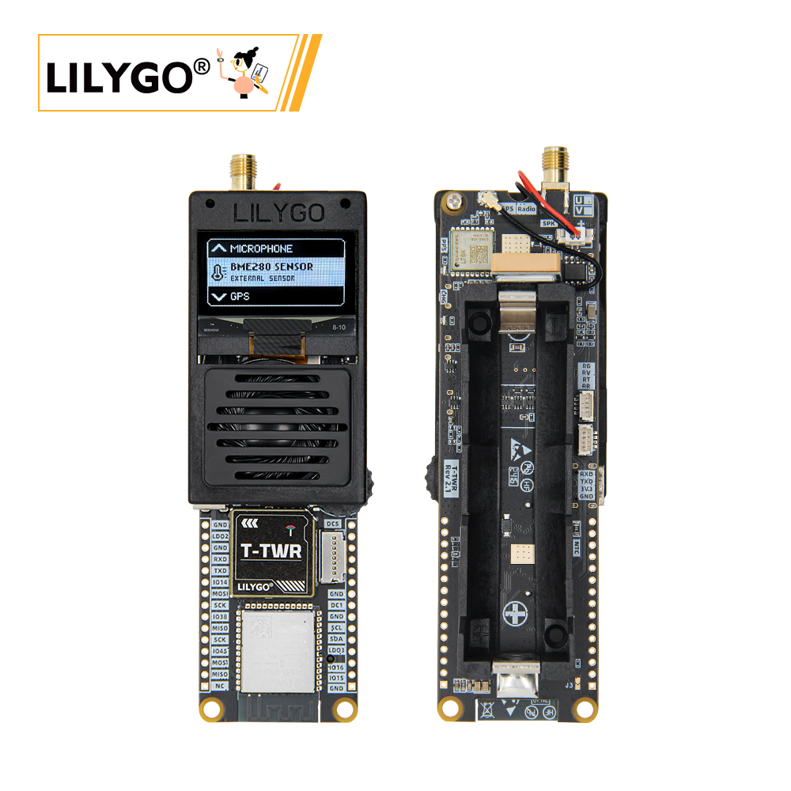
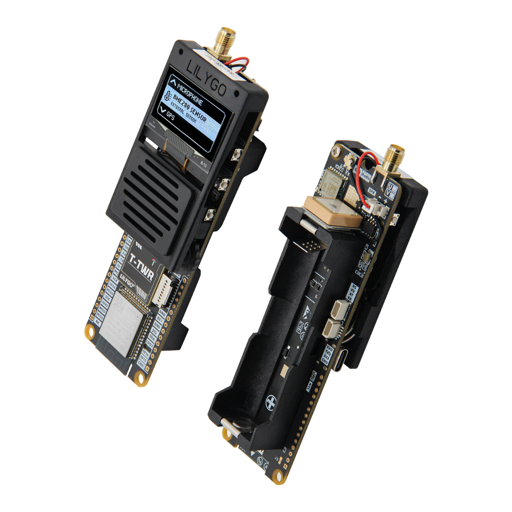
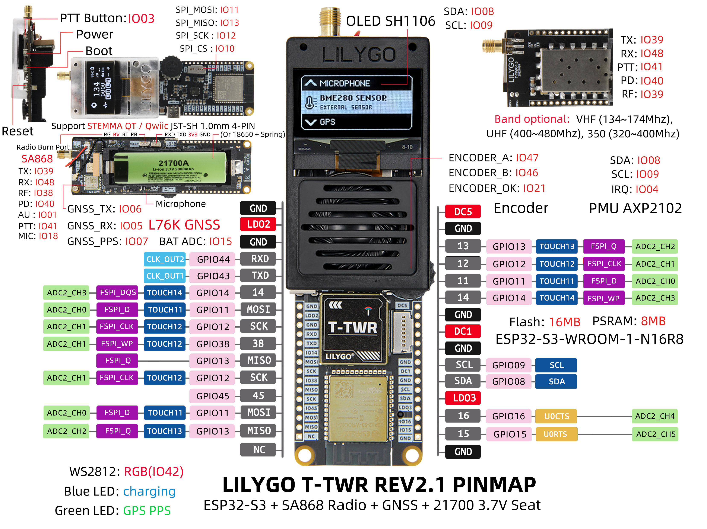

<!-- **[English](README.MD) | 中文** -->

    <a target="_blank" style="margin: 1em;color: white; font-size: 0.9em; border-radius: 0.3em; padding: 0.5em 2em; background-color:rgb(103, 175, 8)" href="https://lilygo.cc/products/t-twr-rev2-1?variant=44505308528821">Go Buying</a>
    <!-- <a target="_blank" style="margin: 1em;color: white; font-size: 0.9em; border-radius: 0.3em; padding: 0.5em 2em; background-color:rgb(63, 201, 28)" href="https://www.aliexpress.com/store/911876460">速卖通</a> -->

> 注意：T-TWR 有UHF以及VHF两种频段的接收机版本,主要的区别在于对讲机的频段不一样,UHF对讲机频段为400-480MHz,VHF对讲机频段为134-174MHz。

## Introduction

LILYGO T-TWR REV2.1 is a highly integrated development board based on the ESP32-S3-WROOM-1-N16R8 module, equipped with 16MB Flash and 8MB PSRAM, supporting dual-mode Wi-Fi and Bluetooth 5 (LE) communication. It features the AXP2102 PMU power management unit, allowing flexible power supply options including USB, 21700, and 18650 batteries, making it ideal for portable device development.

Key features include the L76K GNSS module (supporting GPS, BDS, GLONASS, and AGNSS for assisted positioning), a 1.3-inch SH1106 OLED display (128×64 resolution, I²C interface via SDA: IO8 / SCL: IO9), and the SA868 UHF/VHF walkie-talkie module (optional frequency ranges: 134–174 MHz or 350–480 MHz), along with a WS2812 RGB LED status indicator.

The board is also equipped with 4 functional buttons (PTT, Boot, PWR, Reset), TF card expansion, microphone input, and interfaces for EME280/CITEMAL environmental sensors. This makes it well-suited for IoT terminals, outdoor navigation, wireless communication, environmental monitoring, and low-power embedded system development, offering both industrial-grade reliability and rich expansion capabilities.

## Appearance and function introduction
### Appearance

### Pinmap 

## Module Information and Specifications
### Description

| Component | Description |
| --- | --- |
| MCU | ESP32-S3-WR0OM-1-N16R8
| FLASH| 16M |
| PSRAM | 8M (Octal SPI)|
| Screen | SH1106 OLED |
| Radio | SA868 UHF/VHF Walkie-talkie module |
| Audio | RS2257XC6 Audio Acquisition Module |
| GNSS | L76K GNSS module |
| Power Management | PMU AXP2102 |
| Battery | 21700 battery / 18650 battery + spring battery |
| Encoder | Supports encoder control
| LED | WS2812 RGB LED |
| TF card | TF Card Expansion Interface |
| Wireless |2.4Ghz Wi-Fi + Bluetooth 5.0
| USB | 1 × USB Port and OTG(TYPE-C interface) |
| IO interface | 2 × 15-pin extended IO interface |
| Extended Interface | 2 × 1mm 4-pin STEMMA QT/QWIIC interface + 1 × antenna interface |
| Button | 1x RESET key + 1x BOOT key + 1x PWR key + 1x PTT key |
| Power Supply | 5V/500mA |
| Hole position | **2 × 2mm locatioin hole** |
| Size | Product :** 126* 39 * 29mm **   Antenna :**200mm** |

### Related Links

Github:[T-TWR](https://github.com/Xinyuan-LilyGO/T-TWR)

- [SA868](https://github.com/Xinyuan-LilyGO/T-TWR/blob/master/datasheet/SA868%202W%20Embedded%20walkie%20talkie%20moduleV1.3.pdf)
- [SPEC](https://github.com/Xinyuan-LilyGO/T-TWR/blob/master/datasheet/SPEC%20X096-2864KSWPG17-C30%20VER%20A.pdf)

#### Schematic Diagram

[T-TWR](https://github.com/Xinyuan-LilyGO/T-TWR/blob/master/schematic/T-TWR-Plus_Rev2.1.pdf)

#### Dependency Libraries

- [AceButton](https://github.com/bxparks/AceButton)
- [Adafruit_NeoPixel](https://github.com/adafruit/Adafruit_NeoPixel)
- [Adafruit_BME280_Library](https://github.com/adafruit/Adafruit_BME280_Library)
- [Adafruit_BusIO](https://github.com/adafruit/Adafruit_BusIO)
- [Adafruit_Sensor](https://github.com/adafruit/Adafruit_Sensor)
- [ESPAsyncWebServer](https://github.com/me-no-dev/ESPAsyncWebServer)
- [AsyncTCP](https://github.com/me-no-dev/AsyncTCP)
- [ESP8266Audio](https://github.com/earlephilhower/ESP8266Audio)
- [LilyGo TWR Library](https://github.com/Xinyuan-LilyGO/T-TWR)
- [SdFat - Adafruit Fork](https://github.com/adafruit/SdFat.git)
- [TFT_eSPI](https://github.com/Bodmer/TFT_eSPI)
- [TinyGPSPlus](https://github.com/mikalhart/TinyGPSPlus)
- [U8g2](https://github.com/olikraus/u8g2)
- [XPowersLib](https://github.com/lewisxhe/XPowersLib)

## Software Design
### Arduino Set Parameters

| Arduino IDE Setting                  | Value                          |
|--------------------------------------|--------------------------------|
| Board                                | ESP32S3 Dev Module             |
| Port                                 | Your port                      |
| USB CDC On Boot                      | Enable                         |
| CPU Frequency                        | 240MHZ(WiFi)                   |
| Core Debug Level                     | None                           |
| USB DFU On Boot                      | Disable                        |
| Erase All Flash Before Sketch Upload | Disable                        |
| Events Run On                        | Core1                          |
| Flash Mode                           | QIO 80MHZ                      |
| Flash Size                           | 16MB(128Mb)                    |
| Arduino Runs On                      | Core1                          |
| USB Firmware MSC On Boot             | Disable                        |
| Partition Scheme                     | 16M Flash(3M APP/9.9MB FATFS)  |
| PSRAM                                | OPI PSRAM                      |
| Upload Mode                          | UART0/Hardware CDC             |
| Upload Speed                         | 921600                         |
| USB Mode                             | CDC and JTAG                   |
### Development Platform

1. [VS Code](https://code.visualstudio.com/)
2. [Arduino IDE](https://www.arduino.cc/en/software)
3. [Platform IO](https://platformio.org/)

## Product Technical Support 

