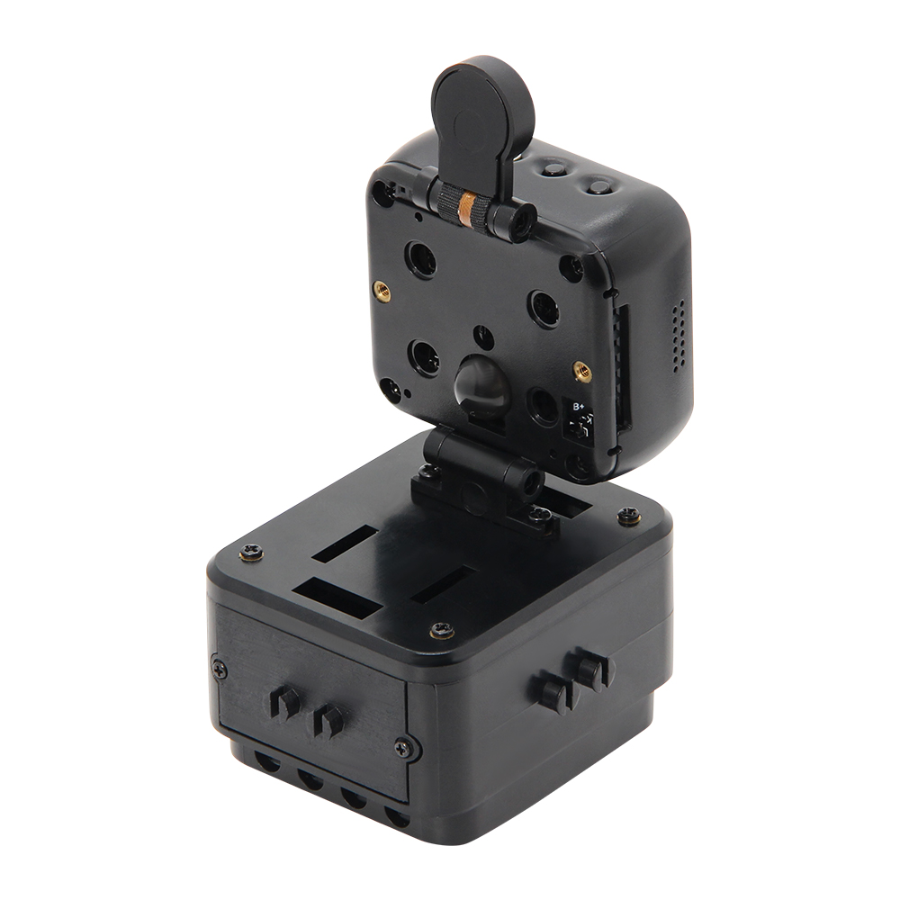
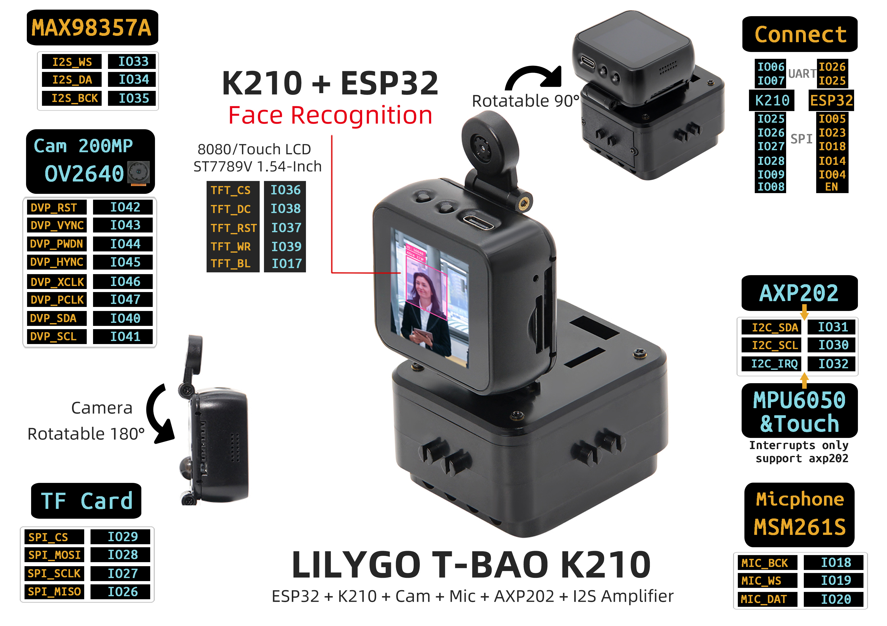

<!-- **[English](README.MD) | 中文** -->

    <a target="_blank" style="margin: 1em;color: white; font-size: 0.9em; border-radius: 0.3em; padding: 0.5em 2em; background-color:rgb(103, 175, 8)" href="https://lilygo.cc/products/t-bao">Go Buying</a>
    <!-- <a target="_blank" style="margin: 1em;color: white; font-size: 0.9em; border-radius: 0.3em; padding: 0.5em 2em; background-color:rgb(63, 201, 28)" href="https://www.aliexpress.com/store/911876460">速卖通</a> -->

## Introduction

T-BAO is an open-source AIoT terminal based on the ESP32-S3-WROOM-1 development board. It features high performance, low power consumption, cost-effectiveness, expandability, and programmability. The platform is fully compatible with Arduino and high-performance embedded AI frameworks, integrating the K210 RISC-V AI processor with an ESP32 dual-core Wi-Fi/BLE module.

It comes equipped with a professional-grade OV2640 2MP camera (with 180° adjustable rotation) and a 1.54-inch ST7789V IPS touch screen (with 90° adaptive rotation), enabling millisecond-level face recognition and real-time dynamic image processing.

Audio capabilities include a MAX98357A I2S digital amplifier, a high-sensitivity MSM261S microphone array, and a hardware codec module for voice interaction and high-definition audio output.

T-BAO adopts the AXP202 intelligent power management system, supporting 3.7V lithium battery power supply and ultra-low-power operation. It integrates an MPU6050 six-axis sensor, TF card storage expansion, and rich interface options (UART/SPI/I2C/Touch), and is fully compatible with both Arduino and MicroPython ecosystems.

Designed for applications such as industrial visual inspection, smart security, AIoT terminals, and educational robotics, T-BAO provides an open-source SDK and complete development documentation, accelerating rapid deployment in commercial use cases.

## Appearance and function introduction
### Appearance

### Pinmap 

## Module Information and Specifications
### Attention

>!⚠️Precautions for SD cards:

### Development board parameters

| Component | Description |
| ---  | --- |
|MCU |ESP32-D0WDQ6-V3 Xtensa LX6 Dual Core
|Flash |16M
|PSRAM |8M
| Clock | 240Mhz
|GPS |MIA-M10Q
| Wireless | Wi-Fi: 802.11b /g/n, Bluetooth: V4.2 + BLE
| Storage | TF Card |
| Motor |drv8833|
| Power Management |AXP202 PMU|
| Gyroscope |MPU6050|
| Camera |OV2640 (2 million pixels)|
| Screen | ST7789 1.54-inch IPS Capacitive Touch LCD (240x240)
| Keys | 1 x RST key   1 x BOOT key and knob   4 × Screen keys |
| USB |1 × type-C interface |
|UI | LVGL
| Extended interfaces | 2 × QWIIC interfaces + 4 × Magnetic interfaces |
| Dimensions | 164x46x42mm |
|USB power supply | 5V/500mA|

<table role="table" class="center_table">
    <thead>
        <tr>
            <th colspan = "2">K210 Basic parameters of the chip</th>   
        </tr>
    </thead>
    <tbody>
    <tr>    
        <td>core</td>
        <td>RISC-V Dual Core 64bit, with FPU</td>
    </tr>
    <tr>
        <td>basic frequency</td>
        <td>400MHz (Can be overclocked to 600MHz)</td>
    </tr>
    <tr>
        <td>SRAM</td>
        <td>Built-in 8M Byte</td>
    </tr>
    <tr>
        <td>image identification</td>
        <td>QVGA@60fps/VGA@30fps</td>
    </tr>
    <tr>
        <td>Speech Recognition</td>
        <td>Microphone Array (8mics)</td>
    </tr>
    <tr>
        <td>Network Model</td>
        <td><li>Supports YOLOv3<li>Mobilenetv2<li>TinyYOLOv2<li> Face recognition</td>
    </tr>
    <tr>
        <td>Deep Learning Framework</td>
        <td>Supports TensorFlow \ Keras \ Darknet \ Caffe etc. Mainstream frameworks</td>
    </tr>
    <tr>
        <td>Peripherals</td>
        <td>FPIOA、 UART、 GPIO、 SPI、 I2C、I2S、 TIMER</td>
    </tr>
    <tr>
        <td>Video Processing</td>
        <td><li>Neural Network Processor (KPU)<li>FPU complies with IEEE754-2008 standard<li>Audio Processor (APU)<li>Fast Fourier Transform Accelerator(FFT)</td>
    </tr>
  </tbody>
</table>

### Related Links
Github：[T-Bao](https://github.com/Xinyuan-LilyGO/LilyGo-K210-Script)

> [MicroPython](https://docs.micropython.org/en/latest/) is a parser based on the grammar of Python3. It contains most of the basic grammar of Python3. It mainly runs on embedded chips with limited performance and memory. (Note that Micropython does not include all the syntax of Python3)

* [MicroPython](https://docs.micropython.org/en/latest/library/index.html)
* [ESP32](https://docs.espressif.com/projects/esp-idf/en/v5.4.1/esp32/get-started/index.html)
#### Schematic Diagram

[T-Bao](https://github.com/Xinyuan-LilyGO/LilyGo-K210-Script/blob/master/schematic/K210_Main.pdf)

<!-- * [SY6970](./datasheet/AN_SY6970.pdf) -->

#### instructions

<table role="table" class="center_table">
  <thead>
    <tr>
      <th colspan = "2">Direction Tracking</th>
    </tr>
  </thead>
    <tr>
    <td>ESP32 Firmware</td>
    <td>ESP32_AT_Firmware_UART1_SGPIO.bin</td>
  </tr>:
  <tr>
    <td>K210 Firmware</td>
    <td>maixpy_twatch_v0.6.2-75-g973361c0d-dirty.bin</td>
  </tr>
  <tr>
    <td>Direction model</td>
    <td>Identify_Direction_model.kmodel</td>
  </tr>
</table>

<table role="table" class="center_table">
  <thead>
    <tr>
      <th colspan = "2">Direction Tracking</th>
    </tr>
  </thead>
    <tr>
    <td>ESP32 Firmware</td>
    <td>ESP32_AT_Firmware_UART1_SGPIO.bin</td>
  </tr>:
  <tr>
    <td>K210 Firmware</td>
    <td>maixpy_twatch_v0.6.2-75-g973361c0d-dirty.bin</td>
  </tr>
  <tr>
    <td>Direction model</td>
    <td>face_model_at_0x300000.kfpkg</td>
  </tr>
</table>

<table role="table" class="center_table">
  <thead>
    <tr>
      <th colspan = "2">speech_recognizer</th>
    </tr>
  </thead>
    <tr>
    <td>ESP32 Firmware</td>
    <td>ESP32_AT_Firmware_UART1_SGPIO.bin</td>
  </tr>:
  <tr>
    <td>K210 Firmware</td>
    <td>maixpy_v0.6.2_83_gf0280db50_minimum_speech_with_ide_support.bin</td>
  </tr>
  <tr>
    <td>Direction model</td>
    <td>maix_asr_2900k_0x500000.kmodel</td>
  </tr>
</table>

>! It should be noted here that the kflash_gui tool should be used to write maix_asR_2900K_0x50000.kmodel to the address 0x500000. And first burn maixpy_v0.6.2_83_gf0280db50_minimum_speech_with_ide_support.bin

## Software Design
### Arduino Set Parameters

The latest firmware can be downloaded in [here](https://cn.dl.sipeed.com/MAIX/MaixPy/release/master), according to their own needs to choose the firmware, then onto/on to a development board.

The firmware download tools can be downloaded from here: [kflash_gui](https://cn.dl.sipeed.com/shareURL/MAIX/tools)

### Development Platform
1. [ESP-IDF](https://www.espressif.com/zh-hans/products/sdks/esp-idf)
2. [Arduino IDE](https://www.arduino.cc/en/software)

## Product Technical Support 

