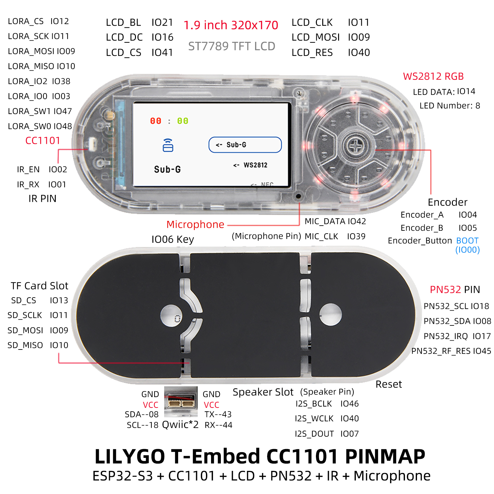

<!-- **[English](README.MD) | 中文** -->

<!-- 

    <a target="_blank" style="margin: 1em;color: white; font-size: 0.9em; border-radius: 0.3em; padding: 0.5em 2em; background-color:rgb(63, 201, 28)" href="https://item.taobao.com/item.htm?id=846226367137">淘宝</a>
    <a target="_blank" style="margin: 1em;color: white; font-size: 0.9em; border-radius: 0.3em; padding: 0.5em 2em; background-color:rgb(63, 201, 28)" href="https://www.aliexpress.com/store/911876460">速卖通</a>

 -->

>Click here to switch to [T-Embed-SI4732](https://wiki.lilygo.cc/get_started/en/LCD_OLED/T-Embed-SI4732/T-Embed-SI4732.html)

## Introduction

LILYGO T-Embed is a highly integrated IoT development board based on the ESP32-S3, featuring a dual-core LX7 processor. It is specifically designed for multi-protocol communication and smart hardware development. The core advantages of this board lie in its integration of LoRa, Sub-GHz (CC1101 module), NFC (PN532), infrared remote control, and Wi-Fi 6/Bluetooth 5.0, making it ideal for complex wireless connection scenarios such as remote sensing (LoRa long-range transmission), smart home control (infrared/NFC access control), and industrial monitoring.

The development board is equipped with a 1.9-inch TFT display (320x170 resolution), supporting dynamic data display and graphical interaction, and features a rotary encoder for precise parameter adjustment. Additionally, it includes 8 programmable RGB LEDs, a microphone and speaker module (supporting voice interaction), and TF card expansion storage, further enhancing human-machine interaction and data processing capabilities.

With a compact design that optimizes pin multiplexing (e.g., shared SPI bus), it strikes a balance between functional density and development flexibility. This board is perfect for smart home control centers, environmental monitoring, and educational IoT prototype development, providing developers with a ready-to-use, multi-scenario adaptable, and efficient hardware platform.

## Appearance and function introduction
### Appearance

### Pinmap 

## Module Information and Specifications
### Description

| Component | Description |
| ---  | --- |
|MCU	|ESP32-S3 Dual-core LX7 microprocessor
|Flash 	|16M 
|PSRAM  |8M
|GPS	|MIA-M10Q
|Wireless| 	Wi-Fi 802.11 b/g/n，BLE 5
|Storage | TF card |
|Display|  1.9 inch ST7789V IPS color TFT LCD
|Sub-G |	CC1101
|NFC	| PN532
|Battery Capacity| 3.7V-1300mAh
|Battery Chip| BQ25896, BQ27220
|Power Switch	|Supported
|LED driver	|WS2812
|Buttons | 1 x RST Button + 1 x BOOT Button |
|Encode	|Support encode
| USB |1 × type-C Interfaces|
|Infrared	 |Support Infrared
|UI | LVGL
| Expansion Interfaces | 2 × QWIIC Interfaces |
| Dimensions | **97.5x39x31mm**  |
### Related Links
Github：[T-Embed-CC1101](https://github.com/Xinyuan-LilyGO/T-Embed-CC1101)

* [PN532](https://github.com/Xinyuan-LilyGO/T-Embed-CC1101/blob/master/hardware/PN532_C1.pdf)
* [bq25896](https://github.com/Xinyuan-LilyGO/T-Embed-CC1101/blob/master/hardware/bq25896.pdf)
* [bq27220](https://github.com/Xinyuan-LilyGO/T-Embed-CC1101/blob/master/hardware/bq27220_datasheet.pdf)
* [cc1101](https://github.com/Xinyuan-LilyGO/T-Embed-CC1101/blob/master/hardware/cc1101.pdf)

#### Schematic Diagram

[T-Embed-CC1101](https://github.com/Xinyuan-LilyGO/T-Embed-CC1101/blob/master/hardware/T-Embed-CC1101%20V1.0%2024-07-29.pdf)

<!-- * [SY6970](./datasheet/AN_SY6970.pdf) -->

#### Dependency Libraries

* [RadioLib](https://github.com/jgromes/RadioLib)
* [PN532](https://github.com/Seeed-Studio/PN532.git)
* [XPowersLib](https://github.com/lewisxhe/XPowersLib)
* [TFT_eSPI](https://github.com/Bodmer/TFT_eSPI)
* [RotaryEncoder](http://www.mathertel.de/Arduino/RotaryEncoderLibrary.aspx)
* [FastLED](https://github.com/FastLED/FastLED)
* [IRremoteESP8266](https://github.com/crankyoldgit/IRremoteESP8266)
* [ESP32-audioI2S](https://github.com/schreibfaul1/ESP32-audioI2S)
* [LVGL](https://github.com/lvgl/lvgl/tree/v8.4.0)

## Software Design
### Arduino Set Parameters

| Arduino IDE setting  | Value      |
| --------------- | ------------------ |
| Board      | **ESP32S3 Dev Module**            |
| Port           | Your port                   |
| USB CDC On Boot          | Enable                    |
| CPU Frequency           | 240MHZ(WiFi)                 |
| Core Debug Level        | None                     |
| USB DFU On Boot         | Disable                           |
| Erase All Flash Before Sketch Upload | Disable        |
| Events Run On       | Core1            |
| Flash Mode       | QIO 80MHZ                         |
| Flash Size       | **16MB(128Mb)**                   |
| Arduino Runs On    | Core1          |
| USB Firmware MSC On Boot  | Disable           |
| Partition Scheme    | **16M Flash(3M APP/9.9MB FATFS)** |
| PSRAM    | **OPI PSRAM**           |
| Upload Mode       | **UART0/Hardware CDC**            |
| Upload Speed    | 921600                            |
| USB Mode         | **CDC and JTAG**                  |
  

### Development Platform
1. [ESP-IDF](https://www.espressif.com/zh-hans/products/sdks/esp-idf)
2. [Arduino IDE](https://www.arduino.cc/en/software)

## Product Technical Support 

