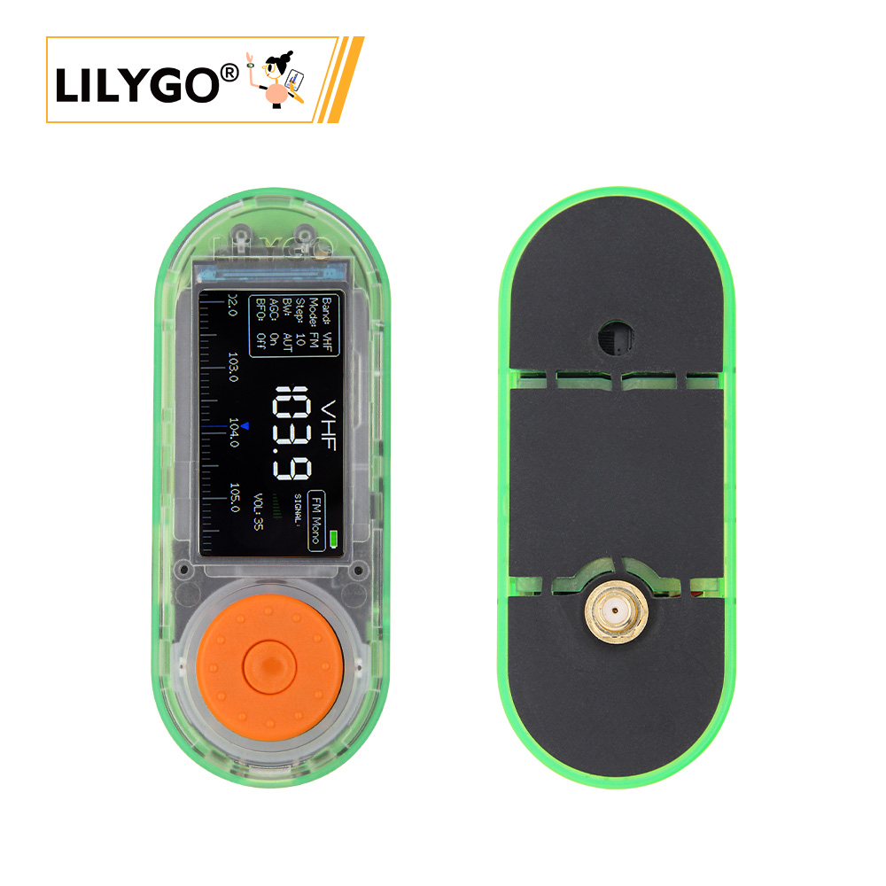

<!-- **[English](README.MD) | 中文** -->

<!-- 

    <a target="_blank" style="margin: 1em;color: white; font-size: 0.9em; border-radius: 0.3em; padding: 0.5em 2em; background-color:rgb(63, 201, 28)" href="https://item.taobao.com/item.htm?id=846226367137">淘宝</a>
    <a target="_blank" style="margin: 1em;color: white; font-size: 0.9em; border-radius: 0.3em; padding: 0.5em 2em; background-color:rgb(63, 201, 28)" href="https://www.aliexpress.com/store/911876460">速卖通</a>

 -->

## Introduction

LILYGO T-Embed SI4732 is an enhanced version of the base T-Embed, featuring an integrated SI4732 extension module. The SI4732 is a high-performance digital-tuning radio receiver chip, designed for AM/FM/SW/LW broadcast band reception. It incorporates Digital Signal Processing (DSP) technology, offering high sensitivity, low power consumption, and high integration, making it ideal for a variety of radio and audio applications.

As for the T-Embed base board itself, it features a rounded rectangular design and integrates a rotary encoder with RGB LED ring and a 1.9-inch IPS TFT display. It also includes a MEMS microphone array, built-in speaker, internal TF card slot, and power management circuitry, supporting 3.7V lithium battery power. Expansion options include both a GROVE port and a 2.54mm-pitch GPIO header, offering flexible connectivity for development and prototyping.

## Appearance and function introduction
### Appearance

### Pinmap 

## Module Information and Specifications
### Description

| Component | Description |
| ---  | --- |
|MCU	|ESP32-S3 Dual-core LX7 microprocessor
|Flash 	|16M
|PSRAM  |8M
|GPS	|MIA-M10Q
| Wireless | Wi-Fi 802.11b /g/n, BLE 5
| Storage | TF Card |
| Screen | 1.9-inch ST7789V IPS color TFT LCD
| radio | Si4732-A10(CMOS AM/FM/SW/LW/RDS radio receiverIC)
| Battery | 702550, 900MAH
| Encoder | Encoder knob
| Keys | 1 x RST key + 1 x BOOT key |
| Microphone | 1 x ES7210 microphone
| USB |1 × type-C interface |
| RGB | APA102
| Hole position | 2×2mm positioning hole |
| Dimensions | **98x39x39mm** |

### Related Links
Github：[T-Embed-SI4732](https://github.com/Xinyuan-LilyGO/T-Embed)

* [PN532](https://github.com/Xinyuan-LilyGO/T-Embed-CC1101/blob/master/hardware/PN532_C1.pdf)
* [bq25896](https://github.com/Xinyuan-LilyGO/T-Embed-CC1101/blob/master/hardware/bq25896.pdf)
* [bq27220](https://github.com/Xinyuan-LilyGO/T-Embed-CC1101/blob/master/hardware/bq27220_datasheet.pdf)

#### Schematic Diagram

[T-Embed-SI4732](https://github.com/Xinyuan-LilyGO/T-Embed-CC1101/blob/master/hardware/T-Embed-CC1101%20V1.0%2024-07-29.pdf)

<!-- * [SY6970](./datasheet/AN_SY6970.pdf) -->

#### Dependency Libraries

* [RadioLib](https://github.com/jgromes/RadioLib)
* [PN532](https://github.com/Seeed-Studio/PN532.git)
* [XPowersLib](https://github.com/lewisxhe/XPowersLib)
* [TFT_eSPI](https://github.com/Bodmer/TFT_eSPI)
* [RotaryEncoder](http://www.mathertel.de/Arduino/RotaryEncoderLibrary.aspx)
* [FastLED](https://github.com/FastLED/FastLED)
* [IRremoteESP8266](https://github.com/crankyoldgit/IRremoteESP8266)
* [ESP32-audioI2S](https://github.com/schreibfaul1/ESP32-audioI2S)
* [LVGL](https://github.com/lvgl/lvgl/tree/v8.4.0)
* [PU2CLR SI4735](https://github.com/pu2clr/SI4735)

## Software Design
### Arduino Set Parameters

| Arduino IDE Setting  | Value      |
| --------------- | ------------------ |
| Board      | **ESP32S3 Dev Module**            |
| Port           | Your port                   |
| USB CDC On Boot          | Enable                    |
| CPU Frequency           | 240MHZ(WiFi)                 |
| Core Debug Level        | None                     |
| USB DFU On Boot         | Disable                           |
| Erase All Flash Before Sketch Upload | Disable        |
| Events Run On       | Core1            |
| Flash Mode       | QIO 80MHZ                         |
| Flash Size       | **16MB(128Mb)**                   |
| Arduino Runs On    | Core1          |
| USB Firmware MSC On Boot  | Disable           |
| Partition Scheme    | **16M Flash(3M APP/9.9MB FATFS)** |
| PSRAM    | **OPI PSRAM**           |
| Upload Mode       | **UART0/Hardware CDC**            |
| Upload Speed    | 921600                            |
| USB Mode         | **CDC and JTAG**                  |
  

### Development Platform
1. [ESP-IDF](https://www.espressif.com/zh-hans/products/sdks/esp-idf)
2. [Arduino IDE](https://www.arduino.cc/en/software)

## Product Technical Support 

