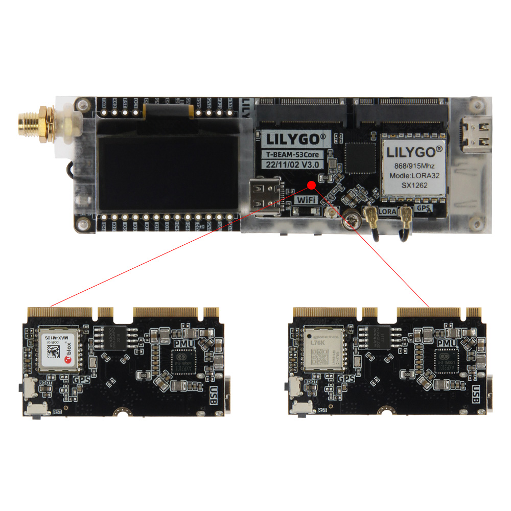

<!-- **[English](README.MD) | 中文** -->

    <a target="_blank" style="margin: 1em;color: white; font-size: 0.9em; border-radius: 0.3em; padding: 0.5em 2em; background-color:rgb(63, 201, 28)" href="https://lilygo.cc/products/t-beam-supreme">Go Buying</a>
    <!-- <a target="_blank" style="margin: 1em;color: white; font-size: 0.9em; border-radius: 0.3em; padding: 0.5em 2em; background-color:rgb(63, 201, 28)" href="https://www.aliexpress.com/store/911876460">速卖通</a>-->

 

## Introduction

T-BEAM-SUPREME V3.0 is a high-performance, multifunctional IoT development board based on the ESP32-S3FN8 dual-core processor, supporting Wi-Fi 802.11 b/g/n and Bluetooth 5.0 for flexible wireless connectivity. Compatible with Arduino IDE, MicroPython, and VS Code, it features 8MB PSRAM and 8MB Flash for robust data storage and processing.

The board integrates a 6-axis sensor (QM6), a 3.7V 18650 battery interface, and multi-function buttons (Boot/Reset/Power). It comes equipped with a 1.3-inch SH1106 OLED display (128×64 resolution, I2C interface) and supports the SX1262 LoRa module for long-range, low-power communication across 433/868/915/923MHz bands.

Users can optionally choose between Ublox MAX-M10S or L76K GPS modules for accurate positioning capabilities, making this board ideal for smart hardware, environmental monitoring, and IoT node development.

## Appearance and function introduction
### Appearance

### Pinmap 

## Module Information and Specifications
### Description

#### Core Board

>The expansion board allows you to choose between the MAX-M10S or L76K GPS module.
>`MAX-M10S `The module supports UART communication with selectable baud rates of 9600, 19200, 38400, 57600, and 115200 bps, and complies with the NMEA 0183 standard.`L76K GPS` The module supports UART communication at configurable baud rates of 9600, 19200, 38400, 57600, and 115200 bps, and is compatible with the UBX protocol.

#### Expansion board

| Component | Description |
| --- | --- |
| MCU | ESP32-S3FN8 Dual-core LX7 microprocessor
| FLASH| 	8MB |
| PSRAM | 8MB|
| RTC | PCF85063ATL (IIC)|
| Microphone | MP34DT05-A (PDM)|
| Power Management Chip | AXP2101
| Six-axis sensor | QMI8658 |
| Temperature, Humidity and pressure sensor | BME280
| LoRa | SX1262:868, 915Mhz SX1280:2.4Ghz |
| Screen | 1.3-inch SH1106 OLED screen |
| Storage | TF Card |
| Wireless |2.4Ghz Wi-Fi + Bluetooth 5.0
| USB | 1 × USB Port and OTG(TYPE-C interface) |
| IO interface | 2.54mm pitch × 2*13 extended IO interface |
| Keys | 1 x RESET key + 1 x BOOT key + 1 x Power key |
| Extended Interfaces | 1x Wifi antenna interface + 1x LoRa antenna interface + 1x GPS antenna interface + 1x Qwiic interface |
| Battery | Supports 3.7V 18650 battery |
| Power Supply | 5V/500mA |
| Hole position | **M2.6 *2** |
| Dimensions | 114x33x28mm |

### Related Links

Github:[T-Beam-SUPREME](https://github.com/Xinyuan-LilyGO/LilyGo-LoRa-Series)

- [SX1262 datasheet](https://www.semtech.com/products/wireless-rf/lora-transceivers/sx1262)
- [LR1121 datasheet](https://www.semtech.com/products/wireless-rf/lora-connect/lr1121)
- [GSP MAX-M10 datasheet](https://www.u-blox.com/zh/product/max-m10-series)
- [PCF8563 datasheet](https://github.com/Xinyuan-LilyGO/LilyGo-LoRa-Series/blob/master/lib/SensorsLib/datasheet/PCF8563%20Datasheet%20Rev.11.pdf)
- [QMI8658 datasheet](https://github.com/Xinyuan-LilyGO/LilyGo-LoRa-Series/blob/master/lib/SensorsLib/datasheet/QMI8658A%20Datasheet%20Rev1.0.pdf)
- [QMC6310 datasheet](https://github.com/Xinyuan-LilyGO/LilyGo-LoRa-Series/blob/master/lib/SensorsLib/datasheet/QMC6310%20Datasheet%20Rev.C.pdf)
- [BME280 datasheet](https://www.bosch-sensortec.com/products/environmental-sensors/humidity-sensors-bme280/)
- [Quectel_L76K_GNSS_Protocol_Specification_V1.2](https://github.com/Xinyuan-LilyGO/LilyGo-LoRa-Series/blob/master/docs/datasheet/Quectel_L76KL26K_GNSS_协议规范_V1.2.pdf)
- [CASIC_ProtocolSpecification](https://github.com/Xinyuan-LilyGO/LilyGo-LoRa-Series/blob/master/docs/datasheet/CASIC_ProtocolSpecification.pdf)

#### Schematic Diagram

[T-Beam Supreme schematic](schematic/LilyGo_T-BeamS3Supreme.pdf)

#### Dependency Libraries

- [AXP202](https://github.com/lewisxhe/AXP202X_Library)
- [AceButton](https://github.com/bxparks/AceButton)
- [Arduino_GFX](https://github.com/moononournation/Arduino_GFX)
- [Adafruit_BME280_Library](https://github.com/adafruit/Adafruit_BME280_Library)
- [Adafruit_BusIO](https://github.com/adafruit/Adafruit_BusIO)
- [Adafruit_Sensor](https://github.com/adafruit/Adafruit_Sensor)
- [ESP8266_SSD1306](https://github.com/ThingPulse/esp8266-oled-ssd1306)
- [GxEPD](https://github.com/ZinggJM/GxEPD)
- [LMIC-Arduino](https://github.com/matthijskooijman/LMIC-node)
- [LoRa](https://github.com/sandeepmistry/arduino-LoRa)
- [RadioLib](https://github.com/jgromes/RadioLib)
- [TFT_eSPI](https://github.com/Bodmer/TFT_eSPI)
- [TinyGPSPlus](https://github.com/mikalhart/TinyGPSPlus)
- [TinyGSM](https://github.com/vshymanskyy/TinyGSM)
- [U8g2](https://github.com/olikraus/u8g2)

#### Attention

> If users need to adjust the external antenna resistance, please refer to the documentation

>!The resistance of the external antenna can be adjusted by replacing the resistor at the point pointed by the arrow

## Software Design
### Arduino Set Parameters

| T-Beam S3 Supreme                    | Value                          |
|--------------------------------------|--------------------------------|
| Board                                | ESP32S3 Dev Module             |
| Port                                 | Your port                      |
| USB CDC On Boot                      | Enable                         |
| CPU Frequency                        | 240MHZ(WiFi)                   |
| Core Debug Level                     | None                           |
| USB DFU On Boot                      | Disable                        |
| Erase All Flash Before Sketch Upload | Disable                        |
| Events Run On                        | Core1                          |
| Flash Mode                           | QIO 80MHZ                      |
| Flash Size                           | 8MB(64Mb)                      |
| Arduino Runs On                      | Core1                          |
| USB Firmware MSC On Boot             | Disable                        |
| Partition Scheme                     | 8M Flash(3M APP/1.5MB SPIFFS)  |
| PSRAM                                | QSPI PSRAM                     |
| Upload Mode                          | UART0/Hardware CDC             |
| Upload Speed                         | 921600                         |
| USB Mode                             | CDC and JTAG                   |
| Programmer                           | Esptool                        |        

### Development Platform

1. [ESP-IDF](https://www.espressif.com/zh-hans/products/sdks/esp-idf)
2. [Arduino IDE](https://www.arduino.cc/en/software)
3. [VS Code](https://code.visualstudio.com/)
4. [Micropython](https://micropython.org/)

## Product Technical Support 

