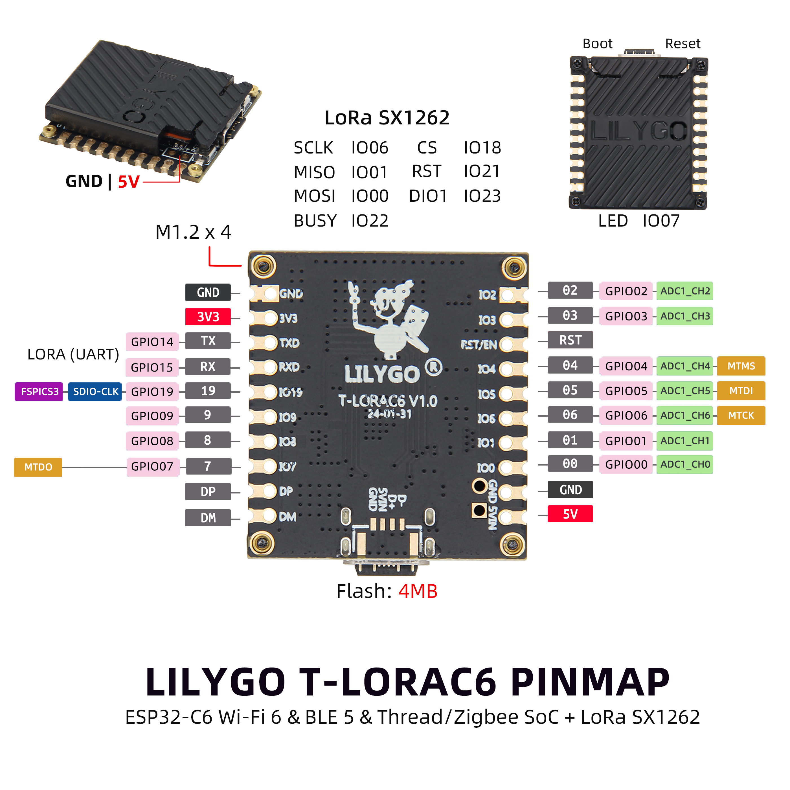

<!-- **[English](README.MD) | 中文** -->

    <a target="_blank" style="margin: 1em;color: white; font-size: 0.9em; border-radius: 0.3em; padding: 0.5em 2em; background-color:rgb(103, 175, 8)" href="https://lilygo.cc/products/t-lora-c6">Go Buying</a>
    <!-- <a target="_blank" style="margin: 1em;color: white; font-size: 0.9em; border-radius: 0.3em; padding: 0.5em 2em; background-color:rgb(63, 201, 28)" href="https://www.aliexpress.com/store/911876460">速卖通</a> -->

## Introduction

LILYGO **T-LoRa C6** is a compact IoT development board based on the ESP32-C6-MINI-1 module, integrating 2.4GHz Wi-Fi 6, Bluetooth 5 (LE), and LoRa® long-range communication (SX1262 module, supporting 868/915MHz frequency bands), offering both high performance and low power consumption. The board features 4MB Flash, supports C/C++, MicroPython, and Lua programming languages, and is compatible with popular development platforms such as Arduino-IDE, VS Code, and ESP-IDF. It includes a BOOT/reset button, customizable LED, and a Type-C power input interface for easy debugging and deployment. Its small size (33x29mm) and multi-protocol integration (Wi-Fi/Bluetooth/LoRa) make it suitable for applications such as smart home control, industrial sensor networks, and remote environmental monitoring. The 5V 500mA power supply design further simplifies mobile device integration, making it an ideal choice for low-power wide-area IoT applications.

## Appearance and function introduction
### Appearance

### Pinmap 

## Module Information and Specifications
### Description

| Component | Description |
| --- | --- |
| MCU | ESP32-C6-MINI-1
| FLASH| 4MB(Quad-SPI) |
| LoRa | SX1262: 868, 915Mhz
| Wireless | 2.4g Wi-Fi 6, Bluetooth 5 (LE), 802.15.4
| USB | 1 × USB Port and OTG(TYPE-C interface) |
| Extended Interface | 2 × 10-PIN GPIO interface |
| Keys | 1 x RESET key + 1 x BOOT key |
| Power input | 5V/500mA |
| Hole Position | **4 × M1.2 positioning hole **
| Dimensions | 33 X 29 X 6 mm |

### Related Links

Github:[T-LoRa-C6](https://github.com/Xinyuan-LilyGO/LilyGo-LoRa-Series)

#### Schematic Diagram

[T-LoRa-C6](https://github.com/Xinyuan-LilyGO/LilyGo-LoRa-Series/blob/master/schematic/T3-C6_V1.0.pdf)

#### Dependency Libraries
- [AXP202](https://github.com/lewisxhe/AXP202X_Library)
- [AceButton](https://github.com/bxparks/AceButton)
- [Arduino_GFX](https://github.com/moononournation/Arduino_GFX)
- [Adafruit_BME280_Library](https://github.com/adafruit/Adafruit_BME280_Library)
- [Adafruit_BusIO](https://github.com/adafruit/Adafruit_BusIO)
- [Adafruit_Sensor](https://github.com/adafruit/Adafruit_Sensor)
- [ESP8266_SSD1306](https://github.com/ThingPulse/esp8266-oled-ssd1306)
- [GxEPD](https://github.com/ZinggJM/GxEPD)
- [LMIC-Arduino](https://github.com/matthijskooijman/LMIC-node)
- [LoRa](https://github.com/sandeepmistry/arduino-LoRa)
- [RadioLib](https://github.com/jgromes/RadioLib)
- [TFT_eSPI](https://github.com/Bodmer/TFT_eSPI)
- [TinyGPSPlus](https://github.com/mikalhart/TinyGPSPlus)
- [TinyGSM](https://github.com/vshymanskyy/TinyGSM)
- [U8g2](https://github.com/olikraus/u8g2)

## Software Design
### Arduino Set Parameters

| Board                                | ESP32C6 Dev Module                                   |
|--------------------------------------|------------------------------------------------------|
| Port                                 | Your port                                            |
| USB CDC On Boot                      | Enable                                               |
| CPU Frequency                        | 160MHZ(WiFi)                                         |
| Core Debug Level                     | None                                                 |
| USB DFU On Boot                      | Disable                                              |
| Erase All Flash Before Sketch Upload | Disable                                              |
| Flash Mode                           | DIO                                                  |
| Flash Size                           | 4MB(32Mb)                                            |
| Arduino Runs On                      | Core1                                                |
| USB Firmware MSC On Boot             | Disable                                              |
| Partition Scheme                     | Default 4M Flash with spiffs(1.2M APP/1.5MB SPIFFS)  |
| Upload Speed                         | 921600                                               |
| Programmer                           | Esptool                                              |

### Development Platform
1. [VS Code](https://code.visualstudio.com/)
2. [Arduino IDE](https://www.arduino.cc/en/software)
3. [Platform IO](https://platformio.org/)
4. [MicroPython](https://micropython.org/)
5. [ESP-IDF](https://github.com/espressif/esp-idf)

## Product Technical Support 

