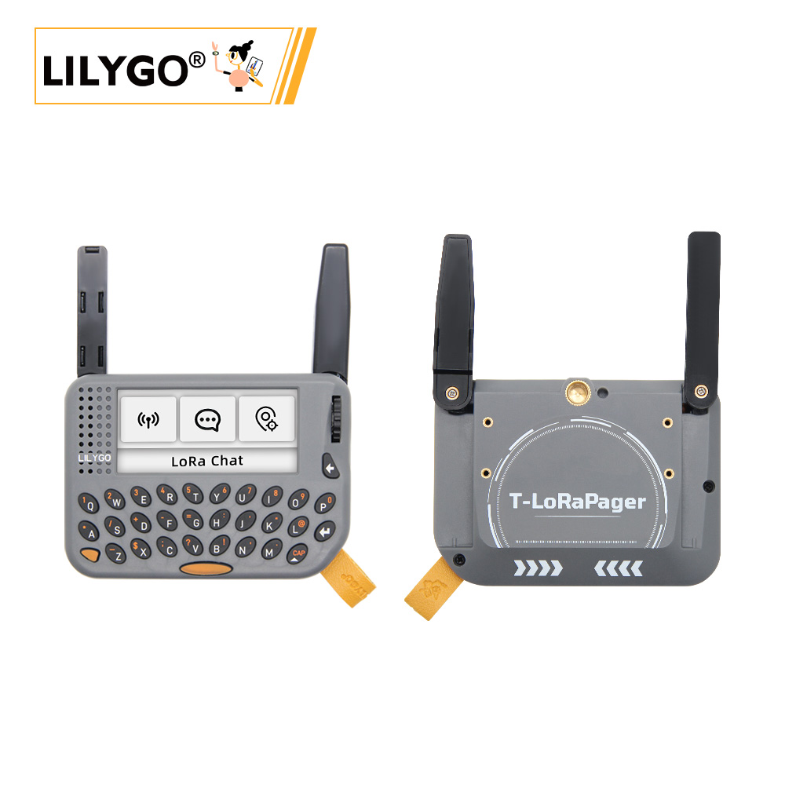
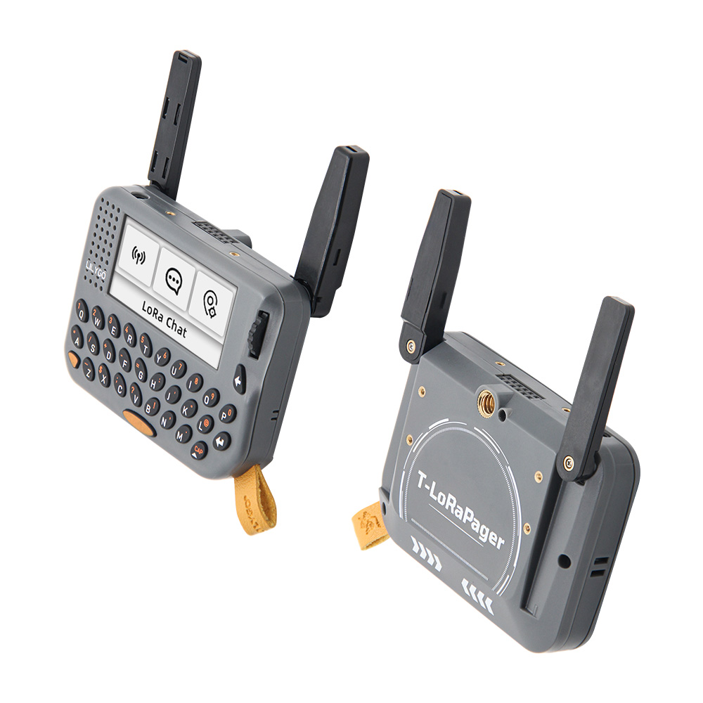
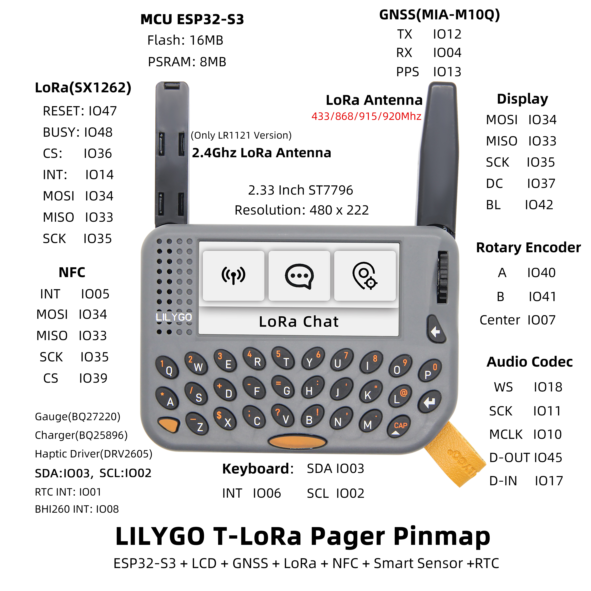
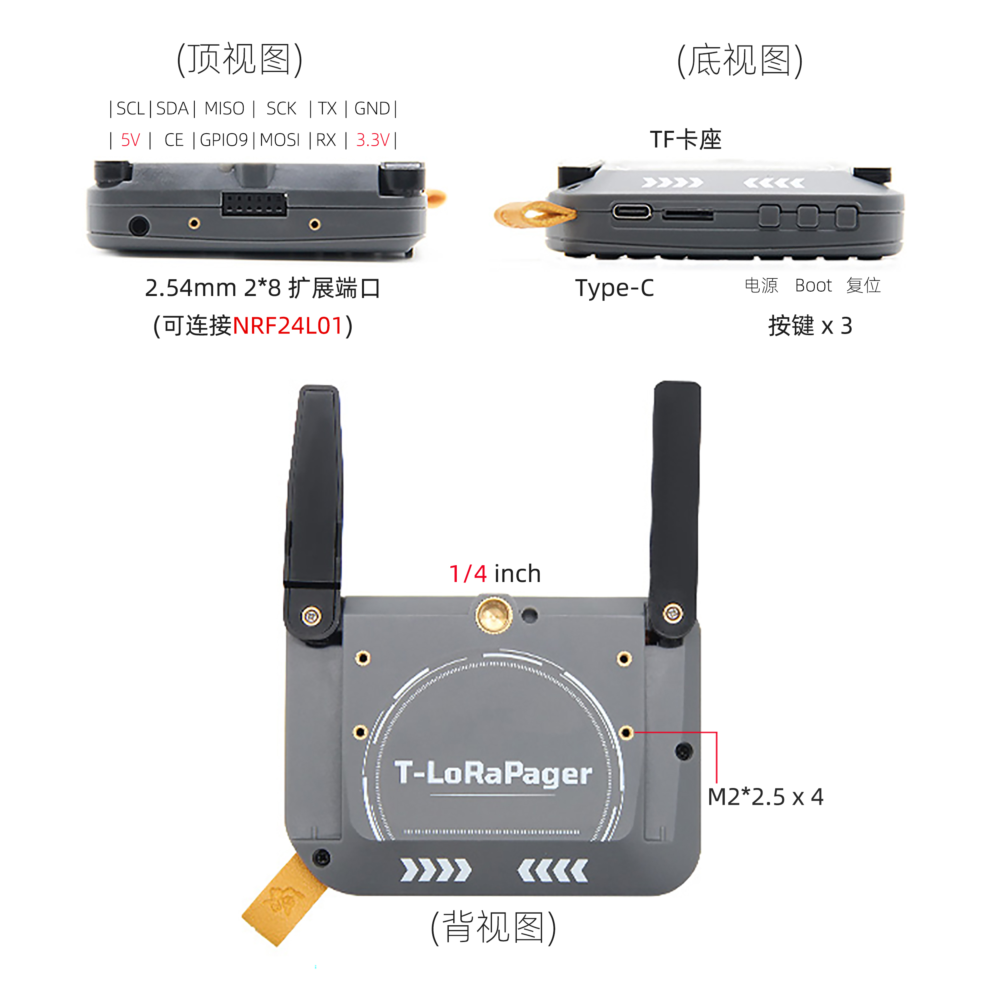
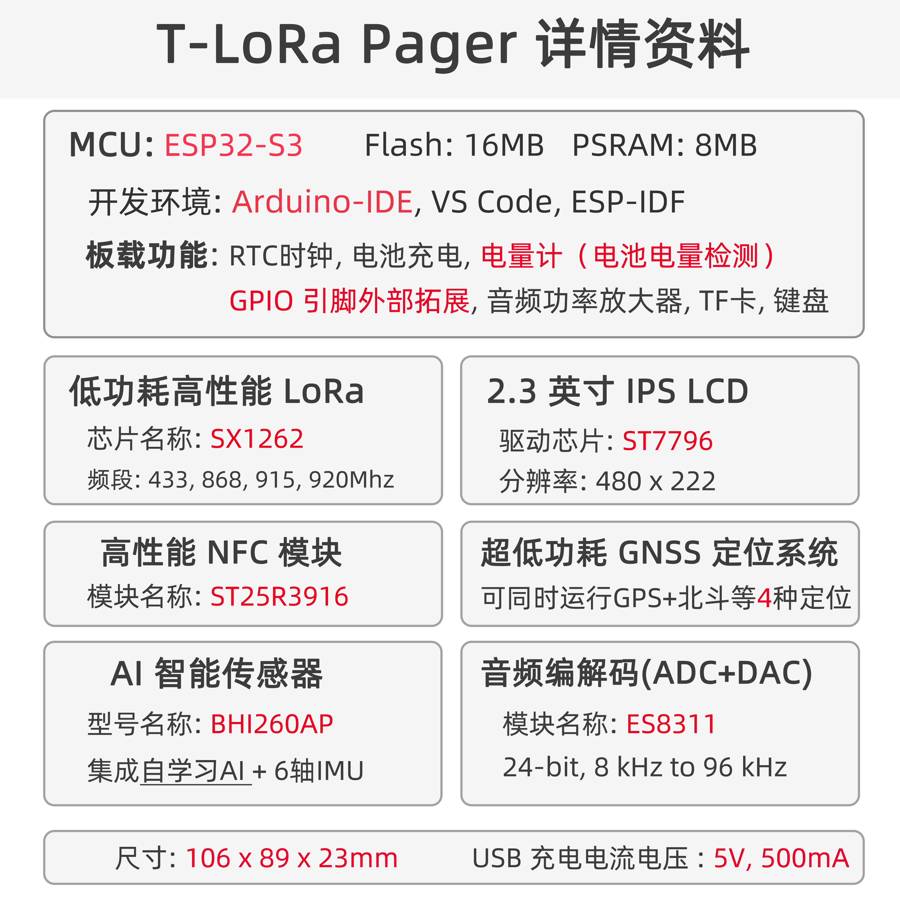

<!-- **[English](README.MD) | 中文** -->

    <a target="_blank" style="margin: 1em;color: white; font-size: 0.9em; border-radius: 0.3em; padding: 0.5em 2em; background-color:rgb(103, 175, 8)" href="https://lilygo.cc/products/t-lora-pager">Go Buying</a>
    <!-- <a target="_blank" style="margin: 1em;color: white; font-size: 0.9em; border-radius: 0.3em; padding: 0.5em 2em; background-color:rgb(63, 201, 28)" href="https://www.aliexpress.com/store/911876460">速卖通</a> -->

## Introduction
T-LoraPager is a new model of LILYGO's handheld AIoT programmable development device combining LoRa + ESP32-S3. It features a compact design with a foldable external antenna, balancing excellent wireless performance with an aesthetically pleasing form.

T-LoraPager comes in multiple versions with identical exterior structures; the main difference lies in the LoRa module used. Available options include:

* LR1121 version

* SX1262 version

* CC1101 version (replacing LoRa functionality)

You can choose the most suitable version based on your application needs.

The device integrates a wide array of features:

- QWERTY keyboard

- AI-enabled IMU (BHI260AP)

- 2.33" bar-type screen (resolution: 222 × 480)

- Optional LoRa module (LR1121 or SX1262)

- u-blox GPS module (MIA-M10Q)

- RFID/NFC + RTC circuit

- TI power management and monitoring chipset

- ES8311 (microphone/speaker/headphone jack)

- Rotary encoder with button

- 2 × 8 GPIO expansion header (designed for top-mounted NRF24L01 module)

- ¼-inch screw mount on the back

- 4 × M2 standoff mounts

- Lanyard with LILYGO logo

The device comes preloaded with a UI demo firmware designed by LILYGO, enabling smooth interaction via the rotary encoder. This demo serves as a learning reference for developing customized applications across various usage scenarios.

## Appearance and function introduction
### Appearance

### Pinmap  

### three views

## Module Information and Specifications
### Description

| Component | Description |
| ---  | --- |
|MCU	|ESP32-S3
|Flash 	|16M
|PSRAM  |8M
|Lora| SX1262 433Mhz - 920Mhz(Optional)
|GPS	|MIA-M10Q
| Wireless | 2.4GHz Wi-Fi & Bluetooth 5 (LE)
|NFC | ST25R3916(SPI) |
| Storage | TF card
| Screen | ST7796 480 x 222 LCD
|AI Intelligent Sensor | BHI260AP
|GNSS | Low-power GNSS module (Concurrent capacity :4)
| Input | Keyboard
| Encoder | Rotary Encoder
|RTC | Supports power switch
| Touch |GT911
| Keys | 1 x RST key + 1 x BOOT key |
| Audio decoder |RC01812(24-bit, 8kHz to 96kHz)
| USB |1 × type-C interface |
|IO Extension |PCA9535PW (0x20)
| Extended Interface | GPS extended interface +2 × Knockout(AUX connector for extended antenna) +2.54mm 2*8 extended IO interface (for NRF24L01 module) |
| Hole position | 1/4-inch fixed screw interface + 4 x M2*2.5 back hole |
| Power input | 5V/500mA |
| Dimensions | 106x89x23mm |

### Related Links

Github：[T-LoraPager](https://github.com/Xinyuan-LilyGO/LilyGoLib?tab=readme-ov-file)
Software Description: [T-LoraPager](https://github.com/Xinyuan-LilyGO/LilyGoLib/blob/master/docs/lilygo-t-lora-pager.md)
Hardware Description: [T-LoraPager](https://github.com/Xinyuan-LilyGO/LilyGoLib/blob/master/docs/hardware/lilygo-t-lora-pager.md)

#### Schematic Diagram

[T-LoraPager](https://github.com/Xinyuan-LilyGO/LilyGoLib/blob/master/docs/hardware/schematic.pdf)

<!-- * [SY6970](./datasheet/AN_SY6970.pdf) -->

#### Dependency Libraries

* [LilyGoLib](https://github.com/Xinyuan-LilyGO/LilyGoLib)

## Software Design
### Arduino Set Parameters

| Arduino IDE Setting                  | Value                          |
|--------------------------------------|--------------------------------|
| Board                                | LilyGo-T-LoRa-Pager            |
| Port                                 | Your port                      |
| USB CDC On Boot                      | Enabled                        |
| CPU Frequency                        | 240MHZ(WiFi)                   |
| Core Debug Level                     | None                           |
| USB DFU On Boot                      | Disable                        |
| Erase All Flash Before Sketch Upload | Disable                        |
| Events Run On                        | Core 1                         |
| JTAG Adapter                         | Disable                        |
| Arduino Runs On                      | Core 1                         |
| USB Firmware MSC On Boot             | Disable                        |
| Partition Scheme                     | 16M Flash(3M APP/9.9MB FATFS)  |
| Board Revision                       | Radio-SX1262                   |
| Upload Mode                          | UART0/Hardware CDC             |
| Upload Speed                         | 921600                         |
| USB Mode                             | CDC and JTAG                   |

### Development Platform
1. [VS Code](https://code.visualstudio.com/)
2. [Arduino IDE](https://www.arduino.cc/en/software)
3. [Platform IO](https://platformio.org/)
4. [Micropython](https://micropython.org/)

## Product Technical Support 

