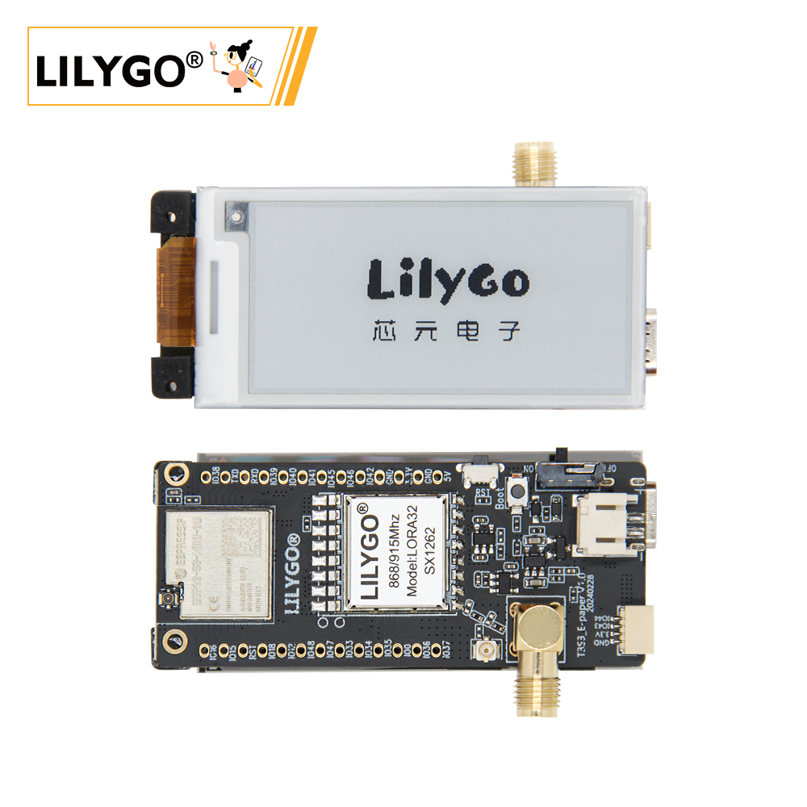
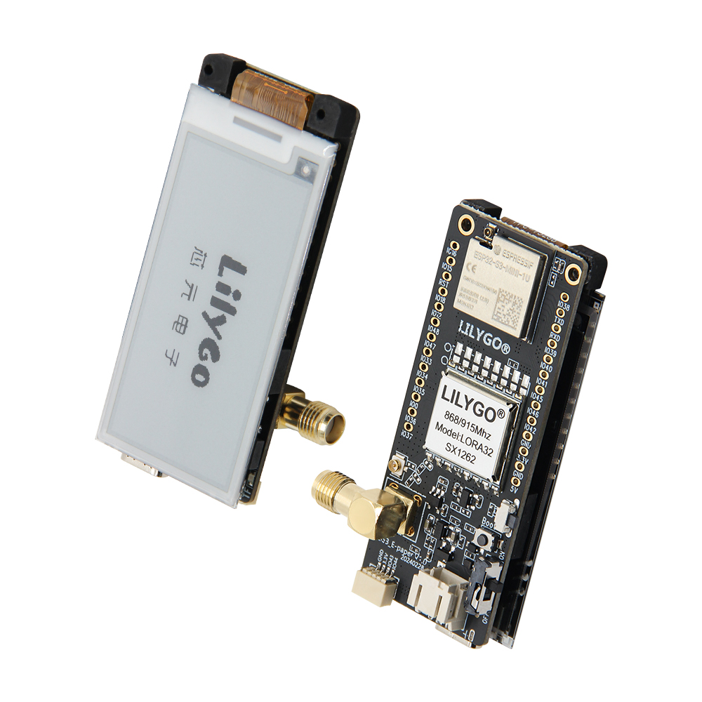
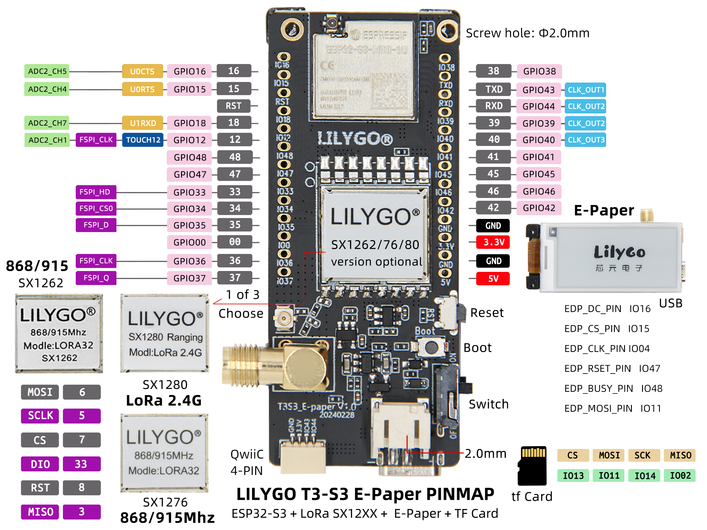
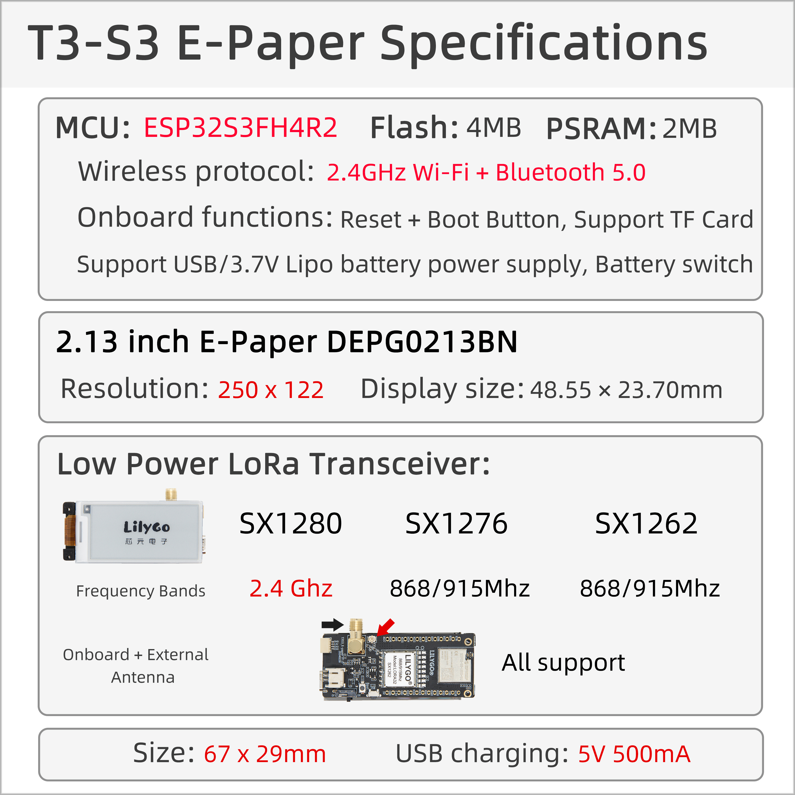
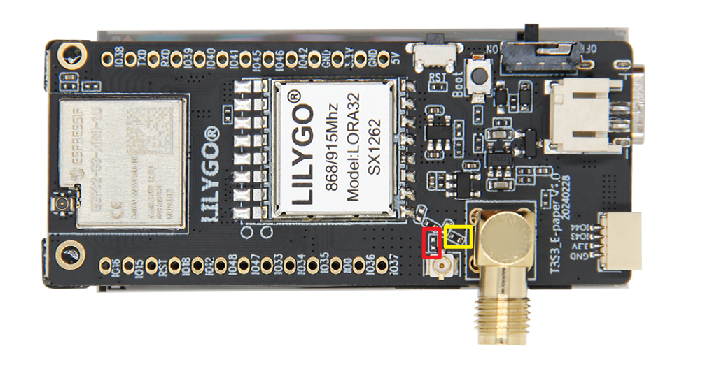

<!-- **[English](README.MD) | 中文** -->

    <a target="_blank" style="margin: 1em;color: white; font-size: 0.9em; border-radius: 0.3em; padding: 0.5em 2em; background-color:rgb(63, 201, 28)" href="https://lilygo.cc/products/ts-s3-epaper">Go Buying</a>
    <!-- <a target="_blank" style="margin: 1em;color: white; font-size: 0.9em; border-radius: 0.3em; padding: 0.5em 2em; background-color:rgb(63, 201, 28)" href="https://www.aliexpress.com/store/911876460">速卖通</a> -->

## Introduction

T3-S3 E-Paper is a low-power IoT development board based on the ESP32S3FH4R2 microcontroller. It integrates 2.4GHz Wi-Fi and Bluetooth 5.0 dual-mode wireless communication, and supports various LoRa RF modules (including SX1280, SX1276, and SX1262), covering both 2.4GHz and 868/915MHz frequency bands—ideal for long-range, low-power data transmission scenarios.

At its core, it features a 2.13-inch E-Ink display (DEPG0213BN) with a resolution of 250×122 and compact dimensions (48.55×23.70mm), offering low power consumption and high visibility, perfect for static information display applications such as electronic tags and environmental monitoring.

Hardware specifications include 4MB Flash and 2MB PSRAM, with support for SD card storage expansion. It offers dual power supply options via USB or a 3.7V lithium battery (with battery switch), supporting long-term mobile deployment.

Additional features include Reset/Boot buttons, multi-band antennas (onboard + external), and a compact form factor (67×29mm), making it widely applicable in smart agriculture, industrial sensing, and intelligent warehousing.

## Appearance and function introduction
### Appearance

### Pinmap 

## Module Information and Specifications
### Description

| Component | Description |
| --- | --- |
| MCU | ESP32S3FH4R2 |
| FLASH| 4MB |
| PSRAM | 2MB|
| Screen | 2.13-inch DEPG0213BN E-Paper e-ink screen |
| LoRa | SX1280:2.4Ghz SX1276:868/915Mhz SX1262:868/915MHz |
| Storage | TF Card |
| Wireless | 2.4GHz Wi-Fi & Bluetooth5 (LE)
| USB | 1 × USB Port and OTG(TYPE-C interface) |
| IO interface | 2.54mm pitch 2*13 (dual rows) Extended IO interface |
| Extended Interfaces | 1 × FPC antenna extended interface +1 × TF card interface +1 × STEMMA QT/QWIIC interface (JST-SH 1.0MM 4Pin) + JST-GH 2MM interface |
| Keys | 1 x RESET key + 1 x BOOT key |
| Hole positions | **2mm positioning holes ** 4**
| Dimensions | 67x29x15mm |

### Related Links

Github：[T3-S3-E-paper](https://github.com/Xinyuan-LilyGO/Lilygo-LoRa-Epaper-series/tree/master)

#### Schematic Diagram

[T3-S3-E-paper](https://github.com/Xinyuan-LilyGO/Lilygo-LoRa-Epaper-series/blob/master/schematic/T3S3_E-paper%20V1.0%2023-12-16.pdf)

<!-- * [SY6970](./datasheet/AN_SY6970.pdf) -->

#### Dependency Libraries

* [Adafruit-GFX-Library](https://github.com/adafruit/Adafruit-GFX-Library)
* [GxEPD](https://github.com/bot1131357/GxEPD)
* [RadioLib](https://github.com/jgromes/RadioLib)
* [SensorLib](https://github.com/lewisxhe/SensorsLib)

#### 注意事项

> If users need to adjust the resistance of the external antenna, please refer to this

>!Adjust the direction of the resistor to regulate the resistance of the external antenna

## Software Design
### Arduino Set Parameters

| Setting                  | Value                            |
|--------------------------|----------------------------------|
| Board                    | ESP32S3 Dev Module               |
| Upload Speed             | 921600                           |
| USB Mode                 | Hardware CDC and JTAG            |
| USB CDC On Boot          | Enabled                          |
| USB Firmware MSC On Boot | Disabled                         |
| USB DFU On Boot          | Disabled                         |
| CPU Frequency            | 240MHz (WiFi)                    |
| Flash Mode               | QIO 80MHz                        |
| Flash Size               | 4MB (32Mb)                       |
| Core Debug Level         | None                             |
| Partition Scheme         | Default 4MB with spiffs          |
| PSRAM                    | OPI PSRAM                        |
| Arduino Runs On          | Core 1                           |
| Events Run On            | Core 1                           |

### Development Platform

1. [Micropython](https://micropython.org/)
2. [Arduino IDE](https://www.arduino.cc/en/software)
3. [Platform IO](https://platformio.org/)

## Product Technical Support 

