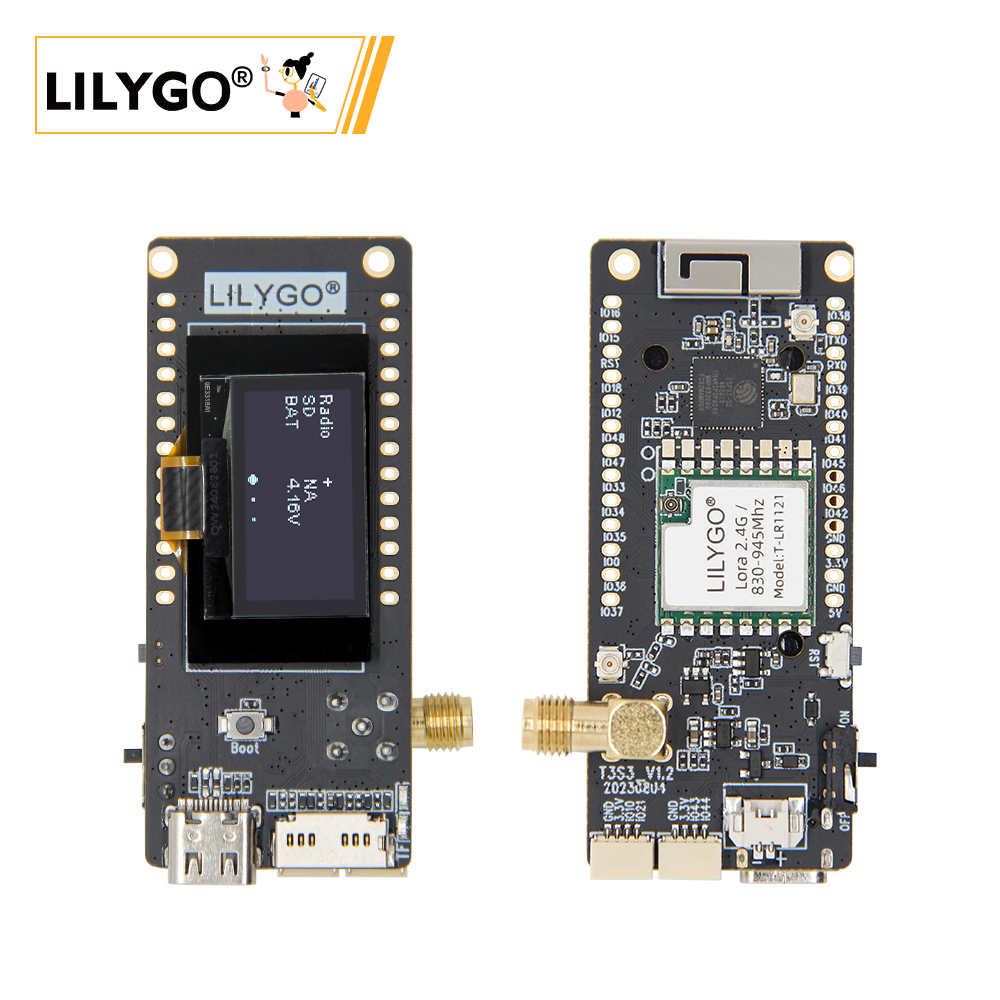

<!-- **[English](README.MD) | 中文** -->

<!-- 

    <a target="_blank" style="margin: 1em;color: white; font-size: 0.9em; border-radius: 0.3em; padding: 0.5em 2em; background-color:rgb(63, 201, 28)" href="https://item.taobao.com/item.htm?id=846226367137">淘宝</a>
    <a target="_blank" style="margin: 1em;color: white; font-size: 0.9em; border-radius: 0.3em; padding: 0.5em 2em; background-color:rgb(63, 201, 28)" href="https://www.aliexpress.com/store/911876460">速卖通</a>

 -->

## Introduction

LILYGO T3-S3 LR1121 is a highly integrated IoT development board based on the ESP32-S3, supporting dual-band LoRa communication at 2.4GHz and 830–945MHz, enabling long-range transmission (10km+) and compatibility with spectrum regulations across various regions.

The board features a 1.3-inch OLED display for real-time data monitoring, a TF card slot for storage expansion, and a Type-C port for convenient power supply and debugging. It offers abundant GPIO pins supporting ADC, SPI, I2C, and other protocols, allowing flexible connection to sensors and peripherals.

With built-in Wi-Fi and Bluetooth 5.0, the T3-S3 LR1121 enables seamless multi-protocol communication. It's ideal for applications such as smart agriculture monitoring, industrial device management, emergency communication networks, and smart home gateways. Its low-power design and compact form factor make it an efficient and versatile hardware platform for rapid IoT system development.

## Appearance and function introduction
### Appearance

### Pinmap 

## Module Information and Specifications
### Description

| Component | Description |
| --- | --- |
| MCU | ESP32S3FH4R2
| FLASH| 4MB |
| PSRAM | 2MB|
| RTC | PCF85063ATL (IIC)|
| LoRa | 830~945Mhz 2.4Ghz |
| Storage | TF card |
| wireless |2.4Ghz Wi-Fi + Bluetooth 5.0
| USB | 1 × USB Port and OTG(TYPE-C Interface) |
| IO interface | 2.54mm spacing × 2*20 (double row) extension IO interface |
| buttons | 1 x RESET button + 1 x BOOT button|
| Extension interface| 2 × QWIIC interface |
| Display | 0.96 inch 1306 OLED |
| Battery interface |1.25mm interface |
| Power | 5V/500mA |
| Holes | **2mm location hole *2** |
| Dimensions | **66x27x15mm**  |

### Related Links

Github:[T3-S3 LR1121](https://github.com/Xinyuan-LilyGO/LilyGo-LoRa-Series)

- [LR1121](https://www.semtech.com/products/wireless-rf/lora-connect/lr1121)

#### Schematic Diagram

[T3-S3 LR1121](https://github.com/Xinyuan-LilyGO/LilyGo-LoRa-Series/blob/master/schematic/T3_S3_V1.3.pdf)

#### Dependency Libraries

- [u8g2](https://github.com/olikraus/u8g2)
- [XPowersLib](https://github.com/lewisxhe/XPowersLib)
- [LoRa](https://github.com/sandeepmistry/arduino-LoRa)

## Software Design
### Arduino Set Parameters

| T3-S3 V.1x                           | Value                             |
|--------------------------------------|-----------------------------------|
| Board                                | ESP32S3 Dev Module                |
| Port                                 | Your port                         |
| USB CDC On Boot                      | Enable                            |
| CPU Frequency                        | 240MHZ(WiFi)                      |
| Core Debug Level                     | None                              |
| USB DFU On Boot                      | Disable                           |
| Erase All Flash Before Sketch Upload | Disable                           |
| Events Run On                        | Core1                             |
| Flash Mode                           | QIO 80MHZ                         |
| Flash Size                           | 4MB(32Mb)                         |
| Arduino Runs On                      | Core1                             |
| USB Firmware MSC On Boot             | Disable                           |
| Partition Scheme                     | Huge APP (3MB No OTA/1MB SPIFFS)  |
| PSRAM                                | QSPI PSRAM                        |
| Upload Mode                          | UART0/Hardware CDC                |
| Upload Speed                         | 921600                            |
| USB Mode                             | CDC and JTAG                      |
| Programmer                           | Esptool                           |
      

### Development Platform

1. [VS Code](https://code.visualstudio.com/)
2. [Arduino IDE](https://www.arduino.cc/en/software)
3. [Platform IO](https://platformio.org/)

## Product Technical Support 

