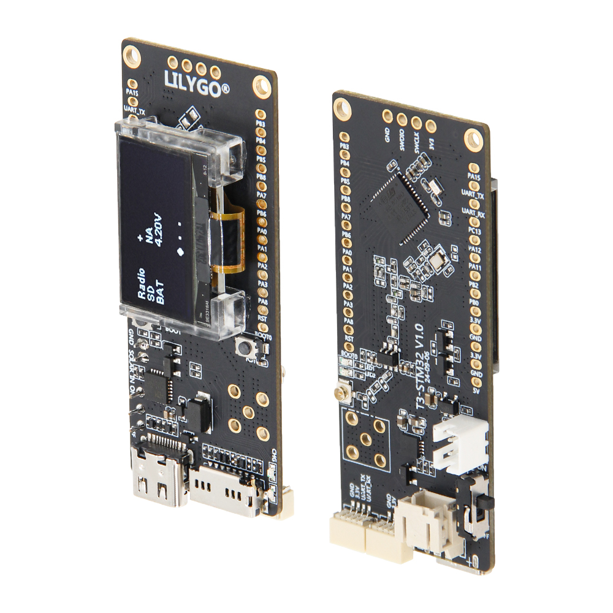

<!-- **[English](README.MD) | 中文** -->

<!-- 

    <a target="_blank" style="margin: 1em;color: white; font-size: 0.9em; border-radius: 0.3em; padding: 0.5em 2em; background-color:rgb(63, 201, 28)" href="https://item.taobao.com/item.htm?id=846226367137">淘宝</a>
    <a target="_blank" style="margin: 1em;color: white; font-size: 0.9em; border-radius: 0.3em; padding: 0.5em 2em; background-color:rgb(63, 201, 28)" href="https://www.aliexpress.com/store/911876460">速卖通</a>

 -->

## Introduction

The LILYGO T3 STM32 is a multifunctional IoT development board based on the low-power STM32WL55CCU6 microcontroller. It integrates a LoRa long-range communication module, supporting 433/868/915MHz multi-band frequencies, making it suitable for global IoT applications.

The hardware configuration includes 256KB Flash and 64KB SRAM, an OLED display driven by the SSD1315 (controlled via I2C), TF card storage expansion (via SPI), and a solar power input interface (4.4–6V), enabling outdoor energy harvesting and low-power operation.

The board features a wide range of GPIO pins compatible with SPI, I2C, timers, and other peripheral interfaces. It also provides a reserved QWIIC connector, allowing easy expansion with various sensors. This board is ideal for rapid development of IoT terminals such as remote monitoring systems, environmental sensing devices, LoRa gateways, and solar-powered equipment.

## Appearance and function introduction
### Appearance

### Pinmap 

## Module Information and Specifications
### Description

| Component | Description |
| ---  | --- |
|MCU	|	STM32WL 55CCU6
|Flash 	|	256kb
|SRAM  |64kb
|Dual Core|32-bit Arm® Cortex®-M4 + Cortex®-M0+ CPU
|Built-in RF Modulation| LoRa®, (G)FSK, (G)MSK ,BPSK
|Lora|	SX1262 433Mhz~915Mhz(optional)
|Storage | TF card |
|Display| 0.96 inch SSD1315 Driver I2C OLED
|USB |1 × type-C Interfaces|
|Buttons | 1 x RST Buttons + 1 x BOOT Buttons  |
|IO Expansion	|2.54mm pitch × 2*13 IO expansion pins|
| Expansion Interfaces |2 × QWIIC  expansion interfaces  1 × battery Switch  1 × 4-pin SWD debug interface (2.54mm pitch)  1 × Solar input port (4.4~6V)   1 × LoRa antenna connector   1 × 5-pin antenna socket |
| Mounting Holes | 2×2mm positioning holes |
| Dimensions | **66x27x13mm**  |

### ### Related Links

For more project information, please refer to:
Github：[T3 STM32](https://github.com/Xinyuan-LilyGO/T3-STM32/tree/master)
* [SSD1315](https://github.com/Xinyuan-LilyGO/T3-STM32/blob/master/hardware/SSD1315.pdf)

#### Schematic

[T3 STM32](https://github.com/Xinyuan-LilyGO/T3-STM32/blob/master/hardware/T3_STM32%20V1.0%2024-07-30.pdf)

<!-- * [SY6970](./datasheet/AN_SY6970.pdf) -->

#### Required Libraries

* [STM32 hal](https://github.com/bxparks/AceButton)
* [STM32CubeMX](https://github.com/moononournation/Arduino_GFX)

## Flashing Tools
1. Official ST programmer: [STM32CubeProgrammer](https://www.st.com.cn/zh/development-tools/stm32cubeprog.html)
2. JLink software [JLink Software and Documentation Pack](https://www.segger.com/downloads/jlink/#J-LinkSoftwareAndDocumentationPack)
3. STLink driver [STLink_V3.0.1_win32](https://www.st.com.cn/zh/development-tools/stsw-link009.html)

> Note: All three flashing tools (`JLink` `STLink` `STM32CubeProgrammer`) require the appropriate drivers to function properly.

### Development Platforms
1. [VS Code](https://code.visualstudio.com/)
2. [STM32Cube](https://www.st.com.cn/zh/development-tools/stm32cubeide.html#get-software)

## Technical Support

