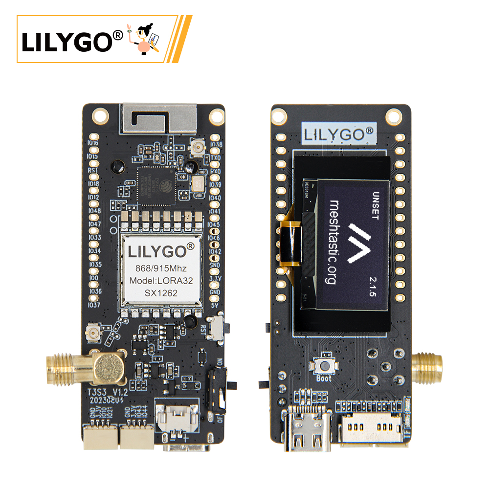
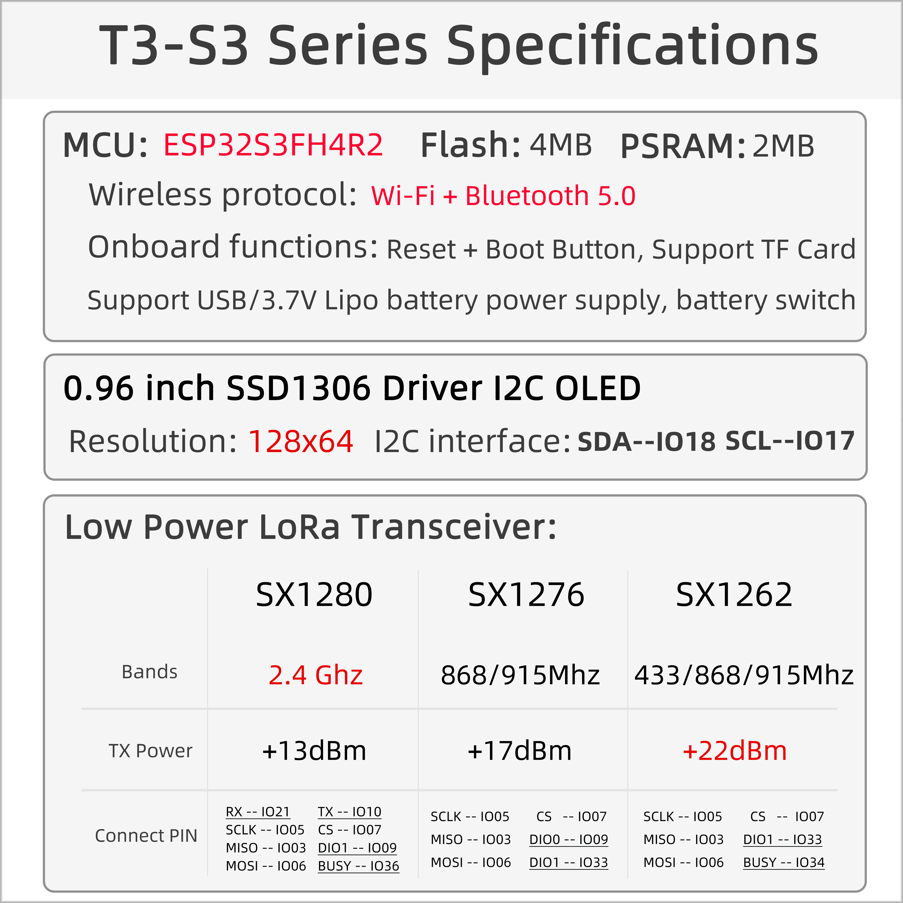

<!-- **[English](README.MD) | 中文** -->

    <a target="_blank" style="margin: 1em;color: white; font-size: 0.9em; border-radius: 0.3em; padding: 0.5em 2em; background-color:rgb(63, 201, 28)" href="https://lilygo.cc/products/t3s3-v1-0?_pos=1&_psq=T3&_ss=e&_v=1.0">Go Buying</a>
    <!-- <a target="_blank" style="margin: 1em;color: white; font-size: 0.9em; border-radius: 0.3em; padding: 0.5em 2em; background-color:rgb(63, 201, 28)" href="https://www.aliexpress.com/store/911876460">速卖通</a>-->

 

## Introduction

The T3S3 (LILYGO T3-S3 V1.2) is a development board based on the ESP32-S3, featuring multi-band LoRa communication via optional SX1262/76 (868/915 MHz) or SX1280 (2.4 GHz) modules. It includes a 128×64 OLED display (SSD1306) and a MicroSD card slot for data visualization and storage. The board supports power and firmware flashing via USB Type-C, and offers rich interfaces such as ADC (GPIO15/16), UART (U0RTS/U0CTS), and a PSP bus (GPIO33–37), along with BOOT/RST buttons and clearly labeled GPIO pins like GPIO12, 48, and 47. It is well-suited for low-power IoT applications such as sensor networks and environmental monitoring.

## Appearance and function introduction
### Appearance

### Pinmap 

## Module Information and Specifications
### Description

| Component | Description |
| --- | --- |
| MCU | ESP32-S3FH4R2
| FLASH| 	4MB(Quad-SPI) |
| PSRAM | 2MB(Quad-SPI)|
| LoRa | SX1262:433/868/915 MHZ < br > SX1276:868/915 mhzsx1280:2.4 Ghz |
| Screen | 0.96-inch SSD1306 OLED screen |
| Storage | TF Card |
| Wireless |2.4Ghz Wi-Fi + Bluetooth 5.0
| USB | 1 × USB Port and OTG(TYPE-C interface) |
| IO interface | 2.54mm pitch × 2*13 extended IO interface |
| Keys | 1 x RESET key + 1 x BOOT key |
| Extended Interfaces | 1 x LoRa antenna interface + 1 x Battery interface + 2 x Qwiic interface |
| Power Supply | 5V/500mA |
| Hole Position | **2mm positioning holes **2 ** |
| Dimensions | 66x36x14mm |

### Related Links

Github:[T3S3](https://github.com/Xinyuan-LilyGO/LilyGo-LoRa-Series)

- [SX1262 datasheet](https://www.semtech.com/products/wireless-rf/lora-transceivers/sx1262)
- [QMI8658 datasheet](https://github.com/Xinyuan-LilyGO/LilyGo-LoRa-Series/blob/master/lib/SensorsLib/datasheet/QMI8658A%20Datasheet%20Rev1.0.pdf)
- [QMC6310 datasheet](https://github.com/Xinyuan-LilyGO/LilyGo-LoRa-Series/blob/master/lib/SensorsLib/datasheet/QMC6310%20Datasheet%20Rev.C.pdf)
- [CASIC_ProtocolSpecification](https://github.com/Xinyuan-LilyGO/LilyGo-LoRa-Series/blob/master/docs/datasheet/CASIC_ProtocolSpecification.pdf)

#### Schematic Diagram

[T3S3](https://github.com/Xinyuan-LilyGO/LilyGo-LoRa-Series/blob/master/schematic/T3_S3_V1.3.pdf)

#### Dependency Libraries

- [AceButton](https://github.com/bxparks/AceButton)
- [Arduino_GFX](https://github.com/moononournation/Arduino_GFX)
- [Adafruit_BusIO](https://github.com/adafruit/Adafruit_BusIO)
- [Adafruit_Sensor](https://github.com/adafruit/Adafruit_Sensor)
- [ESP8266_SSD1306](https://github.com/ThingPulse/esp8266-oled-ssd1306)
- [GxEPD](https://github.com/ZinggJM/GxEPD)
- [LoRa](https://github.com/sandeepmistry/arduino-LoRa)
- [RadioLib](https://github.com/jgromes/RadioLib)
- [U8g2](https://github.com/olikraus/u8g2)

## Software Design
### Arduino Set Parameters

| T3S3                                 | Value                          |
|--------------------------------------|--------------------------------|
| Board                                | ESP32S3 Dev Module             |
| Port                                 | Your port                      |
| USB CDC On Boot                      | Enable                         |
| CPU Frequency                        | 240MHZ(WiFi)                   |
| Core Debug Level                     | None                           |
| USB DFU On Boot                      | Disable                        |
| Erase All Flash Before Sketch Upload | Disable                        |
| Events Run On                        | Core1                          |
| Flash Mode                           | QIO 80MHZ                      |
| Flash Size                           | 4MB(32Mb)                     |
| Arduino Runs On                      | Core1                          |
| USB Firmware MSC On Boot             | Disable                        |
| Partition Scheme                     | Default 4M Flash with spiffs(1.2M APP/1.5MB SPIFFS)  |
| PSRAM                                | QSPI PSRAM                     |
| Upload Mode                          | UART0/Hardware CDC             |
| Upload Speed                         | 921600                         |
| USB Mode                             | CDC and JTAG                   |
| Programmer                           | Esptool                        |        

### Development Platform

1. [ESP-IDF](https://www.espressif.com/zh-hans/products/sdks/esp-idf)
2. [Arduino IDE](https://www.arduino.cc/en/software)
3. [VS Code](https://code.visualstudio.com/)
4. [Micropython](https://micropython.org/)

## Product Technical Support 

