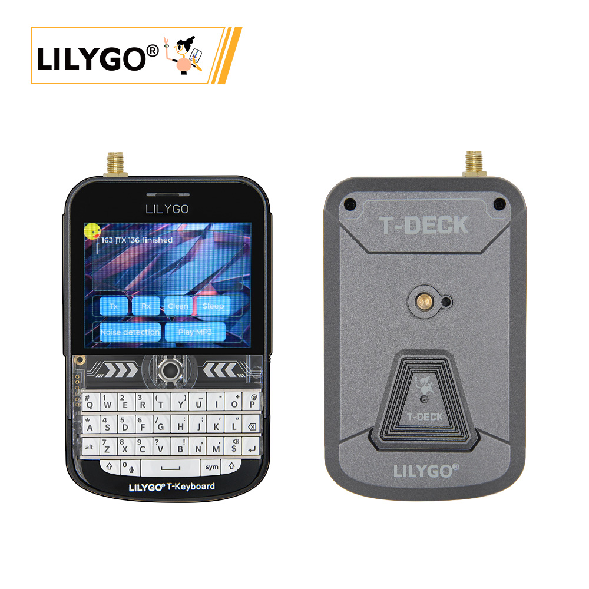
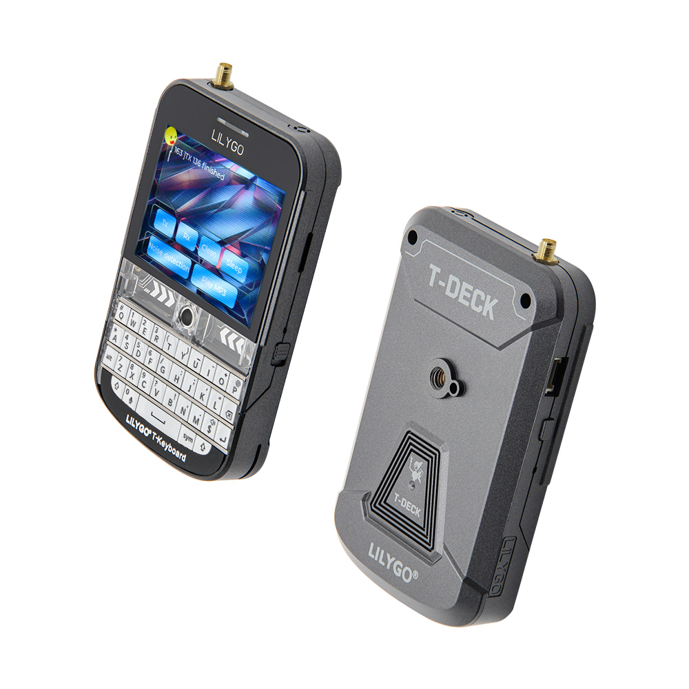
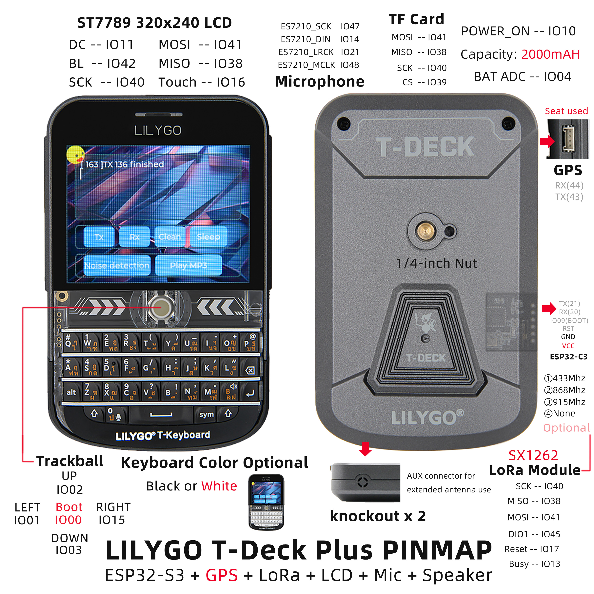

<!-- **[English](README.MD) | 中文** -->

    <a target="_blank" style="margin: 1em;color: white; font-size: 0.9em; border-radius: 0.3em; padding: 0.5em 2em; background-color:rgb(63, 201, 28)" href="https://lilygo.cc/products/t-deck-plus-1">Go Buying</a>
    <!-- <a target="_blank" style="margin: 1em;color: white; font-size: 0.9em; border-radius: 0.3em; padding: 0.5em 2em; background-color:rgb(63, 201, 28)" href="https://www.aliexpress.com/store/911876460">速卖通</a>-->

 

## Introduction

The LILYGO T-Deck Plus is a feature-rich, portable embedded development kit powered by the high-performance ESP32-S3 chip. It integrates a 320x240 resolution ST7789 LCD display, an SX1262 LoRa long-range communication module, an ES7210 audio codec, a microphone, a speaker, and TF card storage expansion.

Its hardware configuration includes optional components such as a trackball, a mechanical keyboard (available in black or white), a 1/4-inch nut mounting interface, and support for GPS positioning and 2000mAh battery power. It also features voltage detection for optimized power management.

The board connects various modules via SPI and I2C interfaces (such as LoRa, LCD, and touch control), and provides an AUX antenna extension interface. It is well-suited for IoT terminals, remote control systems, audio interaction, and outdoor mobile development scenarios.

## Appearance and function introduction
### Appearance

### Pinmap 

## Module Information and Specifications
### Description

| Component | Description |
| ---  | --- |
|MCU	|	ESP32-S3FN16R8 Dual-core LX7 microprocessor
|Flash 	|16M 
|PSRAM  |8M
|Lora|	SX1262 433Mhz~915Mhz(optional)
|GPS	|MIA-M10Q
|Wireless| 2.4 GHz Wi-Fi & Bluetooth 5 (LE)
|Storage | TF card |
|Display| ST7789 320 x 240 LCD
|Battery Capacity |	2000mAh
|Control Methods	| Trackball, Touchscreen
|Input|Keyboard
|Microphone|    MSM381A3729H9CP
|Power Switch	|Supported
|Touch Controller	|GT911
| Buttons | 1 x RST Button + 1 x BOOT Button(on trackball)  |
| USB |1 × type-C Interfaces|
|Audio Codec	|ES7210
|IO Expansion	|PCA9535PW (0x20)
| Expansion Interfaces | GPS expansion interface + 2 × Knockout (for AUX antenna connectors)|
| Mounting Holes | 2 × 2mm positioning holes |
| Dimensions | **115x72x20mm**  |	

### Related Links
Github：[T-Deck Plus](https://github.com/Xinyuan-LilyGO/T-Deck)
* [T-Deck ANT 868-915MH](https://github.com/Xinyuan-LilyGO/T-Deck/blob/master/datasheet/T-Deck%20ANT%20868-915MHZ.pdf.pdf)
* [T-Deck ANT 433MHZ](https://github.com/Xinyuan-LilyGO/T-Deck/blob/master/datasheet/T-Deck%20ANT%20433MHZ.pdf)

#### Schematic Diagram

[T-Deck Plus](https://github.com/Xinyuan-LilyGO/T-Deck/blob/master/schematic/schematic.pdf)

<!-- * [SY6970](./datasheet/AN_SY6970.pdf) -->

#### Dependency Libraries

* [AceButton](https://github.com/bxparks/AceButton)
* [Arduino_GFX](https://github.com/moononournation/Arduino_GFX)
* [ESP32-audioI2S](https://github.com/schreibfaul1/ESP32-audioI2S)
* [RadioLib](https://github.com/jgromes/RadioLib)
* [SensorsLib](https://github.com/lewisxhe/SensorsLib)
* [TFT_eSPI](https://github.com/Bodmer/TFT_eSPI)
* [TinyGPSPlus](https://github.com/mikalhart/TinyGPSPlus)
* [TouchLib](https://github.com/mmMicky/TouchLib)
* [LVGL](https://github.com/lvgl/lvgl/tree/v8.4.0)

## Software Design
### Arduino Set Parameters

|Arduino IDE Setting	|Value   
| ----------- | -----------|                         
|Board     |	ESP32S3 Dev Module
|Port      |    Your port                        
|USB CDC On Boot	|Enable
|CPU Frequency	|240MHZ(WiFi)                      
|Core Debug Level	|None                              
|USB DFU On Boot	|Disable                          
|Erase All Flash Before Sketch Upload	|Disable                          
|Events Run On	|Core1                            
|Flash Mode	|QIO 80MHZ                        
|Flash Size	|16MB(128Mb)                  
|Arduino Runs On	|Core1                            
|USB Firmware MSC On Boot	|Disable                          
|Partition Scheme	|16M Flash(3M APP/9.9MB FATFS)
|PSRAM	|OPI PSRAM                    
|Upload Mode	|UART0/Hardware CDC            
|Upload Speed	|921600                            
|USB Mode	|CDC and JTAG      

### Development Platform
1. [VS Code](https://code.visualstudio.com/)
2. [Arduino IDE](https://www.arduino.cc/en/software)
3. [Platform IO](https://platformio.org/)
4. [Micropython](https://micropython.org/)

## Product Technical Support 

