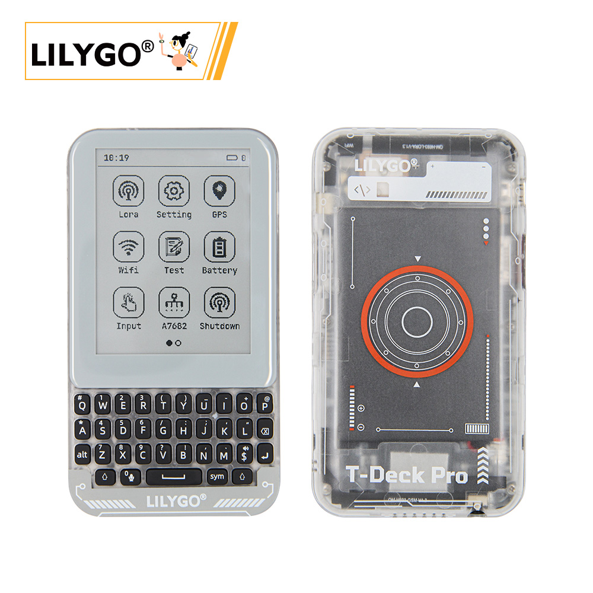
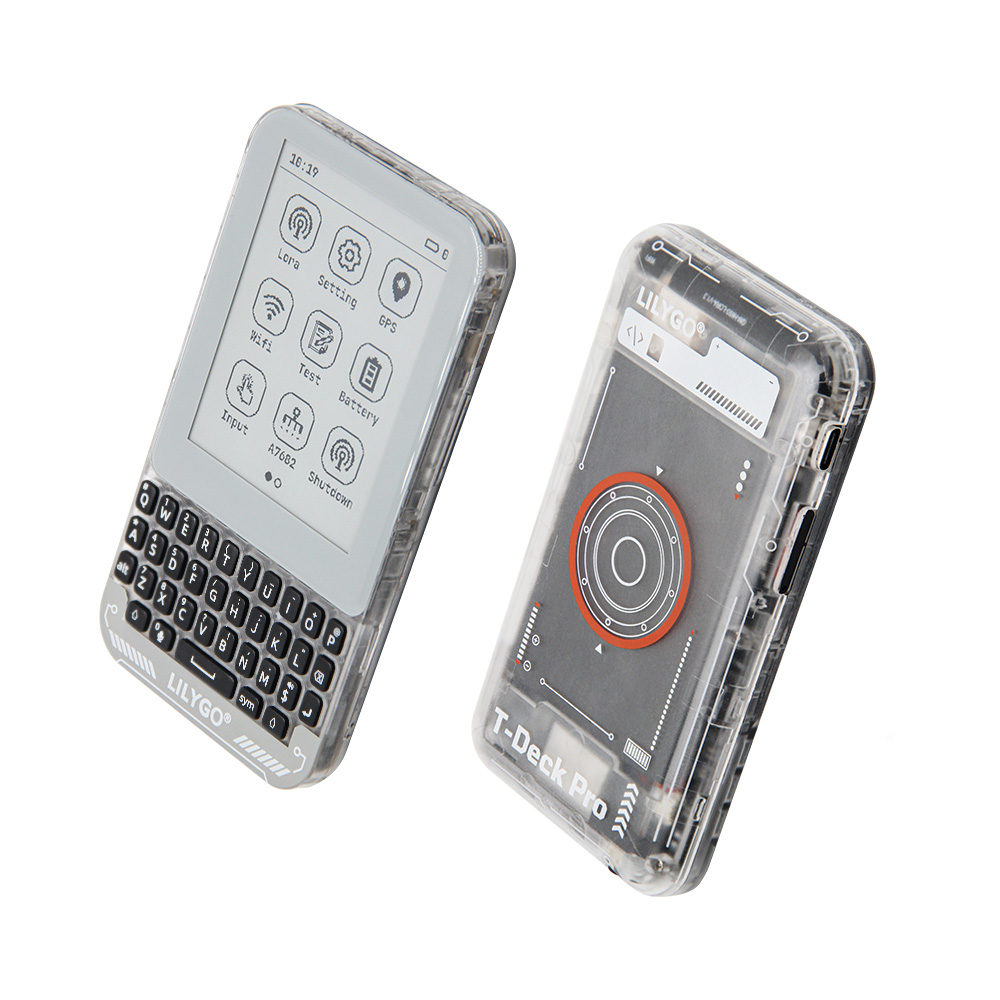

<!-- **[English](README.MD) | 中文** -->

<!-- 

    <a target="_blank" style="margin: 1em;color: white; font-size: 0.9em; border-radius: 0.3em; padding: 0.5em 2em; background-color:rgb(63, 201, 28)" href="https://item.taobao.com/item.htm?id=846226367137">淘宝</a>
    <a target="_blank" style="margin: 1em;color: white; font-size: 0.9em; border-radius: 0.3em; padding: 0.5em 2em; background-color:rgb(63, 201, 28)" href="https://www.aliexpress.com/store/911876460">速卖通</a>

 -->

## Introduction

The LILYGO T-Deck Pro is a highly integrated, multifunctional development platform based on the ESP32-S3 chip. It supports 4G communication and LoRa long-range wireless transmission, featuring an E Ink display (EPD) with touch functionality for low-power display and interaction.

Its hardware modules include GPS positioning, a gyroscope sensor, a microphone for voice input, SD card storage, a mechanical keyboard, and a self-learning AI IMU, making it suitable for IoT, outdoor devices, and smart terminals.

Designed in two versions:

Version 1 focuses on basic communication and display.

Version 2 enhances audio processing and expands storage capabilities.

This flexible configuration meets diverse needs, including industrial control, environmental monitoring, and portable devices.

## Appearance and function introduction
### Appearance

### Pinmap 

## Module Information and Specifications
### Description

| Component | Description |
| --- | --- |
| MCU | ESP32-53FN16R8 Dual-core LX7 microprocessor
| FLASH| 16MB |
| PSRAM | 	8MB|
| GPS | MIA-M10Q |
| LoRa | SX1262:433~920Mhz |
| Storage | TF card |
| 4G-Module | A7682E (Optional) |
| wireless | 2.4 GHz Wi-Fi, Bluetooth 5 (LE)
| Communication | SIM 卡|
| USB | 1 × USB Port and OTG(TYPE-C Interface) |
| Extended Interface | 1 × QWIIC Interface |
| Gyroscope | BHI260AP |
| Motor Control | IO level control|
| Audio | PCM512A (Optional)|
| IO Interface | 2.54mm pitch × 2*20 (dual-row) expansion IO interface |
| Buttons | 1 x RESET Buttons + 1 x BOOT Buttons |
| Display | GDEQ031T10 3.1 inch  E-Ink screen 320x240|
| Touch | CST328  |
| Battery Capacity | 3.7V-1500mAh |
| Battery Management Chip | BQ25896/BQ27220  |
| Keyboard | TCA8418 |
| Light Sensor | LTR_553ALS|
| Power  | 5V/500mA |
| Holes | **2mm location hole *2** |
| Dimensions | **120x66x13.5mm**  |
### Related Links

Github:[T-Deck Pro](https://github.com/Xinyuan-LilyGO/T-Deck-Pro)

- [MAX98357A](https://github.com/Xinyuan-LilyGO/T3-S3-MVSRBoard/blob/main/information/MAX98357AETE+T.pdf)
- [MSM261S4030H0R](https://github.com/Xinyuan-LilyGO/T3-S3-MVSRBoard/blob/main/information/MEMSensing-MSM261S4030H0R.pdf)
- [PCF85063ATL](https://github.com/Xinyuan-LilyGO/T3-S3-MVSRBoard/blob/main/information/PCF85063ATL-1,118.pdf)
- [MP34DT05-A](https://github.com/Xinyuan-LilyGO/T3-S3-MVSRBoard/blob/main/information/mp34dt05-a.pdf)

#### Schematic Diagram

[T-Deck Pro](https://github.com/Xinyuan-LilyGO/T-Deck-Pro/blob/master/hardware/T-Deckpro%2024-05-16/T-DeckPro%20V1.0%2024-05-16.pdf)

#### Dependency Libraries

* [lvgl 8.3.9](https://github.com/lvgl/lvgl)
* [GxEPD2](https://github.com/ZinggJM/GxEPD2)
* [RadioLib](https://github.com/jgromes/RadioLib)
* [TinyGSM](https://github.com/vshymanskyy/TinyGSM)
* [Adafruit_TCA8418](https://github.com/adafruit/Adafruit_TCA8418)
* [XPowersLib](https://github.com/lewisxhe/XPowersLib)
* [SensorLib](https://github.com/lewisxhe/SensorLib)
* [Adafruit_BusIO](https://github.com/adafruit/Adafruit_BusIO)
* [TinyGPSPlus](https://github.com/mikalhart/TinyGPSPlus)
* [U8g2_for_Adafruit_GFX](https://github.com/olikraus/U8g2_for_Adafruit_GFX)
* [ESP32-audioI2S](https://github.com/esphome/ESP32-audioI2S)

## Software Design
### Arduino Set Parameters

| Setting                               | Value                                 |
| ------------------------------- | ------------------------------- |
| Board                                 | ESP32S3 Dev Module           |
| Upload Speed                     | 921600                               |
| USB Mode                           | Hardware CDC and JTAG     |
| USB CDC On Boot                | Enabled                              |
| USB Firmware MSC On Boot | Disabled                             |
| USB DFU On Boot                | Disabled                             |
| CPU Frequency                   | 240MHz (WiFi)                    |
| Flash Mode                         | QIO 80MHz                         |
| Flash Size                           | 16MB (128Mb)                    |
| Core Debug Level                | None                                 |
| Partition Scheme                | 16M Flash (3MB APP/9.9MB FATFS) |
| PSRAM                                | OPI PSRAM                         |
| Arduino Runs On                  | Core 1                               |
| Events Run On                     | Core 1                               |           

### Development Platform
1. [C](https://github.com/Xk-w/Arduino_DriveBus)
2. [Arduino IDE](https://www.arduino.cc/en/software)
3. [Platform IO](https://github.com/Xk-w/Arduino_DriveBus)

## Product Technical Support

