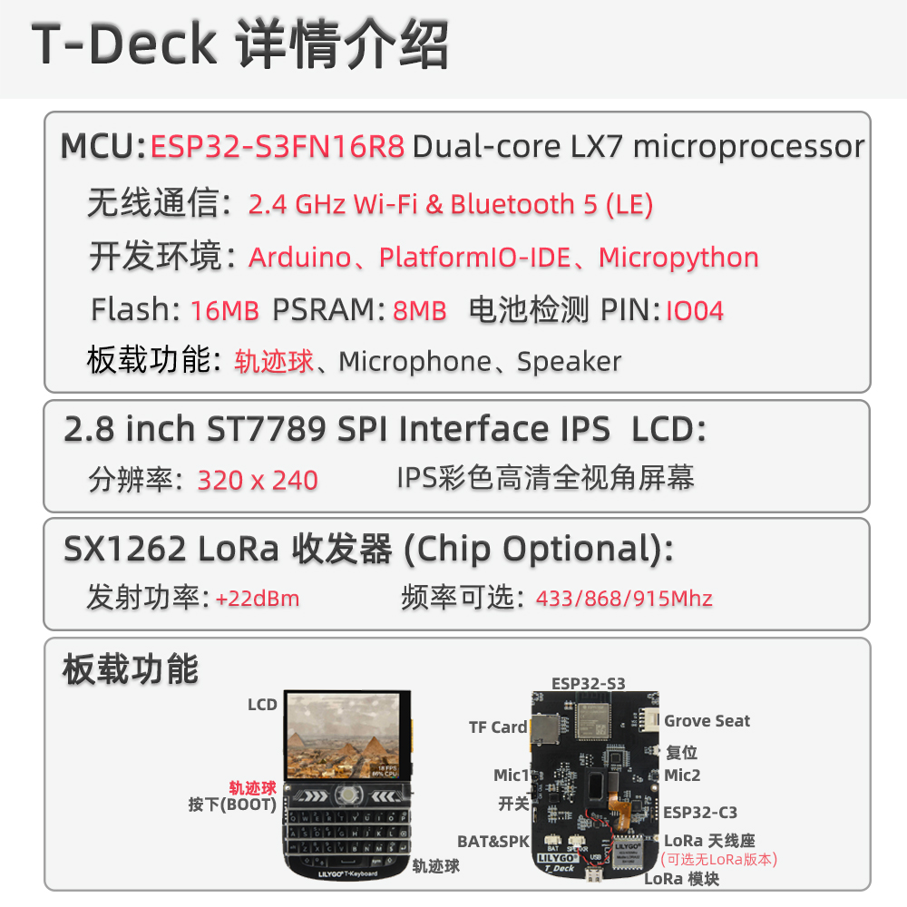

<!-- **[English](README.MD) | 中文** -->

    <a target="_blank" style="margin: 1em;color: white; font-size: 0.9em; border-radius: 0.3em; padding: 0.5em 2em; background-color:rgb(63, 201, 28)" href="https://lilygo.cc/products/https://lilygo.cc/products/t-deck">Go Buying</a>
    <!-- <a target="_blank" style="margin: 1em;color: white; font-size: 0.9em; border-radius: 0.3em; padding: 0.5em 2em; background-color:rgb(63, 201, 28)" href="https://www.aliexpress.com/store/911876460">速卖通</a>-->

 

## Introduction

The LILYGO T-Deck is a highly integrated, multifunctional embedded development platform based on the ESP32-53 main controller. It features a 2.4-inch ST7789 display with a 320x240 resolution, a trackball navigation module (including directional keys and a BOOT button), a physical keyboard interface via I²C communication, TF card storage expansion, a LoRa wireless communication module (supporting SCK/MISO/MOSI and control pins), and an ES7210 microphone array for audio input.

The pin layout is designed to support display control (DC/BL/SPI), touch input, sensor interaction (SDA/SCL/INT), power management (BAT ADC), and modular expansion (SPI/I²C/UART). This makes it ideal for rapid development of IoT terminals, portable interactive devices, or low-power wireless communication projects.

## Appearance and function introduction
### Appearance

### Pinmap 

## Module Information and Specifications
### Description

> The T-Deck version has no touchscreen and uses a trackball navigation module instead.

| Component | Description |
| ---  | --- |
|MCU	|ESP32-S3FN16R8 Dual-core LX7 microprocessor
|Flash 	|16M
|PSRAM  |8M
|Lora| SX1262 433Mhz - 915Mhz(Optional)
|GPS	|MIA-M10Q
| Wireless | 2.4GHz Wi-Fi & Bluetooth 5 (LE)
| Storage | TF Card |
| Screen | 2.8-inch ST7789 320 x 240 LCD screen
| Battery capacity | 2000mAh
| Control Mode | Trackball touch screen
| Input | Keyboard
Microphone | MSM381A3729H9CP
| Switch | Supports power switch
| Keys | 1 x RST key + 1 x BOOT key (trackball) |
| Audio |ES7210
| USB |1 × type-C interface |
|IO extension | 2mm interval 6-pin extension interface
| Extended Interface | GPS extended interface + 2 × JST GH 1.25mm + 1 x 4pin extended interface |
| Hole position | 2mm positioning hole |
| Size | **10x6.8x1.1 cm** |

### Related Links
Github：[T-Deck](https://github.com/Xinyuan-LilyGO/T-Deck)
* [T-Deck ANT 868-915MH](https://github.com/Xinyuan-LilyGO/T-Deck/blob/master/datasheet/T-Deck%20ANT%20868-915MHZ.pdf.pdf)
* [T-Deck ANT 433MHZ](https://github.com/Xinyuan-LilyGO/T-Deck/blob/master/datasheet/T-Deck%20ANT%20433MHZ.pdf)

#### Schematic Diagram

[T-Deck](https://github.com/Xinyuan-LilyGO/T-Deck/blob/master/schematic/schematic.pdf)

<!-- * [SY6970](./datasheet/AN_SY6970.pdf) -->

#### Dependency Libraries

* [AceButton](https://github.com/bxparks/AceButton)
* [Arduino_GFX](https://github.com/moononournation/Arduino_GFX)
* [ESP32-audioI2S](https://github.com/schreibfaul1/ESP32-audioI2S)
* [RadioLib](https://github.com/jgromes/RadioLib)
* [SensorsLib](https://github.com/lewisxhe/SensorsLib)
* [TFT_eSPI](https://github.com/Bodmer/TFT_eSPI)
* [TinyGPSPlus](https://github.com/mikalhart/TinyGPSPlus)
* [TouchLib](https://github.com/mmMicky/TouchLib)
* [LVGL](https://github.com/lvgl/lvgl/tree/v8.4.0)

## Software Design
### Arduino Set Parameters

|Arduino IDE Setting	|Value   
| ----------- | -----------|                         
|Board     |	ESP32S3 Dev Module
|Port      |    Your port                        
|USB CDC On Boot	|Enable
|CPU Frequency	|240MHZ(WiFi)                      
|Core Debug Level	|None                              
|USB DFU On Boot	|Disable                          
|Erase All Flash Before Sketch Upload	|Disable                          
|Events Run On	|Core1                            
|Flash Mode	|QIO 80MHZ                        
|Flash Size	|16MB(128Mb)                  
|Arduino Runs On	|Core1                            
|USB Firmware MSC On Boot	|Disable                          
|Partition Scheme	|16M Flash(3M APP/9.9MB FATFS)
|PSRAM	|OPI PSRAM                    
|Upload Mode	|UART0/Hardware CDC            
|Upload Speed	|921600                            
|USB Mode	|CDC and JTAG      

### Development Platform
1. [VS Code](https://code.visualstudio.com/)
2. [Arduino IDE](https://www.arduino.cc/en/software)
3. [Platform IO](https://platformio.org/)
4. [Micropython](https://micropython.org/)

## Product Technical Support 

