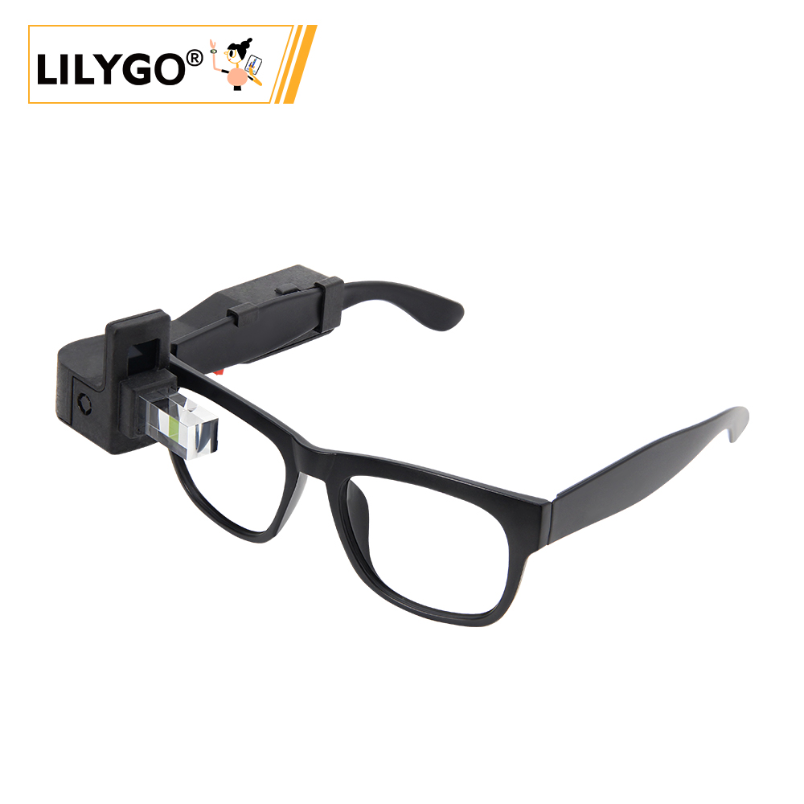
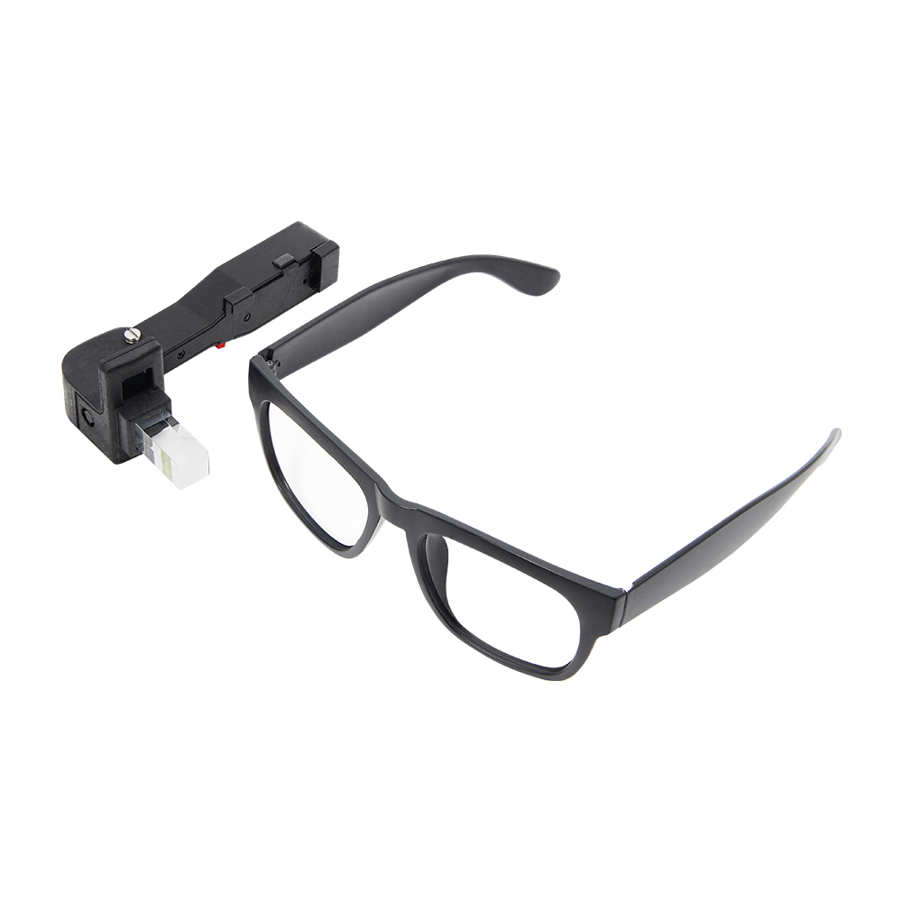
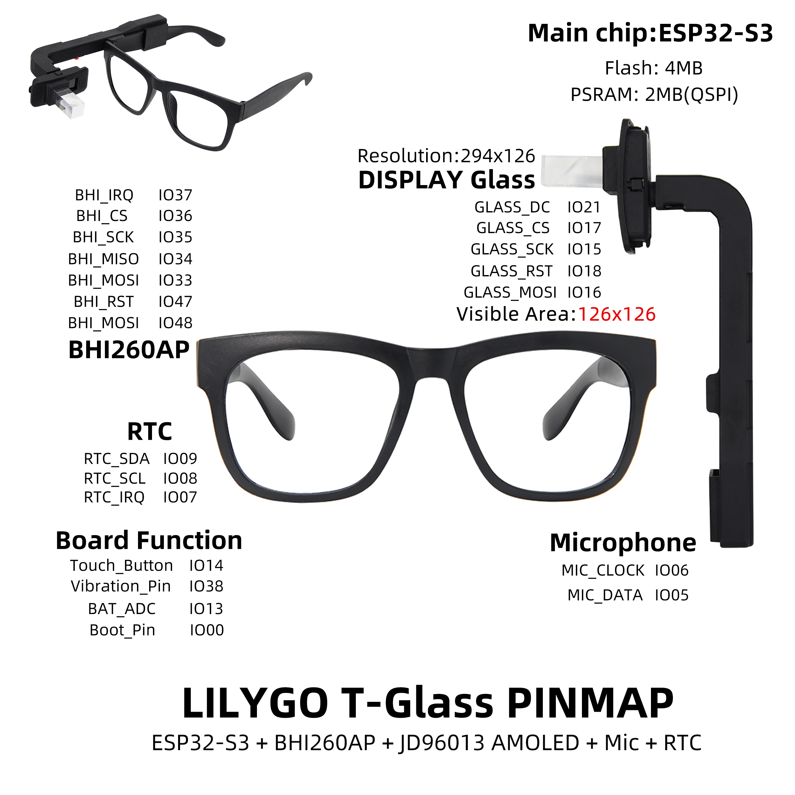
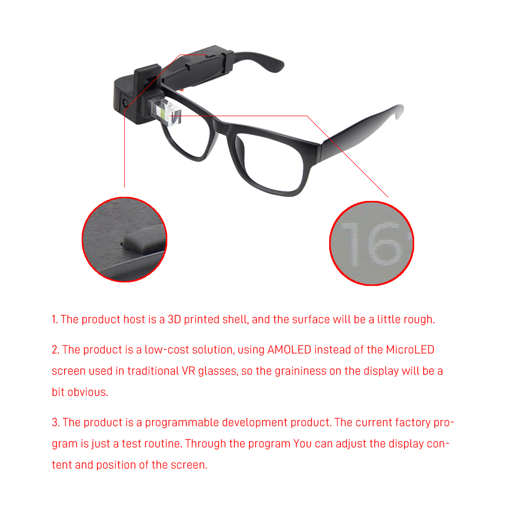
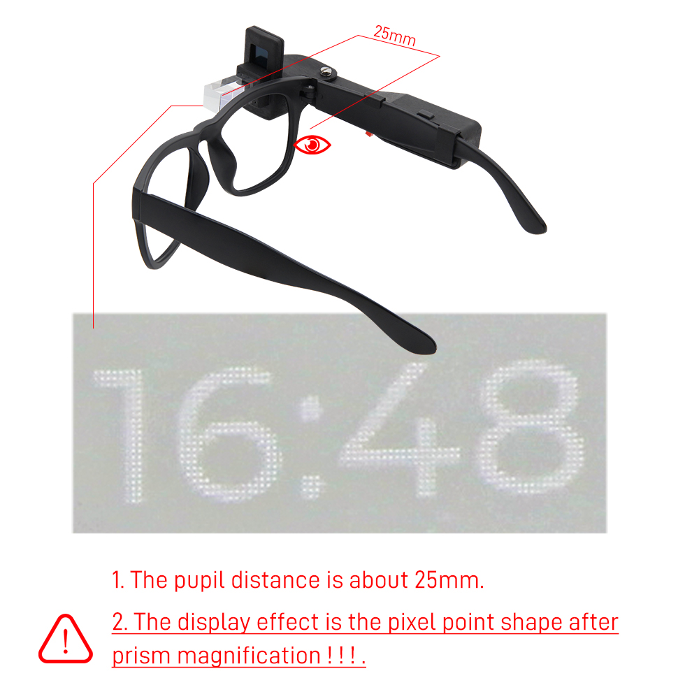

<!-- **[English](README.MD) | 中文** -->

    <a target="_blank" style="margin: 1em;color: white; font-size: 0.9em; border-radius: 0.3em; padding: 0.5em 2em; background-color:rgb(63, 201, 28)" href="https://lilygo.cc/products/t-glass">Go Buying</a>
    <!-- <a target="_blank" style="margin: 1em;color: white; font-size: 0.9em; border-radius: 0.3em; padding: 0.5em 2em; background-color:rgb(63, 201, 28)" href="https://www.aliexpress.com/store/911876460">速卖通</a> -->

## Introduction

LILYGO T-Glass is a smart wearable device powered by the ESP32-S3 main controller. It integrates a BHI260AP motion sensor and a JD96013A AMOLED display, offering a 126×126 pixel visible area with touch interaction and high-contrast visual performance.

The device features 4MB Flash and 2MB OSPI PSRAM, providing smooth operation and reliable data storage. Its rich set of functional modules includes a real-time clock (RTC), microphone (supporting MIC_CLOCK/MIC_DATA audio input), vibration feedback (Vibration_Pin), battery level monitoring (BAT_ADC), and a touch button (Touch_Button), making it ideal for fitness tracking, smart notifications, and other interactive applications.

With the LILYGOT-Glass PINMAP interface layout, the board integrates communication protocols such as SPI and I²C, optimizing the hardware arrangement for compact form factors. It is well-suited for lightweight designs like smart glasses or portable wearable devices, combining low power consumption with high performance.

## Appearance and function introduction
### Appearance

### Pinmap 

## Module Information and Specifications
### Description

>!There are two versions of T-Glass: the initial preview version and the updated T-Glass V2 (which uses an improved prism reflection method). The only difference between them lies in the display method—the hardware remains identical.

>!T-Wristband and T-Glass share the same hardware, but due to differences in the enclosure design, the viewing area differs.

>!LilyGO T-Wristband and T-Glass rely on LVGL v8.4.x. Currently, LVGL v9.0 has been released. If you encounter compilation errors, please ensure that your LVGL version is v8.4.x.

>!The visual display size of T-Wristband and T-Glass differs from the actual screen size. All examples are built upon the LVGL graphics framework. Other graphics libraries such as TFT_eSPI are not supported for these devices.

| Component | Description |
| --- | --- |
| MCU | ESP32-S3 FN4R2 |
| PSRAM | 2MB |
| FLASH | 4MB |
| Screen | 1.1-inch full-color LTPS AMOLED JD9613 (294*126) |
| Touch | Side touch button |
| AI Intelligent Sensor | BHI260AP
| Switch | Side power switch |
| Battery | Lithium battery |
| Microphone | Supports MIC_CLOCK/MIC_DATA audio input |
| Wireless | 2.4GHz Wi-Fi & Bluetooth 5 (LE)
| USB | 1 × USB Port and OTG(TYPE-C interface) |
| Extended Interface | 2 × QWIIC 4-pin interface |
| Keys | 1 x RESET key + 1 x BOOT key |
| Dimensions | **140 x 67 x 111mm** |

### Related Links

Github：[T-Glass](https://github.com/Xinyuan-LilyGO/LilyGO-T-Wristband-and-T-Glass)

- [JD9613 Driver](https://github.com/Xinyuan-LilyGO/LilyGO-T-Wristband-and-T-Glass/blob/master/datasheet/JD9613_DS_Preliminary_V0.02_20210325.pdf)
- [ESP32S3-FN4R2](https://www.espressif.com.cn/en/support/documents/technical-documents?keys=&field_type_tid%5B%5D=842)
- [BHI260AP](https://www.bosch-sensortec.com/products/smart-sensor-systems/bhi260ap/)
- [PCF85063A](https://www.nxp.com/products/analog-and-mixed-signal/real-time-clocks/rtcs-with-ic-bus/tiny-real-time-clock-calendar-with-alarm-function-and-ic-bus:PCF85063A)

#### Schematic Diagram

* [T-Glass](https://github.com/Xinyuan-LilyGO/LilyGO-T-Wristband-and-T-Glass/blob/master/schematic/LilyGO-T-Wristband-and-T-Glass.pdf)

#### Dependency Libraries

- [SensorLib 0.1.8](https://github.com/lewisxhe/SensorsLib)
- [lvgl 8.4.0](https://github.com/lvgl/lvgl/tree/release/v8.4)
- [MadgwickAHRS](https://github.com/arduino-libraries/MadgwickAHRS)

## Software Design
### Arduino Set Parameters

| Arduino IDE Setting                  | Value                                          |
|--------------------------------------|------------------------------------------------|
| Board                                | ESP32S3 Dev Module                             |
| Port                                 | Your port                                      |
| USB CDC On Boot                      | Enable                                         |
| CPU Frequency                        | 240MHZ(WiFi)                                   |
| Core Debug Level                     | None                                           |
| USB DFU On Boot                      | Disable                                        |
| Erase All Flash Before Sketch Upload | Disable                                        |
| Events Run On                        | Core1                                          |
| Flash Mode                           | QIO 80MHZ                                      |
| Flash Size                           | 4MB(32Mb)                                      |
| Arduino Runs On                      | Core1                                          |
| USB Firmware MSC On Boot             | Disable                                        |
| Partition Scheme                     | Default 4M with spiffs(1.2M APP/1.5MB SPIFFS)  |
| PSRAM                                | QSPI PSRAM                                     |
| Upload Mode                          | UART0/Hardware CDC                             |
| Upload Speed                         | 921600                                         |
| USB Mode                             | CDC and JTAG                                   |

### Development Platform
1. [Micropython](https://micropython.org/)
2. [Arduino IDE](https://www.arduino.cc/en/software)
3. [Platform IO](https://platformio.org/)

## Product Technical Support 

