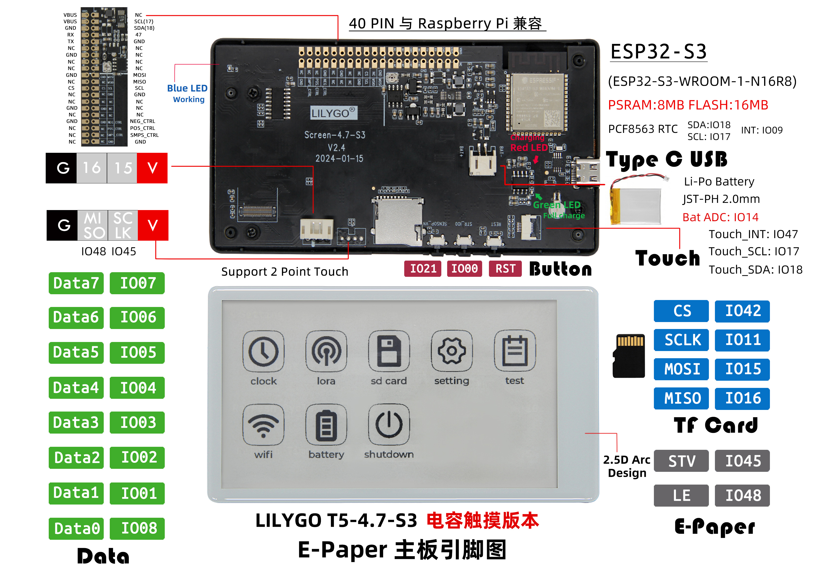

<!-- **[English](README.MD) | 中文** -->

    <a target="_blank" style="margin: 1em;color: white; font-size: 0.9em; border-radius: 0.3em; padding: 0.5em 2em; background-color:rgb(63, 201, 28)" href="https://lilygo.cc/products/t5-4-7-inch-e-paper-v2-3">Go Buying</a>
    <!-- <a target="_blank" style="margin: 1em;color: white; font-size: 0.9em; border-radius: 0.3em; padding: 0.5em 2em; background-color:rgb(63, 201, 28)" href="https://www.aliexpress.com/store/911876460">速卖通</a>-->

## Introduction

The LILYGO T5-4.7-S3 Capacitive Touch Screen Development Board is an e-paper (E-Ink) solution based on the ESP32-S3-WROOM-1-N16R8 chip, which integrates 8MB of PSRAM and 16MB of Flash. This product features a 4.7-inch capacitive touch screen (supporting two-point touch), a PCF8563 real-time clock (RTC) chip, a USB Type-C interface, and a Li-Po battery connector (JST-PH 2.0mm), supporting battery voltage monitoring (Bat ADC).

It offers a 40-PIN GPIO expansion interface compatible with Raspberry Pi, includes an onboard TF card slot, and features dedicated screen control signals (STV/LE) and an SPI interface (CS/SCLK/MOSI/MISO). The board is designed with a 2.5D curved edge and is tailored for low-power e-paper applications with touch interaction, such as information displays, smart home terminals, and portable devices.

## Appearance and function introduction
### Appearance

### Pinmap 

## Module Information and Specifications
### Description

| Component | Description |
| ---  | --- |
|MCU	|ESP32-S3-WROOM-1-N16R8
|Flash 	|16M
|PSRAM  |8M
| Wireless | 2.4GHz Wi-Fi& BLE 5
| Storage | TF Card |
| Screen | EDO47TC1 4.7-inch low-power E-ink screen (540 x 960)
| Touch |GT911
| Clock |PCF8563
| Keys | 1 x RST key + 1 x SIR_io0 key + 1 × io21 key |
|IO Extension | 2 x 20-pin extension interface (Compatible with Raspberry PI)
| Expansion Interface | 1 x JST-PH 2.0mm battery interface + 2 x 4pin Molex connectors |
| Hole position | 6 x 3.8mm positioning hole |
| Dimensions | 121x67x12mm |

### Related Links
Github：[T5 E-paper](https://github.com/Xinyuan-LilyGO/LilyGo-EPD47/tree/esp32s3)

* [ED047TC1](https://github.com/Xinyuan-LilyGO/LilyGo-EPD47/blob/esp32s3/datasheet/ED047TC1.pdf)

#### Schematic Diagram

[T5 E-paper](https://github.com/Xinyuan-LilyGO/LilyGo-EPD47/blob/esp32s3/schematic/T5-ePaper-S3-V2.4.pdf)

<!-- * [SY6970](./datasheet/AN_SY6970.pdf) -->

#### Dependency Libraries

* [Button2](https://github.com/LennartHennigs/Button2)
* [SensorLib@0.19](https://github.com/lewisxhe/SensorsLib)         

## Software Design
### Arduino Set Parameters

| Arduino IDE Setting                     | Value                             |
|--------------------------------------|--------------------------------|
| Board                                | ESP32S3 Dev Module             |
| Port                                 | Your port                      |
| USB CDC On Boot                      | Enable                         |
| CPU Frequency                        | 240MHZ(WiFi)                   |
| Core Debug Level                     | None                           |
| USB DFU On Boot                      | Disable                        |
| Erase All Flash Before Sketch Upload | Disable                        |
| Events Run On                        | Core1                          |
| Flash Mode                           | QIO 80MHZ                      |
| Flash Size                           | 16MB(128Mb)                    |
| Arduino Runs On                      | Core1                          |
| USB Firmware MSC On Boot             | Disable                        |
| Partition Scheme                     | 16M Flash(3M APP/9.9MB FATFS)  |
| PSRAM                                | OPI PSRAM                      |
| Upload Mode                          | UART0/Hardware CDC             |
| Upload Speed                         | 921600                         |
| USB Mode                             | CDC and JTAG                   |
| Programmer                           | Esptool                        |

### Development Platform

1. [ESP-IDF](https://www.espressif.com/zh-hans/products/sdks/esp-idf)
2. [Arduino IDE](https://www.arduino.cc/en/software)
3. [VS Code](https://code.visualstudio.com/)
4. [Micropython](https://micropython.org/)

## Product Technical Support 

