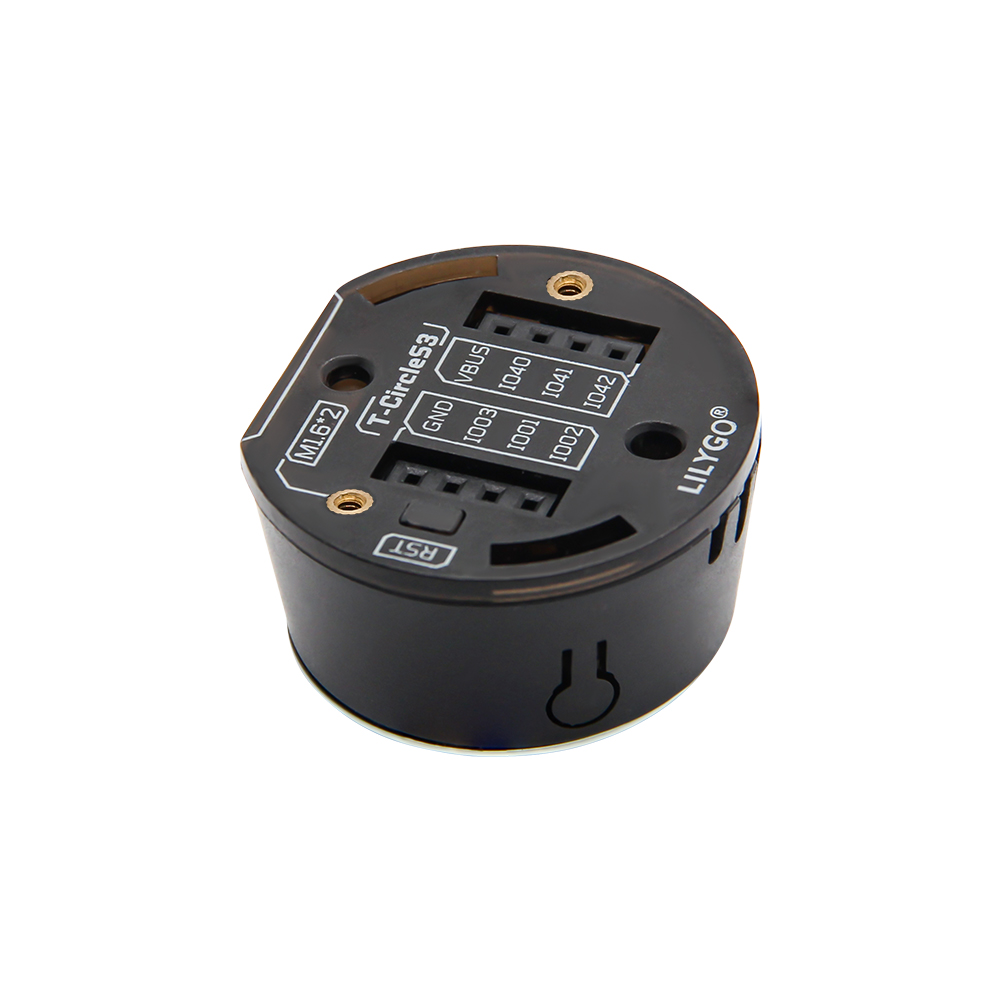
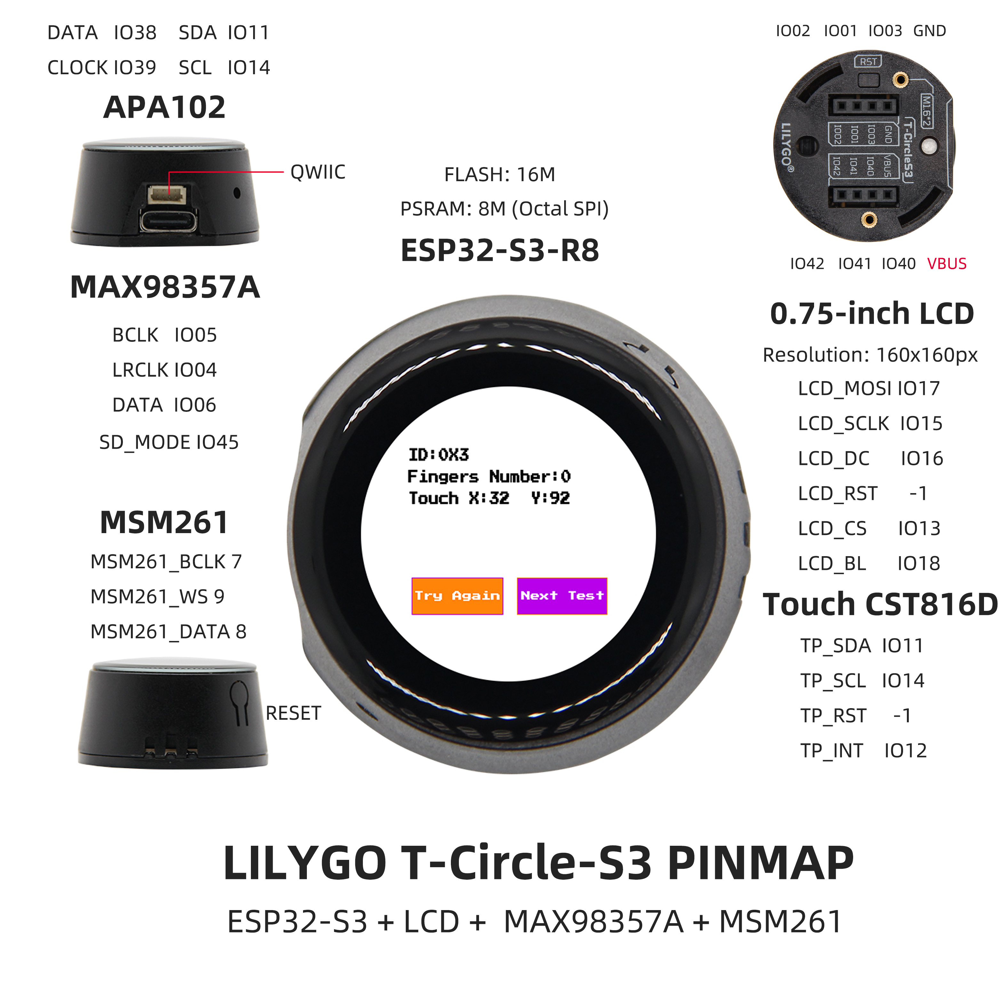
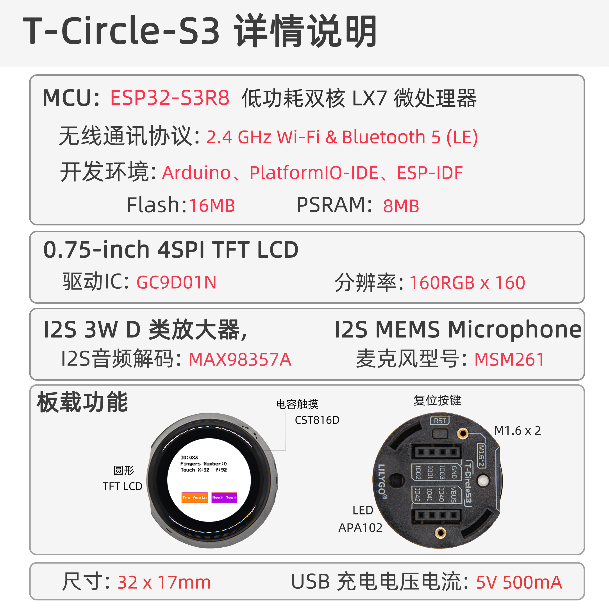

<!-- **[English](README.MD) | 中文** -->

    <a target="_blank" style="margin: 1em;color: white; font-size: 0.9em; border-radius: 0.3em; padding: 0.5em 2em; background-color:rgb(103, 175, 8)" href="https://lilygo.cc/products/t-circle-s3">官网购买</a>
    <!-- <a target="_blank" style="margin: 1em;color: white; font-size: 0.9em; border-radius: 0.3em; padding: 0.5em 2em; background-color:rgb(63, 201, 28)" href="https://www.aliexpress.com/store/911876460">速卖通</a> -->

> 注意：T-Circle S3 为 ESP32-S3 版本 ,点这里切换到ESP32版本[T-Circle](https://wiki.lilygo.cc/get_started/zh/LCD_OLED/T-Circle/T-Circle.html)版本

## 简介

LILYGO T-Circle S3 是一款基于ESP32-S3无线微控制器的多功能开发板，集成0.75英寸圆形LCD触摸屏（160x160像素）、MAX98357A数字音频放大器、MSM261音频采集模块（推测为麦克风）、APA102 LED控制接口及QWIIC扩展接口。其核心配置包括16MB闪存、8MB Octal SPI PSRAM，支持Wi-Fi/蓝牙通信，并搭载电容式触摸屏控制器CST816D实现交互操作。通过精密引脚映射（如LCD_MOSI、TP_SDA等），整合了图形显示、音频输入输出、触控交互与高速存储功能，适用于物联网终端、智能穿戴设备或嵌入式音频可视化项目的原型开发。

## 外观及功能介绍
### 外观

### 引脚图 

## 模块资料
### 概述

T-Circle-S3是一款基于ESP32S3开发的板载0.75寸小屏的开发板，配备有扬声器麦克风和三色LED灯，背部有六个可编程输入输出IO口可扩展多种外设。

| 组件 | 描述 |
| --- | --- |
| MCU | ESP32-S3-R8
| FLASH| 16M |
| PSRAM | 8M (Octal SPI)|
| 触摸 | CST816D|
| 屏幕 | SPI GC9D01N驱动 0.75英寸LCD圆屏幕(160x160px) |
| 扬声器 | IIS驱动 MAX98357A |
| 麦克风 | PDM驱动 MP34DT05-A |
| LED | APA102 |
| 无线 |2.4Ghz Wi-Fi + Bluetooth 5.0
| USB | 1 × USB Port and OTG(TYPE-C接口) |
| IO 接口 | 2 × 4 pin拓展IO接口 |
| 按键 | 1 x RESET 按键 + 1 x BOOT 按键|
| 电源 | 5V/500mA |
| 孔位 | **2 × M1.6*2** |
| 尺寸 | **32*17mm**  |

### 相关资料链接

Github:[T-Circle-S3](https://github.com/Xinyuan-LilyGO/T-Circle-S3/tree/arduino-esp32-libs_V2.0.14)

- [GC9D01N](https://github.com/Xinyuan-LilyGO/T-Circle-S3/blob/arduino-esp32-libs_V2.0.14/information/GC9D01N.pdf)
- [TFT_eSPI-2.5.43](https://github.com/Bodmer/TFT_eSPI)
- [MAX98357A](https://github.com/Xinyuan-LilyGO/T-Circle-S3/blob/arduino-esp32-libs_V2.0.14/information/MAX98357AETE+T.pdf)
- [MSM261S4030H0R](https://github.com/Xinyuan-LilyGO/T-Circle-S3/blob/arduino-esp32-libs_V2.0.14/information/MSM261S4030H0R.pdf))
- [MP34DT05-A](https://github.com/Xinyuan-LilyGO/T-Circle-S3/blob/arduino-esp32-libs_V2.0.14/information/mp34dt05-a.pdf)

#### 原理图

[T-Circle-S3](https://github.com/Xinyuan-LilyGO/T-Circle-S3/blob/arduino-esp32-libs_V2.0.14/project/T-Circle-S3_V1.0.pdf)

#### 依赖库

- [Arduino_DriveBus-1.1.16](https://github.com/Xk-w/Arduino_DriveBus)
- [Arduino_GFX-1.3.7](https://github.com/moononournation/Arduino_GFX)
- [ESP32-audioI2S-3.0.6](https://github.com/schreibfaul1/ESP32-audioI2S)
- [DFRobot_MSM261](https://github.com/DFRobot/DFrobot_MSM261)
- [FastLED-3.6.0](https://github.com/FastLED/FastLED)

## 软件开发
### Arduino 设置参数

| Setting                  | Value                            |
|--------------------------|----------------------------------|
| Board                    | ESP32S3 Dev Module               |
| Upload Speed             | 921600                           |
| USB Mode                 | Hardware CDC and JTAG            |
| USB CDC On Boot          | Enabled                          |
| USB Firmware MSC On Boot | Disabled                         |
| USB DFU On Boot          | Disabled                         |
| CPU Frequency            | 240MHz (WiFi)                    |
| Flash Mode               | QIO 80MHz                        |
| Flash Size               | 16MB (128Mb)                     |
| Core Debug Level         | None                             |
| Partition Scheme         | 16M Flash (3MB APP/9.9MB FATFS)  |
| PSRAM                    | OPI PSRAM                        |
| Arduino Runs On          | Core 1                           |
| Events Run On            | Core 1                           |

### 开发平台

1. [VS Code](https://code.visualstudio.com/)
2. [Arduino IDE](https://www.arduino.cc/en/software)
3. [Platform IO](https://platformio.org/)

## 产品技术支持 

