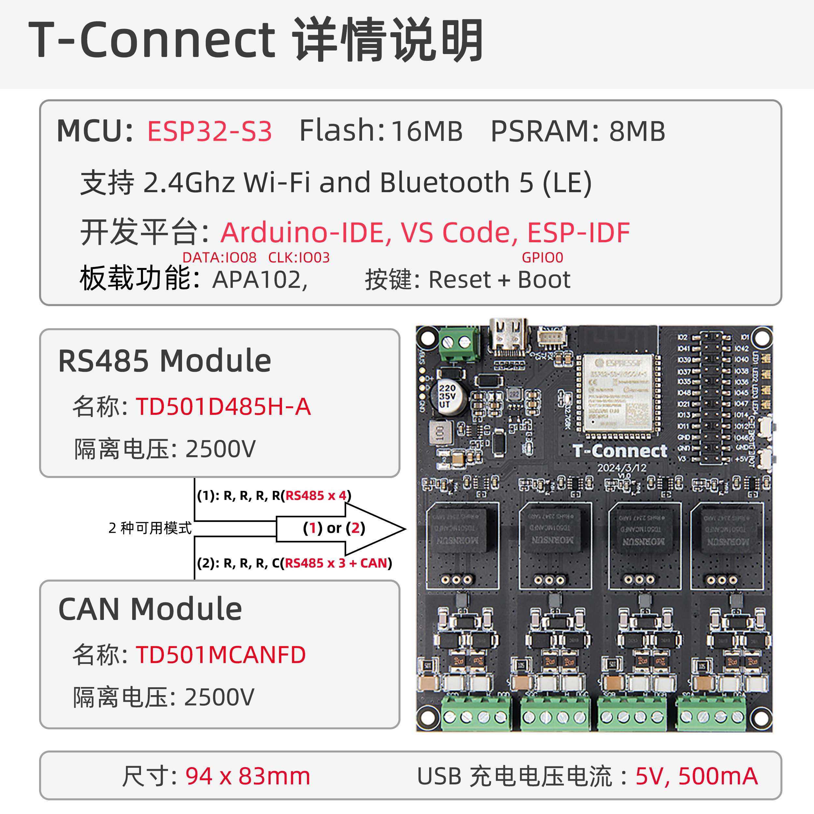

<!-- **[English](README.MD) | 中文** -->

    <a target="_blank" style="margin: 1em;color: white; font-size: 0.9em; border-radius: 0.3em; padding: 0.5em 2em; background-color:rgb(103, 175, 8)" href="https://lilygo.cc/products/t-connect">官网购买</a>
    <!-- <a target="_blank" style="margin: 1em;color: white; font-size: 0.9em; border-radius: 0.3em; padding: 0.5em 2em; background-color:rgb(63, 201, 28)" href="https://www.aliexpress.com/store/911876460">速卖通</a> -->

## 简介

T-Connect 是一款基于 ESP32-S3 芯片的多功能开发板，搭载 8MB PSRAM 和 16MB Flash，支持 Wi-Fi/蓝牙双模通信 及 RS485/CAN 工业协议，内置 APA102 LED 驱动 可直接控制 RGB 灯带。其丰富的 UART 接口和复用引脚（如 SGD/SGC 系列）适配物联网设备、工业自动化、智能照明等场景，兼具高集成度与扩展灵活性，适用于复杂环境下的稳定通信与多样化控制需求。

## 外观及功能介绍
### 外观

### 引脚图 

## 模块资料
### 概述

T-Connect是一款拥有4组不同模块输出数据的板子，支持CAN和RS485两种不同模块相互切换，最大支持三组RS485和一组CAN总线输出不同数据。

| 组件 | 描述 |
| --- | --- |
| MCU | ESP32-S3-R8
| FLASH| 16MB |
| PSRAM | 8MB (Octal SPI)|
| RS485 | UART通信|
| CAN | TWAI通信 |
| Led | APA102|
| 继电器 | 输出10A|
| USB | 1 × USB Port and OTG(TYPE-C接口) |
| 输出 | 最大支持三组RS485 一组CAN总线输出
| 拓展接口 | 1 × QWIIC接口  |
| 按键 | 1 x RESET 按键 + 1 x BOOT 按键 |
| 电源 | 5V/500mA USB接口供电 7V~12V DC电源输入|
| 孔位 | **2mm定位孔 × 4** |
| 尺寸 | **94x83x13mm**  |
### 相关资料链接

Github:[T-Connect](https://github.com/Xinyuan-LilyGO/T-Connect)

- [TD501MCANFD](https://github.com/Xinyuan-LilyGO/T-Connect-Pro/blob/main/information/TD501MCANFD_MORNSUN.pdf)
- [TD501D485H-A](https://github.com/Xinyuan-LilyGO/T-Connect-Pro/blob/main/information/TD501D485H-A_K-CUT.pdf)

#### 原理图
[T-Connect](https://github.com/Xinyuan-LilyGO/T-Connect/blob/main/project/T-Connect_V1.0.pdf)

#### 依赖库
- [FastLED](https://github.com/FastLED/FastLED)

## 软件开发
### Arduino 设置参数

| Setting                  | Value                            |
|--------------------------|----------------------------------|
| Board                    | ESP32S3 Dev Module               |
| Upload Speed             | 921600                           |
| USB Mode                 | Hardware CDC and JTAG            |
| USB CDC On Boot          | Enabled                          |
| USB Firmware MSC On Boot | Disabled                         |
| USB DFU On Boot          | Disabled                         |
| CPU Frequency            | 240MHz (WiFi)                    |
| Flash Mode               | QIO 80MHz                        |
| Flash Size               | 16MB (128Mb)                     |
| Core Debug Level         | None                             |
| Partition Scheme         | 16M Flash (3MB APP/9.9MB FATFS)  |
| PSRAM                    | OPI PSRAM                        |
| Arduino Runs On          | Core 1                           |
| Events Run On            | Core 1                           |

### 开发平台
1. [VS Code](https://code.visualstudio.com/)
2. [Arduino IDE](https://www.arduino.cc/en/software)
3. [Platform IO](https://platformio.org/)

## 产品技术支持 

