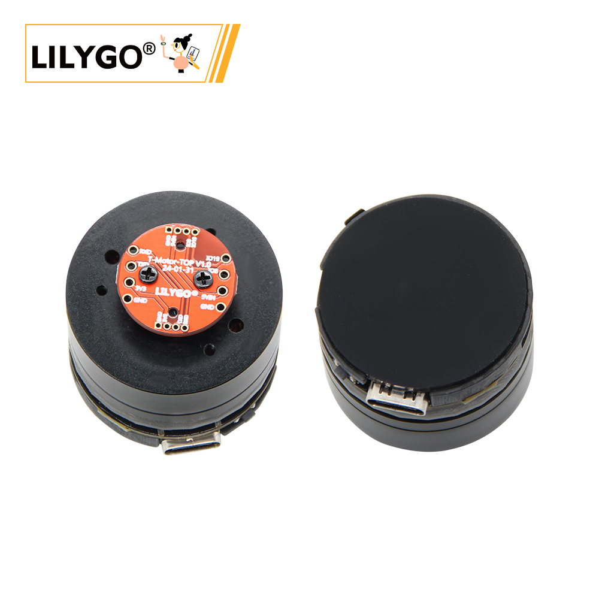
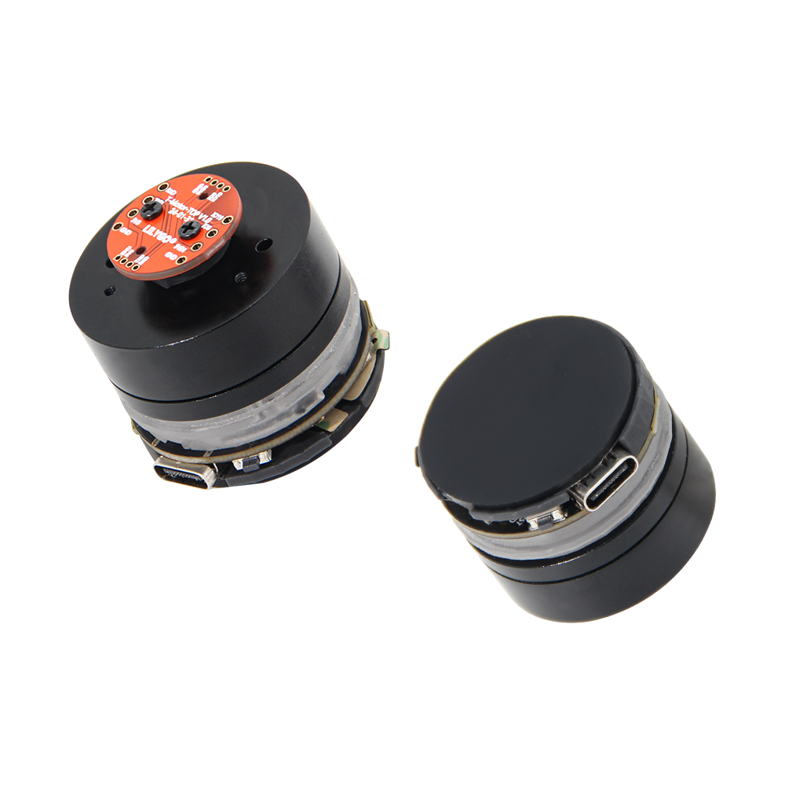
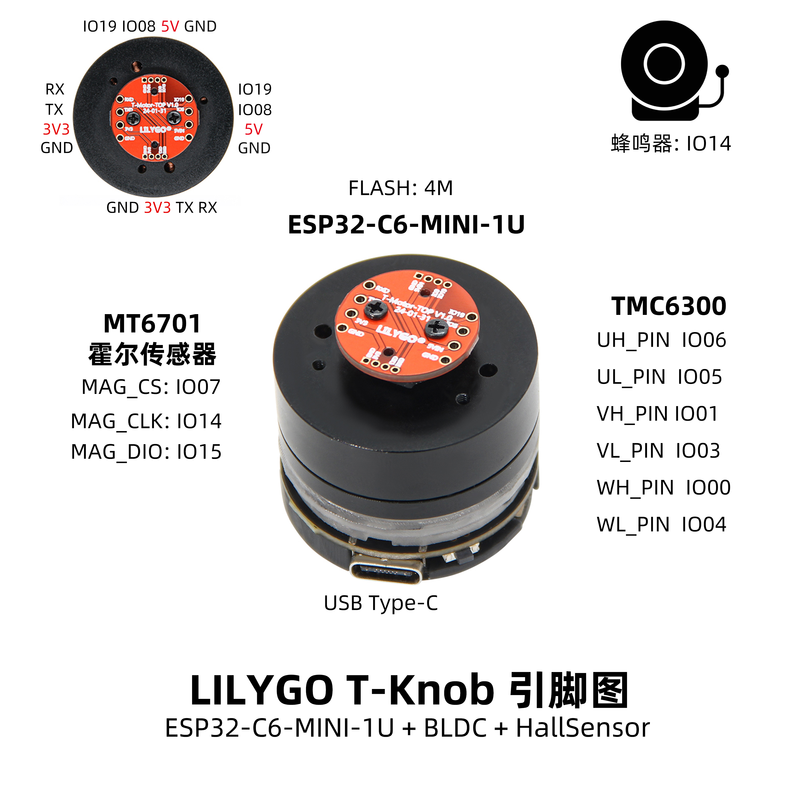
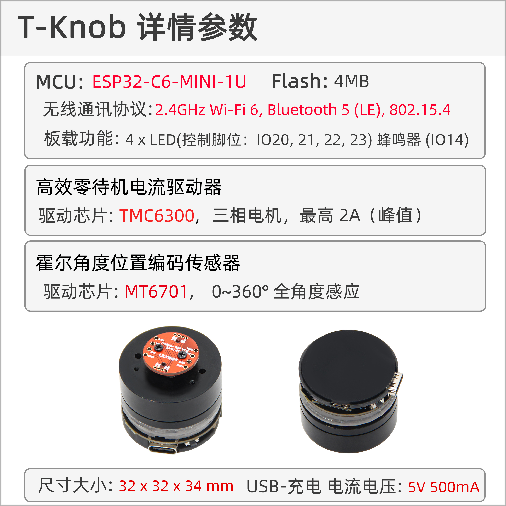

<!-- **[English](README.MD) | 中文** -->

    <a target="_blank" style="margin: 1em;color: white; font-size: 0.9em; border-radius: 0.3em; padding: 0.5em 2em; background-color:rgb(103, 175, 8)" href="https://lilygo.cc/products/t-knob">官网购买</a>
    <!-- <a target="_blank" style="margin: 1em;color: white; font-size: 0.9em; border-radius: 0.3em; padding: 0.5em 2em; background-color:rgb(63, 201, 28)" href="https://www.aliexpress.com/store/911876460">速卖通</a> -->

## 简介

LILYGO T-Knob 是一款基于 ESP32-C6-MINI-1U 无线模块的智能旋钮控制器，集成了 BLDC（无刷直流电机）和 MT6701 霍尔传感器，提供高精度旋钮交互体验。该产品通过 TMC6300 电机驱动芯片实现扭矩控制与反馈，支持 USB Type-C 接口供电及通信，可广泛应用于智能家居（如音量调节、灯光控制）、工业设备人机界面等场景。其硬件设计包含多路 GPIO 引脚（如 UH_PIN、VL_PIN 等）和 FLASH 存储（4MB），兼具无线连接能力与本地数据处理功能，适合开发高响应、低功耗的触觉交互解决方案。

## 外观及功能介绍
### 外观

### 引脚图 

## 模块资料以及参数
### 开发板参数

| 组件 | 描述 |
| ---  | --- |
|MCU	| ESP32-C6-MINI-1U
|Flash 	|	4MB 
|LED	|4 LED(I020, 21, 22, 23)
| 蜂鸣器 | 1 x 蜂鸣器 |
| 无线 | 2.4g Wi-Fi 6, Bluetooth 5 (LE), 802.15.4
| 电源 | 5V/500mA |
| 按键 | 1 x RST 按键 + 1 x BOOT 按键 |
| 霍尔传感器 | MT6701 |
| 电机 | TMC6300 BLDC 无刷直流电机 |
| USB | USB Type-C 接口 |
| 拓展接口 | 1 × QWIIC接口 |
| 孔位 | 1 × 2mm定位孔  |
| 尺寸 | 32 x 32 x 34mm |

### 相关资料
Github：[T-Knob](https://github.com/Xinyuan-LilyGO/T-Knob)
* [TMC6300](https://github.com/Xinyuan-LilyGO/T-Knob/blob/master/hardware/TMC6300_datasheet_rev1.08.pdf)
* [MT6701](https://github.com/Xinyuan-LilyGO/T-Knob/blob/master/hardware/MT6701_Rev.1.0.pdf)
#### 原理图

[T-Knob](https://github.com/Xinyuan-LilyGO/T-Knob/blob/master/hardware/T-MotorDriver-C6%20V1.0.pdf)

<!-- * [SY6970](./datasheet/AN_SY6970.pdf) -->

## 软件开发
### Arduino 设置参数

|Arduino IDE 设置	|参数   
| ----------- | -----------|                         
|Board     |	ESP32C6 Dev Module
|Port      |    Your port                        
|CPU Frequency	|160MHz                    
|Core Debug Level	|None                              
|USB DFU On Boot	|Disable           
|Flash Mode	|QIO                       
|Flash Size	|4MB(32Mb)                                         
|Partition Scheme	|Huge APP (3MB No OTA/1MB SPIFFS)                  
|Upload Speed	|921600    

### 开发平台
1. [VS Code](https://code.visualstudio.com/)
2. [Arduino IDE](https://www.arduino.cc/en/software)
3. [ESP-IDF](https://www.espressif.com/en/products/sdks/esp-idf)

## 产品技术支持 

