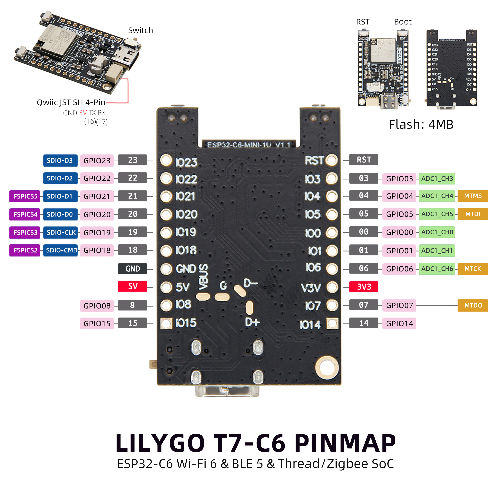

<!-- **[English](README.MD) | 中文** -->

<!-- 

    <a target="_blank" style="margin: 1em;color: white; font-size: 0.9em; border-radius: 0.3em; padding: 0.5em 2em; background-color:rgb(63, 201, 28)" href="https://item.taobao.com/item.htm?id=846226367137">淘宝</a>
    <a target="_blank" style="margin: 1em;color: white; font-size: 0.9em; border-radius: 0.3em; padding: 0.5em 2em; background-color:rgb(63, 201, 28)" href="https://www.aliexpress.com/store/911876460">速卖通</a>

 -->

## 简介

LILYGO T7-C6 是一款基于 ESP32-C6 芯片的开发板，集成了 Wi-Fi 6、蓝牙 5（BLE）以及 Thread/Zigbee 支持，适用于物联网和无线通信项目。该开发板提供丰富的 GPIO 引脚（如 GPIO0-GPIO23），支持 ADC（模数转换）功能，并内置 4MB Flash 存储。其引脚布局兼容常见的 JST SH 4-Pin 接口（GND、3V、TX、RX），同时具备 SPI（SDIO）通信能力，适合连接传感器或其他外设。此外，开发板还支持 5V 和 3.3V 电源输出，方便为不同设备供电，是开发者实现智能家居、远程监控等应用的理想选择。

## 外观及功能介绍
### 外观

### 引脚图 

## 模块资料以及参数
### 开发板参数

| 组件 | 描述 |
| ---  | --- |
|MCU	| ESP32-C6-MINI-1
|Flash 	|	4MB 
|电池芯片	|TP4065
| 无线 | 2.4g Wi-Fi 6, Bluetooth 5 (LE), 802.15.4
| 电源 | 5V/500mA |
| 按键 | 1 x RST 按键 + 1 x BOOT 按键 |
| 拓展接口 | 1 × QWIIC接口 |
| 孔位 |1 × 2mm定位孔  |

### 相关资料
Github：[T7 C6](https://github.com/Xinyuan-LilyGO/T7-c6)
* [TP4065](https://github.com/Xinyuan-LilyGO/T7-C6/blob/main/information/TP4065-4.2V-SOT25-R.pdf)
#### 原理图

[T6 C6](https://github.com/Xinyuan-LilyGO/T7-C6/blob/main/project/T7-C6_V1.0.pdf)

<!-- * [SY6970](./datasheet/AN_SY6970.pdf) -->

## 软件开发
### Arduino 设置参数

|Arduino IDE 设置	|参数   
| ----------- | -----------|                         
|Board     |	ESP32C6 Dev Module
|Port      |    Your port                        
|CPU Frequency	|160MHz                    
|Core Debug Level	|None                              
|USB DFU On Boot	|Disable           
|Flash Mode	|QIO                       
|Flash Size	|4MB(32Mb)                                         
|Partition Scheme	|Huge APP (3MB No OTA/1MB SPIFFS)                  
|Upload Speed	|921600    

### 开发平台
1. [VS Code](https://code.visualstudio.com/)
2. [Arduino IDE](https://www.arduino.cc/en/software)
3. [ESP-IDF](https://www.espressif.com/en/products/sdks/esp-idf)

## 产品技术支持 

