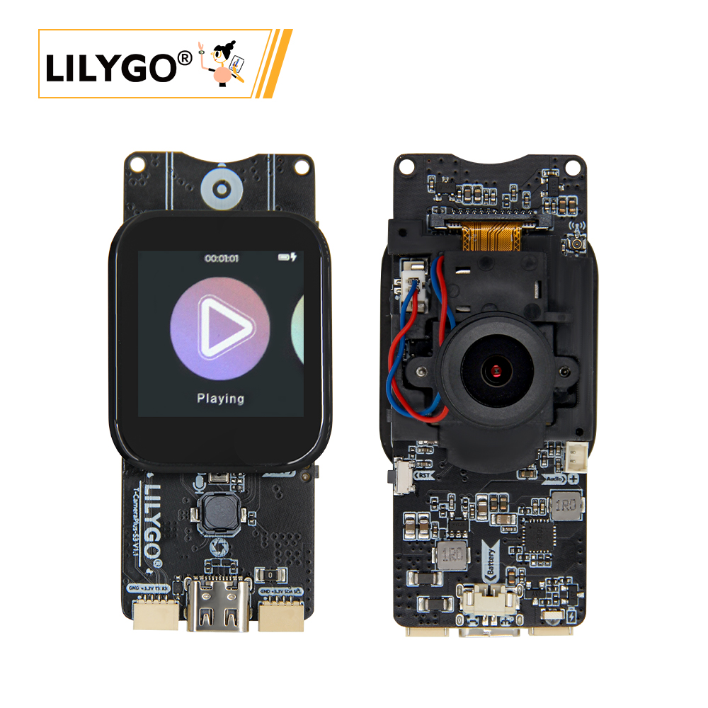
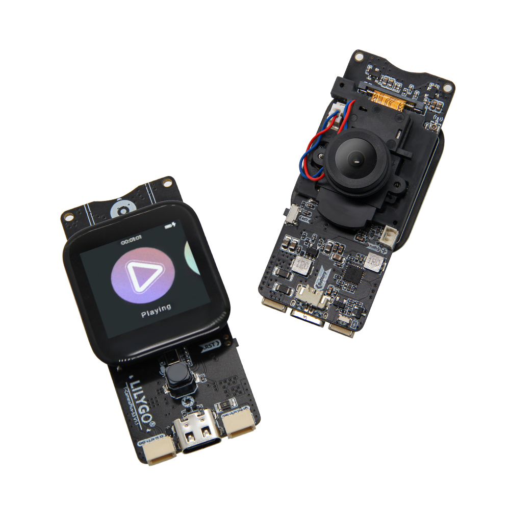
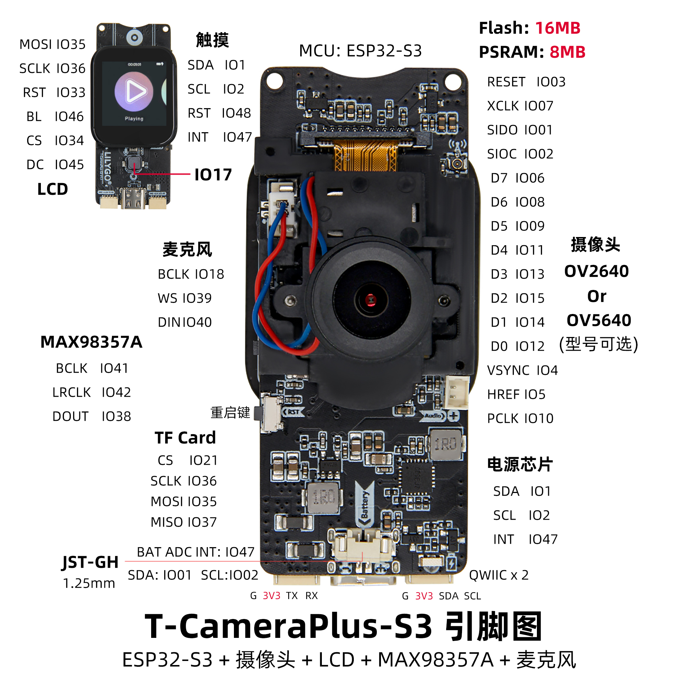
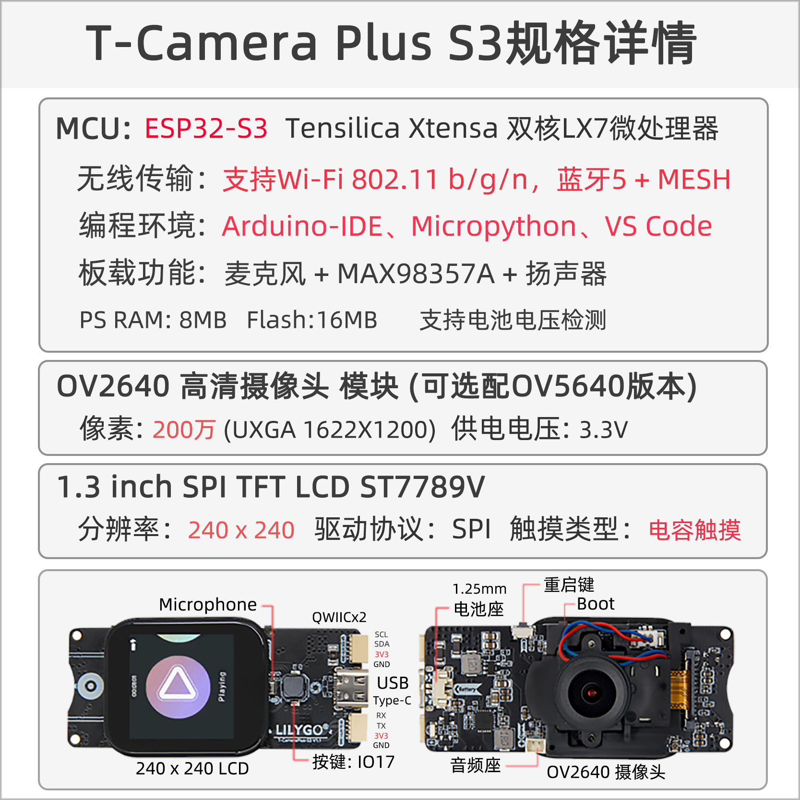

<!-- **[English](README.MD) | 中文** -->

    <a target="_blank" style="margin: 1em;color: white; font-size: 0.9em; border-radius: 0.3em; padding: 0.5em 2em; background-color:rgb(103, 175, 8)" href="https://lilygo.cc/products/t-camera-plus-s3">官网购买</a>
    <!-- <a target="_blank" style="margin: 1em;color: white; font-size: 0.9em; border-radius: 0.3em; padding: 0.5em 2em; background-color:rgb(63, 201, 28)" href="https://www.aliexpress.com/store/911876460">速卖通</a> -->

## 简介

T-CameraPlus-S3是一款基于ESP32-S3主控芯片的多功能智能硬件开发板，集成高性能摄像头模块（支持OV2640/OV5640可选）、LCD显示屏（含触摸功能）和MAX98357A音频芯片，具备16MB Flash与8MB PSRAM，可高效处理图像、视频及音频数据。支持双模音频输入输出（麦克风与数字音频接口），配备TF卡扩展存储、QWIIC接口（兼容I²C设备扩展）以及电池管理模块（BAT ADC），适用于物联网视觉交互、智能监控、多媒体终端等场景。硬件设计兼容多种传感器与外围设备，通过SPI、I²C等协议实现摄像头、显示屏、音频模块的协同工作，满足开发者在AIoT、边缘计算等领域的灵活开发需求。

## 外观及功能介绍
### 外观

### 引脚图 

## 模块资料以及参数
### 概述

T-CameraPlus-S3是基于ESP32S3芯片所开发的智能摄像头模组，板载240x240的TFT显示屏、数字麦克风、扬声器、一个独立按键、电源控制芯片、SD卡模块等。 出厂自带一个基于LVGL写的具有基本功能的UI，可实现文件管理、音乐播放、录音、摄像头投影等功能（如果出厂未写程序需要手动烧写示例名为“Lvgl_UI”的UI程序）

| 组件 | 描述 |
| --- | --- |
| MCU | 	ESP32-S3R8 Dual-core Xtensa LX7 CPU |
| FLASH| 	16MB |
| PSRAM | 8MB|
| 屏幕 | 1.3 英寸 ST7789V SPI TFT LCD |
| 触摸 | CST816S 触摸电容屏
| 存储 | TF 卡 |
| 摄像头 | OV2640/OV5640 |
| 无线 |2.4 GHz Wi-Fi & Bluetooth5 (LE)
| USB | 1 × USB Port and OTG(TYPE-C接口) |
| IO 接口 | 2.54mm间距 2*13（双排）拓展IO接口 |
| 电池芯片 | SY6970 |
| 扬声器 | MAX98357A     |
| 麦克风 | MP34DT05-A |
| 拓展接口|1 × TF card接口  + 2 × STEMMA QT/QWIIC接口(JST-SH 1.0MM 4Pin)  + 1 x JST-GH 1.25MM 接口|
| 按键 | 1 x RESET 按键 + 1 x BOOT 按键 + 1 x IO17按键|
| 电源 | AXPM65611电源芯片管理,BQ25896充电管理芯片|
| 孔位 | **2mm定位孔 * 4** |
| 尺寸 | **60x32x12mm**  |

### 相关资料

Github：[T-Camera Plus S3](https://github.com/Xinyuan-LilyGO/LilyGo-AMOLED-Series)

* [Espressif](https://www.espressif.com/en/support/documents/technical-documents)
* [MAX98357A](https://github.com/Xinyuan-LilyGO/T-CameraPlus-S3/blob/arduino-esp32-libs_V2.0.14/information/MAX98357AETE+T.pdf)
* [MSM261S4030H0R](information/MSM261S4030H0R.pdf)
* [MP34DT05-A](https://github.com/Xinyuan-LilyGO/T-CameraPlus-S3/blob/arduino-esp32-libs_V2.0.14/information/mp34dt05-a.pdf)
* [EVB_SY6970](information/EVB_SY6970.pdf)
* [AN_SY6970 ](information/AN_SY6970.pdf)
[T-Camera Plus S3](https://github.com/Xinyuan-LilyGO/LilyGo-AMOLED-Series/blob/master/schematic/T-Display-S3-AMOLED-Plus.pdf)

#### 原理图

* [T-CameraPlus-S3_V1.2](project/T-CameraPlus-S3_V1.2_20240417.pdf)

#### 依赖库

 * [Arduino_GFX-1.3.7](https://github.com/moononournation/Arduino_GFX)  
 * [lvgl-8.3.5](https://github.com/lvgl/lvgl)  
 * [JPEGDEC-1.2.8](https://github.com/bitbank2/JPEGDEC)  
 * [MiniTV](https://github.com/moononournation/MiniTV)  
 * [TFT_eSPI](https://github.com/Bodmer/TFT_eSPI)
 * [XPowersLib-0.2.1](https://github.com/lewisxhe/XPowersLib)  
 * [Arduino_DriveBus-1.1.16](https://github.com/Xk-w/Arduino_DriveBus)
 * [cst816t-1.5.0](https://github.com/koendv/cst816t)  
 * [arduino-libhelix-0.8.1](https://github.com/pschatzmann/arduino-libhelix)  
 * [ESP32-audioI2S-3.0.6](https://github.com/schreibfaul1/ESP32-audioI2S)
 * [DFRobot_MSM261](https://github.com/DFRobot/DFrobot_MSM261)  

## 软件开发
### Arduino 设置参数

| Setting                  | Value                            |
|--------------------------|----------------------------------|
| Board                    | ESP32S3 Dev Module               |
| Upload Speed             | 921600                           |
| USB Mode                 | Hardware CDC and JTAG            |
| USB CDC On Boot          | Enabled                          |
| USB Firmware MSC On Boot | Disabled                         |
| USB DFU On Boot          | Disabled                         |
| CPU Frequency            | 240MHz (WiFi)                    |
| Flash Mode               | QIO 80MHz                        |
| Flash Size               | 16MB (128Mb)                     |
| Core Debug Level         | None                             |
| Partition Scheme         | 16M Flash (3MB APP/9.9MB FATFS)  |
| PSRAM                    | QSPI PSRAM                       |
| Arduino Runs On          | Core 1                           |
| Events Run On            | Core 1                           |

### 开发平台
1. [Micropython](https://micropython.org/)
2. [Arduino IDE](https://www.arduino.cc/en/software)
3. [Platform IO](https://platformio.org/)

## 产品技术支持 

