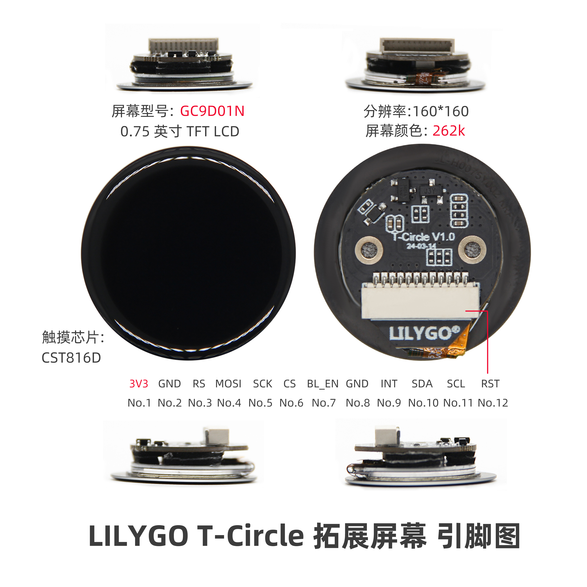

<!-- **[English](README.MD) | 中文** -->

    <a target="_blank" style="margin: 1em;color: white; font-size: 0.9em; border-radius: 0.3em; padding: 0.5em 2em; background-color:rgb(103, 175, 8)" href="https://lilygo.cc/products/t-circle-s3?variant=44912874062005">官网购买</a>
    <!-- <a target="_blank" style="margin: 1em;color: white; font-size: 0.9em; border-radius: 0.3em; padding: 0.5em 2em; background-color:rgb(63, 201, 28)" href="https://www.aliexpress.com/store/911876460">速卖通</a> -->

> 注意：T-Circle 为 ESP32 版本 ,点这里切换到ESP32-S3版本[T-Circle S3](https://wiki.lilygo.cc/get_started/zh/LCD_OLED/T-Circle-S3/T-Circle-S3.html)版本

## 简介

LILYGO T-Circle是ESP32版本的圆形屏幕开发板，核心搭载0.75英寸TFT LCD圆形显示屏，支持160x160分辨率与262K色彩显示，配备CST816D电容式触摸芯片实现精准触控交互。硬件采用GCPD01N驱动芯片，通过12引脚（包括3V3供电、SPI接口的MOSI/SCK/CS、I2C通信的SDA/SCL、BLE使能引脚BLEEN等）与外部设备连接，兼容Arduino等开发框架。其紧凑设计集成了高精度显示、触控及低功耗通信功能，适用于智能手表、物联网设备界面或微型嵌入式系统的原型开发。

## 外观及功能介绍
### 外观

### 引脚图 

## 模块资料
### 概述

| 组件 | 描述 |
| --- | --- |
| MCU | ESP32-S3R8 Dual-core LX7 microprocessor
| FLASH| 16M |
| PSRAM | 8M (Octal SPI)|
| 屏幕 | SPI GC9D01N驱动 0.75英寸LCD圆屏幕(160x160px) |
| 触摸 | CST816D|
| 无线 |2.4 GHz Wi-Fi & Bluetooth5 (LE)
| 拓展接口 | 12pin拓展接口 |
| 按键 | 1 x RESET 按键 + 1 x BOOT 按键|
| 电源 | 5V/500mA |
| 孔位 | **2 × M1.6*2** |
| 尺寸 | **32*17mm**  |

### 相关资料链接

Github:[T-Circle](https://github.com/Xinyuan-LilyGO/T-Circle)

- [GC9D01N](https://github.com/Xinyuan-LilyGO/T-Circle-S3/blob/arduino-esp32-libs_V2.0.14/information/GC9D01N.pdf)
- [TFT_eSPI-2.5.43](https://github.com/Bodmer/TFT_eSPI)
- [MAX98357A](https://github.com/Xinyuan-LilyGO/T-Circle-S3/blob/arduino-esp32-libs_V2.0.14/information/MAX98357AETE+T.pdf)
- [MSM261S4030H0R](https://github.com/Xinyuan-LilyGO/T-Circle-S3/blob/arduino-esp32-libs_V2.0.14/information/MSM261S4030H0R.pdf))
- [MP34DT05-A](https://github.com/Xinyuan-LilyGO/T-Circle-S3/blob/arduino-esp32-libs_V2.0.14/information/mp34dt05-a.pdf)

#### 原理图

[T-Circle-S3](https://github.com/Xinyuan-LilyGO/T-Circle-S3/blob/arduino-esp32-libs_V2.0.14/project/T-Circle-S3_V1.0.pdf)

#### 依赖库

- [Arduino_DriveBus-1.1.16](https://github.com/Xk-w/Arduino_DriveBus)
- [Arduino_GFX-1.3.7](https://github.com/moononournation/Arduino_GFX)
- [ESP32-audioI2S-3.0.6](https://github.com/schreibfaul1/ESP32-audioI2S)
- [DFRobot_MSM261](https://github.com/DFRobot/DFrobot_MSM261)
- [FastLED-3.6.0](https://github.com/FastLED/FastLED)

## 软件开发
### Arduino 设置参数

| Setting                  | Value                            |
|--------------------------|----------------------------------|
| Board                    | ESP32S3 Dev Module               |
| Upload Speed             | 921600                           |
| USB Mode                 | Hardware CDC and JTAG            |
| USB CDC On Boot          | Enabled                          |
| USB Firmware MSC On Boot | Disabled                         |
| USB DFU On Boot          | Disabled                         |
| CPU Frequency            | 240MHz (WiFi)                    |
| Flash Mode               | QIO 80MHz                        |
| Flash Size               | 16MB (128Mb)                     |
| Core Debug Level         | None                             |
| Partition Scheme         | 16M Flash (3MB APP/9.9MB FATFS)  |
| PSRAM                    | OPI PSRAM                        |
| Arduino Runs On          | Core 1                           |
| Events Run On            | Core 1                           |

### 开发平台

1. [VS Code](https://code.visualstudio.com/)
2. [Arduino IDE](https://www.arduino.cc/en/software)
3. [Platform IO](https://platformio.org/)

## 产品技术支持 

