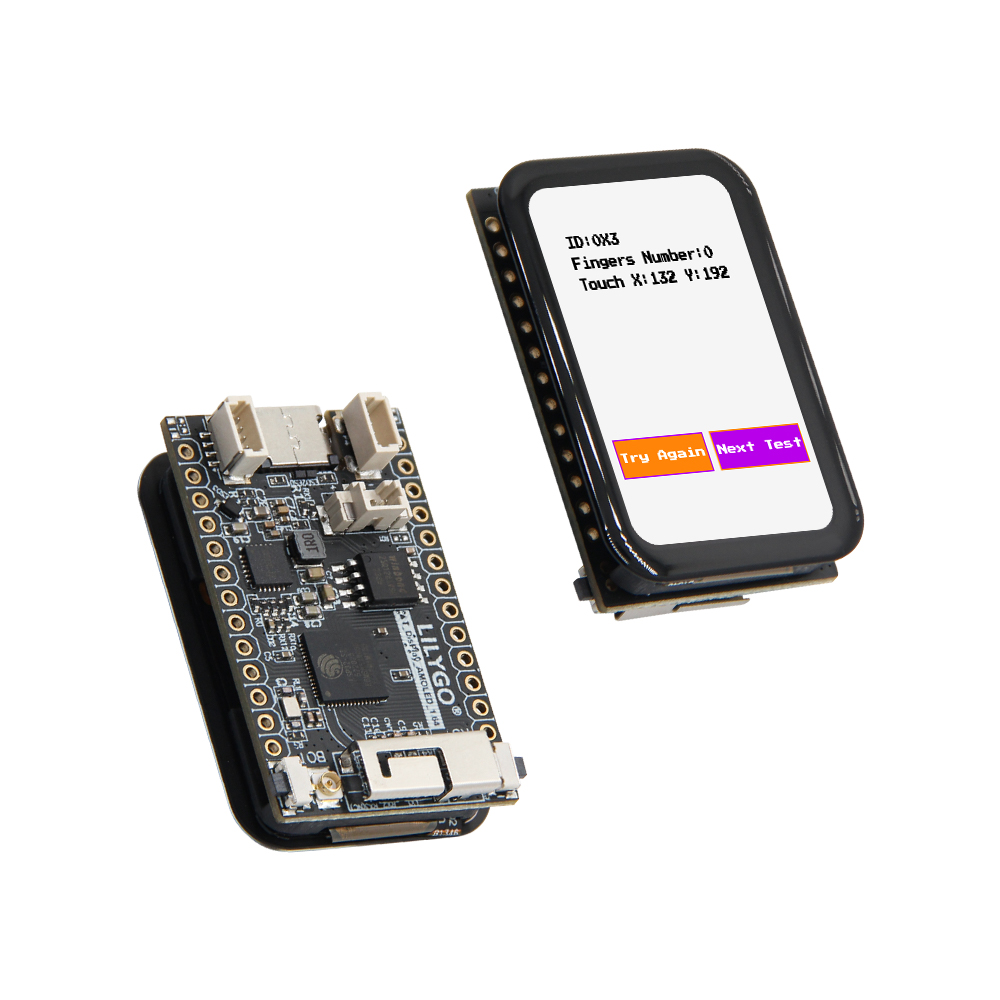
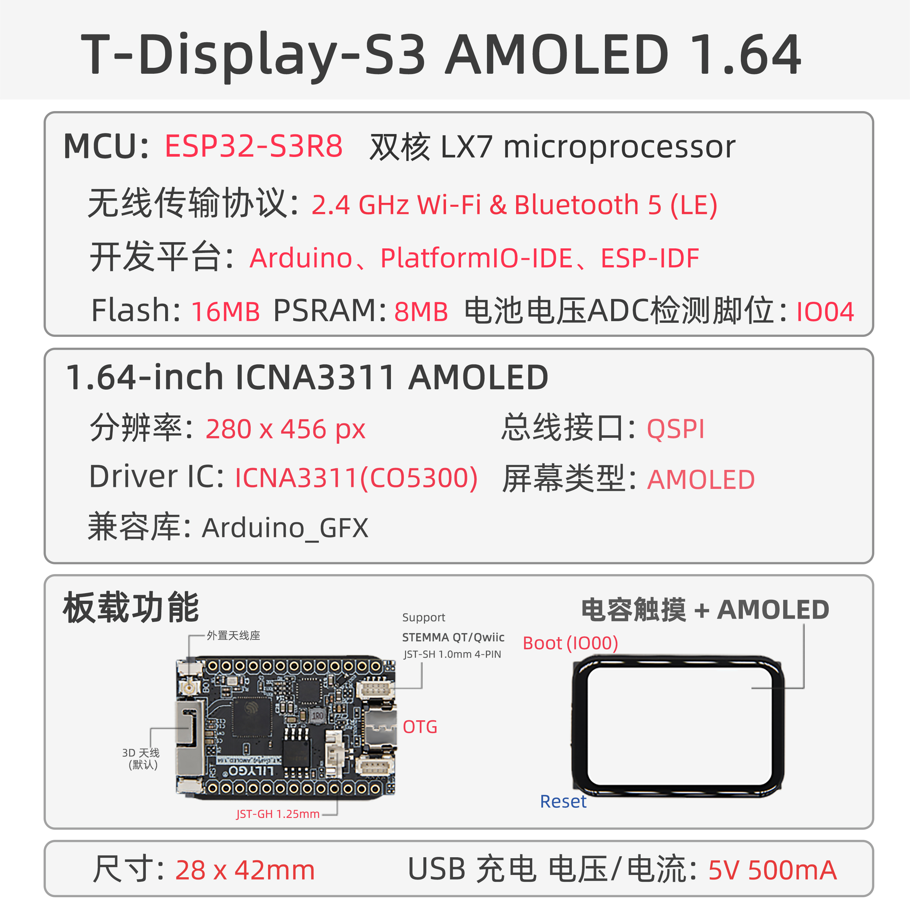
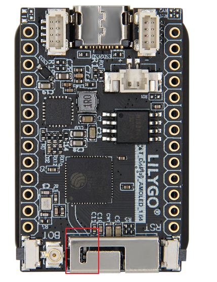

<!-- **[English](README.MD) | 中文** -->

    <a target="_blank" style="margin: 1em;color: white; font-size: 0.9em; border-radius: 0.3em; padding: 0.5em 2em; background-color:rgb(63, 201, 28)" href="https://lilygo.cc/products/t-display-s3-amoled-1-64?variant=44437365031093">官网购买</a>
    <!-- <a target="_blank" style="margin: 1em;color: white; font-size: 0.9em; border-radius: 0.3em; padding: 0.5em 2em; background-color:rgb(63, 201, 28)" href="https://www.aliexpress.com/store/911876460">速卖通</a> -->

## 简介

T-Display-S3 AMOLED 1.64 是一款基于 ESP32-S3R8 双核 LX7 微处理器的高性能物联网开发板，集成 2.4 GHz Wi-Fi 和蓝牙 5（LE）无线通信功能，支持多平台开发（Arduino、PlatformIO-IDE、ESP-IDF）。其核心亮点为 1.64 英寸 ICMA3311 AMOLED 显示屏，分辨率达 280×456 像素，采用 QSPI 总线接口并兼容 Arduino_GFX 图形库，可快速实现丰富的图形界面开发。板载 16MB Flash 和 8MB PSRAM，提供充足存储与内存资源，同时支持电池电压检测（ADC 脚位 I004）及 5V/500mA USB 充电，兼顾低功耗与移动场景需求。其他功能包括电容触摸交互、外显式流量控制、STEMMA OT/Qwilc 扩展接口及 RF SH 1.0mm + 4W 射频设计，适用于智能穿戴、嵌入式 GUI、工业控制等场景，以紧凑尺寸（28×42mm）实现高性能与多功能的平衡。

## 外观及功能介绍
### 外观

### 引脚图 

## 模块资料以及参数

### 概述

| 组件 | 描述 |
| --- | --- |
| MCU | ESP32-S3R8 Dual-core LX7 microprocessor |
| FLASH| 16MB |
| PSRAM | 8MB|
| 屏幕 | **1.64英寸 ICNA3311 AMOLED** |
| 触摸 | FT3168 触摸电容屏
| 屏幕总线 | QSPI
| LoRa | 1276:868,915Mhz |
| 存储 | TF 卡 |
| 充电芯片 | SY6970
| RTC | PCF8563 |
| 无线 |2.4 GHz Wi-Fi & Bluetooth 5 (LE)
| USB | 1 × USB Port and OTG(TYPE-C接口) |
| IO 接口 |2 x 2.54mm间距 2*7 拓展IO接口 |
| 拓展接口|  2 × STEMMA QT/Qwlic JST-SH 1.0MM4pin 接口 +1 x JST-GH 1.25mm电池座子 + 1 x 天线座子|
| 按键 | 1 x RESET 按键 + 1 x BOOT 按键|
| 尺寸 | **28x42x11mm**  |

> 该芯片在未接电池5V供电时输出波形将非常不稳定，需要连接电池使用或者软件关闭电池通道，这样的话情况将会得到缓解

### 相关资料

Github：[T-Display-S3-AMOLED-1.64](https://github.com/Xinyuan-LilyGO/T-Display-S3-AMOLED-1.64-1.75/tree/main)

* [CO5300](https://github.com/Xinyuan-LilyGO/T-Display-S3-AMOLED-1.64/blob/arduino-esp32-libs_V2.0.14/information/CO5300_V0.01.pdf)
* [FT3168](https://github.com/Xinyuan-LilyGO/T-Display-S3-AMOLED-1.64/blob/arduino-esp32-libs_V2.0.14/information/FT3168.pdf)
* [DO0164FMST02](https://github.com/Xinyuan-LilyGO/T-Display-S3-AMOLED-1.64/blob/arduino-esp32-libs_V2.0.14/information/SPEC-DO0164FMST02-20240126.pdf)
* [AN_SY6970](https://github.com/Xinyuan-LilyGO/T-Display-S3-AMOLED-1.64/blob/arduino-esp32-libs_V2.0.14/information/AN_SY6970.pdf)
* [EVB_SY6970](https://github.com/Xinyuan-LilyGO/T-Display-S3-AMOLED-1.64/blob/arduino-esp32-libs_V2.0.14/information/EVB_SY6970.pdf)

#### 原理图

* [T-Display-S3-AMOLED-1.64_V1.0](https://github.com/Xinyuan-LilyGO/T-Display-S3-AMOLED-1.64/blob/arduino-esp32-libs_V2.0.14/project/T-Display-AMOLED-1.64_V1.0.pdf)
<!-- * [SY6970](./datasheet/AN_SY6970.pdf) -->

#### 依赖库

* [JPEGDEC-1.2.8](https://github.com/bitbank2/JPEGDEC)
* [lvgl-8.3.5](https://lvgl.io)
* [MiniTV](https://github.com/moononournation/MiniTV)
* [SensorLib](https://github.com/lewisxhe/SensorsLib)
* [Arduino_GFX-1.3.7](https://github.com/moononournation/Arduino_GFX)
* [Arduino_DriveBus-1.1.8](https://github.com/Xk-w/Arduino_DriveBus)

#### 注意事项

> 使用者如有需要调节外接天线电阻请参考

>!图中硬件遮蔽了电阻跳线部分，可以参考T3-S3 LR1121文档中的方式调整电阻方向实现调节外接天线的电阻。

## 软件开发
### Arduino 设置参数

| Setting                  | Value                            |
|--------------------------|----------------------------------|
| Board                    | ESP32S3 Dev Module               |
| Upload Speed             | 921600                           |
| USB Mode                 | Hardware CDC and JTAG            |
| USB CDC On Boot          | Enabled                          |
| USB Firmware MSC On Boot | Disabled                         |
| USB DFU On Boot          | Disabled                         |
| CPU Frequency            | 240MHz (WiFi)                    |
| Flash Mode               | QIO 80MHz                        |
| Flash Size               | 16MB (128Mb)                     |
| Core Debug Level         | None                             |
| Partition Scheme         | 16M Flash (3MB APP/9.9MB FATFS)  |
| PSRAM                    | OPI PSRAM                        |
| Arduino Runs On          | Core 1                           |
| Events Run On            | Core 1                           |

### 开发平台

1. [Micropython](https://micropython.org/)
2. [Arduino IDE](https://www.arduino.cc/en/software)
3. [Platform IO](https://platformio.org/)

## 产品技术支持 

