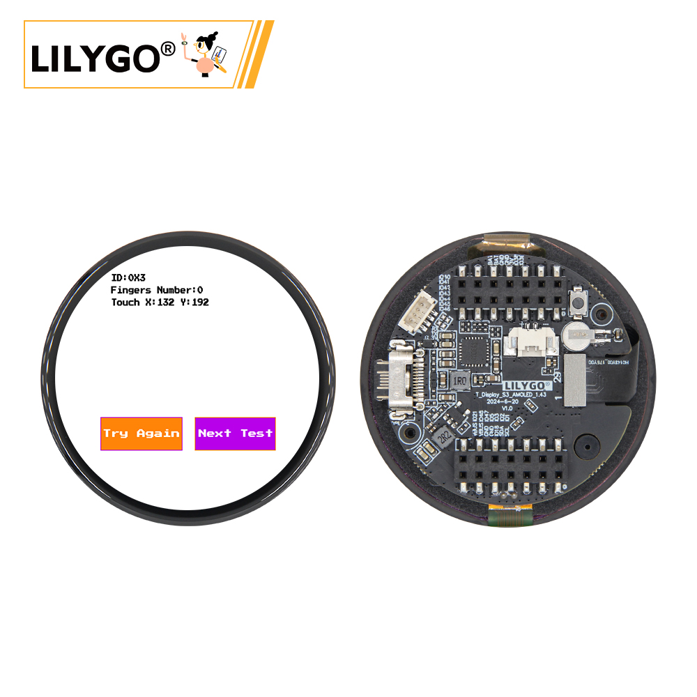
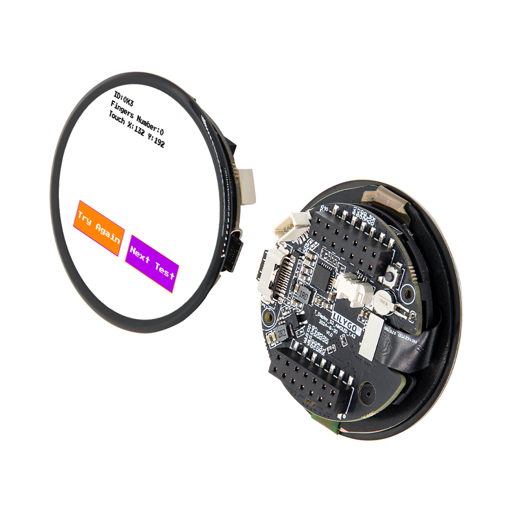
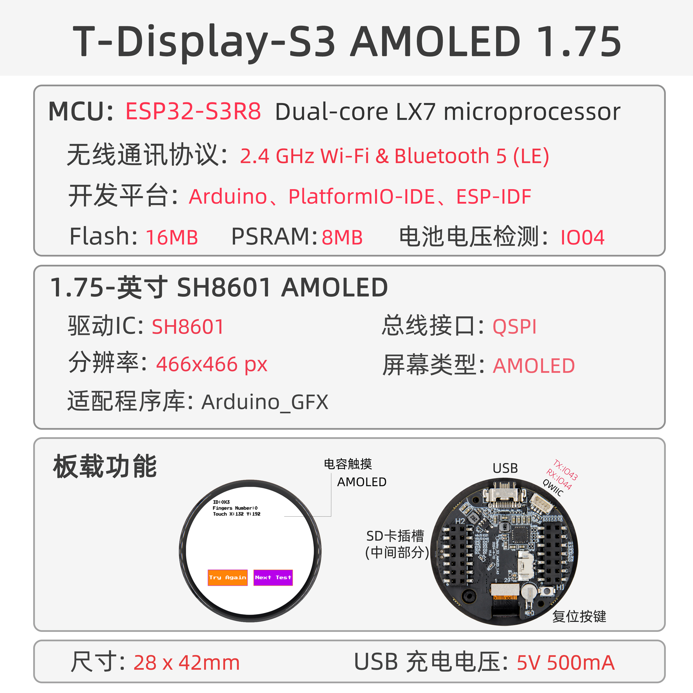

<!-- **[English](README.MD) | 中文** -->

    <a target="_blank" style="margin: 1em;color: white; font-size: 0.9em; border-radius: 0.3em; padding: 0.5em 2em; background-color:rgb(63, 201, 28)" href="https://lilygo.cc/products/t-display-s3-amoled-1-64?variant=44848332931253">官网购买</a>
    <!-- <a target="_blank" style="margin: 1em;color: white; font-size: 0.9em; border-radius: 0.3em; padding: 0.5em 2em; background-color:rgb(63, 201, 28)" href="https://www.aliexpress.com/store/911876460">速卖通</a> -->

## 简介

T-Display AMOLED Plus 是一款基于 ESP32-S3 微控制器的高集成度开发板，主打多功能与高性能。其核心搭载 16MB Flash 和 8MB PSRAM，支持复杂应用运行。配备 1.25 英寸 AMOLED 显示屏，并支持触摸功能。内置 PMU（电源管理单元）和 RTC（实时时钟），结合 VBUS 电源管理，优化了低功耗设计。扩展方面，提供 STEMMA QT/Qwlic 双接口，兼容快速传感器连接；支持 SD 卡存储，并预留丰富 GPIO、ADC 通道及 UART 通信接口，便于外设扩展。此外，板载 BOOT 模式切换和复位电路，简化开发调试。该产品适用于智能穿戴、物联网终端等需要显示交互与多传感器集成的场景。

## 外观及功能介绍
### 外观

### 引脚图 

## 模块资料以及参数

| 组件 | 描述 |
| --- | --- |
| MCU | ESP32-S3R8 Dual-core LX7 microprocessor |
| FLASH| 16MB |
| PSRAM | 8MB|
| 屏幕 | 1.75 英寸 SH8601 AMOLED |
| 触摸 | FT3168 触摸电容屏
| 总线 | QSPI
| LoRa | 1276:868,915Mhz |
| 存储 | TF 卡 |
| 充电芯片 | SY6970
| RTC | PCF8563 |
| 无线 |2.4 GHz Wi-Fi & Bluetooth 5 (LE)
| USB | 1 × USB Port and OTG(TYPE-C接口) |
| IO 接口 |2 x 2.54mm间距 2*7 拓展IO接口 |
| 拓展接口|  1 × QWIIC接口 + JST-GH 1.25MM 接口 +1 x 电池座子|
| 按键 | 1 x RESET 按键 + 1 x BOOT 按键|
| 尺寸 | **45x45x11mm**  |

> 该芯片在未接电池5V供电时输出波形将非常不稳定，需要连接电池使用或者软件关闭电池通道，这样的话情况将会得到缓解

### 相关资料

T-Display-S3-AMOLED-1.43-1.75是一款基于ESP32S3开发的板载高清AMOLED屏幕的圆屏开发板，可连接外接电池独立供电。

Github：[T-Display-S3-AMOLED-1.43](https://github.com/Xinyuan-LilyGO/T-Display-S3-AMOLED-1.43-1.75/tree/main)

* [PCF8563](https://github.com/Xinyuan-LilyGO/T-Display-S3-AMOLED-1.43-1.75/blob/main/information/PCF8563.pdf)
* [SH8601](https://github.com/Xinyuan-LilyGO/T-Display-S3-AMOLED-1.43-1.75/blob/main/information/SH8601Z.pdf)
* [DO0143FAT01](https://github.com/Xinyuan-LilyGO/T-Display-S3-AMOLED-1.43-1.75/blob/main/information/SPEC-DO0143FAT01-20230830.pdf)
* [AN_SY6970](https://github.com/Xinyuan-LilyGO/T-Display-S3-AMOLED-1.43-1.75/blob/main/information/AN_SY6970.pdf)
* [EVB_SY6970](https://github.com/Xinyuan-LilyGO/T-Display-S3-AMOLED-1.43-1.75/blob/main/information/EVB_SY6970.pdf)

#### 原理图

* [T-Display-S3-AMOLED-1.43-1.75_V1.0](https://github.com/Xinyuan-LilyGO/T-Display-S3-AMOLED-1.43-1.75/blob/main/project/T-Display-S3-AMOLED-1.43-1.75_V1.0.pdf)

<!-- * [SY6970](./datasheet/AN_SY6970.pdf) -->

#### 依赖库

* [Arduino_GFX-1.3.7](https://github.com/moononournation/Arduino_GFX)
* [Arduino_DriveBus-1.1.12](https://github.com/Xk-w/Arduino_DriveBus)
* [JPEGDEC-1.2.8](https://github.com/bitbank2/JPEGDEC)
* [lvgl-8.3.5](https://lvgl.io)
* [MiniTV](https://github.com/moononournation/MiniTV)
* [SensorLib](https://github.com/lewisxhe/SensorsLib)

## 软件开发
### Arduino 设置参数

| Setting                  | Value                            |
|--------------------------|----------------------------------|
| Board                    | ESP32S3 Dev Module               |
| Upload Speed             | 921600                           |
| USB Mode                 | Hardware CDC and JTAG            |
| USB CDC On Boot          | Enabled                          |
| USB Firmware MSC On Boot | Disabled                         |
| USB DFU On Boot          | Disabled                         |
| CPU Frequency            | 240MHz (WiFi)                    |
| Flash Mode               | QIO 80MHz                        |
| Flash Size               | 16MB (128Mb)                     |
| Core Debug Level         | None                             |
| Partition Scheme         | 16M Flash (3MB APP/9.9MB FATFS)  |
| PSRAM                    | OPI PSRAM                        |
| Arduino Runs On          | Core 1                           |
| Events Run On            | Core 1                           |

### 开发平台
1. [Micropython](https://micropython.org/)
2. [Arduino IDE](https://www.arduino.cc/en/software)
3. [Platform IO](https://platformio.org/)

## 产品技术支持 

