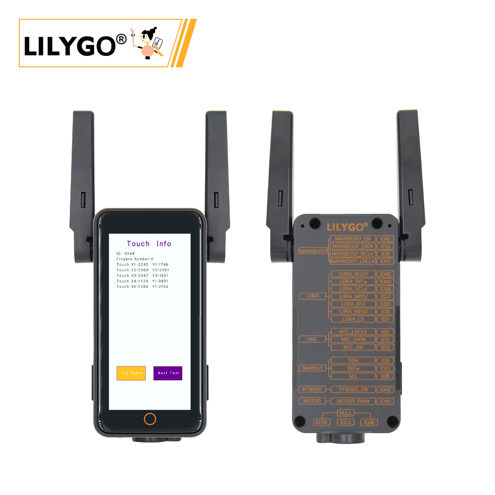
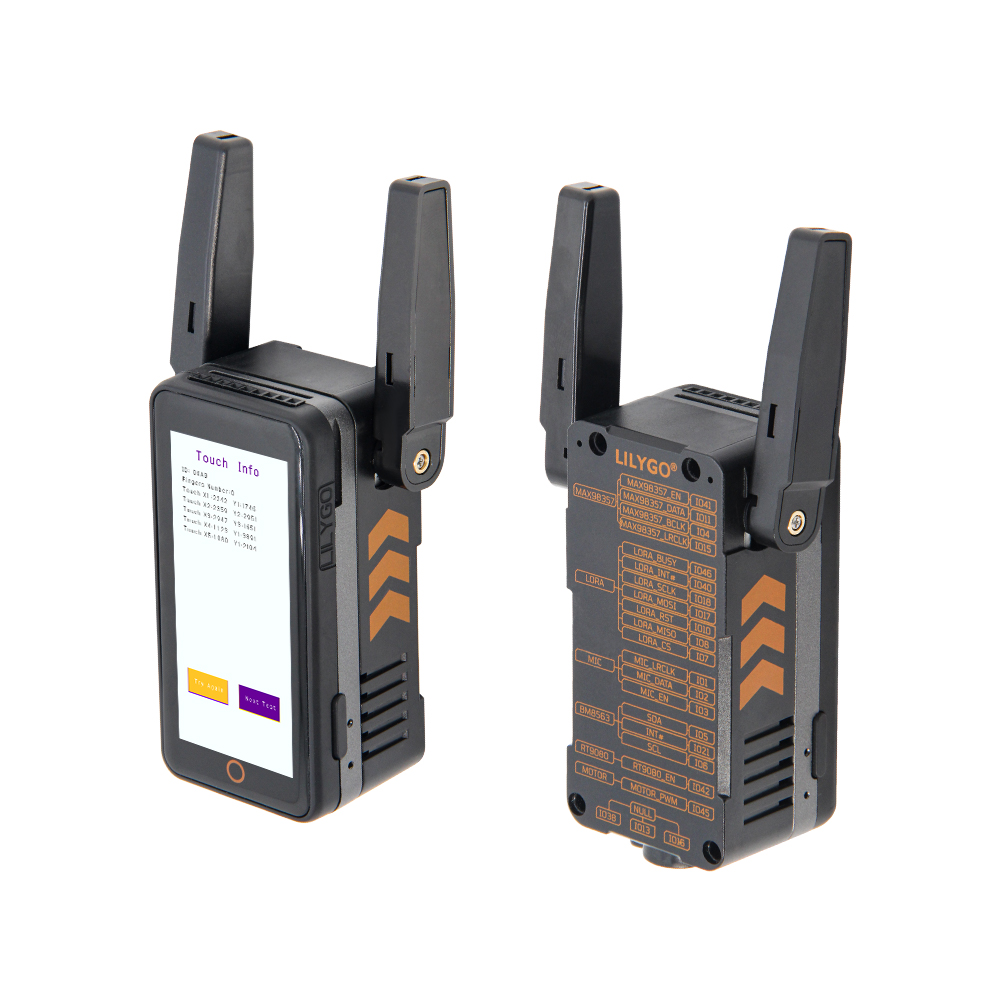
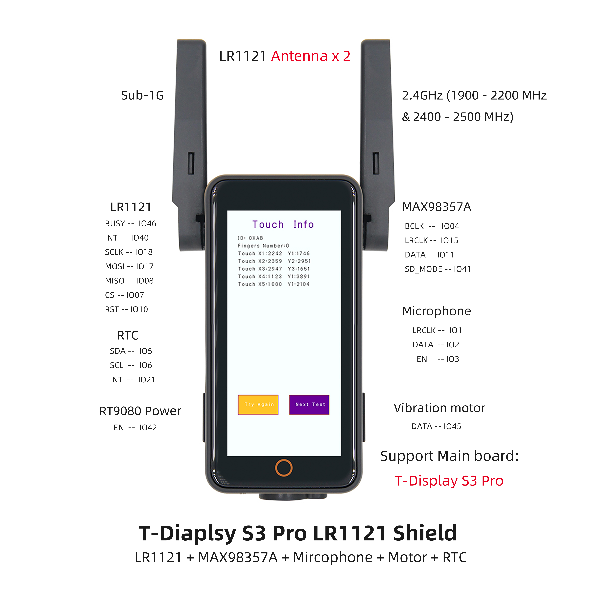

<!-- **[English](README.MD) | 中文** -->

<!-- 

    <a target="_blank" style="margin: 1em;color: white; font-size: 0.9em; border-radius: 0.3em; padding: 0.5em 2em; background-color:rgb(63, 201, 28)" href="https://item.taobao.com/item.htm?id=846226367137">淘宝</a>
    <a target="_blank" style="margin: 1em;color: white; font-size: 0.9em; border-radius: 0.3em; padding: 0.5em 2em; background-color:rgb(63, 201, 28)" href="https://www.aliexpress.com/store/911876460">速卖通</a>

 -->

## 简介

T-Display S3 AMOLED Plus 是一款基于 ESP32-S3 微控制器的高集成度开发板，主打多功能与高性能。其核心搭载 16MB Flash 和 8MB PSRAM，支持复杂应用运行。配备 1.25 英寸 AMOLED 显示屏，并支持触摸功能。内置 PMU（电源管理单元）和 RTC（实时时钟），结合 VBUS 电源管理，优化了低功耗设计。扩展方面，提供 STEMMA QT/Qwlic 双接口，兼容快速传感器连接；支持 SD 卡存储，并预留丰富 GPIO、ADC 通道及 UART 通信接口，便于外设扩展。此外，板载 BOOT 模式切换和复位电路，简化开发调试。该产品适用于智能穿戴、物联网终端等需要显示交互与多传感器集成的场景。

## 外观及功能介绍
### 外观

### 引脚图 

## 模块资料以及参数

### 概述

| 组件 | 描述 |
| --- | --- |
| MCU | ESP32-S3R8 Dual-core LX7 microprocessor |
| FLASH| 	16MB |
| PSRAM | 8MB|
| 屏幕 | 1.91 英寸 RM67162 IPS AMOLED |
| 触摸 | 触摸电容屏
| LoRa | 1276:868,915Mhz |
| 存储 | TF 卡 |
| RTC | PCF85063ATL/1 |
| 无线 |	2.4 GHz Wi-Fi & Bluetooth5 (LE)
| USB | 1 × USB Port and OTG(TYPE-C接口) |
| IO 接口 | 2.54mm间距 2*13（双排）拓展IO接口 |
| 拓展接口| 1 × FPC 天线拓展接口 +1 × TF card接口  + 1 × STEMMA QT/QWIIC接口(JST-SH 1.0MM 4Pin)  + JST-GH 1.25MM 接口|
| 按键 | 1 x RESET 按键 + 1 x BOOT 按键|
| 电源 | AXPM65611电源芯片管理,BQ25896充电管理芯片|
| 孔位 | **2mm定位孔 * 4** |
| 尺寸 | **60x32x12mm**  |

### 相关资料

Github：[T-Display S3 AMOLED Plus](https://github.com/Xinyuan-LilyGO/LilyGo-AMOLED-Series)

#### 原理图

[T-Display S3 AMOLED Plus](https://github.com/Xinyuan-LilyGO/LilyGo-AMOLED-Series/blob/master/schematic/T-Display-S3-AMOLED-Plus.pdf)

<!-- * [SY6970](./datasheet/AN_SY6970.pdf) -->

#### 依赖库

* [lvgl 8.3.9](https://github.com/lvgl/lvgl)
* [AceButton](https://github.com/bxparks/AceButton)
* [TFT_eSPI](https://github.com/Bodmer/TFT_eSPI)
* [Arduino_GFX](https://github.com/moononournation/Arduino_GFX)
* [XPowersLib](https://github.com/lewisxhe/XPowersLib)
* [SensorLib](https://github.com/lewisxhe/SensorsLib)
* [TinyGPSPlus](https://github.com/mikalhart/TinyGPSPlus)
* [Arduino_NeoPixel](https://github.com/adafruit/Adafruit_NeoPixel)
* [OneWire](https://github.com/PaulStoffregen/OneWire) 
* [SparkFun MAX3010x Pulse and Proximity Sensor Library](https://github.com/sparkfun/SparkFun_MAX3010x_Pulse_and_Proximity_Sensor_Library)

## 软件开发
### Arduino 设置参数

| Setting                               | Value                                 |
| -------------------------------| ------------------------------- |
|Board	|ESP32S3 Dev Module
|Port	|Your port
|USB CDC On Boot	|Enable
|CPU Frequency	|240MHZ(WiFi)
|Core Debug Level	|None
|USB DFU On Boot	|Disable
|Erase All Flash Before Sketch Upload	|Disable
|Events Run On	|Core1
|Flash Mode	|QIO 80MHZ
|Flash Size	|16MB(128Mb)
|Arduino Runs On	|Core1
|USB Firmware MSC On Boot	|Disable
|Partition Scheme	|16M Flash(3M APP/9.9MB FATFS)
|PSRAM	|OPI PSRAM
|Upload Mode	|UART0/Hardware CDC
|Upload Speed	|921600
|USB Mode	|CDC and JTAG  

### 开发平台
1. [Micropython](https://micropython.org/)
2. [Arduino IDE](https://www.arduino.cc/en/software)
3. [Platform IO](https://platformio.org/)

## 产品技术支持 

