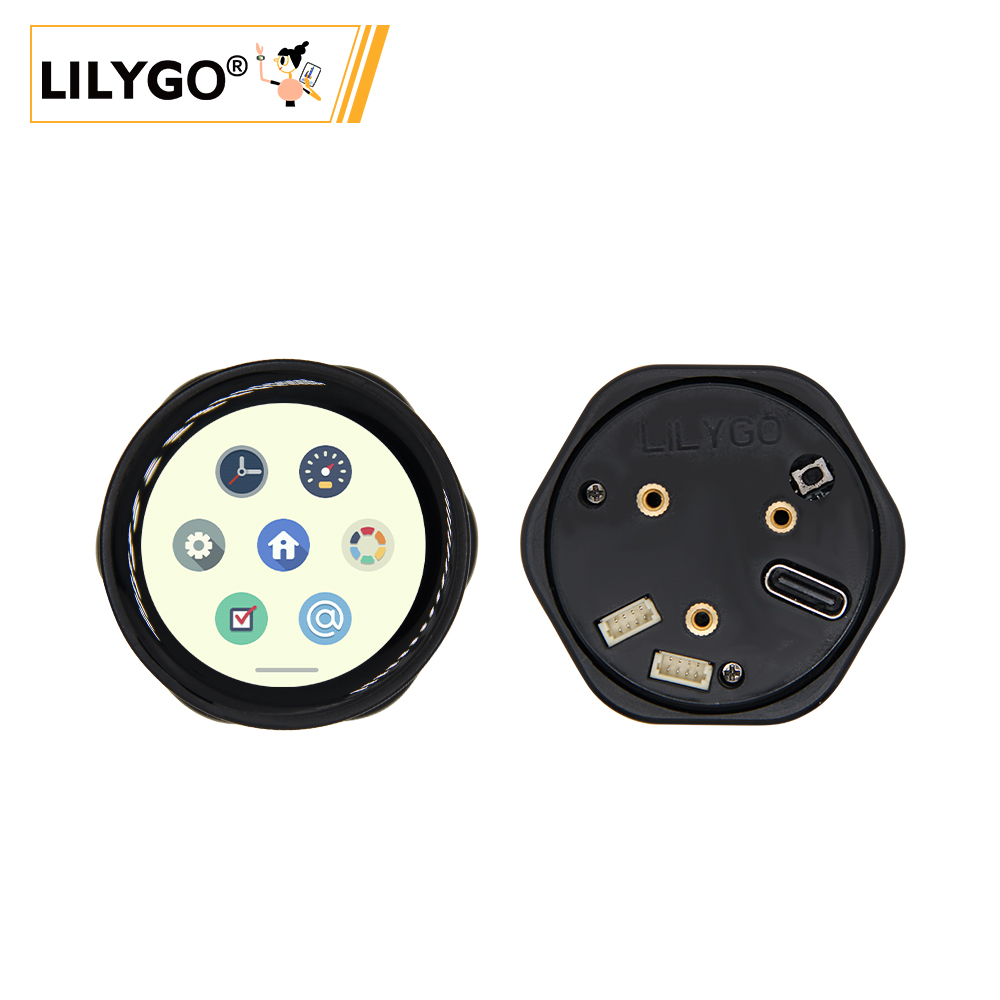
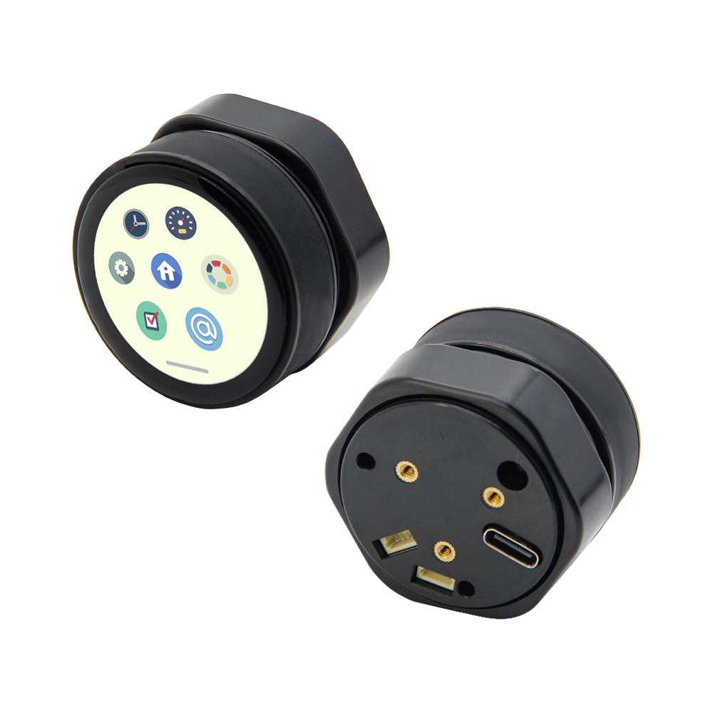
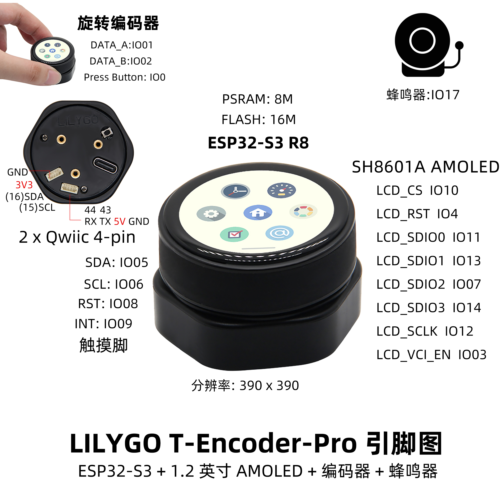
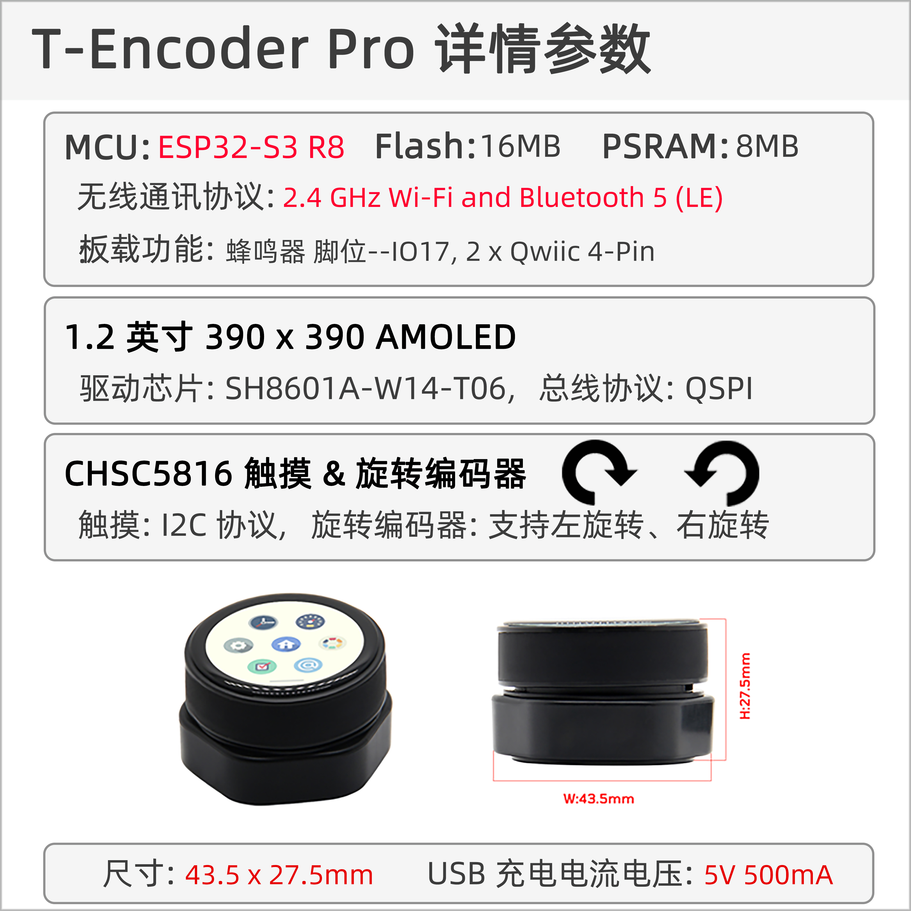

<!-- **[English](README.MD) | 中文** -->

    <a target="_blank" style="margin: 1em;color: white; font-size: 0.9em; border-radius: 0.3em; padding: 0.5em 2em; background-color:rgb(63, 201, 28)" href="https://lilygo.cc/products/t-encoder-plus">官网购买</a>
    <!-- <a target="_blank" style="margin: 1em;color: white; font-size: 0.9em; border-radius: 0.3em; padding: 0.5em 2em; background-color:rgb(63, 201, 28)" href="https://www.aliexpress.com/store/911876460">速卖通</a> -->

## 简介

LILYGO T-Encoder-Pro Pinnap 开发板，核心基于 ESP32-S3 R8 高性能 Wi-Fi/蓝牙双模芯片，集成 1.2 英寸 SH8601A 触摸 AMOLED 显示屏（分辨率 390×390），支持电容触控交互。硬件功能丰富，包含 旋转编码器（DATA_A/B 引脚及按压按键）、蜂鸣器、8MB PSRAM 和 16MB Flash 存储，并配备双 Qwiic 4-Pin 接口（SDA/SCL/RST/INT）以快速扩展传感器或模块。其显示屏驱动引脚配置完整（如 LCD_CS、LCD_RST、SPI 通信接口），适配复杂图形渲染场景。设计上注重高集成度与交互性，适用于嵌入式 UI 开发、智能家居控制面板、便携式设备原型或物联网终端，兼顾低功耗与高性能需求。

## 外观及功能介绍
### 外观

### 引脚图 

## 模块资料以及参数

### 概述
T-Encoder-Pro是一款配备AMOLED触摸屏的智能控制旋钮，基于ESP32S3R8芯片。旋钮旋转，点击（推），并包含一个寻呼机和振动电机。

| 组件 | 描述 |
| --- | --- |
| MCU | ESP32-S3R8  |
| PSRAM | 8M |
| FLASH | 16M |
| 屏幕 | 2.04 英寸 SH8601A-W14-T06 AMOLED |
| 触摸 | CHSC5816 触摸电容屏
| 编码器 | 支持左右旋转
| 蜂鸣器 | 支持蜂鸣器 |
| 无线 |2.4 GHz Wi-Fi & Bluetooth 5 (LE)
| USB | 1 × USB Port and OTG(TYPE-C接口) |
| 拓展接口|  2 × QWIIC 4 pin接口 |
| 按键 | 1 x RESET 按键 + 1 x BOOT 按键|
| 孔位 | **M2螺丝孔 * 3** |
| 尺寸 | **43.5 x 43.5 x 27.5mm**  |

### 相关资料

Github：[T-Encoder-Pro](https://github.com/Xinyuan-LilyGO/T-Encoder-Pro)

* [Espressif](https://www.espressif.com/en/support/documents/technical-documents)
* [DXQ120MYB2416A](https://github.com/Xinyuan-LilyGO/T-Encoder-Pro/blob/arduino-esp32-libs_V3.0.7/information/DXQ120MYB2416A.pdf)
* [DS_CHSC5816_V1.1.5](https://github.com/Xinyuan-LilyGO/T-Encoder-Pro/blob/arduino-esp32-libs_V3.0.7/information/DS_CHSC5816_V1.1.5.pdf)
* [CHSC5816-ApplicationDoc_US_V04](https://github.com/Xinyuan-LilyGO/T-Encoder-Pro/blob/arduino-esp32-libs_V3.0.7/information/CHSC5816-ApplicationDoc_US_V04.pdf)

#### 原理图

* [T-Encoder-Pro](https://github.com/Xinyuan-LilyGO/T-Encoder-Pro/blob/arduino-esp32-libs_V3.0.7/project/[SCH][T-Encoder-Pro_V1.0].pdf)
<!-- * [SY6970](./datasheet/AN_SY6970.pdf) -->

#### 依赖库

* [Arduino_GFX-1.3.7](https://github.com/moononournation/Arduino_GFX)
* [lvgl-8.3.5](https://github.com/lvgl/lvgl)
* [SensorLib-0.1.4](https://github.com/lewisxhe/SensorsLib)

## 软件开发
### Arduino 设置参数

| Setting                  | Value                            |
|--------------------------|----------------------------------|
| Board                    | ESP32S3 Dev Module               |
| Upload Speed             | 921600                           |
| USB Mode                 | Hardware CDC and JTAG            |
| USB CDC On Boot          | Enabled                          |
| USB Firmware MSC On Boot | Disabled                         |
| USB DFU On Boot          | Disabled                         |
| CPU Frequency            | 240MHz (WiFi)                    |
| Flash Mode               | QIO 80MHz                        |
| Flash Size               | 16MB (128Mb)                     |
| Core Debug Level         | None                             |
| Partition Scheme         | 16M Flash (3MB APP/9.9MB FATFS)  |
| PSRAM                    | OPI PSRAM                        |
| Arduino Runs On          | Core 1                           |
| Events Run On            | Core 1                           |

### 开发平台
1. [Micropython](https://micropython.org/)
2. [Arduino IDE](https://www.arduino.cc/en/software)
3. [Platform IO](https://platformio.org/)

## 产品技术支持 

