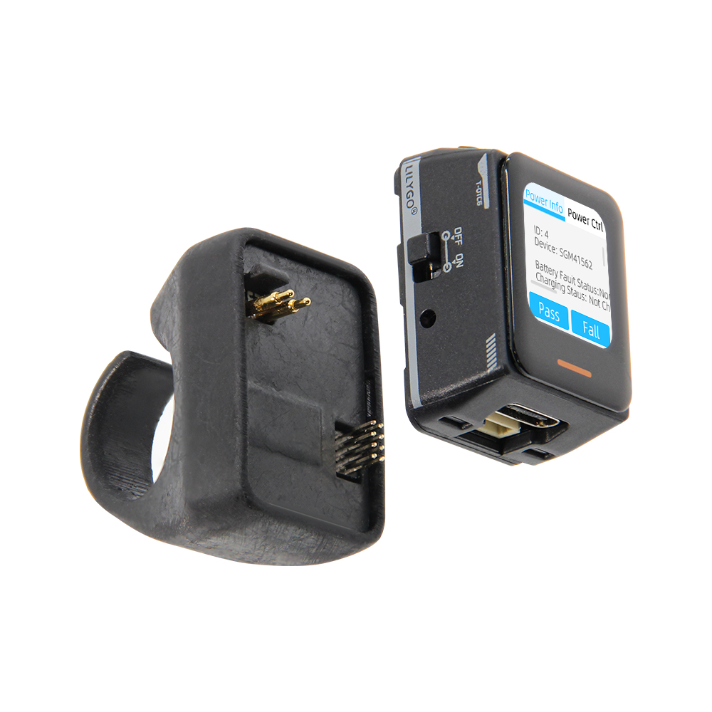
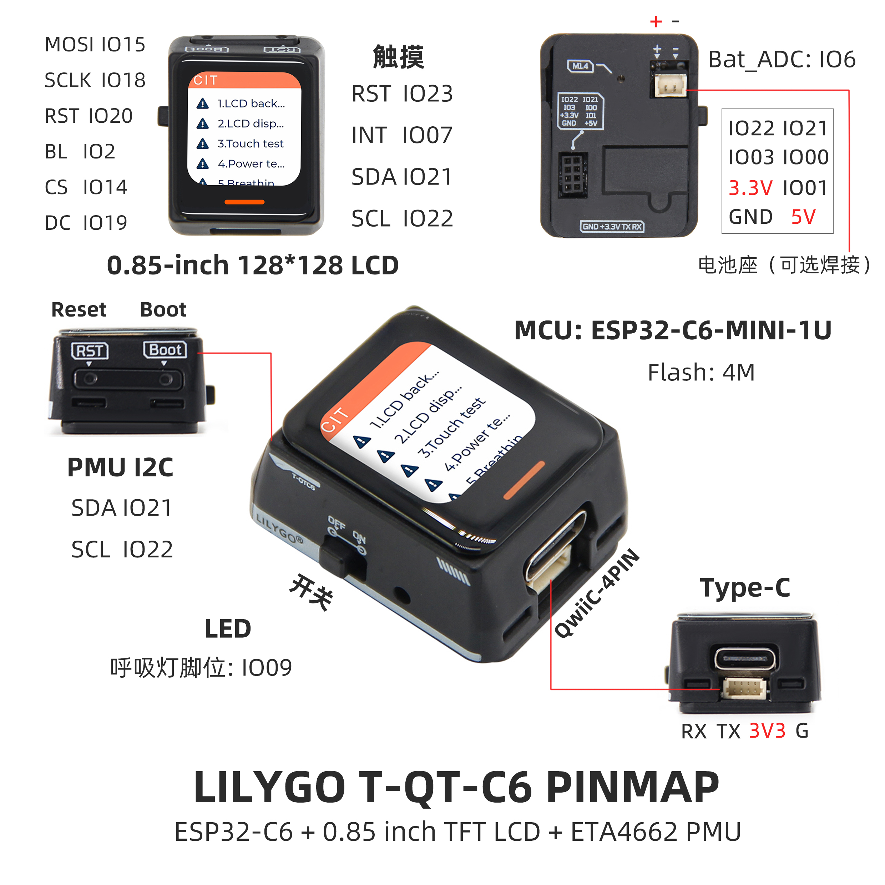
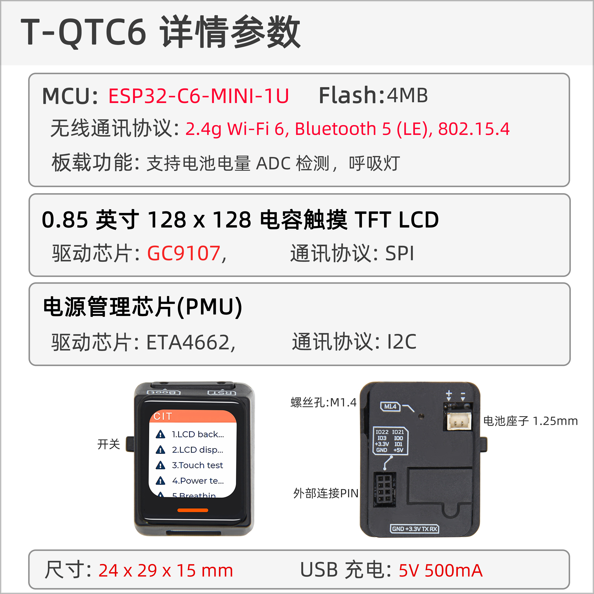

<!-- **[English](README.MD) | 中文** -->

    <a target="_blank" style="margin: 1em;color: white; font-size: 0.9em; border-radius: 0.3em; padding: 0.5em 2em; background-color:rgb(63, 201, 28)" href="https://lilygo.cc/products/t-qt-c6">官网购买</a>
    <!-- <a target="_blank" style="margin: 1em;color: white; font-size: 0.9em; border-radius: 0.3em; padding: 0.5em 2em; background-color:rgb(63, 201, 28)" href="https://www.aliexpress.com/store/911876460">速卖通</a> -->

## 简介

LILYGO T-QT-C6 是基于ESP32-C6-MINI-1U微控制器的智能可穿戴开发套件，集成了0.85英寸128*128分辨率的TFT LCD显示屏、6轴传感器（LSM6DSL，支持加速度计和陀螺仪功能）以及SGM41562电源管理单元（PMU）。其核心特性包括：内置电池供电、触摸交互、呼吸灯状态指示、4MB Flash存储，并通过QWIIC 4-PIN接口及I2C/SPI引脚支持硬件扩展。支持Wi-Fi/蓝牙无线通信，适用于运动监测、嵌入式开发或便携式交互设备场景。产品设计上可能采用戒指式扩展坞形态（T-QT-C6 Extended Finger Ring Dock），兼顾低功耗与高集成度，适合开发者在物联网、穿戴设备等领域进行原型设计与功能验证。

## 外观及功能介绍
### 外观

### 引脚图 

## 模块资料以及参数

### 概述

| 组件 | 描述 |
| --- | --- |
| MCU | ESP32-S3R8 Dual-core LX7 microprocessor |
| PSRAM | 4M|
| 屏幕 | 0.85 英寸 GC9107 TFT |
| 触摸 | CST816T 触摸电容屏
| 总线 | QSPI
| LoRa | 1276:868,915Mhz |
| 电池背板惯性传感器 | LSM6DSLTR
| 电源管理 | SGM41562 |
| 无线 |2.4 GHz Wi-Fi & Bluetooth 5 (LE)
| USB | 1 × USB Port and OTG(TYPE-C接口) |
| IO 接口 |2 x 2.54mm间距 2*7 拓展IO接口 |
| 拓展接口|  1 × QWIIC 4 pin接口 +1 x 2 x 4pin拓展电池接口 + 电源接口|
| 按键 | 1 x RESET 按键 + 1 x BOOT 按键|
| 尺寸 | **33x24x44.5mm**  |

### 相关资料

Github：[T-QT-C6](https://github.com/Xinyuan-LilyGO/T-QT-C6/tree/arduino-esp32-libs_V3.0.2)

* [Espressif](https://www.espressif.com/en/support/documents/technical-documents)
* [ETA4662_V1.8](https://github.com/Xinyuan-LilyGO/T-QT-C6/blob/arduino-esp32-libs_V3.0.2/information/ETA4662_V1.8.pdf)
* [AN-CST816T-v1](https://github.com/Xinyuan-LilyGO/T-QT-C6/blob/arduino-esp32-libs_V3.0.2/information/AN-CST816T-v1.pdf)
* [WS2812B-2020](https://github.com/Xinyuan-LilyGO/T-QT-C6/blob/arduino-esp32-libs_V3.0.2/information/WS2812B-2020.pdf)
* [WS2812C-2020](https://github.com/Xinyuan-LilyGO/T-QT-C6/blob/arduino-esp32-libs_V3.0.2/information/WS2812C-2020.pdf)
* [SGMICRO-SGM41562XGTR](https://github.com/Xinyuan-LilyGO/T-QT-C6/blob/arduino-esp32-libs_V3.0.2/information/SGMICRO-SGM41562XGTR.pdf)
* [lsm6dsl](https://github.com/Xinyuan-LilyGO/T-QT-C6/blob/arduino-esp32-libs_V3.0.2/information/lsm6dsl.pdf)
* [lsm6dsl-stmicroelectronics_en](https://github.com/Xinyuan-LilyGO/T-QT-C6/blob/arduino-esp32-libs_V3.0.2/information/lsm6dsl-stmicroelectronics_en.pdf)

#### 原理图

* [T-QT-C6_V1.2](https://github.com/Xinyuan-LilyGO/T-QT-C6/blob/arduino-esp32-libs_V3.0.2/project/T-QT-C6_V1.2/T-QT-C6_MCU_V1.2.pdf)

<!-- * [SY6970](./datasheet/AN_SY6970.pdf) -->

#### 依赖库

* [Arduino_DriveBus-1.1.10](https://github.com/Xk-w/Arduino_DriveBus)
* [Arduino_GFX-1.3.7](https://github.com/moononournation/Arduino_GFX)
* [lvgl-8.3.5](https://github.com/lvgl/lvgl)

## 软件开发
### Arduino 设置参数

| Setting                               | Value                                 |
| :-------------------------------: | :-------------------------------: |
| Board                                | ESP32C6 Dev Module            |
| Upload Speed                     | 921600                               |
| CPU Frequency                   | 160MHz                              |
| Flash Mode                         | QIO                                   |
| Flash Size                           | 4MB (32Mb)                     |
| Core Debug Level                | None                                 |
| Partition Scheme                | Huge APP (3MB No OTA/1MB SPIFFS)                                 |

### 开发平台
1. [Micropython](https://micropython.org/)
2. [Arduino IDE](https://www.arduino.cc/en/software)
3. [Platform IO](https://platformio.org/)

## 产品技术支持 

