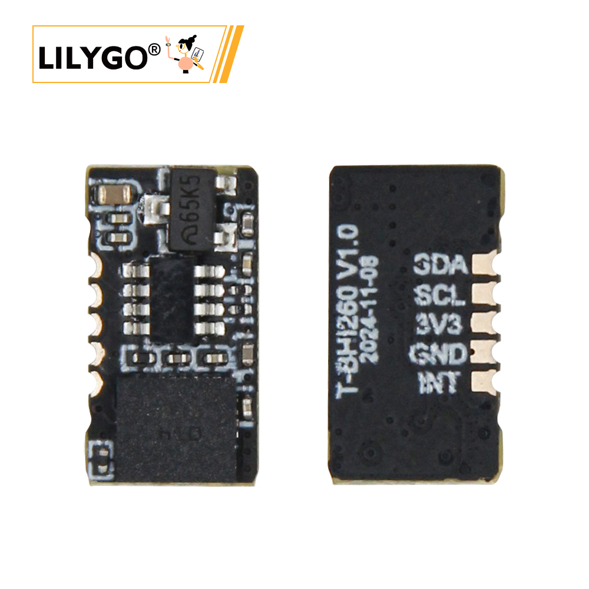
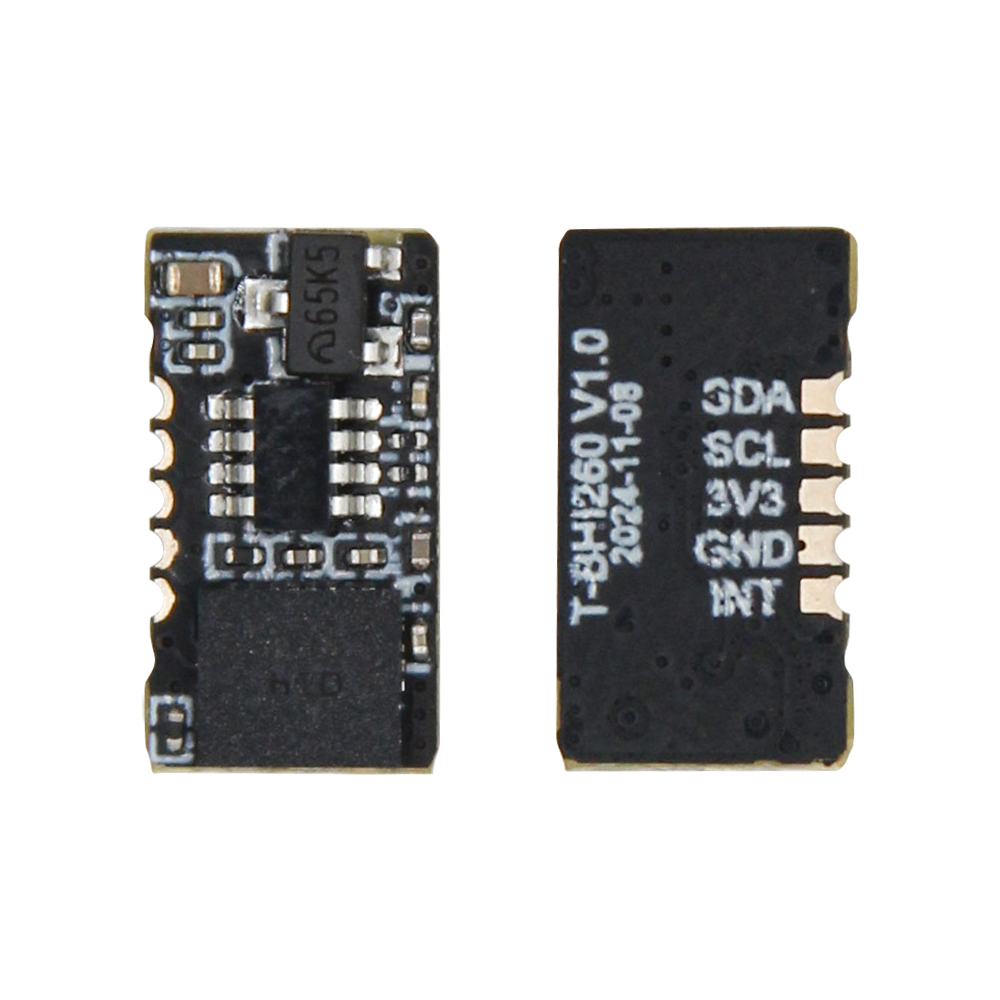

<!-- **[English](README.MD) | 中文** -->

    <a target="_blank" style="margin: 1em;color: white; font-size: 0.9em; border-radius: 0.3em; padding: 0.5em 2em; background-color:rgb(103, 175, 8)" href="https://lilygo.cc/products/t-bhi260ap">官网购买</a>
    <!-- <a target="_blank" style="margin: 1em;color: white; font-size: 0.9em; border-radius: 0.3em; padding: 0.5em 2em; background-color:rgb(63, 201, 28)" href="https://www.aliexpress.com/store/911876460">速卖通</a> -->

## 简介

T-BH260 V1.0及升级型号T-BH1260 AI智能传感器是一款集成自学习AI算法与6轴IMU（加速度计+陀螺仪）的多功能运动监测设备，支持实时行人定位追踪、个性化健身数据分析（如动作标准度、卡路里消耗）及游泳专项指标记录（泳姿效率、划频等），适用于跑步、游泳及日常健康管理。其防水设计与低功耗特性保障了户外与水下的持续使用，通过蓝牙/Wi-Fi连接手机APP实现数据同步，兼容主流健康平台，兼顾运动爱好者的专业需求与安全监护场景的实时定位功能。

## 外观及功能介绍
### 外观

## 模块资料以及参数

### 相关应用

|产品	          |        详细链接
| --------------- | -----------------|                         
|T-Deck           |	[T-Deck](https://lilygo.cc/products/t-deck?_pos=2&_psq=DECK&_ss=e&_v=1.0)
|T-Display-S3     |	[T-Display-S3](https://lilygo.cc/products/t-display-s3?_pos=2&_psq=display&_ss=e&_v=1.0)
|T-Display-S3-Pro |	[T-Display-S3-Pro](https://lilygo.cc/products/t-display-s3-pro?_pos=3&_psq=display+s3+p&_ss=e&_v=1.0)
|T-Echo           |	[T-Echo](https://lilygo.cc/products/t-echo-lilygo?_pos=2&_psq=echo&_ss=e&_v=1.0)

