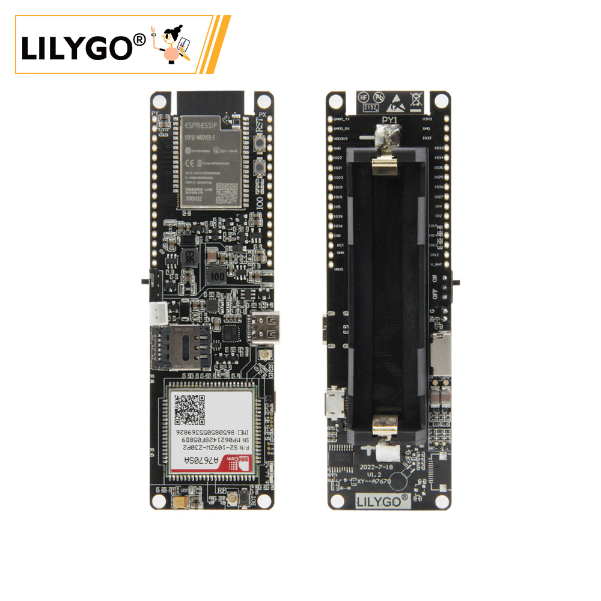
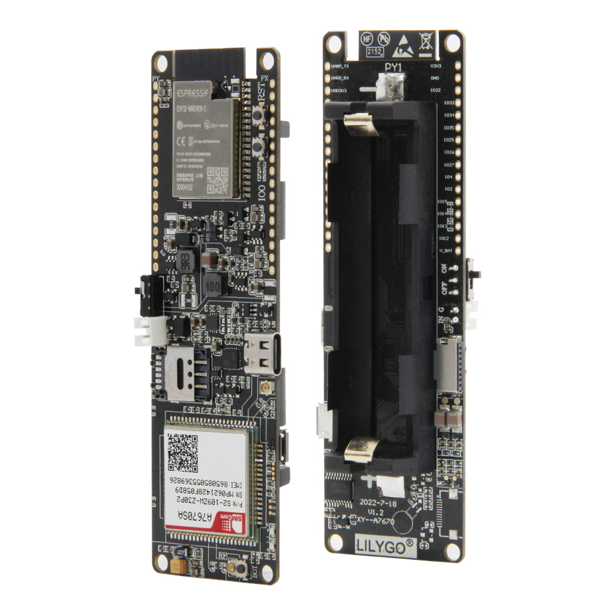

<!-- **[English](README.MD) | 中文** -->

>T-A76xx系列的差异可以参考[SIM](../../SIM.md)

<!-- 

    <a target="_blank" style="margin: 1em;color: white; font-size: 0.9em; border-radius: 0.3em; padding: 0.5em 2em; background-color:rgb(63, 201, 28)" href="https://item.taobao.com/item.htm?id=846226367137">淘宝</a>
    <a target="_blank" style="margin: 1em;color: white; font-size: 0.9em; border-radius: 0.3em; padding: 0.5em 2em; background-color:rgb(63, 201, 28)" href="https://www.aliexpress.com/store/911876460">速卖通</a>

 -->

## 简介

LILYGO T-A7670SA R2 是一款 4G LTE Cat1 物联网通信模块，支持 GSM/GPRS/EDGE 网络，专为澳大利亚、新西兰及南美洲等地区设计，兼容 Nano SIM 卡接入蜂窝网络。模块提供多类型接口，包括 GPIO、ADC/DAC（模拟信号处理）、I2C 总线及 触摸感应引脚（如 TQUEH0-9），支持低功耗模式（Nano Power）和宽电压输入（DIR 25、POWER 4），可连接传感器或控制器实现远程数据传输。适用于环境监测、智能农业及区域化物联网部署，需注意本地频段适配与 3.3V 电平兼容。

## 外观及功能介绍
### 外观

### 引脚图 

## 模块资料
### 概述

| 组件 | 描述 |
| --- | --- |
| MCU | ESP32-WROVER-E |
| FLASH| 4MB |
| PS RAM | 8MB|
| 时钟频率 | 240MHz |
| 无线 | Wi-Fi: 802.11 b/g/n; BLE V5.0 |
| IO 拓展	|2.54mm间距 × 2*16拓展IO接口 + 1×4.4V~6.0V 输入接口|
| 电池 | 18650 电池
| 存储 | TF 卡 |
| 语音通话 | 支持语音功能
| 按键 | 1 x RST 按键 + 1 x BOOT 按键 + 1 × IO0 按键 |
| USB | 1 × USB Port and OTG(Type-C) |
| SIM | 支持2G 3G 4G (Nano Sim)
| 电源 | 5V/500mA 输入|
| 尺寸 | **111x34x19mm**  |
| 孔位 | 4×2mm 定位孔 |
 
<table role="table" class="center_table">
  <thead>
    <tr>
      <th colspan = "2">无线通讯模块</th>
    </tr>
  </thead>
    <tr>
    <td>MCU</td>
    <td>A7670G</td>
  </tr>
  <tr>
    <td>支持地区</td>
    <td>南美 新西兰 澳大利亚</td>
  </tr>
  <tr>
    <td>尺寸规格</td>
    <td>LCC+LGA,124Pin</td>
  </tr>
  </tr>
    <tr>
    <td>大小</td>
    <td>24*24*2.3mm</td>
  </tr>
    </tr>
    <tr>
    <td>频率波特率</td>
    <td>LTE-FDD :B1/B2/B3/B4/B5/B7/B8/B28/B66 
        LTE-TDD :N/A 
        GSM:850/900/1800/1900MHz,
        </td>
  </tr>
  </tr>
    </tr>
    <tr>
    <td>功耗</td>
    <td>LTE(Mbps) :10(DL)/5(UL) 
        GPRS/EDGE(Kbps) :236.8(DL) / 236.8(UL) 
        </td>
  </tr>
    <tr>
    <td>数据传输</td>
    <td>LTE :3.8mA 
        GSM :3.5mA 
        </td>
  </tr>
    <tr>
    <td>协议支持</td>
    <td>TCP/IP/IPV4/IPV6/DNS/Multi-PDP/FTP/FTPS/HTTP/HTTPS</td>
  </tr>
  </tr>
    </tr>
    <tr>
    <td>可选拓展</td>
    <td>GNSS 蓝牙</td>
  </tr>
    </tr>
    <tr>
    <td>认证</td>
    <td>RoHS/CE(RED)/FCC/REACH/OCD(Anatel)/RCM</td>

</table>

> ⚠️⚠️⚠️ 可选择不带 GPS版本，带 GPS版本请联系客服购买。

### 相关资料链接

Github:[T-A7670SA](https://github.com/Xinyuan-LilyGO/LilyGO-T-A76XX)

#### 原理图

[T-A7670SA](https://github.com/Xinyuan-LilyGO/LilyGO-T-A76XX/blob/main/schematic/T-A7670X-V1.4.pdf)

#### 依赖库

* [Adafruit_BusIO](https://github.com/adafruit/Adafruit_BusIO)
* [Adafruit-GFX-Library](https://github.com/adafruit/Adafruit-GFX-Library)                     
* [Adafruit_INA219](https://github.com/adafruit/Adafruit_INA219)       
* [Adafruit_NeoPixel](https://github.com/adafruit/Adafruit_NeoPixel)   
* [Adafruit_SSD1306](https://github.com/adafruit/Adafruit_SSD1306) 
* [Adafruit_Sensor](https://github.com/adafruit/Adafruit_Sensor)    
* [ArduinoHttpClient](https://github.com/arduino-libraries/ArduinoHttpClient)      
* [blynk](https://blynk.io)                     
* [BlynkNcpDriver](https://blynk.io)       
* [DHT-sensor-library](https://github.com/adafruit/DHT-sensor-library)   
* [TinyGPSPlus](http://pubsubclient.knolleary.net) 
* [SensorsLib](https://github.com/lewisxhe/SensorsLib)    
* [StreamDebugger](https://github.com/vshymanskyy/StreamDebugger)      
* [TinyGPSPlus](https://github.com/mikalhart/TinyGPSPlus)       
* [TinyGSM-fork](https://github.com/lewisxhe/TinyGSM-fork)   
 

## 软件开发
### Arduino 设置参数

| Setting                               | Value                                 |
| :-------------------------------: | :-------------------------------: |
| Board                                 | ESP32 Dev Module           |
| CPU Frequency                   | 240MHz (WiFi/BT)     
| Core Debug Level                | None  
| Erase All Flash Before Sketch Upload | Disabled                             |
| Events Run On                   | Core 1                               |
| Flash Frequency                  | 80MHz
| Flash Mode                         | QIO                      |
| Flash Size                           | 4MB (32Mb)                    |
| JATG  Adapter                      | Disabled                             |
| Arduino Runs On                  | Core 1                               |
| Partition Scheme                | default 4MB with spiffs (1.2MB APP/1.5MB spiffs) |
| PSRAM                              | ENabled                             |
| Upload Speed                      | 921600                             |

### 开发平台

1. [ESP-IDF](https://www.espressif.com/zh-hans/products/sdks/esp-idf)
2. [Arduino IDE](https://www.arduino.cc/en/software)
3. [VS Code](https://code.visualstudio.com/)
4. [Platform IO](https://platformio.org/)

## 产品技术支持 

