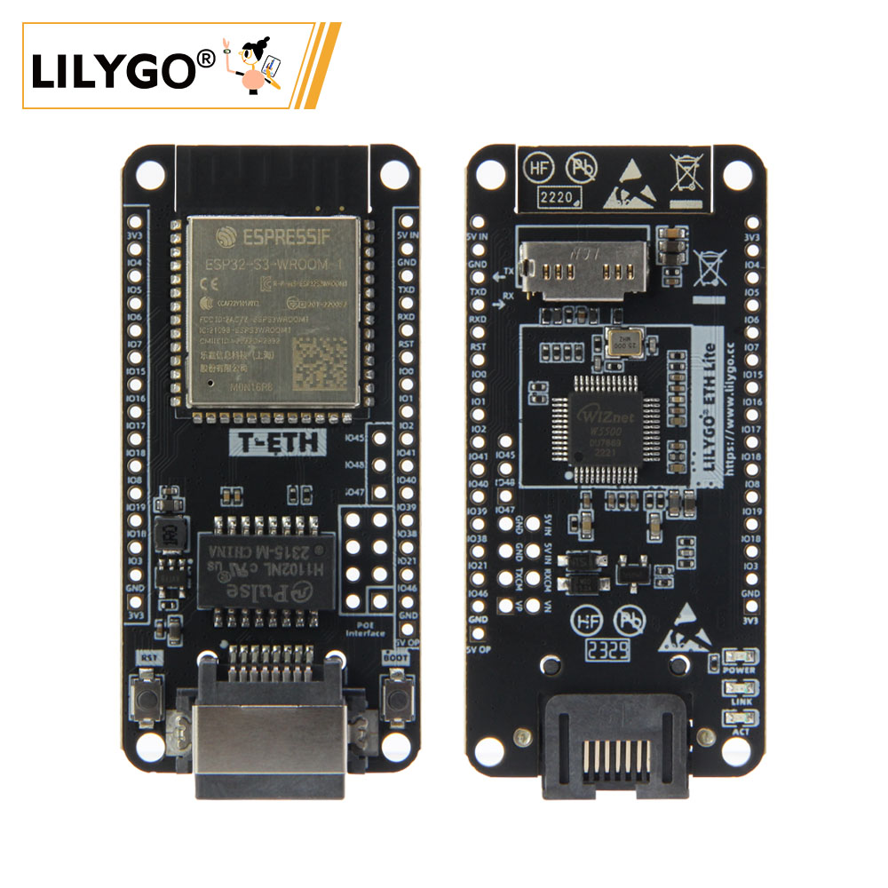
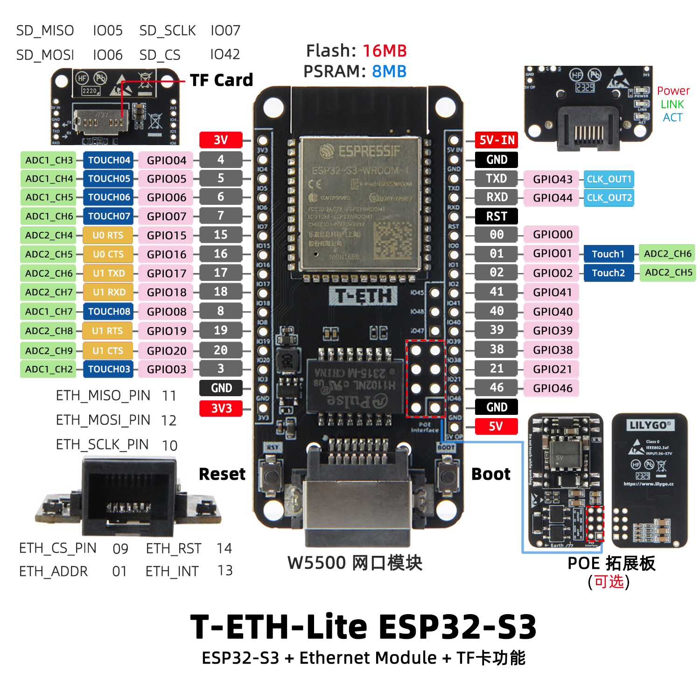
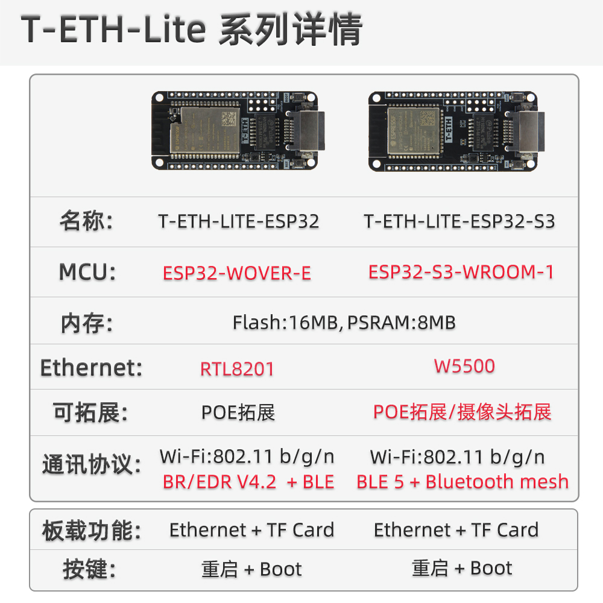

<!-- **[English](README.MD) | 中文** -->

    <a target="_blank" style="margin: 1em;color: white; font-size: 0.9em; border-radius: 0.3em; padding: 0.5em 2em; background-color:rgb(63, 201, 28)" href="https://lilygo.cc/products/t-eth-lite?variant=43120880779445">官网购买</a>
    <!-- <a target="_blank" style="margin: 1em;color: white; font-size: 0.9em; border-radius: 0.3em; padding: 0.5em 2em; background-color:rgb(63, 201, 28)" href="https://www.aliexpress.com/store/911876460">速卖通</a>-->

 

## 简介

T-ETH-Lite ESP32-S3 是一款基于 ESP32-S3 芯片的嵌入式开发模块，集成了以太网通信、TF卡存储扩展及多种外设接口。其核心配置包括 16MB Flash 和 8MB PSRAM，支持高速数据处理与存储；内置 W5500 以太网控制器，提供稳定的网络连接能力，并通过 ETH_CS、ETH_INT 等引脚实现网络控制。模块配备丰富的 GPIO 接口（如 GPIO00-GPIO20、GPIO38-GPIO46），支持 ADC 通道、触摸输入（TOUCH03-TOUCH08）以及专用输出控制引脚（GK_OUT1/GK_OUT2），可灵活适配传感器、执行器等外设。此外，该模块提供 SD 卡槽（支持 SPI 协议）和可选 POE 供电拓展板，适用于物联网终端、工业控制等场景，兼顾功能扩展性与低功耗特性。

## 外观及功能介绍
### 外观

### 引脚图 

## 模块资料
### 概述

> 注意：T-ETH-Lite S3 为 ESP32-S3 版本 ,点这里切换到ESP32版本[T-ETH-Lite](https://wiki.lilygo.cc/get_started/zh/LoRa_GPS/T-ETH-Lite/T-ETH-Lite/T-ETH-Lite.html)版本

| 组件 | 描述 |
| --- | --- |
| 储存 | TF卡
| 拓展 | 2 x 15io拓展 
| 按键 | 1 x BOOT按键 + 1 x Reset按键 |
| LED | 3 x 指示灯(Power/link/ACT)
| 电源 | 5V/500mA |
| 接口 | 1 x USB Type-C接口 |
| 定位孔 | 4 x 2mm定位孔 |

### 相关资料链接

Github:[T-ETH-Lite](https://github.com/Xinyuan-LilyGO/LilyGO-T-ETH-Series)

- [DP9900M](https://github.com/Xinyuan-LilyGO/LilyGO-T-ETH-Series/blob/master/datasheet/ETH-POE-DP9900M-5V.pdf)
- [DP5300](https://github.com/Xinyuan-LilyGO/LilyGO-T-ETH-Series/blob/master/datasheet/ETH-PRO-POE-DP5300-12V.pdf)

#### 原理图
- [T-ETH-Lite](https://github.com/Xinyuan-LilyGO/LilyGO-T-ETH-Series/blob/master/schematic/T-ETH-Lite-ESP32S3.pdf)

#### 依赖库

- [Adafruit_BME280_Library](https://github.com/adafruit/Adafruit_BME280_Library)
- [Adafruit_BusIO-1.16.1](https://github.com/Xinyuan-LilyGO/T-Echo-Lite/tree/main/libraries/Adafruit_BusIO-1.16.1)
- [Adafruit_NeoPixel](https://github.com/adafruit/Adafruit_NeoPixel)
- [Adafruit_Sensor](https://github.com/adafruit/Adafruit_Sensor)
- [ESP32_USB_Stream](https://github.com/esp-arduino-libs/ESP32_USB_Stream)
- [ETHClass2](https://github.com/Xinyuan-LilyGO/LilyGO-T-ETH-Series/blob/master/lib/ETHClass2)
- [LoRa](https://github.com/sandeepmistry/arduino-LoRa)
- [ModbusMaster](https://github.com/4-20ma/ModbusMaster)
- [RadioLib](https://github.com/jgromes/RadioLib)
- [StreamDebugger](https://github.com/plerup/StreamDebugger)
- [TFT_eSPI](https://github.com/Bodmer/TFT_eSPI)
- [TinyGPSPlus](https://github.com/mikalhart/TinyGPSPlus)
- [TinyGSM](https://github.com/vshymanskyy/TinyGSM)
- [U8g2](https://github.com/olikraus/u8g2)

## 软件开发
### Arduino 设置参数

| Arduino IDE Setting                  | Value                          |
|--------------------------------------|--------------------------------|
| Board                                | ESP32S3 Dev Module             |
| Port                                 | Your port                      |
| USB CDC On Boot                      | Disable                        |
| CPU Frequency                        | 240MHZ(WiFi)                   |
| Core Debug Level                     | None                           |
| USB DFU On Boot                      | Disable                        |
| Erase All Flash Before Sketch Upload | Disable                        |
| Events Run On                        | Core1                          |
| Flash Mode                           | QIO 80MHZ                      |
| Flash Size                           | 16MB(128Mb)                    |
| Arduino Runs On                      | Core1                          |
| USB Firmware MSC On Boot             | Disable                        |
| Partition Scheme                     | 16M Flash(3M APP/9.9MB FATFS)  |
| PSRAM                                | OPI PSRAM                      |
| Upload Mode                          | UART0/Hardware CDC             |
| Upload Speed                         | 921600                         |
| USB Mode                             | CDC and JTAG                   |

### 开发平台

1. [ESP-IDF](https://www.espressif.com/zh-hans/products/sdks/esp-idf)
2. [Arduino IDE](https://www.arduino.cc/en/software)
3. [VS Code](https://code.visualstudio.com/)
4. [Micropython](https://micropython.org/)

## 产品技术支持 

